# URBANEDGE LAND SPACE — MASTER WEBSITE ARCHITECTURE

**File:** `01-MASTER-WEBSITE-ARCHITECTURE.md`  
**System:** UrbanEdge Land Space V1  
**Status:** Authoritative parent architecture  
**Launch geography:** Ahmedabad + Gandhinagar, Gujarat  
**Expansion direction:** Gujarat → India  
**Primary domain:** `https://urbanedgelandspace.com`  
**Architecture date:** 29 August 2026

---

## Document Purpose

This document establishes the **overall technical architecture** for UrbanEdge Land Space V1.

It is the parent architecture contract for all subsequent specialist architecture documents. Later documents may refine implementation details, schemas, UI states, security policies, search mechanics, verification checklists, deployment configuration, or tests, but they **must not contradict the system boundaries or major decisions defined here** without an explicit Architecture Decision Record (ADR) or later client decision.

This document intentionally stays one level above detailed implementation. It defines:

- system boundaries;
- ownership of responsibilities;
- major technology choices;
- domain boundaries;
- public/private data boundaries;
- major flows;
- security posture;
- SEO and rendering strategy;
- operational constraints;
- scaling direction;
- rejected alternatives.

It does **not** replace the specialist documents for database schema, verification, UX/UI, admin/CRM, SEO, security, testing, or deployment.

---

# 1. Architecture Executive Summary

UrbanEdge Land Space V1 is a **curated, brokerage-led land discovery and lead-management platform**, not an open classifieds marketplace.

The public product helps buyers discover curated Agricultural, NA, and Industrial land in Ahmedabad and Gandhinagar, understand the important parcel information, and contact UrbanEdge through inquiry, WhatsApp, call, or site-visit requests.

The private system enables the UrbanEdge administrator to:

- create and manage property inventory;
- review owner submissions;
- manage media;
- maintain availability and publication status;
- record scoped verification work;
- manage leads and buyer requirements;
- coordinate site visits;
- manage guides and SEO landing content;
- maintain configurable business settings;
- review basic business analytics;
- preserve an audit trail.

The core architecture is a **single deployable Next.js application with a modular domain structure**, backed by a **dedicated Supabase project** containing PostgreSQL, Auth, and Storage.

There is deliberately **no separate Node/Nest backend service in V1**. Server-side application logic lives behind the Next.js boundary using Server Components, Server Actions, and Route Handlers as appropriate. Supabase is the system of record for structured data and storage.

The architecture is optimized for:

1. strong SEO;
2. simple operational ownership;
3. low infrastructure cost;
4. secure public/private separation;
5. fast land discovery;
6. human-assisted brokerage workflows;
7. future Gujarat/India expansion without national-scale complexity today.

The architectural style is therefore:

> **SEO-first modular monolith + managed PostgreSQL backend + explicit public/private data boundary + server-owned mutations + provider boundaries for maps/search/email.**

The product itself remains intentionally narrow. V1 does not attempt to become a land-record authority, legal title product, payment platform, buyer/seller social network, agent marketplace, or self-service transaction/registration platform.

The supplied product requirements explicitly define the product as brokerage-led, curated, and geographically focused on Ahmedabad and Gandhinagar, with Buy/Rent/Lease as discovery intents and Sell Your Land as an owner-submission workflow. [Source: `LANDSPACE_PRODUCT_REQUIREMENTS.md`]

---

# 2. System Context

## 2.1 Actors

### Public Visitor

An unauthenticated person browsing UrbanEdge Land Space.

Capabilities:

- browse public pages;
- search/filter published land;
- view public property details;
- view public-safe maps;
- read guides;
- submit inquiry;
- request a site visit;
- submit a buyer requirement;
- submit Sell Your Land;
- click WhatsApp;
- click Call.

No account is required.

### Buyer / Investor

A public visitor with a buying, renting, or leasing requirement.

The V1 architecture treats the buyer as a **lead-bearing actor rather than an authenticated application user**. The buyer's business relationship is represented in the CRM after a conversion event.

### Landowner

A public visitor submitting land for brokerage consideration.

There is no seller dashboard in V1. Submission creates a private owner-submission workflow controlled by UrbanEdge.

### UrbanEdge Administrator

The single internal V1 operator.

The admin has access to:

- properties;
- owner submissions;
- verification;
- media;
- leads;
- buyer requirements;
- site visits;
- content;
- location configuration;
- SEO fields;
- settings;
- audit records;
- operational analytics.

The data model should remain compatible with future `assigned_to` and role-based authorization, but V1 does not need operational multi-user complexity.

### External Services

External services are integration dependencies rather than owners of core business data.

Expected categories:

- map tiles/style provider;
- Google Maps URLs for navigation/directions;
- email delivery provider;
- analytics platform;
- CAPTCHA/anti-bot provider where enabled;
- deployment platform;
- Supabase-managed infrastructure.

---

## 2.2 Context Diagram

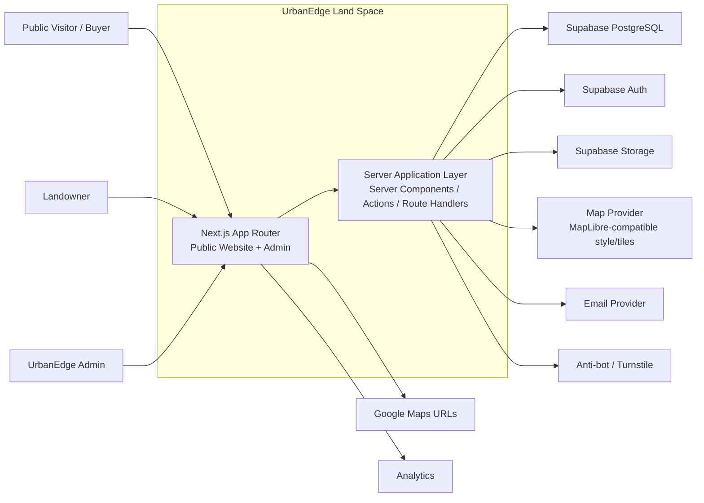

### Context rule

All core business state belongs inside the UrbanEdge application and its dedicated Supabase project.

External providers may render maps, deliver mail, or receive analytics events, but they are **not authoritative business systems** for:

- properties;
- property publication;
- owner submissions;
- leads;
- site visits;
- verification;
- private documents;
- internal notes.

---

# 3. Application Boundaries

The V1 system is divided into six practical boundaries.

## 3.1 Public Website

Responsible for:

- branded public navigation and content;
- category discovery;
- search and filtering;
- property results;
- property detail;
- public maps;
- conversion forms;
- guides;
- contact and legal pages;
- location SEO pages;
- SEO metadata and structured data;
- public availability/status display.

The public website consumes only **public-safe projections** of application data.

It must never depend on client-side hiding of private records.

---

## 3.2 Admin Application

Responsible for private brokerage operations:

- secure admin authentication;
- property CRUD;
- publication workflow;
- availability;
- media management;
- owner submissions;
- verification;
- leads;
- buyer requirements;
- site visits;
- guides;
- SEO landing pages;
- locations;
- settings;
- analytics;
- audit log.

The admin application is part of the same Next.js deployment but has a separate route boundary and authorization boundary.

The admin visual language may be denser and operationally focused. It should not define the public Land Space marketing design.

---

## 3.3 Backend / Application Layer

This is the **server-owned orchestration boundary** inside Next.js.

Responsibilities:

- input validation;
- authorization;
- domain rules;
- public/private projections;
- database access;
- mutation orchestration;
- email requests;
- event recording;
- search query construction;
- location privacy transformation;
- publication validation;
- external provider calls that require secrecy.

This layer is implemented with framework-native mechanisms rather than a separate backend server.

### Primary mechanisms

- Server Components for server-rendered reads;
- Server Actions for appropriate first-party mutations;
- Route Handlers for HTTP endpoints, integration callbacks, or cases where an explicit endpoint is useful;
- shared domain services/helpers under `features/` and `server/`.

Public forms should prefer server-owned submission paths instead of broad anonymous database insert policies.

---

## 3.4 Database

Supabase PostgreSQL is the system of record for:

- property records;
- parties/owners;
- normalized geography;
- transaction and pricing data;
- category-specific property data;
- verification records;
- media metadata;
- owner submissions;
- leads;
- lead activities;
- buyer requirements;
- site visits;
- guides;
- SEO landing pages;
- settings;
- analytics summaries where stored;
- audit records.

Schema changes are migration-controlled and committed to the repository.

Manual dashboard edits are not the source of truth.

---

## 3.5 Storage

Supabase Storage manages binary assets.

At the architecture level, the important distinction is between:

### Public / controlled listing media

Examples:

- listing images;
- cover image;
- approved brochure;
- approved public video/360 references.

### Private media

Examples:

- owner documents;
- legal evidence;
- internal supporting documents;
- sensitive attachments.

Public and private storage responsibilities must be explicitly separated.

Security cannot depend on obscure URLs.

---

## 3.6 External Integrations

V1 should use explicit adapter/provider boundaries for:

- maps;
- email;
- analytics;
- anti-bot;
- optional future search providers.

The rest of the application should depend on an internal interface rather than embedding vendor-specific behavior across components.

This keeps the product portable and preserves the ability to replace a provider without re-architecting the domain layer.

---

# 4. Repository Architecture

The recommended repository is a **single Next.js TypeScript repository** with domain-oriented feature modules.

```text
urbanedge-land-space/
├── app/
│   ├── (public)/
│   ├── (admin)/
│   ├── api/
│   ├── layout.tsx
│   ├── sitemap.ts
│   ├── robots.ts
│   └── globals.css
│
├── components/
│   ├── ui/
│   ├── layout/
│   └── shared/
│
├── features/
│   ├── properties/
│   ├── geography/
│   ├── search/
│   ├── pricing/
│   ├── media/
│   ├── verification/
│   ├── leads/
│   ├── submissions/
│   ├── site-visits/
│   ├── guides/
│   ├── admin/
│   ├── analytics/
│   └── settings/
│
├── lib/
│   ├── supabase/
│   ├── validation/
│   ├── seo/
│   ├── privacy/
│   ├── formatting/
│   └── utilities/
│
├── server/
│   ├── actions/
│   ├── queries/
│   ├── services/
│   └── integrations/
│
├── types/
│
├── config/
│
├── supabase/
│   ├── migrations/
│   ├── seed/
│   └── functions/        # only where actually justified
│
├── docs/
│
├── tests/
│   ├── unit/
│   ├── integration/
│   └── e2e/
│
├── public/
│
├── .env.example
├── next.config.*
├── package.json
└── tsconfig.json
```

## 4.1 Ownership Rules

| Directory | Responsibility |
|---|---|
| `app/` | Routes, layouts, page composition, route handlers, server-rendered entry points |
| `components/` | Reusable presentation/UI primitives without ownership of domain state |
| `features/` | Domain-specific UI, schemas, queries, types, business-facing orchestration for each bounded domain |
| `lib/` | Cross-cutting infrastructure utilities and framework adapters |
| `server/` | Server-only orchestration, application services, server queries/actions/integrations |
| `types/` | Shared stable TypeScript contracts that genuinely cross domains |
| `config/` | Typed application configuration and non-secret constants |
| `supabase/` | Database migrations, seed/reference data, database-oriented artifacts |
| `docs/` | Architecture, operational runbooks, ADRs, backup/deployment documentation |
| `tests/` | Unit, integration, and E2E test suites |

### Architectural restraint

Do not add additional layers such as:

- repositories around every query;
- generic service factories;
- domain-event infrastructure;
- controller classes;
- dependency-injection containers;
- abstract data-access frameworks.

A layer exists only when it reduces coupling or protects a meaningful boundary.

---

# 5. Next.js Architecture

## 5.1 App Router

Use the Next.js App Router as the primary application routing architecture.

Route groups separate public and private concerns without changing URL structure.

Conceptually:

```text
app/
├── (public)/
│   ├── page.tsx
│   ├── properties/
│   ├── agricultural-land/
│   ├── na-land/
│   ├── industrial-land/
│   ├── property/[slug]/
│   ├── sell-your-land/
│   ├── guides/
│   └── ...
│
└── (admin)/
    └── admin/
        ├── page.tsx
        ├── properties/
        ├── submissions/
        ├── leads/
        ├── visits/
        ├── verification/
        └── settings/
```

The exact final route tree may be detailed in the later information-architecture document.

---

## 5.2 Server Components by Default

Public pages should default to Server Components.

Use Client Components only where browser interactivity is required, such as:

- search/filter controls;
- interactive maps;
- image galleries;
- drag/reorder media;
- interactive forms;
- dialogs;
- client-only analytics hooks;
- local UI state.

Do not turn the site into a client-side SPA.

The master source specifically requires that property and results content be present in initial HTML rather than waiting for hydration. [Source: `Pasted text(3).txt`]

---

## 5.3 Server Actions

Server Actions are appropriate for first-party mutations such as:

- inquiry submission;
- buyer requirement submission;
- owner submission;
- site-visit request;
- admin property mutation;
- publication status changes;
- lead stage changes.

Actions must:

1. authenticate where required;
2. authorize;
3. validate input;
4. apply domain rules;
5. mutate;
6. create required activity/audit records;
7. return a safe result.

Client-supplied status, ownership, admin flags, or internal IDs must never be trusted without server verification.

---

## 5.4 Route Handlers

Use Route Handlers when an actual HTTP endpoint is required, for example:

- webhook-like provider callbacks;
- externally consumed endpoints;
- integration-specific POST handlers;
- file-processing endpoints where necessary.

Do not create Route Handlers merely because a Server Action could perform the same first-party operation more simply.

---

## 5.5 Layouts

Layouts should establish stable shell concerns:

- global fonts;
- public header/footer;
- admin shell;
- metadata defaults;
- accessible navigation;
- common providers only where required.

Avoid putting domain fetches or client-heavy logic into the root layout.

---

## 5.6 Middleware

Middleware is **not a default architecture requirement**.

Use middleware only for cross-cutting request concerns that truly need to run before route handling.

Admin authentication should preferably remain understandable and enforceable at the route/server boundary rather than hiding important authorization behavior in opaque global middleware.

A later security document may justify narrow middleware use for:

- admin route protection;
- canonical request handling;
- narrowly defined security controls.

Do not use middleware for database business rules.

---

## 5.7 Caching and Revalidation Philosophy

The system is neither “cache everything” nor “never cache.”

### Cache aggressively where content is public and slow-changing

Examples:

- guides;
- static marketing pages;
- curated category content;
- qualifying location landing pages;
- configuration that is not sensitive.

### Revalidate when business content changes

Examples:

- published property detail;
- property results;
- featured inventory;
- availability state.

### Avoid stale presentation of operationally critical data

Examples:

- unpublished properties;
- owner submissions;
- internal leads;
- verification records;
- private notes.

The preferred model is:

> **Server-render first, cache public reads where safe, invalidate/revalidate after meaningful publication changes.**

Exact Next.js cache primitives are a specialist implementation detail and must preserve this principle.

---

# 6. Domain Boundaries

UrbanEdge Land Space is organized into bounded domains rather than generic technical layers.

## 6.1 Properties

Owns the core land listing entity and listing lifecycle.

Includes:

- property identity;
- category;
- transaction intent;
- title/description;
- publication;
- availability;
- public-facing summary;
- relation to location;
- relation to parties;
- category-specific data.

Properties are the central business object but do **not** own everything that happens around them.

---

## 6.2 Geography

Owns normalized location entities and relationships:

```text
Country
  → State
    → District
      → Taluka/Sub-district
        → Village/Locality
```

Additional dimensions are related but separate:

- ward;
- PIN code;
- planning authority;
- TP scheme;
- survey references;
- GIDC estate.

Geography should not be encoded as free-form strings throughout the application.

---

## 6.3 Search

Owns:

- structured filters;
- URL state;
- keyword query behavior;
- sorting;
- pagination;
- search result projections.

Search reads from the properties/geography domains but does not own their data.

A provider boundary may be exposed for a future dedicated search engine.

V1 uses PostgreSQL capabilities rather than Elasticsearch/Algolia.

---

## 6.4 Pricing

Owns price representation and display rules.

Pricing must distinguish:

- price mode;
- numeric price;
- unit/basis;
- negotiability;
- rent/lease economics;
- currency.

`Price on Request` is a valid business state, not missing data.

Monetary values must be stored using numeric PostgreSQL conventions appropriate for money.

---

## 6.5 Media

Owns:

- media metadata;
- ordering;
- cover selection;
- media type;
- public/private classification;
- storage references;
- publication eligibility.

Media storage itself is owned by the Storage boundary; the Media domain owns the business metadata.

---

## 6.6 Verification

Owns:

- verification signal definitions;
- verification status;
- evidence linkage;
- reviewer;
- date;
- scope;
- internal notes;
- public-safe summary.

Verification never becomes a monolithic boolean.

The legal source explicitly recommends scoped verification states rather than a universal “Verified” claim. [Source: `LEGAL_VERIFICATION_REPORT.md`]

---

## 6.7 Leads

Owns the central CRM relationship:

```text
Lead
 ├── activities
 ├── requirement
 ├── linked properties
 ├── site visits
 └── outcome/follow-up
```

A lead may link to multiple properties.

A property may receive multiple leads.

---

## 6.8 Owner Submissions

Owns the inbound supply workflow:

```text
Submission
 → Contact
 → Review
 → Documents
 → Verification
 → Approval
 → Listing
```

Submission is not a public listing.

Conversion from submission to property is an explicit admin action.

---

## 6.9 Site Visits

Owns:

- preferred date/time;
- proposed schedule;
- confirmed schedule;
- status;
- outcome;
- follow-up.

V1 uses manual confirmation rather than automatic calendar booking.

---

## 6.10 Guides / Content

Owns:

- guide records;
- editorial metadata;
- publication state;
- reviewed date;
- SEO metadata;
- controlled content rendering.

Rich text must use safe structured content or robust sanitization.

---

## 6.11 Admin

Owns:

- private route composition;
- operational dashboards;
- admin-only workflows;
- admin authorization checks;
- audit visibility;
- system health indicators.

Admin must not become the owner of every domain's data model.

---

## 6.12 Analytics

Owns product/business event definitions and reporting projections.

Examples:

- property view;
- inquiry;
- WhatsApp click;
- call click;
- site-visit request;
- requirement submission;
- owner submission;
- source/channel attribution.

Analytics must not become a shadow CRM.

---

## 6.13 Settings

Owns validated application/business configuration such as:

- business phone;
- WhatsApp number;
- email;
- office address;
- business hours;
- cross-link URL;
- social URLs;
- service-area configuration;
- supported units;
- SEO defaults;
- verification disclaimer;
- notification recipient.

Do not create an unvalidated “everything JSON” configuration bucket.

---

## 6.14 Domain Dependency Map

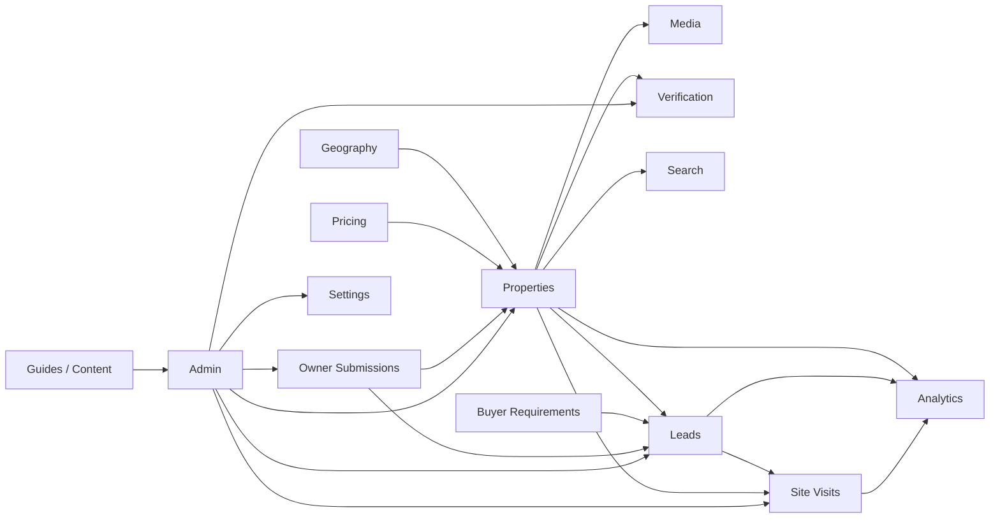

The diagram is directional, not a requirement for separate deployable services.

---

# 7. Major Data and Application Flows

## 7.1 Browse / Search

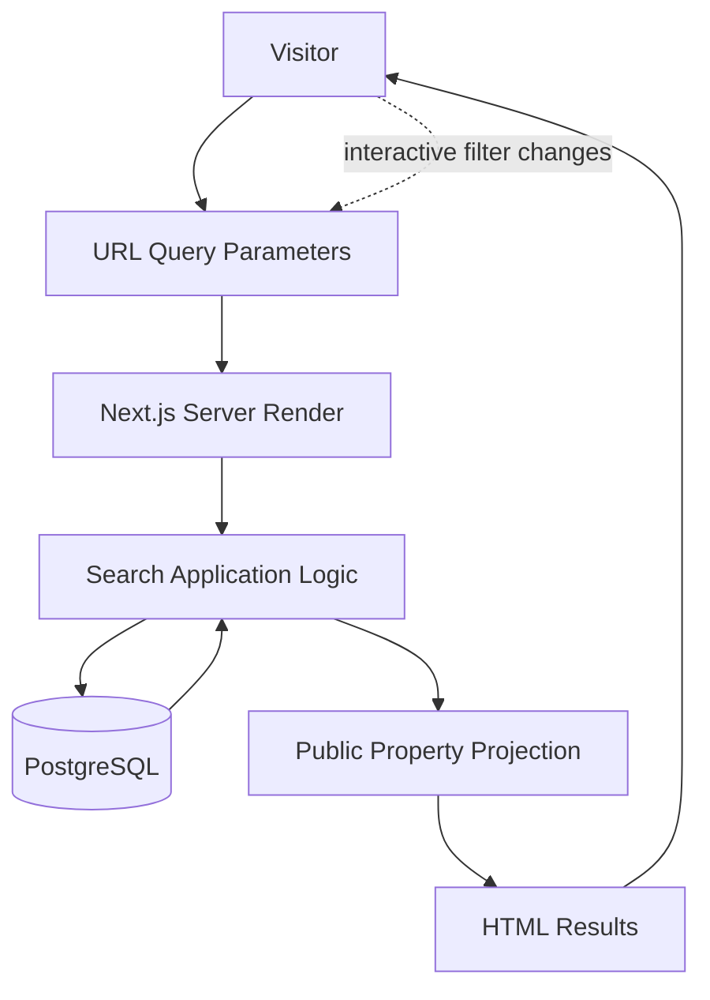

Principles:

- query state lives in URL parameters;
- initial results are server-rendered;
- property records are filtered to published/public-safe inventory;
- pagination remains server-side;
- map interactivity is an enhancement.

---

## 7.2 Property Detail

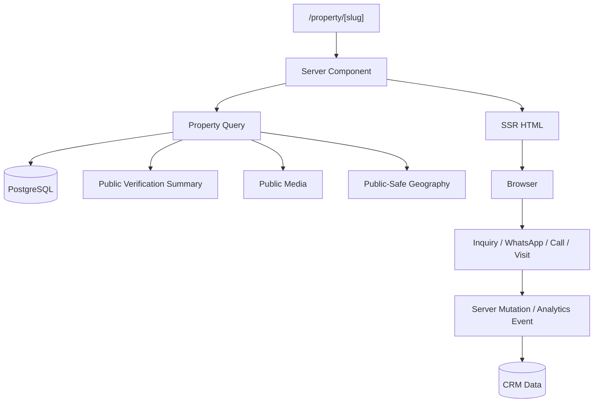

Property detail pages must not accidentally include:

- owner private phone/email;
- exact private coordinates when not permitted;
- internal verification notes;
- private documents;
- negotiation notes.

---

## 7.3 Inquiry

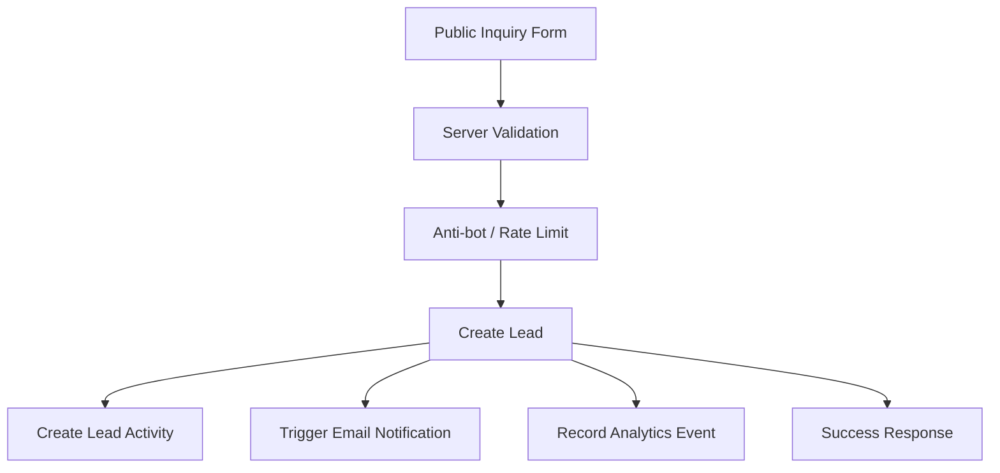

The lead is created in the CRM even if email delivery later fails.

Email failure must be treated as a notification failure, not a rollback of the saved lead.

---

## 7.4 WhatsApp / Call Event

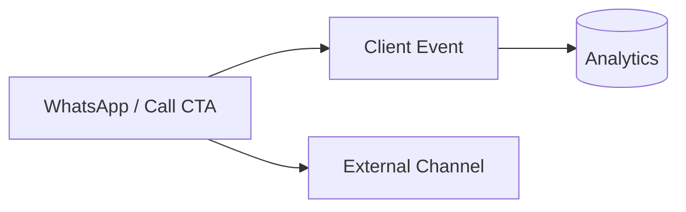

For WhatsApp, the generated URL/message should carry the Property ID.

For Call, the application should record a click event even though it cannot guarantee call completion.

The source requirements explicitly state that call clicks should become analytics events and that WhatsApp should preserve Property ID context. [Source: `LANDSPACE_PRODUCT_REQUIREMENTS.md`]

---

## 7.5 Buyer Requirement

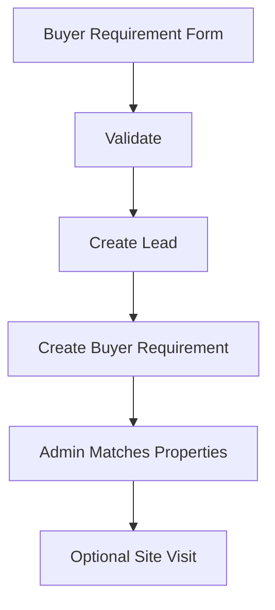

Buyer requirement is a first-class lead type.

It must not be represented as a fake inquiry against an arbitrary property.

---

## 7.6 Site Visit

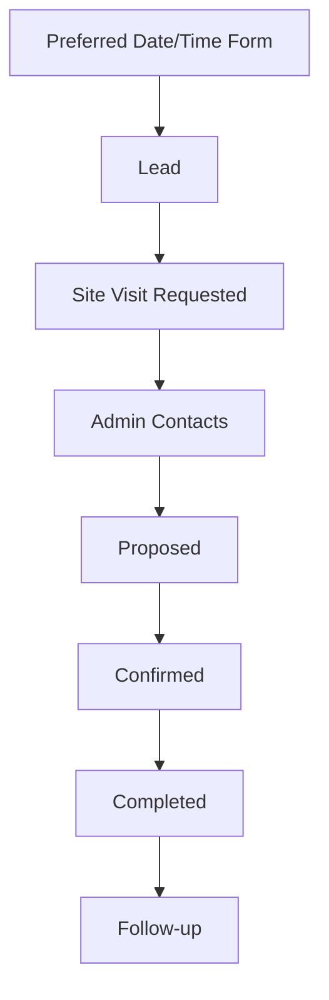

V1 does not automatically reserve calendar slots.

---

## 7.7 Sell Your Land

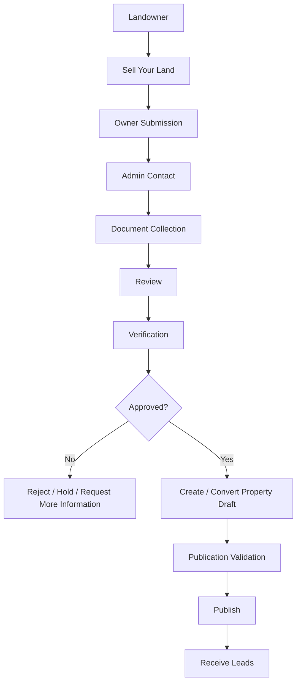

Owner submissions **never auto-publish**.

---

## 7.8 Admin Property Publication

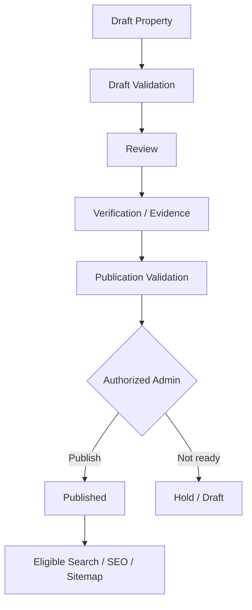

Database insert validation and publication validation are separate concepts.

A draft may be incomplete.

A published listing must satisfy stricter requirements.

---

## 7.9 Verification

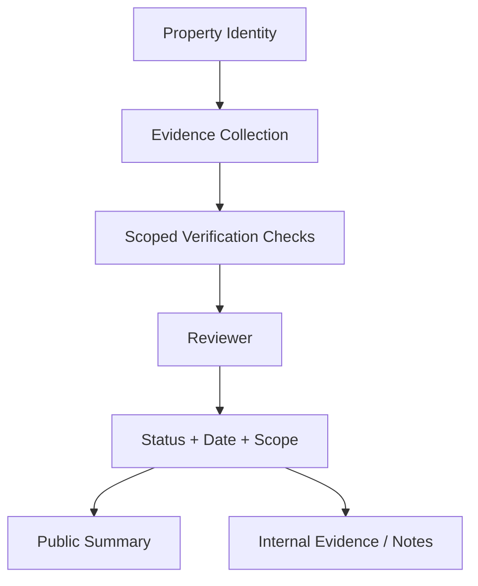

The public layer sees only approved verification summaries.

Evidence and detailed notes remain internal.

---

## 7.10 Media Upload

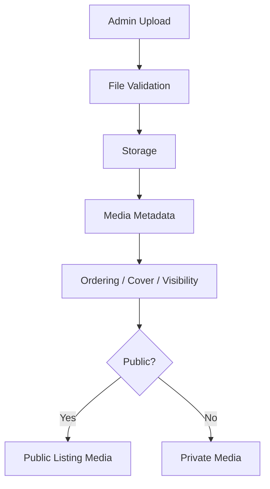

Upload security is an application and storage policy concern, not merely a frontend file-input concern.

---

# 8. Authentication & Authorization Boundary

## 8.1 Public Anonymous Access

Anonymous users may read only data intentionally exposed as public.

Typical public data:

- published properties;
- public property media;
- active public locations;
- published guides;
- public settings;
- public-safe verification summaries.

Anonymous users may submit approved forms through server-side validated mutations.

Anonymous users must not receive database permissions to broadly read or manipulate:

- leads;
- owner submissions;
- private documents;
- private coordinates;
- audit logs;
- internal notes;
- unpublished properties;
- verification evidence.

---

## 8.2 Admin Access

Admin access is authenticated through Supabase Auth.

Authorization is enforced server-side and backed by database policies for defense in depth.

V1 can use a simple admin identity boundary, while the schema should remain extensible to future roles.

Important principle:

> Authentication identifies the actor. Authorization determines what the actor may do.

Do not rely on client-side UI state such as `isAdmin === true`.

---

## 8.3 RLS Architecture Position

This parent architecture establishes that **Row Level Security is mandatory**, but does not define every policy.

The specialist database/security documents must define:

- anonymous read policies;
- admin read/write policies;
- storage policies;
- private-coordinate separation;
- testing strategy.

The master source explicitly requires RLS and server-only service keys. [Source: `Pasted text(3).txt`]

---

# 9. Public / Private Data Boundary

The product has four practical visibility classes.

| Class | Meaning |
|---|---|
| Public | Safe for public listing/API/rendering |
| Admin Only | Operational data used by UrbanEdge staff |
| Sensitive / Private | PII, confidential commercial information, private coordinates, sensitive documents |
| Verification Evidence | Evidence retained to substantiate verification decisions |

Visibility and data shape are independent.

A field can be:

- public + core;
- admin + core;
- private + core;
- verification evidence + flexible.

---

## 9.1 Owner PII

Owner name/contact may be required internally to manage brokerage relationships.

Public listings should show UrbanEdge contact paths rather than exposing the private owner's phone/email unless business policy explicitly changes later.

---

## 9.2 Exact Coordinates

The location privacy model has three levels:

- `EXACT`
- `APPROXIMATE`
- `HIDDEN`

The default public posture is `APPROXIMATE`.

The most important rule is architectural:

> A private exact coordinate must not be sent to the browser and then merely hidden visually.

For `APPROXIMATE` and `HIDDEN` records, exact latitude/longitude must be absent from:

- HTML;
- client props;
- JSON-LD;
- API responses;
- client state;
- network payloads.

A separate public-safe coordinate is stored when needed.

---

## 9.3 Documents

Owner/legal documents are private storage objects.

They must not be:

- publicly indexable;
- exposed through public storage URLs;
- returned by public property queries;
- logged in application telemetry.

Signed/private access should be short-lived and authorization-checked where document access is operationally required.

---

## 9.4 Internal Notes

Internal notes are never a public description source.

This includes:

- negotiation notes;
- broker source;
- bypass-risk notes;
- rejection reasons;
- internal legal comments;
- sensitive verification notes.

---

# 10. SEO Rendering Strategy

SEO is an architectural requirement, not a marketing afterthought.

## 10.1 Server-Rendered Content

The following should be server-rendered or statically generated/cached when appropriate:

- homepage;
- category pages;
- property results that are intended as indexable discovery pages;
- individual property pages;
- guides;
- qualifying location landing pages;
- public legal/information pages.

Property/listing information must be present in the initial HTML response.

---

## 10.2 Rendering Model

| Content | Preferred model |
|---|---|
| Core marketing pages | Static/server-rendered, cacheable |
| Published property pages | Server-rendered + revalidated |
| Public result pages | Server-rendered; cache according to query/revalidation strategy |
| Guides | Static/server-rendered + revalidation |
| Curated SEO landing pages | Server-rendered + revalidation |
| Admin pages | Server-rendered with private data; client interaction where needed |
| Maps | Client-enhanced |
| Image gallery | Server-rendered shell + client interaction |
| Search filter controls | Client interaction controlling URL state |
| Analytics transport | Client/server as appropriate |
| Private CRM | Never public/indexable |

---

## 10.3 Metadata

Use Next.js Metadata APIs.

Indexable pages should support:

- unique title;
- meta description;
- canonical;
- Open Graph;
- robots directives;
- descriptive URL;
- breadcrumb data;
- structured data where accurate.

Do not rely on client-only metadata injection.

---

## 10.4 Structured Data

Use Schema.org only when it accurately reflects visible page content.

Potential types include:

- Organization;
- WebSite;
- BreadcrumbList;
- FAQPage where applicable;
- RealEstateListing where appropriate.

Do not invent:

- ratings;
- reviews;
- fake prices;
- false availability;
- private/exact coordinates;
- legal verification claims.

---

## 10.5 Programmatic SEO Boundary

Location SEO should be controlled, not combinatorial.

The architecture supports curated SEO landing entities with:

- path;
- page type;
- land type;
- transaction;
- location;
- H1;
- intro;
- SEO metadata;
- indexable/active flags.

Pages should become indexable only when they meet quality conditions such as:

- meaningful inventory;
- useful unique content;
- valid canonical;
- useful internal links.

Arbitrary filter combinations should generally not become thousands of indexable pages.

---

# 11. Search Architecture

V1 search is intentionally PostgreSQL-based.

## 11.1 Search Source

Use:

- indexed typed columns;
- normalized geography relations;
- PostgreSQL full-text search where useful;
- `pg_trgm` where justified;
- GIN/GiST indexes where justified.

Avoid:

- Algolia;
- Elasticsearch;
- another paid/external search engine.

This is both a cost decision and a complexity decision.

The product requirements explicitly specify PostgreSQL search for V1 and a future `SearchProvider` boundary. [Source: `Pasted text(3).txt`]

---

## 11.2 Structured Filters

V1 supports the major structured filter dimensions:

- transaction;
- land type;
- district;
- taluka;
- village/locality;
- area min/max;
- pricing where meaningful;
- relevant category-specific filters.

Property ID supports exact lookup.

---

## 11.3 URL-Based Search State

Search state belongs in the URL.

Conceptually:

```text
/properties?type=agricultural&transaction=buy&district=ahmedabad
```

Requirements:

- shareable;
- bookmarkable;
- back/forward compatible;
- server-readable;
- reproducible after page reload.

React component memory alone is not the canonical search state.

---

## 11.4 Future Search Provider Boundary

The UI and domain layer may depend on:

```text
SearchProvider
```

rather than directly on a specific vendor.

V1 implementation:

```text
PostgresSearchProvider
```

Future implementation could add a dedicated provider without changing public UX contracts.

---

# 12. Geography Architecture

## 12.1 Core Administrative Hierarchy

```text
Country
  ↓
State
  ↓
District
  ↓
Taluka / Sub-district
  ↓
Village / Locality
```

V1 activates only the geography necessary for Ahmedabad and Gandhinagar.

---

## 12.2 Separate Geography Dimensions

These are **not child nodes of village**:

- planning authority;
- TP scheme;
- Original Plot / Final Plot references;
- GIDC estate;
- city survey / ward;
- PIN code;
- survey references.

This matters because planning, industrial, administrative, and parcel-reference systems do not share one hierarchy.

The data model report explicitly identifies TP schemes, planning authorities, GIDC estates, wards, PIN codes, and survey references as separate dimensions. [Source: `LAND_DATA_MODEL_REPORT.md`]

---

## 12.3 No Hard-Coded Gujarat UI Model

Public selectors are database-driven.

They should expose only:

- active locations;
- current service-area locations;
- or locations justified by inventory/content.

Do not fabricate large village/taluka datasets.

Geography imports should be versionable and source-aware.

---

## 12.4 Expansion Contract

The geography domain must support:

```text
Ahmedabad + Gandhinagar
        ↓
All Gujarat
        ↓
Selected India
```

without redesigning public components.

State-specific terms, units, authorities, documents, and legal labels belong behind data/configuration boundaries, not in universal UI code.

---

# 13. Media Architecture

Media is modeled as a business entity plus a storage concern.

## 13.1 Media Entity Responsibilities

Media metadata may include:

- media ID;
- property ID;
- type;
- storage/file reference;
- public/private classification;
- cover flag;
- order;
- source;
- caption/alt text where appropriate.

---

## 13.2 Supported V1 Media

The product requirements support:

- images;
- video references;
- drone video references;
- brochure/PDF links;
- 360-tour links.

Large video hosting should not be forced into free Supabase Storage.

Where external video is used, the application stores the safe external reference rather than copying large media into the database.

---

## 13.3 Image Strategy

Property images should be:

- compressed;
- optimized for web delivery;
- assigned meaningful alt text;
- ordered;
- associated with a property;
- protected from uncontrolled public/private mixing.

Free-tier resilience requires conscious storage usage.

---

# 14. Verification Architecture

Verification is a **domain, evidence, and disclosure system**, not a badge field.

## 14.1 Architectural Model

```text
Property
  ↓
Verification
  ↓
Verification Scope / Check
  ↓
Evidence
  ↓
Reviewer + Date + Status
  ↓
Public-Safe Summary
```

---

## 14.2 Evidence Sources

Verification may involve, depending on property and scope:

- revenue records;
- registered document evidence;
- Index-2;
- EC/search;
- mutation/VF6;
- property card;
- survey/mapni evidence;
- tenure records;
- NA order;
- planning/zoning;
- GIDC records;
- site observation;
- litigation/government-claim screening;
- professional review.

The legal report describes this as a multi-dimensional due-diligence process and explicitly rejects a monolithic verified flag. [Source: `LEGAL_VERIFICATION_REPORT.md`]

---

## 14.3 Public Disclosure

Public badges must be:

- scoped;
- explainable;
- dated;
- evidence-backed.

Examples:

- Documents Reviewed;
- Revenue Records Reviewed;
- Registration Records Reviewed;
- Location Checked;
- Site Visit Completed;
- Survey/Mapni Evidence Reviewed;
- Planning/Zoning Check Completed;
- GIDC Records Reviewed;
- Legal Review Completed — Scoped.

A legal or government claim must never be inferred from the presence of a generic “verified” icon.

---

## 14.4 Legal Boundary

UrbanEdge Land Space is not:

- a title insurer;
- a legal opinion service;
- a land-record authority;
- a guarantee of transferability;
- a guarantee of buildability.

Where the evidence is insufficient or a high-risk legal decision is involved, the system should support referral to qualified professional review.

---

# 15. CRM Architecture

CRM is the operational center of the product.

## 15.1 Core Relationship

```text
Party / Contact
      │
      ▼
     Lead
      ├──────────────► Buyer Requirement
      │
      ├──────────────► Lead Activities
      │
      ├──────────────► Property Links
      │
      └──────────────► Site Visits
```

Properties independently relate to multiple leads.

---

## 15.2 Lead Sources

The central CRM should support configurable sources including:

- website form;
- property detail;
- WhatsApp click;
- call click;
- site-visit form;
- Sell Your Land;
- buyer requirement;
- referral;
- manual entry;
- property portals;
- social channels;
- Google Business/Profile;
- direct/organic;
- offline.

Sources are data, not hard-coded branches in UI logic.

---

## 15.3 Lead Pipeline

V1 pipeline:

```text
New
→ Contact Attempted
→ Qualified
→ Requirement Confirmed
→ Property Matched
→ Site Visit Requested
→ Site Visit Confirmed
→ Site Visit Completed
→ Negotiation
→ Nurture / Closed Won / Closed Lost
```

The CRM must maintain:

- follow-up;
- activity timeline;
- outcome;
- loss reason where relevant.

---

## 15.4 One-Admin Model

V1 uses one central inbox and one admin.

The architecture leaves room for:

```text
assigned_to
```

later without redesigning lead/property records.

---

# 16. Error Architecture

Errors are treated as intentional product states.

## 16.1 Validation Errors

Client-side validation improves usability.

Server-side validation is authoritative.

Use one consistent schema validation strategy, such as Zod.

---

## 16.2 Domain Errors

Examples:

- property cannot be published yet;
- listing is archived;
- invalid workflow transition;
- duplicate property/submission warning;
- unsupported price/area combination.

Domain errors should be structured and user-safe.

---

## 16.3 Authorization Errors

Use clear outcomes for:

- unauthenticated;
- authenticated but unauthorized;
- expired private access;
- invalid admin operation.

Do not reveal sensitive resource existence unnecessarily.

---

## 16.4 Not Found

Use real 404 behavior for:

- invalid public slug;
- unknown public route;
- missing public property when no retained SEO page exists.

Closed properties may remain publicly resolvable with clear Sold/Rented/Leased status when business/SEO policy warrants it.

---

## 16.5 External Service Failure

External failures must not destroy durable core state where the business operation can still succeed.

Examples:

- lead saved but email failed;
- property saved but analytics call failed;
- map provider unavailable;
- anti-bot provider unavailable.

Use graceful degradation.

---

## 16.6 Upload Failure

Reject uploads for:

- invalid file type;
- invalid size;
- policy violation;
- authorization failure.

Do not leave partially completed public records without a recoverable state.

---

## 16.7 Error UX

The public application must deliberately support:

- 404;
- 500/application failure;
- no properties;
- zero search results;
- image unavailable;
- email failure after lead creation;
- upload rejected;
- unauthorized admin;
- network failure;
- anti-bot failure;
- expired signed URL;
- invalid property slug;
- archived/closed property states.

Never leave a blank screen.

---

# 17. Configuration

Configuration is divided into three categories.

## 17.1 Code

Use code for stable technical behavior:

- route structure;
- enum definitions;
- business workflow mechanics;
- feature flags that are not expected to change operationally;
- component behavior;
- static legal/technical constants where appropriate.

---

## 17.2 Database Settings

Use validated DB-backed settings for business values likely to change without a deployment.

Examples:

- business phone;
- WhatsApp number;
- email;
- office address;
- business hours;
- Living Space URL;
- social URLs;
- service-area configuration;
- supported units;
- SEO defaults;
- verification disclaimer;
- notification email.

---

## 17.3 Environment Variables

Use environment variables for:

- Supabase URL;
- Supabase anon/public key;
- Supabase service-role key;
- external provider secrets;
- deployment/environment identifiers;
- email provider key;
- anti-bot secrets;
- map style/provider secrets if applicable;
- application base URL when environment-specific.

Never place secrets in `NEXT_PUBLIC_*`.

`.env.example` contains names only.

---

# 18. Observability

Observability must remain compatible with free-tier infrastructure.

## 18.1 Logging

Log operational events at useful boundaries:

- request failure;
- action failure;
- integration failure;
- permission failure;
- unexpected domain transition.

Do not log:

- passwords;
- tokens;
- service keys;
- private document contents;
- unnecessary owner PII;
- exact confidential data unless operationally justified.

---

## 18.2 Audit Log

Audit log is distinct from application logs.

Important admin mutations should be recorded, including:

- property published/unpublished;
- price changed;
- location privacy changed;
- verification updated;
- submission converted;
- lead stage changed;
- sensitive document access where appropriate.

Store:

- actor;
- action;
- entity;
- entity ID;
- timestamp;
- safe before/after summary.

Never log raw secrets or sensitive document content.

---

## 18.3 Analytics

V1 analytics should be business-focused and privacy-conscious.

Important events:

- page/property view;
- search;
- inquiry;
- WhatsApp click;
- call click;
- site visit request;
- buyer requirement;
- owner submission;
- lead source.

Do not use:

- covert fingerprinting;
- third-party ad pixels;
- invasive session replay.

---

## 18.4 Operational Health

The admin system should provide a non-public operational health view showing configuration readiness without exposing secrets.

Examples:

- database reachable;
- storage configured;
- email provider configured;
- anti-bot configured;
- site URL configured;
- WhatsApp configured;
- analytics configured.

---

# 19. Environment Architecture

Three environments are required.

```text
LOCAL
  ↓
PREVIEW / STAGING
  ↓
PRODUCTION
```

## Local

Purpose:

- development;
- unit/integration testing;
- optional local Supabase.

Preferred approach:

- Supabase CLI/Docker when practical;
- otherwise a clearly designated development project.

---

## Preview / Staging

Purpose:

- integration testing;
- E2E testing;
- pre-production validation;
- content/configuration verification.

Never connect automated tests to production.

---

## Production

Purpose:

- public website;
- live CRM;
- real inventory;
- real leads.

Production uses:

- dedicated production environment variables;
- dedicated Supabase project;
- production storage;
- production email integration.

Destructive migrations are never automated blindly against production.

---

# 20. Infrastructure Architecture

## 20.1 Hosting

The supplied architecture sets the default free production target as **Netlify Free** for this commercial website, while keeping the Next.js application portable enough to move to paid infrastructure later if explicitly approved.

The source material also explicitly warns against using a hosting plan whose commercial terms are unsuitable for the client deployment. [Source: `Pasted text(3).txt`]

---

## 20.2 Database

Use a **new, separate Supabase project**.

Do not share UrbanEdge Living Space's production database.

Reasons:

- different data models;
- different verification workflows;
- different listing fields;
- different lead workflows;
- independent evolution;
- security isolation.

Future cross-product integration should occur through explicit APIs or shared business integrations, not a shared production database.

---

## 20.3 Storage

Use separate storage responsibilities for:

- public/controlled property media;
- private owner/legal documents.

---

## 20.4 Email

Email is a notification integration.

Core business state must remain in PostgreSQL even if email delivery fails.

---

## 20.5 Maps

Use a MapLibre-compatible public map architecture with configurable provider/style.

For strict-free deployment, use an appropriate free OpenStreetMap-derived provider if current terms remain suitable.

Use Google Maps URLs for navigation/directions rather than a paid Google Maps Platform API dependency.

The master specification specifically requires avoiding direct abuse of public OpenStreetMap raster servers and keeping map provider settings configurable. [Source: `Pasted text(3).txt`]

---

# 21. Security Architecture

Security is designed around **server ownership of trust**.

## 21.1 Mutation Security

Every mutation follows:

```text
Authenticate
   ↓
Authorize
   ↓
Validate
   ↓
Apply domain rules
   ↓
Mutate
   ↓
Audit / Activity
   ↓
Return safe result
```

Public mutations additionally require:

- rate limiting;
- anti-bot where configured;
- abuse controls;
- appropriate origin/CSRF protections.

---

## 21.2 Storage Security

Private documents use explicit storage policies.

Do not treat unguessable URLs as access control.

---

## 21.3 Security Headers

Production should configure appropriate headers such as:

- Content-Security-Policy;
- X-Content-Type-Options;
- Referrer-Policy;
- Permissions-Policy;
- frame protections;
- HSTS where appropriate.

CSP must reflect actual dependencies rather than blindly allowing broad unsafe sources.

---

## 21.4 XSS / Content

Guides and descriptions must use:

- controlled Markdown/structured content; or
- sanitized HTML.

Arbitrary untrusted HTML must never be rendered directly.

---

# 22. Scalability

V1 should scale by **data volume and modular boundaries**, not by prematurely adopting distributed architecture.

## 22.1 Stage 1 — Ahmedabad + Gandhinagar

Expected characteristics:

- modest curated inventory;
- one admin;
- PostgreSQL search;
- one Next.js deployment;
- Supabase Free;
- free-tier-compatible maps/email/analytics.

This is the ideal scale for the modular monolith.

---

## 22.2 Stage 2 — Gujarat

Scale without redesign by:

- adding geography data;
- adding properties;
- adding authority references;
- expanding configurable category attributes;
- adding more content;
- adding more CRM ownership fields.

No national infrastructure should be required yet.

---

## 22.3 Stage 3 — India

If the business grows substantially, the current architecture provides boundaries for selective extraction:

- search provider;
- media processing;
- email;
- analytics;
- CRM workloads;
- specialized verification integrations.

Only extract a service when there is an actual scaling or operational reason.

---

## 22.4 Expected Scaling Path

```text
More inventory
→ better PostgreSQL indexes
→ query/projection optimization
→ caching/revalidation
→ pagination
→ optional read models
→ optional dedicated search provider
→ selective service extraction only if justified
```

Not:

```text
Start with microservices
→ add infrastructure
→ add event bus
→ add search cluster
→ pay for idle complexity
```

---

# 23. Architecture Decision Records

This document establishes the following major decisions.

| ADR | Decision |
|---|---|
| ADR-001 | Build Land Space as a new repository |
| ADR-002 | Use a new dedicated Supabase project/database |
| ADR-003 | Use Next.js App Router + TypeScript |
| ADR-004 | Use Server Components by default |
| ADR-005 | Use Server Actions / Route Handlers instead of a separate backend server |
| ADR-006 | Use a modular monolith for V1 |
| ADR-007 | Use PostgreSQL as the V1 search engine |
| ADR-008 | Keep search state in URL parameters |
| ADR-009 | Separate public-safe and private data projections |
| ADR-010 | Use three location visibility modes: EXACT / APPROXIMATE / HIDDEN |
| ADR-011 | Use scoped verification rather than a monolithic Verified flag |
| ADR-012 | Treat Sell Your Land as an owner-submission workflow |
| ADR-013 | Use one central V1 CRM/admin |
| ADR-014 | Require manual site-visit confirmation |
| ADR-015 | Keep buyer/seller accounts out of V1 |
| ADR-016 | Separate public property media from private owner documents |
| ADR-017 | Keep external integrations behind provider boundaries |
| ADR-018 | Use server-rendered property/listing content for SEO |
| ADR-019 | Make location SEO curated and quality-gated |
| ADR-020 | Target free-tier infrastructure where reasonably possible |
| ADR-021 | Keep Living Space operationally isolated |
| ADR-022 | Use database migrations as schema source of truth |
| ADR-023 | Require RLS and server-only privileged keys |
| ADR-024 | Record important admin mutations in an audit log |

---

# 24. Explicitly Rejected Architecture

The following are deliberately not part of V1.

## Shared Living Space Database

**Rejected.**

UrbanEdge Living Space and Land Space are separate products with different data models, workflows, verification concerns, and evolution paths.

Brand continuity is achieved through design language and intentional cross-links, not shared database state.

---

## Public Marketplace

**Rejected.**

V1 is brokerage-led and curated.

Owners do not directly publish listings.

This reduces:

- low-quality supply;
- duplicate inventory;
- unsafe disclosures;
- moderation burden;
- bypass risk;
- trust problems.

---

## Microservices

**Rejected for V1.**

The workload does not justify the operational cost.

A modular monolith gives:

- clearer deployment;
- fewer failure points;
- simpler local development;
- lower cost;
- faster iteration.

The domain boundaries remain strong enough to permit later extraction where justified.

---

## Elasticsearch / Algolia

**Rejected for V1.**

PostgreSQL is sufficient for realistic curated brokerage inventory.

A provider boundary is retained for future scale.

---

## Unnecessary Event Bus

**Rejected for V1.**

The system does not need Kafka-like/event-bus infrastructure for:

- form submission;
- lead creation;
- property publication;
- site visits;
- audit records.

Synchronous application orchestration is easier to reason about.

Future asynchronous workflows can be introduced only when there is an actual requirement.

---

## Pure EAV Property Model

**Rejected.**

Core property data must remain strongly typed.

A flexible attribute layer may exist for evolving category-specific fields, but the entire property record must not become a generic key/value blob.

This preserves:

- searchability;
- integrity;
- constraints;
- maintainability;
- SEO data quality.

---

## Client-Side-Only Application

**Rejected.**

The product requires:

- SEO;
- public HTML before hydration;
- secure server mutations;
- private/public data boundaries;
- server-side authorization.

A browser-only SPA would work against these goals.

---

## Buyer Authentication

**Rejected for V1.**

Buyers can convert anonymously into CRM leads.

There is no need to create account/password lifecycle complexity when the core workflow is human-assisted brokerage.

---

## Seller Dashboard

**Rejected for V1.**

Landowners submit inventory to UrbanEdge.

They do not manage a self-service listing dashboard.

---

## Paid Infrastructure Dependencies

**Rejected unless approved.**

The zero-cost policy is architectural, not merely budgetary.

Do not silently introduce:

- paid maps;
- paid search;
- paid email plans;
- paid hosting;
- paid storage;
- paid analytics;
- paid monitoring;
- SMS/WhatsApp Business API billing;
- premium SaaS dependencies.

Any required payment is a decision gate.

---

# 25. Architecture Risks

## Risk 1 — False confidence from verification

**Risk:** Users interpret a badge as a title guarantee.

**Mitigation:**

- scoped statuses;
- evidence-backed checks;
- date/scope display;
- lawyer review triggers;
- explicit disclaimer;
- no monolithic Verified flag.

---

## Risk 2 — Private coordinate leakage

**Risk:** Exact parcel location leaks through JSON, props, APIs, maps, or SEO.

**Mitigation:**

- separate private/public coordinates;
- server-side projection;
- RLS;
- public-safe geography view;
- dedicated leakage tests.

---

## Risk 3 — Free-tier limits

**Risk:** Storage, email, database, maps, or hosting free tiers are exhausted.

**Mitigation:**

- compress images;
- avoid large video storage;
- document quotas;
- monitor usage;
- provide backup/export procedures;
- keep provider boundaries.

The source material explicitly recognizes that free services do not provide enterprise SLAs and requires this reality to remain visible operationally. [Source: `Pasted text(3).txt`]

---

## Risk 4 — Low-quality owner submissions

**Risk:** Large amounts of incomplete or unreliable supply enter the system.

**Mitigation:**

- draft-first submission;
- admin review;
- duplicate warnings;
- publish validation;
- no auto-publication.

---

## Risk 5 — Stale property availability

**Risk:** Closed properties continue accepting misleading enquiries.

**Mitigation:**

- separate publication status from availability;
- clear Sold/Rented/Leased state;
- adjust CTAs to “Find Similar Properties” / “Tell Us Your Requirement”;
- CRM follow-up.

---

## Risk 6 — Thin SEO pages

**Risk:** Programmatic geography/search pages create low-quality indexable content.

**Mitigation:**

- quality-gated landing pages;
- editorial control;
- canonicalization;
- noindex/non-generation for thin pages.

---

## Risk 7 — Vendor lock-in

**Risk:** Maps/email/search become deeply coupled to one provider.

**Mitigation:**

- provider interfaces;
- configuration-driven provider settings;
- standard Next.js APIs;
- internal domain contracts.

---

## Risk 8 — Admin concentration

**Risk:** One admin controls valuable listings, leads, and verification states.

**Mitigation:**

- Supabase Auth;
- RLS;
- audit log;
- confirmation for destructive actions;
- clear publication workflow;
- future-ready `assigned_to`.

---

## Risk 9 — Domain model drift

**Risk:** Specialist documents independently redefine property, lead, verification, or geography concepts.

**Mitigation:**

This master document is authoritative for system boundaries. Specialist documents must derive from it and identify any intentional deviation through an ADR.

---

## Risk 10 — Legal/Regulatory change

**Risk:** Government portals, rules, forms, authority practices, and terminology change.

**Mitigation:**

- source-aware verification records;
- reviewed dates;
- configurable content;
- legal review for consequential public claims;
- state/jurisdiction-aware architecture.

The legal report explicitly describes itself as a controlled research baseline rather than a permanently correct rulebook. [Source: `LEGAL_VERIFICATION_REPORT.md`]

---

# 26. Dependency Map for Remaining Architecture Documents

The following documents should derive from this master architecture.

## `02-DATABASE-ARCHITECTURE.md`

Must derive:

- bounded domains;
- property/party/lead/verification relationships;
- geography hierarchy and separate dimensions;
- visibility classes;
- public/private coordinate model;
- RLS requirements;
- migration strategy.

It must not replace the master architecture with a different backend model.

---

## `03-FRONTEND-ARCHITECTURE.md`

Must derive:

- App Router;
- Server Components default;
- Client boundaries;
- route groups;
- public/admin shell separation;
- server-rendered SEO content;
- URL-based search state.

---

## `04-UX-UI-DESIGN-ARCHITECTURE.md`

Must derive:

- UrbanEdge brand family;
- premium navy/gold language;
- land/investment-oriented visual personality;
- responsive/accessibility requirements;
- public/admin visual separation.

The Living Space design report is the visual reference, not a code template. [Source: `URBANEDGE_LIVINGSPACE_DESIGN_REPORT.md`]

---

## `05-PROPERTY-DOMAIN-ARCHITECTURE.md`

Must derive:

- property-centric model;
- agricultural/NA/industrial separation;
- publication versus availability;
- pricing and area principles;
- location visibility;
- media relation.

---

## `06-SEARCH-ARCHITECTURE.md`

Must derive:

- PostgreSQL V1 search;
- structured filters;
- URL state;
- server-rendered results;
- SearchProvider boundary;
- future provider migration path.

---

## `07-GEOGRAPHY-ARCHITECTURE.md`

Must derive:

- Country → State → District → Taluka → Village/Locality;
- separate planning/industrial/survey dimensions;
- Gujarat-to-India extensibility;
- database-driven selectors.

---

## `08-VERIFICATION-ARCHITECTURE.md`

Must derive:

- evidence-backed scoped verification;
- internal versus public disclosure;
- lawyer referral boundaries;
- auditability;
- property/legal source separation.

---

## `09-MEDIA-STORAGE-ARCHITECTURE.md`

Must derive:

- public/private storage split;
- media metadata;
- upload validation;
- safe access;
- free-tier storage strategy.

---

## `10-ADMIN-CRM-ARCHITECTURE.md`

Must derive:

- one-admin V1;
- lead pipeline;
- activity timeline;
- buyer requirements;
- site visits;
- owner submissions;
- future `assigned_to`.

---

## `11-AUTHORIZATION-RLS-SECURITY-ARCHITECTURE.md`

Must derive:

- authenticated admin boundary;
- anonymous public boundary;
- RLS;
- private coordinate protections;
- storage policies;
- mutation validation;
- service-key secrecy;
- audit logging.

---

## `12-SEO-ARCHITECTURE.md`

Must derive:

- SSR/indexable HTML;
- metadata;
- canonicalization;
- sitemap/robots;
- structured data;
- quality-gated location SEO;
- closed-property URL strategy.

---

## `13-ANALYTICS-OBSERVABILITY-ARCHITECTURE.md`

Must derive:

- free-tier observability;
- conversion event model;
- analytics/privacy principles;
- operational health;
- audit log distinction.

---

## `14-ERROR-RESILIENCE-ARCHITECTURE.md`

Must derive:

- validation/domain/auth/external-service failure boundaries;
- graceful degradation;
- public-safe error states;
- notification failure semantics.

---

## `15-TESTING-ARCHITECTURE.md`

Must derive:

- unit/integration/E2E layering;
- RLS testing;
- privacy leakage testing;
- SEO SSR testing;
- accessibility testing;
- publication workflow testing.

---

## `16-DEPLOYMENT-ENVIRONMENT-ARCHITECTURE.md`

Must derive:

- Local / Preview-Staging / Production;
- separate Supabase environments;
- Netlify Free target;
- migration discipline;
- backups;
- zero-cost approval gates.

---

# 27. Authoritative Architecture Summary

UrbanEdge Land Space V1 shall be built as:

> **A new, independent Next.js + TypeScript modular monolith using the App Router, backed by a dedicated Supabase PostgreSQL/Auth/Storage project, deployed independently from UrbanEdge Living Space, with server-rendered public discovery pages, a private authenticated one-admin CRM/admin application, PostgreSQL-powered search, explicit public/private data projections, scoped verification, privacy-preserving location handling, and provider boundaries for maps, email, analytics, and future search infrastructure.**

The following principles are mandatory:

1. **Land Space is a separate product and database from Living Space.**
2. **V1 is a curated brokerage platform, not an open marketplace.**
3. **Buy/Rent/Lease are discovery intents; Sell Your Land is an owner-submission workflow.**
4. **Next.js Server Components are the default rendering model.**
5. **Client Components are used only where interaction requires them.**
6. **Server-side mutations own authentication, authorization, validation, and domain rules.**
7. **PostgreSQL is the V1 search engine.**
8. **Search state is URL-based and shareable.**
9. **Published property and listing content must be present in initial HTML for SEO.**
10. **Geography is normalized and database-driven.**
11. **Planning authority, TP scheme, GIDC estate, survey references, ward, and similar concepts are separate dimensions, not fake geography children.**
12. **Exact/private coordinates must never leak to clients when location is APPROXIMATE or HIDDEN.**
13. **Owner PII, private documents, internal notes, and verification evidence are private.**
14. **Verification is scoped, evidence-backed, dated, and explainable—not a universal legal-clearance Boolean.**
15. **The CRM is the central operational system for leads, buyer requirements, activities, and site visits.**
16. **Site visits are manually confirmed in V1.**
17. **Owner submissions never publish automatically.**
18. **Public inventory must be explicitly published and availability must remain separate from publication status.**
19. **Public and private storage responsibilities are separated.**
20. **RLS is mandatory and service-role privileges remain server-only.**
21. **Free-tier constraints are real architectural constraints and no paid service may be activated without explicit approval.**
22. **Microservices, Elasticsearch, event buses, pure EAV, buyer accounts, seller dashboards, payment workflows, in-app chat, AI chatbot, automatic valuation, and automatic calendar booking are not V1 architecture.**
23. **The architecture must scale by strengthening the modular monolith before introducing distributed infrastructure.**
24. **Specialist architecture documents must derive from this document and may only override it through explicit documented architecture decisions.**

This is the parent contract for the V1 system.

