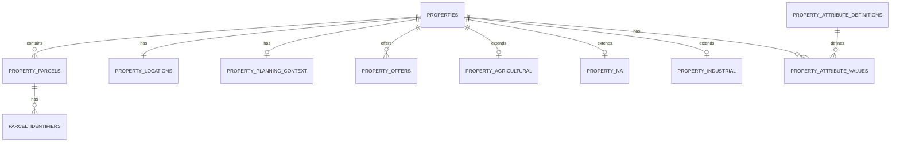
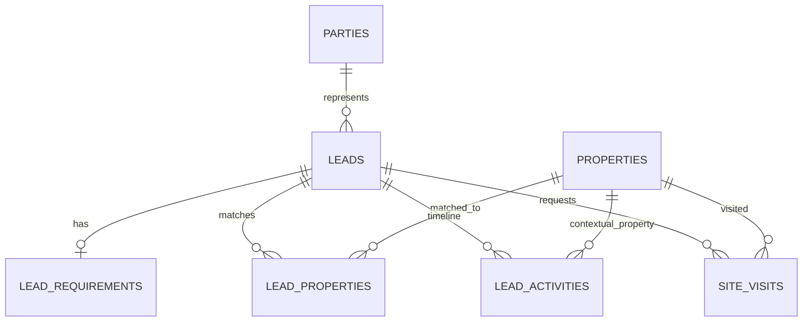
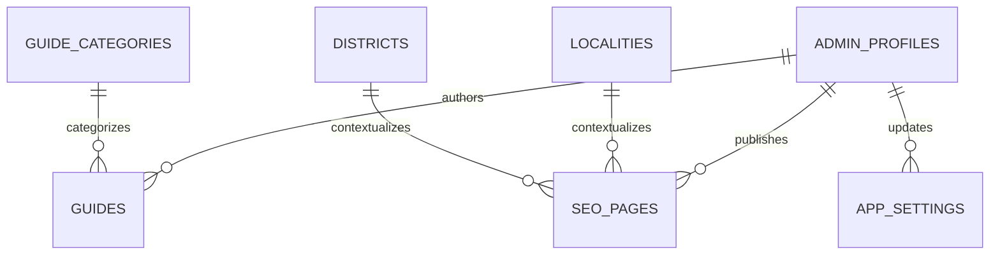

# URBANEDGE LAND SPACE — DATABASE SCHEMA ARCHITECTURE

**File:** `03-DATABASE-SCHEMA-ARCHITECTURE.md`  
**System:** UrbanEdge Land Space V1  
**Status:** Production database architecture / coding-agent handoff  
**Launch geography:** Ahmedabad + Gandhinagar, Gujarat  
**Expansion direction:** Gujarat → India  
**Database:** PostgreSQL via dedicated Supabase project  
**Architecture date:** 29 August 2026

---

## 0. Purpose and authority

This document translates the researched land-domain model, the master website architecture, the page/UX architecture, the product requirements, and the legal/verification research into the **production PostgreSQL/Supabase relational architecture for UrbanEdge Land Space V1**.

It is the database contract for the implementation phase.

The design intentionally follows the research conclusion that UrbanEdge should use:

- a universal typed property core;
- separate parcel and government-identifier records;
- normalized geography;
- separate planning dimensions;
- category-specific typed extension tables;
- unit-aware numeric area/pricing;
- separate public media and private documents;
- scoped verification and evidence;
- owner submissions as a private intake workflow;
- a thin but relational CRM;
- configurable category attributes;
- append-only analytics/audit records;
- public-safe and private projections.

The architecture explicitly rejects:

- a giant `properties` table;
- pure JSONB property storage;
- pure EAV;
- government-form cloning;
- a monolithic `verified` boolean;
- storing exact parcel coordinates in a public property payload;
- treating publication and availability as the same state;
- replacing source records/evidence with marketing claims.

The source research explicitly recommends the hybrid approach, separate planning/GIDC dimensions, source-specific identifiers, regional unit conversions, multiple parcels per listing, scoped verification, and public/private separation. fileciteturn1file0 fileciteturn3file16

---

# 1. Core architecture decisions

## 1.1 Database principles

1. **Every business entity gets its own table.**
2. **Every stable searchable fact is typed.**
3. **Every government/source identifier remains source-specific.**
4. **Every public/private boundary is enforced by database/API projection, not UI hiding.**
5. **Property identity is separate from parcel identity.**
6. **One listing may aggregate multiple underlying parcels.**
7. **Planning is a separate dimension from administrative geography.**
8. **Verification is an evidence-backed workflow, not a property flag.**
9. **Source provenance is first-class where an important fact comes from an external record.**
10. **Soft archive is the normal deletion strategy for business data.**
11. **Audit history is append-only for sensitive/admin mutations.**
12. **Raw analytics may be flexible, but it is not the property system of record.**
13. **Supabase Auth owns authentication; the database owns application authorization metadata and business state.**
14. **All schema changes are committed SQL migrations.**
15. **RLS is mandatory.**
16. **Service-role credentials remain server-side only.**

---

# 2. Platform identity model

## 2.1 Property ID — resolved V1 format

The canonical public property identifier is:

```text
UE-LS-000001
```

Examples:

```text
UE-LS-000001
UE-LS-000002
UE-LS-000003
```

### Rules

- Prefix is permanently `UE-LS-`.
- Six decimal digits.
- Immutable for the lifetime of the listing record.
- Unique.
- Generated by a PostgreSQL sequence/function, not by the client.
- Never derived from title, category, locality, owner name, date, or UUID.
- Never reused.
- Independent from the SEO slug.
- Not a government land-record identifier.

### Important consequence

The old researched examples such as `UEL-AG-000001`, `UEL-NA-000001`, and `UEL-IN-000001` are superseded for V1 public identity by the requested canonical format:

```text
UE-LS-000001
```

Land category must be stored separately as a typed field.

### Database representation

```text
property_id            uuid PRIMARY KEY
property_code          varchar(13) UNIQUE NOT NULL
```

Constraint:

```regex
^UE-LS-[0-9]{6}$
```

Generation must be concurrency-safe using a sequence-backed allocator.

The six-digit format deliberately caps the public namespace at `999999` identifiers. A future architecture decision is required before that namespace is exhausted.

---

# 3. UUID / key policy

## 3.1 Primary key policy

Use PostgreSQL `uuid` primary keys generated with:

```sql
gen_random_uuid()
```

for normal entities.

Use UUID PKs for:

- properties;
- parcels;
- parties;
- leads;
- submissions;
- media;
- documents;
- verifications;
- guides;
- settings;
- analytics;
- audit records;
- geography/planning entities where practical.

## 3.2 Why UUID + public property code

UUIDs are internal relational identifiers.

`UE-LS-000001` is the human/business identifier.

This prevents the public ID contract from being coupled to internal database implementation.

## 3.3 Foreign key rules

Default:

```text
ON DELETE RESTRICT
```

for business parent relationships.

Use:

```text
ON DELETE CASCADE
```

only for true dependent rows where loss of the child has no independent business meaning, for example:

- `property_attribute_values` → `property_attribute_definitions` only when safe;
- join records;
- non-historical UI configuration links.

Use:

```text
ON DELETE SET NULL
```

for actor references where historical business records must remain after an admin account is deactivated.

Do not cascade-delete:

- properties;
- leads;
- site visits;
- verification history;
- audit logs;
- owner submissions;
- financial/commercial evidence;
- parties.

---

# 4. PostgreSQL schemas

V1 should remain operationally simple.

Recommended schemas:

```text
public
auth              # Supabase-managed
storage           # Supabase-managed
```

All application tables may live in `public` for straightforward Supabase operation, but **public exposure is controlled through RLS and explicit views**.

A future architecture may introduce domain schemas such as `crm`, `land`, and `content` only if operational scale justifies it.

Do not fragment V1 into many PostgreSQL schemas merely for aesthetics.

---

# 5. Timestamp and audit-field standard

## 5.1 Standard fields on mutable business tables

Where applicable:

```text
created_at          timestamptz NOT NULL DEFAULT now()
updated_at          timestamptz NOT NULL DEFAULT now()
created_by          uuid NULL
updated_by          uuid NULL
archived_at         timestamptz NULL
archived_by         uuid NULL
deleted_at          timestamptz NULL
deleted_by          uuid NULL
```

### Rules

- Store timestamps in UTC.
- Frontend formats for local timezone.
- `updated_at` is database-maintained.
- `created_at` is immutable.
- `created_by` / `updated_by` reference internal admin identity where the mutation is administrative.
- System-generated operations may have null actor or a reserved system actor convention.
- `deleted_at` is rare and represents a true retention/deletion action, not normal business lifecycle.
- `archived_at` represents normal business retirement.

## 5.2 Published content

Tables that can become public also use:

```text
published_at      timestamptz NULL
published_by      uuid NULL
```

## 5.3 History

Do not use `updated_at` as a replacement for history.

For sensitive state changes, create:

- verification rows/history;
- audit log entries;
- document version rows;
- relevant activity records.

---

# 6. Enum catalogue

Enums are used only for stable business concepts. High-change vocabularies belong in lookup/configuration tables.

## 6.1 `land_category`

```text
AGRICULTURAL
NA
INDUSTRIAL
```

## 6.2 `transaction_type`

```text
BUY
RENT
LEASE
```

`SELL` is not a property discovery transaction. It is an owner-submission workflow.

## 6.3 `property_publication_status`

```text
DRAFT
UNDER_REVIEW
PUBLISHED
UNPUBLISHED
ARCHIVED
```

## 6.4 `property_availability_status`

```text
AVAILABLE
UNDER_NEGOTIATION
SOLD
RENTED
LEASED
OFF_MARKET
```

Availability is intentionally separate from publication.

## 6.5 `location_visibility`

```text
EXACT
APPROXIMATE
HIDDEN
```

Default for published listings:

```text
APPROXIMATE
```

## 6.6 `price_mode`

```text
PRICE_ON_REQUEST
EXACT_TOTAL
PRICE_RANGE
PER_UNIT
```

`NEGOTIABLE` is represented by `is_negotiable`, not as a price mode.

## 6.7 `currency_code`

V1 application constraint:

```text
INR
```

Use ISO 4217-compatible `char(3)` rather than an enum so future currencies do not require migration.

## 6.8 `area_unit_code`

Controlled by `area_units` rather than PostgreSQL enum because regional vocabulary is expected to evolve.

## 6.9 `area_normalization_status`

```text
AUTHORITATIVE
SOURCE_DECLARED
PROVISIONAL
UNKNOWN
```

## 6.10 `party_type`

```text
INDIVIDUAL
COMPANY
PARTNERSHIP
TRUST
SOCIETY
GOVERNMENT
OTHER
```

## 6.11 `property_party_role`

```text
OWNER
CO_OWNER
AUTHORIZED_REPRESENTATIVE
BROKER
INTERMEDIARY
DEVELOPER
INSTITUTIONAL_OWNER
OTHER
```

## 6.12 `media_type`

```text
IMAGE
VIDEO
PANORAMA_360
BROCHURE
DOCUMENT_PREVIEW
MAP_IMAGE
OTHER
```

## 6.13 `record_visibility`

```text
PUBLIC
ADMIN_ONLY
PRIVATE
```

## 6.14 `verification_status`

```text
NOT_STARTED
IN_REVIEW
PASSED
PASSED_WITH_NOTE
FAILED
REQUIRES_REVIEW
EXPIRED
```

## 6.15 `risk_level`

```text
NONE
LOW
MEDIUM
HIGH
CRITICAL
```

## 6.16 `owner_submission_status`

```text
NEW
CONTACTED
DOCS_REQUESTED
UNDER_REVIEW
VERIFICATION_PENDING
APPROVED
REJECTED
ON_HOLD
CONVERTED
CLOSED
```

## 6.17 `lead_status`

```text
NEW
CONTACT_ATTEMPTED
QUALIFIED
REQUIREMENT_CONFIRMED
PROPERTY_MATCHED
SITE_VISIT_REQUESTED
SITE_VISIT_CONFIRMED
SITE_VISIT_COMPLETED
NEGOTIATION
WON
LOST
NURTURE
CLOSED
```

## 6.18 `lead_inquiry_type`

```text
PROPERTY_INQUIRY
PRICE_INQUIRY
WHATSAPP_CLICK
CALL_CLICK
BUYER_REQUIREMENT
SITE_VISIT_REQUEST
GENERAL_CONTACT
```

## 6.19 `buyer_type`

```text
INDIVIDUAL
INVESTOR
FARMER
DEVELOPER
BUILDER
INDUSTRIAL_BUSINESS
LOGISTICS_OPERATOR
NRI
BROKER
OTHER
```

## 6.20 `lead_activity_type`

```text
LEAD_CREATED
CONTACT_ATTEMPTED
CONTACTED
NOTE_ADDED
WHATSAPP_CLICK
CALL_CLICK
REQUIREMENT_UPDATED
PROPERTY_MATCHED
SITE_VISIT_REQUESTED
SITE_VISIT_CONFIRMED
SITE_VISIT_COMPLETED
OFFER_RECEIVED
FOLLOW_UP_SCHEDULED
STATUS_CHANGED
DOCUMENT_REQUESTED
OTHER
```

## 6.21 `site_visit_status`

```text
REQUESTED
CONTACTED
PROPOSED
CONFIRMED
COMPLETED
CANCELLED
NO_SHOW
RESCHEDULED
```

## 6.22 `guide_status`

```text
DRAFT
REVIEW
PUBLISHED
UNPUBLISHED
ARCHIVED
```

## 6.23 `attribute_value_type`

```text
TEXT
LONG_TEXT
INTEGER
DECIMAL
BOOLEAN
DATE
TIMESTAMP
SINGLE_OPTION
MULTI_OPTION
```

## 6.24 `seo_page_status`

```text
DRAFT
REVIEW
PUBLISHED
NOINDEX
ARCHIVED
```

## 6.25 `setting_value_type`

```text
TEXT
INTEGER
DECIMAL
BOOLEAN
URL
JSON
```

`JSON` is allowed only for genuinely structured configuration, not for property records or CRM entities.

## 6.26 `audit_action`

```text
CREATE
UPDATE
PUBLISH
UNPUBLISH
ARCHIVE
RESTORE
DELETE
LOGIN
LOGOUT
EXPORT
DOCUMENT_ACCESS
VERIFICATION_CHANGE
STATUS_CHANGE
```

---

# 7. V1 table inventory

The following is the authoritative V1 relational table set.

## Geography

1. `countries`
2. `states`
3. `districts`
4. `subdistricts`
5. `places`
6. `localities`
7. `geography_aliases`

## Planning / land-domain reference

8. `planning_authorities`
9. `development_plan_zones`
10. `tp_schemes`
11. `tp_plots`
12. `gidc_estates`
13. `area_units`
14. `area_conversion_rules`
15. `source_references`

## Identity / inventory

16. `properties`
17. `property_offers`
18. `property_parcels`
19. `parcel_identifiers`
20. `property_locations`
21. `property_planning_context`

## Category extensions

22. `property_agricultural`
23. `property_na`
24. `property_industrial`

## Flexible typed attributes

25. `property_attribute_definitions`
26. `property_attribute_options`
27. `property_attribute_values`

## Parties / ownership / sourcing

28. `parties`
29. `property_parties`
30. `property_source_links`

## Media / documents

31. `media_assets`
32. `private_documents`
33. `owner_submission_documents`

## Verification

34. `verification_check_definitions`
35. `property_verifications`
36. `verification_evidence`

## Owner submission

37. `owner_submissions`

## CRM

38. `leads`
39. `lead_requirements`
40. `lead_properties`
41. `lead_activities`
42. `site_visits`

## Content / SEO

43. `guide_categories`
44. `guides`
45. `seo_pages`

## Administration

46. `admin_profiles`
47. `app_settings`

## Analytics / audit

48. `analytics_events`
49. `audit_logs`

---

# 8. Geography model

The research explicitly requires:

```text
Country
  → State
    → District
      → Taluka / Subdistrict
        → Village / Town / City
          → Locality
```

Planning authority, TP scheme, GIDC estate, city-survey references and parcel identifiers are **not child nodes of this hierarchy**. They are parallel domain dimensions. fileciteturn2file0

---

## 8.1 `countries`

Purpose: normalized country reference.

Columns:

| Column | Type | Null | Rules |
|---|---|---:|---|
| `id` | uuid | no | PK |
| `iso_code` | char(2) | no | UNIQUE |
| `name` | varchar(100) | no | UNIQUE |
| `is_active` | boolean | no | default true |
| `created_at` | timestamptz | no | default now() |
| `updated_at` | timestamptz | no | default now() |

V1 seed:

```text
IN / India
```

---

## 8.2 `states`

Columns:

| Column | Type | Null | Rules |
|---|---|---:|---|
| `id` | uuid | no | PK |
| `country_id` | uuid | no | FK countries |
| `code` | varchar(10) | no | UNIQUE within country |
| `name` | varchar(100) | no | required |
| `is_active` | boolean | no | default true |
| `created_at` | timestamptz | no | default now() |
| `updated_at` | timestamptz | no | default now() |

Unique:

```text
(country_id, name)
```

V1 seed includes Gujarat only.

---

## 8.3 `districts`

Columns:

| Column | Type | Null | Rules |
|---|---|---:|---|
| `id` | uuid | no | PK |
| `state_id` | uuid | no | FK states |
| `code` | varchar(30) | yes | source/official code |
| `name` | varchar(120) | no | required |
| `is_service_area` | boolean | no | default false |
| `is_active` | boolean | no | default true |
| `source_reference_id` | uuid | yes | FK source_references |
| `created_at` | timestamptz | no | default now() |
| `updated_at` | timestamptz | no | default now() |

V1 active service-area districts:

- Ahmedabad
- Gandhinagar

Do not hard-code these in application logic.

---

## 8.4 `subdistricts`

Represents taluka/subdistrict.

Columns:

| Column | Type | Null |
|---|---|---:|
| `id` | uuid | no |
| `district_id` | uuid | no |
| `code` | varchar(30) | yes |
| `name` | varchar(120) | no |
| `is_active` | boolean | no |
| `source_reference_id` | uuid | yes |
| `created_at` | timestamptz | no |
| `updated_at` | timestamptz | no |

Unique:

```text
(district_id, lower(name))
```

Index:

```text
district_id, is_active
```

---

## 8.5 `places`

A normalized village/town/city node.

Columns:

| Column | Type | Null |
|---|---|---:|
| `id` | uuid | no |
| `subdistrict_id` | uuid | no |
| `place_type` | varchar(20) | no |
| `official_name` | varchar(160) | no |
| `postal_name` | varchar(160) | yes |
| `pin_code` | varchar(6) | yes |
| `is_active` | boolean | no |
| `source_reference_id` | uuid | yes |
| `created_at` | timestamptz | no |
| `updated_at` | timestamptz | no |

`place_type` is lookup/configurable rather than an enum because governmental classifications can differ.

Check:

```regex
pin_code IS NULL OR ^[0-9]{6}$
```

---

## 8.6 `localities`

Market/locality-level labels beneath a place.

Columns:

| Column | Type | Null |
|---|---|---:|
| `id` | uuid | no |
| `place_id` | uuid | no |
| `name` | varchar(160) | no |
| `slug` | varchar(180) | no |
| `is_active` | boolean | no |
| `is_publicly_indexable` | boolean | no |
| `created_at` | timestamptz | no |
| `updated_at` | timestamptz | no |

Unique:

```text
(place_id, lower(name))
```

Index:

```text
slug
place_id, is_active
```

---

## 8.7 `geography_aliases`

Search aliases and alternate spellings.

Columns:

| Column | Type | Null |
|---|---|---:|
| `id` | uuid | no |
| `entity_type` | varchar(30) | no |
| `entity_id` | uuid | no |
| `alias` | varchar(180) | no |
| `language_code` | varchar(10) | no |
| `is_searchable` | boolean | no |
| `created_at` | timestamptz | no |

Because PostgreSQL cannot enforce a normal FK to multiple entity types, this table is intentionally a controlled search-index structure rather than a core relational ownership structure.

Do not use it as the canonical geography relation.

---

# 9. Planning and land reference dimensions

## 9.1 `planning_authorities`

Columns:

| Column | Type | Null |
|---|---|---:|
| `id` | uuid | no |
| `state_id` | uuid | no |
| `name` | varchar(180) | no |
| `short_name` | varchar(50) | yes |
| `authority_type` | varchar(50) | no |
| `is_active` | boolean | no |
| `source_reference_id` | uuid | yes |
| `created_at` | timestamptz | no |
| `updated_at` | timestamptz | no |

Examples conceptually:

- AUDA
- GUDA
- other competent planning/local authorities

Do not hard-code planning authority based only on district.

---

## 9.2 `development_plan_zones`

Columns:

| Column | Type | Null |
|---|---|---:|
| `id` | uuid | no |
| `planning_authority_id` | uuid | no |
| `code` | varchar(80) | yes |
| `name` | varchar(180) | no |
| `use_classification` | varchar(120) | yes |
| `source_reference_id` | uuid | yes |
| `effective_from` | date | yes |
| `effective_to` | date | yes |
| `is_active` | boolean | no |
| `created_at` | timestamptz | no |
| `updated_at` | timestamptz | no |

Do not make a generic boolean:

```text
developable = true
```

Zone information is source-backed planning context.

---

## 9.3 `tp_schemes`

Town Planning Scheme dimension.

Columns:

| Column | Type | Null |
|---|---|---:|
| `id` | uuid | no |
| `planning_authority_id` | uuid | no |
| `scheme_number` | varchar(80) | no |
| `name` | varchar(180) | yes |
| `village_context` | varchar(180) | yes |
| `status` | varchar(50) | yes |
| `source_reference_id` | uuid | yes |
| `created_at` | timestamptz | no |
| `updated_at` | timestamptz | no |

Unique:

```text
(planning_authority_id, scheme_number)
```

---

## 9.4 `tp_plots`

Supports OP / FP and future plot identifiers.

Columns:

| Column | Type | Null |
|---|---|---:|
| `id` | uuid | no |
| `tp_scheme_id` | uuid | no |
| `plot_type` | varchar(10) | no |
| `plot_number` | varchar(80) | no |
| `area_value` | numeric(18,4) | yes |
| `area_unit_id` | uuid | yes |
| `source_reference_id` | uuid | yes |
| `created_at` | timestamptz | no |
| `updated_at` | timestamptz | no |

Check:

```text
plot_type IN ('OP','FP')
```

Unique:

```text
(tp_scheme_id, plot_type, lower(plot_number))
```

The model does not infer ownership/development rights from OP/FP labels.

---

## 9.5 `gidc_estates`

Columns:

| Column | Type | Null |
|---|---|---:|
| `id` | uuid | no |
| `name` | varchar(180) | no |
| `district_id` | uuid | yes |
| `place_id` | uuid | yes |
| `authority_name` | varchar(180) | no |
| `estate_type` | varchar(80) | yes |
| `is_active` | boolean | no |
| `source_reference_id` | uuid | yes |
| `created_at` | timestamptz | no |
| `updated_at` | timestamptz | no |

GIDC remains separate from generic geography.

---

# 10. Unit model

The research explicitly warns against a universal Gujarat `bigha/vigha` conversion. Store declared unit, normalized value only where source-backed, and conversion provenance. fileciteturn2file2

---

## 10.1 `area_units`

Columns:

| Column | Type | Null |
|---|---|---:|
| `id` | uuid | no |
| `code` | varchar(30) | no |
| `display_name` | varchar(80) | no |
| `symbol` | varchar(20) | yes |
| `is_public_v1` | boolean | no |
| `is_metric` | boolean | no |
| `is_local` | boolean | no |
| `created_at` | timestamptz | no |
| `updated_at` | timestamptz | no |

V1 public-capable units:

```text
sq_m
sq_ft
sq_yd
var
guntha
acre
hectare
bigha
vigha
```

---

## 10.2 `area_conversion_rules`

Columns:

| Column | Type | Null |
|---|---|---:|
| `id` | uuid | no |
| `from_unit_id` | uuid | no |
| `to_unit_id` | uuid | no |
| `jurisdiction_id` | uuid | yes |
| `place_id` | uuid | yes |
| `factor` | numeric(30,12) | yes |
| `conversion_method` | varchar(40) | no |
| `source_reference_id` | uuid | yes |
| `effective_from` | date | yes |
| `effective_to` | date | yes |
| `is_authoritative` | boolean | no |
| `created_at` | timestamptz | no |

Do not permit two active authoritative rules with the same scope.

For V1, normalized square metres are preferred.

---

# 11. `source_references`

First-class provenance record for official/external information.

Columns:

| Column | Type | Null |
|---|---|---:|
| `id` | uuid | no |
| `authority_name` | varchar(180) | no |
| `source_system` | varchar(120) | no |
| `document_or_service_name` | varchar(240) | no |
| `source_url` | text | yes |
| `reference_number` | varchar(160) | yes |
| `accessed_at` | timestamptz | yes |
| `document_date` | date | yes |
| `last_known_update_date` | date | yes |
| `source_classification` | varchar(40) | no |
| `notes` | text | yes |
| `created_at` | timestamptz | no |
| `updated_at` | timestamptz | no |

`source_classification` should support concepts from the research:

```text
LEGAL_OFFICIAL
ADMINISTRATIVE_PRACTICE
SECONDARY_COMMENTARY
OWNER_PROVIDED
URBANEDGE_OBSERVED
```

Do not use source URL itself as a unique key.

---

# 12. Core property architecture

## 12.1 `properties`

This is the commercial/listing identity table.

It is intentionally **not** a copy of government records.

### Columns

| Column | PostgreSQL type | Null | Visibility | Notes |
|---|---|---:|---|---|
| `id` | uuid | no | internal | PK |
| `property_code` | varchar(13) | no | public | UNIQUE, `UE-LS-000001` |
| `public_slug` | varchar(220) | yes | public | unique among active/published records |
| `land_category` | land_category | no | public | stable core discriminator |
| `primary_transaction_type` | transaction_type | no | public | discovery default |
| `publication_status` | property_publication_status | no | admin | workflow |
| `availability_status` | property_availability_status | no | public/admin | business state |
| `listing_title` | varchar(220) | yes | public | required for publish |
| `short_description` | text | yes | public | concise marketing copy |
| `description` | text | yes | public | controlled/sanitized content |
| `district_id` | uuid | no | public | normalized hierarchy |
| `subdistrict_id` | uuid | yes | public | taluka |
| `place_id` | uuid | yes | public | village/town/city |
| `locality_id` | uuid | yes | public | market/locality |
| `landmark_text` | varchar(240) | yes | public | contextual |
| `public_address` | text | yes | public | safe location wording |
| `display_area_value` | numeric(20,4) | no | public | declared/display area |
| `display_area_unit_id` | uuid | no | public | FK area_units |
| `normalized_area_sqm` | numeric(20,4) | yes | public/search | only when supported |
| `area_normalization_status` | area_normalization_status | no | admin | provenance-aware |
| `area_conversion_rule_id` | uuid | yes | admin | FK conversion rule |
| `area_source_reference_id` | uuid | yes | admin | source |
| `featured` | boolean | no | public/derived | default false |
| `location_visibility` | location_visibility | no | admin | default APPROXIMATE |
| `seo_title` | varchar(220) | yes | public | optional override |
| `seo_description` | varchar(320) | yes | public | optional override |
| `canonical_path` | varchar(300) | yes | public | optional explicit canonical |
| `published_at` | timestamptz | yes | public | set on publish |
| `published_by` | uuid | yes | admin | admin_profiles |
| `created_at` | timestamptz | no | admin | default now() |
| `updated_at` | timestamptz | no | admin | trigger |
| `created_by` | uuid | yes | admin | admin_profiles |
| `updated_by` | uuid | yes | admin | admin_profiles |
| `archived_at` | timestamptz | yes | admin | soft business retirement |
| `archived_by` | uuid | yes | admin | admin_profiles |
| `deleted_at` | timestamptz | yes | private | exceptional |
| `deleted_by` | uuid | yes | private | admin_profiles |

### Constraints

1. `display_area_value > 0`.
2. If `normalized_area_sqm` is not null then `normalized_area_sqm > 0`.
3. If `area_normalization_status = AUTHORITATIVE`, `normalized_area_sqm` and `area_source_reference_id` must not be null.
4. If `publication_status = PUBLISHED`, required publish-gate fields must be non-null.
5. `public_slug` unique case-insensitively.
6. `archived_at IS NULL OR publication_status = ARCHIVED`.
7. `deleted_at IS NULL` for normal active records.
8. `published_at` must be non-null when status is `PUBLISHED`.
9. `location_visibility` defaults to `APPROXIMATE`.

### Important business rule

The property table does **not** store:

```text
legal = true
clear_title = true
developable = true
government_approved = true
```

The research explicitly rejects such fields. fileciteturn3file11

---

# 13. `property_offers`

A property can commercially support more than one discovery transaction when that is genuinely true.

Examples:

- BUY
- LEASE
- RENT

Columns:

| Column | Type | Null |
|---|---|---:|
| `id` | uuid | no |
| `property_id` | uuid | no |
| `transaction_type` | transaction_type | no |
| `price_mode` | price_mode | no |
| `currency_code` | char(3) | no |
| `price_amount` | numeric(20,2) | yes |
| `price_min` | numeric(20,2) | yes |
| `price_max` | numeric(20,2) | yes |
| `price_per_unit` | numeric(20,4) | yes |
| `price_unit_id` | uuid | yes |
| `is_negotiable` | boolean | no |
| `security_deposit_amount` | numeric(20,2) | yes |
| `term_min_months` | integer | yes |
| `term_max_months` | integer | yes |
| `payment_frequency` | varchar(30) | yes |
| `commercial_terms` | text | yes |
| `is_primary` | boolean | no |
| `created_at` | timestamptz | no |
| `updated_at` | timestamptz | no |
| `archived_at` | timestamptz | yes |

### Constraints

- One active offer per `(property_id, transaction_type)`.
- Exactly one active `is_primary = true` offer.
- `EXACT_TOTAL` requires `price_amount`.
- `PRICE_RANGE` requires `price_min <= price_max`.
- `PER_UNIT` requires `price_per_unit` and `price_unit_id`.
- `PRICE_ON_REQUEST` may not pretend to have numeric price.
- All monetary values `>= 0`.
- Term max >= term min.

### Indexes

```text
property_id
(transaction_type, archived_at)
(price_amount) WHERE price_mode = 'EXACT_TOTAL'
```

This follows the product requirement to preserve numeric price structure while supporting Price on Request. fileciteturn2file7

---

# 14. Parcel model

A property listing is a commercial object.

A parcel is the underlying land object represented by government/source identifiers.

One property can reference multiple parcels.

This is required because the research explicitly permits a listing to combine adjoining survey/plot references. fileciteturn3file7

---

## 14.1 `property_parcels`

Columns:

| Column | Type | Null |
|---|---|---:|
| `id` | uuid | no |
| `property_id` | uuid | no |
| `sequence_no` | smallint | no |
| `parcel_label` | varchar(80) | yes |
| `display_area_value` | numeric(20,4) | yes |
| `display_area_unit_id` | uuid | yes |
| `normalized_area_sqm` | numeric(20,4) | yes |
| `area_normalization_status` | area_normalization_status | no |
| `area_source_reference_id` | uuid | yes |
| `notes_internal` | text | yes |
| `created_at` | timestamptz | no |
| `updated_at` | timestamptz | no |
| `archived_at` | timestamptz | yes |

Constraints:

- `(property_id, sequence_no)` UNIQUE.
- `sequence_no > 0`.
- Parcel area cannot be negative.
- At least one parcel is recommended before publication where the offering is parcel-identifiable.

Indexes:

```text
property_id, archived_at
```

---

## 14.2 `parcel_identifiers`

Government/source identifiers live here, not in the property table.

Columns:

| Column | Type | Null |
|---|---|---:|
| `id` | uuid | no |
| `parcel_id` | uuid | no |
| `identifier_type` | varchar(50) | no |
| `identifier_value` | varchar(160) | no |
| `normalized_value` | varchar(160) | no |
| `source_reference_id` | uuid | yes |
| `is_primary` | boolean | no |
| `public_visibility` | record_visibility | no |
| `valid_from` | date | yes |
| `valid_to` | date | yes |
| `created_at` | timestamptz | no |
| `updated_at` | timestamptz | no |

Supported V1 identifier types:

```text
SURVEY_NUMBER
HISSA_NUMBER
BLOCK_NUMBER
CITY_SURVEY_NUMBER
PROPERTY_CARD_NUMBER
VF7_REFERENCE
VF8A_REFERENCE
VF6_ENTRY_NUMBER
ULPIN
GIDC_PLOT_NUMBER
GIDC_SHED_NUMBER
OTHER
```

Constraints:

- `normalized_value` required.
- Unique within source system for source identifiers where the source guarantees uniqueness.
- Do not enforce universal global uniqueness for all identifier types.
- ULPIN remains optional.

This preserves the research distinction between platform identity and source/government identifiers. fileciteturn3file16

---

# 15. Location privacy model

## 15.1 `property_locations`

Exact and public-safe coordinates must be separated.

Columns:

| Column | Type | Null | Visibility |
|---|---|---:|---|
| `property_id` | uuid | no | internal |
| `private_latitude` | numeric(9,6) | yes | private |
| `private_longitude` | numeric(9,6) | yes | private |
| `public_latitude` | numeric(9,6) | yes | public |
| `public_longitude` | numeric(9,6) | yes | public |
| `location_visibility` | location_visibility | no | admin |
| `private_accuracy_m` | numeric(10,2) | yes | private |
| `public_accuracy_m` | numeric(10,2) | yes | public/internal |
| `location_source_reference_id` | uuid | yes | admin |
| `location_notes` | text | yes | private |
| `created_at` | timestamptz | no | — |
| `updated_at` | timestamptz | no | — |

PK:

```text
property_id
```

### Critical security rule

For `APPROXIMATE` and `HIDDEN`:

- exact coordinates never enter public views;
- exact coordinates never enter public props;
- exact coordinates never enter JSON-LD;
- exact coordinates never enter anonymous API responses;
- exact coordinates never enter client state.

The master architecture explicitly requires this. fileciteturn2file7

---

# 16. Planning context

## 16.1 `property_planning_context`

Separate planning dimension from geographic hierarchy.

Columns:

| Column | Type | Null |
|---|---|---:|
| `id` | uuid | no |
| `property_id` | uuid | no |
| `planning_authority_id` | uuid | yes |
| `development_plan_zone_id` | uuid | yes |
| `tp_scheme_id` | uuid | yes |
| `primary_tp_plot_id` | uuid | yes |
| `reservation_status` | varchar(50) | yes |
| `road_reservation_status` | varchar(50) | yes |
| `planning_notes_public` | text | yes |
| `planning_notes_internal` | text | yes |
| `source_reference_id` | uuid | yes |
| `checked_at` | timestamptz | yes |
| `created_at` | timestamptz | no |
| `updated_at` | timestamptz | no |
| `archived_at` | timestamptz | yes |

One active row per property is preferred in V1.

A future V2 may support historical planning contexts/versioning.

---

# 17. Agricultural extension

## 17.1 `property_agricultural`

One-to-one with `properties` where `land_category = AGRICULTURAL`.

Columns:

| Column | Type | Null |
|---|---|---:|
| `property_id` | uuid | no |
| `tenure_type` | varchar(40) | yes |
| `agricultural_use_status` | varchar(50) | yes |
| `irrigation_status` | varchar(40) | yes |
| `primary_irrigation_source` | varchar(40) | yes |
| `borewell_count` | integer | yes |
| `well_count` | integer | yes |
| `canal_access_status` | varchar(40) | yes |
| `electricity_status` | varchar(30) | yes |
| `fencing_status` | varchar(30) | yes |
| `topography` | varchar(40) | yes |
| `land_shape` | varchar(40) | yes |
| `structure_present` | boolean | yes |
| `built_structure_area` | numeric(20,4) | yes |
| `built_structure_area_unit_id` | uuid | yes |
| `road_touch` | boolean | yes |
| `road_width_m` | numeric(10,2) | yes |
| `boundary_summary_public` | text | yes |
| `survey_mapni_status` | varchar(40) | yes |
| `measurement_source_reference_id` | uuid | yes |
| `current_cultivation_status` | varchar(50) | yes |
| `tree_count_estimate` | integer | yes |
| `created_at` | timestamptz | no |
| `updated_at` | timestamptz | no |
| `created_by` | uuid | yes |
| `updated_by` | uuid | yes |

### Constraints

- counts >= 0;
- areas > 0 where supplied;
- width >= 0;
- road-touch claims do not prove legal right of way;
- no buyer-eligibility boolean.

The research explicitly distinguishes access from legal right-of-way and agricultural purchaser eligibility from generic property facts. fileciteturn2file16

---

# 18. NA extension

## 18.1 `property_na`

Columns:

| Column | Type | Null |
|---|---|---:|
| `property_id` | uuid | no |
| `na_status` | varchar(40) | no |
| `na_purpose` | varchar(160) | yes |
| `na_order_reference` | varchar(160) | yes |
| `na_order_date` | date | yes |
| `development_permission_status` | varchar(50) | yes |
| `layout_approval_status` | varchar(50) | yes |
| `road_width_m` | numeric(10,2) | yes |
| `frontage_m` | numeric(10,2) | yes |
| `corner_plot` | boolean | yes |
| `fsi` | numeric(8,3) | yes |
| `far` | numeric(8,3) | yes |
| `fsi_source_reference_id` | uuid | yes |
| `layout_source_reference_id` | uuid | yes |
| `water_status` | varchar(30) | yes |
| `electricity_status` | varchar(30) | yes |
| `drainage_status` | varchar(30) | yes |
| `restriction_summary` | text | yes |
| `created_at` | timestamptz | no |
| `updated_at` | timestamptz | no |
| `created_by` | uuid | yes |
| `updated_by` | uuid | yes |

Do not infer:

```text
NA = unlimited development
```

The source research explicitly states that NA is not automatically synonymous with guaranteed development. fileciteturn3file0

---

# 19. Industrial extension

## 19.1 `property_industrial`

Columns:

| Column | Type | Null |
|---|---|---:|
| `property_id` | uuid | no |
| `industrial_subtype` | varchar(100) | yes |
| `gidc_estate_id` | uuid | yes |
| `industrial_authority_name` | varchar(180) | yes |
| `industrial_tenure` | varchar(60) | yes |
| `gidc_plot_number` | varchar(100) | yes |
| `gidc_shed_number` | varchar(100) | yes |
| `allotment_status` | varchar(60) | yes |
| `possession_status` | varchar(60) | yes |
| `transfer_status` | varchar(60) | yes |
| `lease_start_date` | date | yes |
| `lease_end_date` | date | yes |
| `permitted_industrial_use` | text | yes |
| `existing_shed_present` | boolean | yes |
| `shed_area_value` | numeric(20,4) | yes |
| `shed_area_unit_id` | uuid | yes |
| `open_area_value` | numeric(20,4) | yes |
| `open_area_unit_id` | uuid | yes |
| `building_height_m` | numeric(8,2) | yes |
| `crane_provision` | varchar(50) | yes |
| `road_width_m` | numeric(10,2) | yes |
| `truck_loading_access` | varchar(50) | yes |
| `power_status` | varchar(50) | yes |
| `sanctioned_load_kw` | numeric(12,2) | yes |
| `transformer_status` | varchar(50) | yes |
| `water_status` | varchar(50) | yes |
| `drainage_status` | varchar(50) | yes |
| `cetp_status` | varchar(50) | yes |
| `etp_status` | varchar(50) | yes |
| `gas_status` | varchar(50) | yes |
| `environmental_approval_summary` | text | yes |
| `connectivity_summary` | text | yes |
| `created_at` | timestamptz | no |
| `updated_at` | timestamptz | no |
| `created_by` | uuid | yes |
| `updated_by` | uuid | yes |

GIDC estate, industrial tenure, lease dates, allotment/transfer state, infrastructure and use are deliberately modeled separately. This aligns with the research conclusion that industrial/GIDC land is not interchangeable with generic private industrial land. fileciteturn3file0

---

# 20. Hybrid configurable attribute system

The flexible-attribute layer is for fields that are:

- category-specific;
- evolving;
- regional;
- uncommon;
- not yet worth a permanent typed column.

It is **not** a replacement for core fields.

---

## 20.1 `property_attribute_definitions`

Columns:

| Column | Type | Null |
|---|---|---:|
| `id` | uuid | no |
| `code` | varchar(100) | no |
| `label` | varchar(180) | no |
| `description` | text | yes |
| `land_category` | land_category | yes |
| `value_type` | attribute_value_type | no |
| `unit_id` | uuid | yes |
| `is_filterable` | boolean | no |
| `is_searchable` | boolean | no |
| `is_public` | boolean | no |
| `is_required_for_publish` | boolean | no |
| `is_active` | boolean | no |
| `sort_order` | integer | no |
| `created_at` | timestamptz | no |
| `updated_at` | timestamptz | no |
| `created_by` | uuid | yes |
| `updated_by` | uuid | yes |
| `archived_at` | timestamptz | yes |

Examples:

```text
soil_type
orchard_type
current_crop
drip_irrigation
industrial_truck_turn_radius
specific_gas_availability
specialized_loading_feature
```

---

## 20.2 `property_attribute_options`

Used for single/multi-option attributes.

Columns:

| Column | Type | Null |
|---|---|---:|
| `id` | uuid | no |
| `attribute_definition_id` | uuid | no |
| `code` | varchar(100) | no |
| `label` | varchar(180) | no |
| `sort_order` | integer | no |
| `is_active` | boolean | no |
| `created_at` | timestamptz | no |

Unique:

```text
(attribute_definition_id, code)
```

---

## 20.3 `property_attribute_values`

One value per attribute per property.

Columns:

| Column | Type | Null |
|---|---|---:|
| `id` | uuid | no |
| `property_id` | uuid | no |
| `attribute_definition_id` | uuid | no |
| `text_value` | text | yes |
| `long_text_value` | text | yes |
| `integer_value` | bigint | yes |
| `decimal_value` | numeric(20,6) | yes |
| `boolean_value` | boolean | yes |
| `date_value` | date | yes |
| `timestamp_value` | timestamptz | yes |
| `option_id` | uuid | yes |
| `sort_key` | integer | yes |
| `source_reference_id` | uuid | yes |
| `public_visibility` | record_visibility | no |
| `created_at` | timestamptz | no |
| `updated_at` | timestamptz | no |

### Required database rule

Exactly one typed value representation must be populated according to the definition's `value_type`.

The database should enforce this with a check/function trigger because normal SQL checks cannot easily reference another table for type metadata.

### Multi-select

For `MULTI_OPTION`, use one row per selected option with `option_id`, rather than putting an array or JSON document into the property.

### Why this is not EAV

The architecture keeps:

- property identity;
- category;
- geography;
- transaction;
- pricing;
- area;
- publication;
- availability;
- core planning context;
- common physical attributes;
- ownership relations;
- verification

as normal typed relational structures.

The flexible layer is deliberately bounded to evolving attributes.

This is exactly the hybrid architecture recommended by the research. fileciteturn3file8

---

# 21. Parties and property relationships

## 21.1 `parties`

Represents people/entities participating in owner/source/CRM workflows.

Columns:

| Column | Type | Null | Visibility |
|---|---|---:|---|
| `id` | uuid | no | internal |
| `party_type` | party_type | no | admin |
| `display_name` | varchar(180) | no | admin |
| `legal_name` | varchar(240) | yes | private |
| `phone` | varchar(40) | yes | private |
| `email` | varchar(320) | yes | private |
| `alternate_phone` | varchar(40) | yes | private |
| `consent_recorded_at` | timestamptz | yes | private |
| `consent_source` | varchar(80) | yes | admin |
| `notes_internal` | text | yes | private |
| `is_active` | boolean | no | admin |
| `created_at` | timestamptz | no | admin |
| `updated_at` | timestamptz | no | admin |
| `created_by` | uuid | yes | admin |
| `updated_by` | uuid | yes | admin |
| `archived_at` | timestamptz | yes | admin |

Do not publish owner personal contact fields by default.

---

## 21.2 `property_parties`

Many-to-many relation.

Columns:

| Column | Type | Null |
|---|---|---:|
| `id` | uuid | no |
| `property_id` | uuid | no |
| `party_id` | uuid | no |
| `role` | property_party_role | no |
| `ownership_share_percent` | numeric(7,4) | yes |
| `is_primary` | boolean | no |
| `authority_document_id` | uuid | yes |
| `start_date` | date | yes |
| `end_date` | date | yes |
| `notes_internal` | text | yes |
| `created_at` | timestamptz | no |
| `updated_at` | timestamptz | no |
| `created_by` | uuid | yes |
| `updated_by` | uuid | yes |
| `archived_at` | timestamptz | yes |

Constraints:

- ownership share 0–100;
- sum-of-shares validation is application/trigger-level where used;
- only one active primary owner relation unless explicit shared ownership rules are configured.

The product requirement explicitly calls for owner, co-owner, authorized representative and broker/intermediary relations. fileciteturn2file1

---

# 22. `property_source_links`

Separates listing source/channel from owner relationship.

Columns:

| Column | Type | Null |
|---|---|---:|
| `id` | uuid | no |
| `property_id` | uuid | no |
| `party_id` | uuid | yes |
| `source_type` | varchar(50) | no |
| `source_name` | varchar(180) | yes |
| `source_reference` | varchar(180) | yes |
| `notes_internal` | text | yes |
| `created_at` | timestamptz | no |
| `updated_at` | timestamptz | no |

Examples:

```text
OWNER
BROKER
REFERRAL
EXISTING_NETWORK
DIRECT
OTHER
```

This avoids putting source/lead semantics inside `properties`.

---

# 23. Media model

## 23.1 `media_assets`

Public/controlled property media.

Columns:

| Column | Type | Null |
|---|---|---:|
| `id` | uuid | no |
| `property_id` | uuid | yes |
| `media_type` | media_type | no |
| `storage_bucket` | varchar(100) | no |
| `object_path` | text | no |
| `mime_type` | varchar(120) | no |
| `file_size_bytes` | bigint | yes |
| `width_px` | integer | yes |
| `height_px` | integer | yes |
| `duration_seconds` | numeric(12,3) | yes |
| `alt_text` | text | yes |
| `caption` | text | yes |
| `visibility` | record_visibility | no |
| `is_cover` | boolean | no |
| `sort_order` | integer | no |
| `source_type` | varchar(40) | yes |
| `checksum_sha256` | varchar(64) | yes |
| `created_at` | timestamptz | no |
| `updated_at` | timestamptz | no |
| `created_by` | uuid | yes |
| `updated_by` | uuid | yes |
| `archived_at` | timestamptz | yes |

Rules:

- public media only references an approved public storage location;
- a property has at most one active cover image;
- no public URL is generated for private documents;
- binary deletion is handled separately from relational deletion.

Indexes:

```text
property_id, visibility, archived_at
(property_id, sort_order)
```

---

## 23.2 `private_documents`

Private evidence and owner/legal documents.

Columns:

| Column | Type | Null |
|---|---|---:|
| `id` | uuid | no |
| `property_id` | uuid | yes |
| `party_id` | uuid | yes |
| `owner_submission_id` | uuid | yes |
| `document_type` | varchar(80) | no |
| `storage_bucket` | varchar(100) | no |
| `object_path` | text | no |
| `mime_type` | varchar(120) | no |
| `file_size_bytes` | bigint | yes |
| `checksum_sha256` | varchar(64) | yes |
| `document_reference` | varchar(180) | yes |
| `document_date` | date | yes |
| `issuer_name` | varchar(180) | yes |
| `visibility` | record_visibility | no |
| `notes_internal` | text | yes |
| `created_at` | timestamptz | no |
| `updated_at` | timestamptz | no |
| `created_by` | uuid | yes |
| `updated_by` | uuid | yes |
| `archived_at` | timestamptz | yes |

Rules:

- bucket must be private;
- public RLS never exposes object path;
- document access must be authorized and logged;
- do not put document contents into analytics/audit payloads.

---

# 24. Verification architecture

The legal/verification research is explicit that verification is multi-dimensional and should retain scope, evidence, reviewer, date, risk, and public explanation. fileciteturn2file4

---

## 24.1 `verification_check_definitions`

Configurable checklist definitions.

Columns:

| Column | Type | Null |
|---|---|---:|
| `id` | uuid | no |
| `code` | varchar(100) | no |
| `name` | varchar(180) | no |
| `description_internal` | text | yes |
| `category_scope` | land_category | yes |
| `applies_to_transaction` | transaction_type | yes |
| `default_required_for_publish` | boolean | no |
| `lawyer_review_required_by_default` | boolean | no |
| `surveyor_review_required_by_default` | boolean | no |
| `public_label_default` | varchar(180) | yes |
| `public_explanation_template` | text | yes |
| `recheck_days_default` | integer | yes |
| `risk_if_failed` | risk_level | no |
| `is_active` | boolean | no |
| `sort_order` | integer | no |
| `created_at` | timestamptz | no |
| `updated_at` | timestamptz | no |

Examples:

```text
REVENUE_RECORDS_REVIEWED
VF7_REVIEWED
VF8A_REVIEWED
VF6_MUTATION_REVIEWED
REGISTRATION_RECORDS_REVIEWED
ENCUMBRANCE_SEARCH_REVIEWED
NA_ORDER_REVIEWED
PLANNING_CHECK_REVIEWED
TP_FP_OP_REVIEWED
GIDC_RECORDS_REVIEWED
LOCATION_REVIEWED
SITE_VISIT_COMPLETED
SURVEY_MAPNI_EVIDENCE_REVIEWED
LEGAL_REVIEW_COMPLETED
ACCESS_EVIDENCE_REVIEWED
LITIGATION_SCREENING_REVIEWED
```

---

## 24.2 `property_verifications`

One row represents one scoped verification state.

Columns:

| Column | Type | Null |
|---|---|---:|
| `id` | uuid | no |
| `property_id` | uuid | no |
| `check_definition_id` | uuid | no |
| `status` | verification_status | no |
| `risk_level` | risk_level | no |
| `scope_statement` | text | yes |
| `public_label` | varchar(180) | yes |
| `public_explanation` | text | yes |
| `public_visible` | boolean | no |
| `reviewed_by` | uuid | yes |
| `reviewed_at` | timestamptz | yes |
| `recheck_at` | timestamptz | yes |
| `reviewer_notes_internal` | text | yes |
| `referral_required` | boolean | no |
| `referral_type` | varchar(40) | yes |
| `source_reference_id` | uuid | yes |
| `created_at` | timestamptz | no |
| `updated_at` | timestamptz | no |

`referral_type` may be:

```text
LAWYER
SURVEYOR
PLANNER
ENGINEER
OTHER
```

### Important

A `PASSED` verification row means:

> this defined check was completed to the recorded scope.

It does not mean:

> the property is universally legally clear.

---

## 24.3 `verification_evidence`

Evidence can be a private document, source reference, or reviewer observation.

Columns:

| Column | Type | Null |
|---|---|---:|
| `id` | uuid | no |
| `property_verification_id` | uuid | no |
| `private_document_id` | uuid | yes |
| `source_reference_id` | uuid | yes |
| `evidence_type` | varchar(60) | no |
| `evidence_reference` | varchar(180) | yes |
| `observed_date` | date | yes |
| `supports_check` | boolean | no |
| `evidence_notes_internal` | text | yes |
| `created_at` | timestamptz | no |
| `created_by` | uuid | yes |

Constraint:

At least one of:

```text
private_document_id
source_reference_id
evidence_notes_internal
```

must be present.

Indexes:

```text
property_verification_id
source_reference_id
private_document_id
```

---

# 25. Owner submission architecture

Owner submissions are not properties and never auto-publish.

---

## 25.1 `owner_submissions`

Columns:

| Column | Type | Null |
|---|---|---:|
| `id` | uuid | no |
| `submission_reference` | varchar(20) | no |
| `party_id` | uuid | no |
| `land_category` | land_category | no |
| `primary_transaction_type` | transaction_type | no |
| `district_id` | uuid | yes |
| `subdistrict_id` | uuid | yes |
| `place_id` | uuid | yes |
| `locality_text` | varchar(180) | yes |
| `approximate_area_value` | numeric(20,4) | yes |
| `approximate_area_unit_id` | uuid | yes |
| `asking_price_text` | varchar(180) | yes |
| `source_description` | text | yes |
| `status` | owner_submission_status | no |
| `converted_property_id` | uuid | yes |
| `first_contacted_at` | timestamptz | yes |
| `next_action_at` | timestamptz | yes |
| `notes_internal` | text | yes |
| `created_at` | timestamptz | no |
| `updated_at` | timestamptz | no |
| `created_by` | uuid | yes |
| `updated_by` | uuid | yes |
| `archived_at` | timestamptz | yes |

### Rules

- `submission_reference` is unique.
- `converted_property_id` may point to only one final property.
- conversion is an explicit admin action.
- copied fields become editable property data after conversion.
- owner documents stay private by default.

---

## 25.2 `owner_submission_documents`

Columns:

| Column | Type | Null |
|---|---|---:|
| `id` | uuid | no |
| `owner_submission_id` | uuid | no |
| `private_document_id` | uuid | no |
| `document_role` | varchar(80) | no |
| `created_at` | timestamptz | no |

A submission document may later be associated with the resulting property through the private document record.

---

# 26. CRM architecture

The CRM is intentionally thin and centered around brokerage activity.

---

## 26.1 `leads`

Columns:

| Column | Type | Null |
|---|---|---:|
| `id` | uuid | no |
| `lead_reference` | varchar(20) | no |
| `party_id` | uuid | no |
| `source_type` | varchar(50) | no |
| `source_detail` | varchar(180) | yes |
| `inquiry_type` | lead_inquiry_type | no |
| `buyer_type` | buyer_type | yes |
| `preferred_transaction` | transaction_type | yes |
| `land_category` | land_category | yes |
| `budget_min` | numeric(20,2) | yes |
| `budget_max` | numeric(20,2) | yes |
| `budget_currency` | char(3) | yes |
| `district_id` | uuid | yes |
| `subdistrict_id` | uuid | yes |
| `place_id` | uuid | yes |
| `locality_text` | varchar(180) | yes |
| `intended_use` | varchar(240) | yes |
| `status` | lead_status | no |
| `next_follow_up_at` | timestamptz | yes |
| `last_contacted_at` | timestamptz | yes |
| `assigned_to` | uuid | yes |
| `notes_internal` | text | yes |
| `closed_at` | timestamptz | yes |
| `loss_reason` | varchar(120) | yes |
| `created_at` | timestamptz | no |
| `updated_at` | timestamptz | no |
| `created_by` | uuid | yes |
| `updated_by` | uuid | yes |
| `archived_at` | timestamptz | yes |

Structured loss reasons should be implemented through a future/configurable lookup table rather than a fixed enum because the business may refine them.

V1 examples:

```text
BUDGET_MISMATCH
LOCATION_MISMATCH
SIZE_MISMATCH
PROPERTY_SOLD
PROPERTY_UNAVAILABLE
LEGAL_DOCUMENT_CONCERN
TIMING_CHANGED
COMPETITOR_PROPERTY
NO_RESPONSE
NOT_INTERESTED
DUPLICATE
OTHER
```

The requirements explicitly call for structured lead fields, follow-up, loss reasons, activities and multi-property matching. fileciteturn3file10

---

## 26.2 `lead_requirements`

A separate requirement snapshot keeps property-specific lead data from bloating the lead table.

Columns:

| Column | Type | Null |
|---|---|---:|
| `id` | uuid | no |
| `lead_id` | uuid | no |
| `min_area_value` | numeric(20,4) | yes |
| `max_area_value` | numeric(20,4) | yes |
| `area_unit_id` | uuid | yes |
| `normalized_min_area_sqm` | numeric(20,4) | yes |
| `normalized_max_area_sqm` | numeric(20,4) | yes |
| `preferred_road_width_m_min` | numeric(10,2) | yes |
| `preferred_frontage_m_min` | numeric(10,2) | yes |
| `preferred_use_text` | text | yes |
| `created_at` | timestamptz | no |
| `updated_at` | timestamptz | no |

One active requirement profile per lead in V1.

---

## 26.3 `lead_properties`

Many-to-many relationship.

Columns:

| Column | Type | Null |
|---|---|---:|
| `id` | uuid | no |
| `lead_id` | uuid | no |
| `property_id` | uuid | no |
| `match_status` | varchar(40) | yes |
| `match_score` | numeric(6,3) | yes |
| `matched_by` | uuid | yes |
| `matched_at` | timestamptz | yes |
| `notes_internal` | text | yes |
| `created_at` | timestamptz | no |

Unique:

```text
(lead_id, property_id)
```

This implements:

```text
Lead ↔ many Properties
Property ↔ many Leads
```

---

## 26.4 `lead_activities`

Append-oriented timeline.

Columns:

| Column | Type | Null |
|---|---|---:|
| `id` | uuid | no |
| `lead_id` | uuid | no |
| `activity_type` | lead_activity_type | no |
| `property_id` | uuid | yes |
| `actor_admin_id` | uuid | yes |
| `activity_at` | timestamptz | no |
| `note` | text | yes |
| `metadata_text` | text | yes |
| `created_at` | timestamptz | no |

Do not store arbitrary private data inside a generic JSON payload.

For structured activity metadata, prefer typed columns or a narrowly scoped JSON field only where necessary.

Indexes:

```text
lead_id, activity_at DESC
property_id, activity_at DESC
```

---

# 27. Site visits

## 27.1 `site_visits`

Columns:

| Column | Type | Null |
|---|---|---:|
| `id` | uuid | no |
| `visit_reference` | varchar(20) | no |
| `lead_id` | uuid | no |
| `property_id` | uuid | no |
| `status` | site_visit_status | no |
| `requested_start_at` | timestamptz | yes |
| `requested_end_at` | timestamptz | yes |
| `proposed_start_at` | timestamptz | yes |
| `proposed_end_at` | timestamptz | yes |
| `confirmed_start_at` | timestamptz | yes |
| `confirmed_end_at` | timestamptz | yes |
| `contacted_at` | timestamptz | yes |
| `completed_at` | timestamptz | yes |
| `outcome` | varchar(80) | yes |
| `notes_internal` | text | yes |
| `created_at` | timestamptz | no |
| `updated_at` | timestamptz | no |
| `created_by` | uuid | yes |
| `updated_by` | uuid | yes |
| `archived_at` | timestamptz | yes |

V1 does not implement automatic calendar reservation.

A visit is not considered confirmed until an admin explicitly confirms it.

This follows the product/master architecture. fileciteturn2file12

---

# 28. Content / guide architecture

## 28.1 `guide_categories`

Columns:

| Column | Type | Null |
|---|---|---:|
| `id` | uuid | no |
| `name` | varchar(120) | no |
| `slug` | varchar(150) | no |
| `description` | text | yes |
| `is_active` | boolean | no |
| `sort_order` | integer | no |
| `created_at` | timestamptz | no |
| `updated_at` | timestamptz | no |

---

## 28.2 `guides`

Columns:

| Column | Type | Null |
|---|---|---:|
| `id` | uuid | no |
| `title` | varchar(240) | no |
| `slug` | varchar(220) | no |
| `excerpt` | text | yes |
| `body_markdown` | text | no |
| `category_id` | uuid | yes |
| `status` | guide_status | no |
| `author_admin_id` | uuid | yes |
| `reviewed_at` | timestamptz | yes |
| `reviewed_by` | uuid | yes |
| `published_at` | timestamptz | yes |
| `published_by` | uuid | yes |
| `seo_title` | varchar(220) | yes |
| `seo_description` | varchar(320) | yes |
| `canonical_url` | varchar(500) | yes |
| `created_at` | timestamptz | no |
| `updated_at` | timestamptz | no |
| `created_by` | uuid | yes |
| `updated_by` | uuid | yes |
| `archived_at` | timestamptz | yes |

Use controlled Markdown rendering or sanitized rich text.

Never render arbitrary owner/user HTML.

The source architecture explicitly requires safe content handling. fileciteturn3file12

---

# 29. `seo_pages`

Allows curated location/category landing pages without manufacturing thousands of pages.

Columns:

| Column | Type | Null |
|---|---|---:|
| `id` | uuid | no |
| `page_type` | varchar(50) | no |
| `slug` | varchar(220) | no |
| `district_id` | uuid | yes |
| `locality_id` | uuid | yes |
| `land_category` | land_category | yes |
| `transaction_type` | transaction_type | yes |
| `title` | varchar(240) | no |
| `intro_text` | text | yes |
| `body_markdown` | text | yes |
| `status` | seo_page_status | no |
| `seo_title` | varchar(220) | yes |
| `seo_description` | varchar(320) | yes |
| `canonical_url` | varchar(500) | yes |
| `published_at` | timestamptz | yes |
| `published_by` | uuid | yes |
| `created_at` | timestamptz | no |
| `updated_at` | timestamptz | no |
| `created_by` | uuid | yes |
| `updated_by` | uuid | yes |
| `archived_at` | timestamptz | yes |

Unique active canonical route:

```text
lower(slug)
```

The parent architecture requires location SEO to be curated and quality-gated. fileciteturn1file1

---

# 30. Admin/auth architecture

## 30.1 `admin_profiles`

Supabase Auth owns login identity.

This table owns application role/profile metadata.

Columns:

| Column | Type | Null |
|---|---|---:|
| `user_id` | uuid | no | PK, FK `auth.users(id)` |
| `display_name` | varchar(160) | no |
| `role` | varchar(40) | no |
| `is_active` | boolean | no |
| `last_seen_at` | timestamptz | yes |
| `created_at` | timestamptz | no |
| `updated_at` | timestamptz | no |

V1:

```text
ADMIN
```

Design is future-compatible with:

```text
SUPER_ADMIN
ADMIN
EDITOR
SALES
VERIFIER
CONTENT_EDITOR
```

Do not rely on client-side `isAdmin` state.

The master architecture explicitly states authentication identifies the actor and authorization determines permissions. fileciteturn3file14

---

# 31. Settings

## 31.1 `app_settings`

Typed setting slots avoid a giant configuration JSON.

Columns:

| Column | Type | Null |
|---|---|---:|
| `id` | uuid | no |
| `key` | varchar(160) | no |
| `label` | varchar(180) | no |
| `description` | text | yes |
| `value_type` | setting_value_type | no |
| `text_value` | text | yes |
| `integer_value` | bigint | yes |
| `decimal_value` | numeric(20,6) | yes |
| `boolean_value` | boolean | yes |
| `url_value` | text | yes |
| `json_value` | jsonb | yes |
| `is_public` | boolean | no |
| `is_secret_reference` | boolean | no |
| `created_at` | timestamptz | no |
| `updated_at` | timestamptz | no |
| `updated_by` | uuid | yes |

### Rules

- exactly one value column is populated according to `value_type`;
- `json_value` is reserved for genuinely structured settings;
- secrets themselves are not stored here; environment variables/secret stores own secrets.

Example settings:

```text
whatsapp_number
public_phone
public_email
site_name
default_location_visibility
default_price_mode
map_style_url
default_currency
sitemap_enabled
```

---

# 32. Analytics event data

## 32.1 `analytics_events`

Raw event stream for product analytics.

Columns:

| Column | Type | Null |
|---|---|---:|
| `id` | uuid | no |
| `event_name` | varchar(120) | no |
| `occurred_at` | timestamptz | no |
| `anonymous_id` | varchar(160) | yes |
| `session_id` | varchar(160) | yes |
| `page_path` | varchar(500) | yes |
| `referrer_path` | varchar(500) | yes |
| `property_id` | uuid | yes |
| `lead_id` | uuid | yes |
| `source_channel` | varchar(80) | yes |
| `device_class` | varchar(30) | yes |
| `country_code` | char(2) | yes |
| `metadata` | jsonb | yes |
| `created_at` | timestamptz | no |

### Supported high-value events

```text
property_view
search
property_id_search
whatsapp_click
call_click
inquiry_submit
site_visit_request
sell_land_submit
buyer_requirement_submit
guide_view
cta_click
```

### JSON rule

`metadata` is allowed because raw analytics events are inherently extensible.

However:

- analytics JSON must never become authoritative property data;
- do not place private documents, full phone numbers, emails, exact coordinates, or internal notes in event metadata;
- sensitive events use typed columns wherever possible.

The product requirements explicitly call for call-click and WhatsApp context measurement. fileciteturn3file10

---

# 33. Audit log

## 33.1 `audit_logs`

Append-only history of important mutations.

Columns:

| Column | Type | Null |
|---|---|---:|
| `id` | uuid | no |
| `actor_admin_id` | uuid | yes |
| `action` | audit_action | no |
| `entity_type` | varchar(80) | no |
| `entity_id` | uuid | yes |
| `occurred_at` | timestamptz | no |
| `ip_hash` | varchar(128) | yes |
| `user_agent_hash` | varchar(128) | yes |
| `changed_fields` | text[] | yes |
| `before_state` | jsonb | yes |
| `after_state` | jsonb | yes |
| `reason` | text | yes |

### Audit policy

Audit:

- publish;
- unpublish;
- archive;
- restore;
- delete;
- price changes;
- availability changes;
- owner/party changes;
- public coordinate changes;
- verification changes;
- document access;
- guide publication;
- settings changes;
- assignment changes.

Do not store raw document content.

Do not make audit logs editable through normal admin UI.

The master architecture explicitly requires an audit trail for important admin mutations. fileciteturn1file1

---

# 34. Public vs private representation

Database security must produce a clean public projection.

## 34.1 Public property projection

Create a database view such as:

```text
public_property_listings
```

It may expose:

- property_code;
- public_slug;
- category;
- primary transaction;
- active public offer summary;
- title;
- short description;
- public area;
- normalized area;
- district/subdistrict/place/locality names;
- public address;
- public-safe coordinates;
- approved public media;
- approved public verification summaries;
- featured;
- published_at.

It must not expose:

- owner phone/email;
- private party records;
- exact private coordinates unless location visibility is EXACT and approved;
- private documents;
- internal notes;
- verification reviewer notes;
- rejection reasons;
- commission data;
- internal source notes;
- private lead associations;
- audit log.

## 34.2 Public property detail projection

Recommended:

```text
public_property_detail
```

This can join:

- `properties`
- `property_offers`
- geography
- parcel public identifiers approved for publication
- category extension
- planning context where public
- media
- scoped public verifications.

## 34.3 Admin projections

Admin pages may query normalized base tables through server-owned queries.

Do not grant anonymous users direct table access merely because a page needs a subset.

---

# 35. RLS architecture

## 35.1 Anonymous read

Allow anonymous read only through public-safe tables/views or base rows with restrictive policies.

Anonymous must not read:

- leads;
- parties;
- owner submissions;
- private documents;
- audit logs;
- internal notes;
- exact private coordinates;
- verification evidence;
- unpublished properties.

## 35.2 Admin

Admin policies:

- authenticated;
- active admin profile;
- appropriate role;
- read/write based on role.

V1 has one operational admin role but the schema supports later roles.

## 35.3 Public writes

Do not rely on anonymous `INSERT` directly into CRM tables.

Public form submissions should use server-owned mutations:

```text
Browser
  ↓
Server Action / Route Handler
  ↓
Zod validation
  ↓
rate/anti-bot check
  ↓
authorized insert
  ↓
lead/submission creation
  ↓
audit/activity
```

The master architecture explicitly requires server-owned mutation and RLS protection. fileciteturn3file12

---

# 36. Publication gate

Publication should be enforced at application/service level, with supporting database constraints.

Minimum V1 publish checks:

### Universal

- valid land category;
- valid primary transaction;
- district and safe location;
- area + unit;
- valid price mode;
- availability;
- title;
- description;
- location visibility;
- public-safe media;
- owner/source relationship;
- required review/verification state;
- no blocking high-risk flag.

### Agricultural

Recommended where available:

- survey/block identity;
- access summary;
- irrigation summary;
- appropriate tenure/restriction review;
- required evidence review.

### NA

- NA status;
- NA purpose where claimed;
- planning context where represented;
- access/road summary;
- appropriate verification.

### Industrial

- industrial subtype;
- estate/authority context where applicable;
- area;
- commercial terms;
- basic industrial access/infrastructure data;
- appropriate verification.

The research explicitly defines publication as “enough information to publish without misleading or exposing private information,” not “legally perfect.” fileciteturn3file9

---

# 37. Search indexes

PostgreSQL is the V1 search engine.

## 37.1 Core indexes

### `properties`

```text
UNIQUE(property_code)
UNIQUE(lower(public_slug))
(land_category, publication_status, availability_status)
(district_id, land_category, publication_status)
(subdistrict_id, land_category, publication_status)
(place_id, land_category, publication_status)
(locality_id, land_category, publication_status)
(normalized_area_sqm) WHERE publication_status = PUBLISHED
(featured, published_at DESC)
(published_at DESC)
```

## 37.2 Offer indexes

```text
(property_id, transaction_type)
(transaction_type, price_amount)
```

## 37.3 Parcel identifiers

```text
(identifier_type, normalized_value)
(parcel_id, identifier_type)
```

## 37.4 Leads

```text
(status, next_follow_up_at)
(assigned_to, status)
(created_at DESC)
```

## 37.5 Activities

```text
(lead_id, activity_at DESC)
(property_id, activity_at DESC)
```

## 37.6 Site visits

```text
(status, confirmed_start_at)
(property_id, confirmed_start_at)
(lead_id, confirmed_start_at)
```

## 37.7 Content

```text
(lower(slug))
(status, published_at DESC)
```

---

# 38. Text search

For V1, add a generated `tsvector` only where it materially helps:

### Property searchable text

Combine:

- title;
- short description;
- description;
- locality label;
- landmark text;
- safe address.

Do not include:

- owner names;
- phone numbers;
- private document content;
- internal notes.

Recommended:

```text
GIN(tsvector)
```

Search can combine:

- exact Property ID;
- geographic filters;
- typed category/transaction filters;
- PostgreSQL full-text search.

Do not add Elasticsearch/Algolia in V1.

This follows the parent architecture's PostgreSQL-first search decision. fileciteturn1file1

---

# 39. Derived / computed values

Avoid duplicated mutable facts.

Examples:

- displayed price formatting is derived;
- “7/12 + 8A reviewed” badge is derived from verification rows;
- public media ordering is relational;
- property result count is query-derived;
- “available” label is derived from availability status.

Keep authoritative values in one place.

---

# 40. Verification history and recheck strategy

The system must support:

```text
verified_at
recheck_at
reviewer
scope
evidence
status
risk
public statement
```

Do not invent universal statutory expiry periods.

`recheck_at` is an UrbanEdge operational reminder.

Potentially stale checks include:

- ownership/revenue records;
- registration/encumbrance search;
- property availability;
- permissions;
- planning status;
- GIDC information;
- site condition.

The legal research specifically recommends preserving recheck dates without pretending they are universal statutory expiry dates. fileciteturn3file1

---

# 41. Deletion and archive strategy

## 41.1 Properties

Never physically delete a normal business property record because:

- leads may reference it;
- site visits may reference it;
- audit history may reference it;
- SEO history may require handling;
- business history matters.

Normal retirement:

```text
availability_status = OFF_MARKET
publication_status = ARCHIVED
archived_at = now()
```

## 41.2 Leads

Never delete merely because they are closed.

Use:

```text
status = WON / LOST / NURTURE / CLOSED
archived_at
```

## 41.3 Owner submissions

Keep historical submissions.

Archive or close.

## 41.4 Media

First:

```text
archived_at
```

Then storage cleanup may remove binaries only after retention policy and orphan verification.

## 41.5 Private documents

Archive relational metadata before physical deletion.

Physical deletion must be:

- authorized;
- logged;
- retention-policy driven;
- independent of public property lifecycle.

## 41.6 Parties / PII

Do not blindly cascade-delete parties because property/lead history may depend on them.

Where retention law/policy requires removal, prefer controlled anonymization:

```text
display_name = "Archived Contact #XXXX"
phone = NULL
email = NULL
```

with a corresponding audit entry.

Final retention/anonymization policy must be reviewed against current legal requirements before production.

## 41.7 Analytics

Raw analytics can be retained for a shorter period than core business data.

A future retention job may hard-delete old raw events after aggregate metrics are preserved.

## 41.8 Audit logs

Audit logs are append-only.

No ordinary hard delete.

---

# 42. Preventing accidental public leakage

The following fields are especially sensitive:

### Exact coordinates

`property_locations.private_latitude`  
`property_locations.private_longitude`

### Owner identity/contact

`parties.phone`  
`parties.email`  
`parties.legal_name`

### Internal verification

`property_verifications.reviewer_notes_internal`  
`verification_evidence.*`

### Private documents

`private_documents.*`

### Commercial/internal

`property_source_links.notes_internal`  
`leads.notes_internal`  
`lead_activities.note`  
`properties.created_by` where actor identity is private

### Audit

`audit_logs.*`

Never solve this with frontend field omission alone.

Use:

- RLS;
- explicit public views;
- server-only private queries;
- separate private storage buckets.

---

# 43. Property / parcel / identifier relationship



### Interpretation

```text
PROPERTY
    = commercial/public listing

PARCEL
    = underlying land unit represented by the listing

IDENTIFIER
    = source/government reference for that parcel
```

One listing:

```text
UE-LS-000101
```

can therefore represent:

```text
Parcel A
  Survey 24/1

Parcel B
  Survey 24/2

Parcel C
  Survey 25/3
```

without turning `properties` into a survey-number bag.

---

# 44. Property domain ER diagram

```mermaid
erDiagram
    PROPERTIES ||--o{ PROPERTY_OFFERS : has
    PROPERTIES ||--o{ PROPERTY_PARCELS : aggregates
    PROPERTY_PARCELS ||--o{ PARCEL_IDENTIFIERS : identified_by

    PROPERTIES }o--|| DISTRICTS : located_in
    PROPERTIES }o--o| SUBDISTRICTS : located_in
    PROPERTIES }o--o| PLACES : located_in
    PROPERTIES }o--o| LOCALITIES : located_in

    PROPERTIES ||--|| PROPERTY_LOCATIONS : location
    PROPERTIES ||--o| PROPERTY_PLANNING_CONTEXT : planning

    PROPERTY_PLANNING_CONTEXT }o--o| PLANNING_AUTHORITIES : governed_by
    PROPERTY_PLANNING_CONTEXT }o--o| DEVELOPMENT_PLAN_ZONES : zone
    PROPERTY_PLANNING_CONTEXT }o--o| TP_SCHEMES : scheme
    PROPERTY_PLANNING_CONTEXT }o--o| TP_PLOTS : plot

    PROPERTY_INDUSTRIAL }o--o| GIDC_ESTATES : estate

    PROPERTIES ||--o| PROPERTY_AGRICULTURAL : agricultural
    PROPERTIES ||--o| PROPERTY_NA : na
    PROPERTIES ||--o| PROPERTY_INDUSTRIAL : industrial

    PROPERTIES ||--o{ PROPERTY_PARTIES : parties
    PARTIES ||--o{ PROPERTY_PARTIES : related
    PROPERTIES ||--o{ PROPERTY_SOURCE_LINKS : sourced_from
```



---

# 45. Verification ER diagram

```mermaid
erDiagram
    PROPERTIES ||--o{ PROPERTY_VERIFICATIONS : checked_by
    VERIFICATION_CHECK_DEFINITIONS ||--o{ PROPERTY_VERIFICATIONS : defines
    PROPERTY_VERIFICATIONS ||--o{ VERIFICATION_EVIDENCE : supported_by
    PRIVATE_DOCUMENTS ||--o{ VERIFICATION_EVIDENCE : evidence
    SOURCE_REFERENCES ||--o{ VERIFICATION_EVIDENCE : sourced_from
    ADMIN_PROFILES ||--o{ PROPERTY_VERIFICATIONS : reviews
```



This structure directly implements the researched principle:

```text
Scope
  +
Check
  +
Status
  +
Evidence
  +
Reviewer
  +
Date
  +
Risk
  +
Public explanation
```

rather than:

```text
property.verified = true
```

---

# 46. CRM ER diagram



This gives:

```text
One lead → many properties
One property → many leads
One lead → many activities
One lead → many site visits
One site visit → exactly one lead + one property
```

---

# 47. Content / admin ER diagram



---

# 48. End-to-end data-flow model

## 48.1 Public property discovery

```text
Public browser
      ↓
Server-rendered search request
      ↓
Typed property filters
      ↓
properties
 + geography
 + offers
 + category extension
 + public-safe media
 + approved verification summaries
      ↓
Public projection
      ↓
HTML / RSC payload
```

No private records are loaded into the public query.

---

## 48.2 Inquiry

```text
Property page
   ↓
Inquiry form
   ↓
Server mutation
   ↓
Validate / rate-limit / anti-bot
   ↓
Find/create Party
   ↓
Create Lead
   ↓
Create Lead Requirement where appropriate
   ↓
Link Lead ↔ Property
   ↓
Create Lead Activity
   ↓
Audit mutation where appropriate
```

---

## 48.3 Sell Your Land

```text
Owner
  ↓
Owner Submission
  ↓
Party
  ↓
Owner Submission Documents
  ↓
Admin review
  ↓
Verification
  ↓
Create property draft
  ↓
Copy approved data
  ↓
Admin edits public representation
  ↓
Publication gate
  ↓
Publish
```

Never:

```text
Owner form → automatic public listing
```

The product requirements explicitly prohibit automatic publication. fileciteturn2file1

---

# 49. Data normalization rules

## Normalize into separate tables

Use relations for:

- geography;
- parties;
- property-party roles;
- parcels;
- source identifiers;
- planning authorities;
- TP schemes;
- TP plots;
- GIDC estates;
- offers;
- media;
- verification;
- documents;
- leads;
- site visits.

## Keep typed columns in core tables for:

- category;
- publication;
- availability;
- area;
- normalized area;
- location references;
- title/description;
- primary transaction;
- exact/public location;
- core agricultural/NA/industrial searchable facts.

## Use flexible attributes for:

- specialized crops;
- unusual industrial features;
- evolving vocabulary;
- future state-specific attributes;
- lower-frequency category details.

## Allow JSONB only for:

- raw analytics metadata;
- audit before/after snapshots;
- rare structured app settings.

It is not allowed as the property-domain substitute.

---

# 50. Referential integrity rules

## Property category extensions

A property must have:

```text
0 or 1 property_agricultural
0 or 1 property_na
0 or 1 property_industrial
```

Exactly one extension is required before publication when the application has established the land category.

A database trigger or service-layer publish transaction should enforce:

```text
land_category = AGRICULTURAL → agricultural extension exists
land_category = NA → NA extension exists
land_category = INDUSTRIAL → industrial extension exists
```

## Primary transaction

The primary transaction should correspond to an active `property_offers` row before publish.

## Location

District is required.

Subdistrict/place/locality become more precise as available.

## Parcels

Multiple parcels are allowed.

A single parcel is valid.

A property does not require a parcel row in the earliest draft stage when the inventory is still approximate, but parcel identity is required for higher-confidence verification/publication when the business policy says the listing is parcel-specific.

---

# 51. Publication-state versus availability-state matrix

These are independent.

| Publication | Availability | Meaning |
|---|---|---|
| DRAFT | AVAILABLE | internal draft |
| UNDER_REVIEW | AVAILABLE | internal review |
| PUBLISHED | AVAILABLE | public and currently offered |
| PUBLISHED | UNDER_NEGOTIATION | public but qualified status |
| PUBLISHED | SOLD | public historical/closed page if SEO policy permits |
| UNPUBLISHED | SOLD | removed from public |
| ARCHIVED | OFF_MARKET | retained internally |
| DRAFT | SOLD | internal stale record |

Do not infer publication from availability.

Do not infer availability from publication.

---

# 52. Data-quality constraints worth enforcing

## Property

- code format;
- positive area;
- valid status combinations;
- unique active slug;
- published requires title/description;
- publication requires location visibility.

## Offers

- non-negative numeric price;
- proper price-mode fields;
- one primary offer;
- transaction-specific uniqueness.

## Parcels

- positive sequence number;
- non-negative area;
- identifiers retain original source formatting.

## Geography

- hierarchy foreign-key correctness;
- active/inactive state;
- service-area flags.

## Planning

- authority → zone/scheme relation consistency;
- TP plot belongs to referenced TP scheme.

## Parties

- email format where present;
- phone normalized at application layer;
- no public exposure policy.

## Verification

- reviewer required when status transitions to PASSED/FAILED;
- review date required with reviewed status;
- evidence or documented observation required;
- public badge requires `public_visible = true` and defined label/explanation.

## Site visits

- confirmed times required for CONFIRMED;
- completed_at required for COMPLETED.

---

# 53. Public verification representation

Public cards/details should show scoped signals, for example:

```text
Revenue Records Reviewed
Location Reviewed
Documents Reviewed
Site Visit Completed
Survey/Mapni Evidence Reviewed
Planning Check Completed
```

Each public verification item should have:

- public label;
- explanation;
- checked/reviewed date;
- scope;
- optional “what this does not mean” disclaimer.

Do not display:

```text
100% Clear Title
Fully Verified
Government Approved
Guaranteed Legal
Dispute Free
Guaranteed Construction
```

unless a future legally reviewed policy explicitly authorizes an exact claim.

The legal research explicitly recommends scoped public statements rather than generic “Verified.” fileciteturn2file16

---

# 54. Public-safe parcel identifiers

Not every identifier needs to be public.

Recommended public candidates:

- survey number;
- block number;
- GIDC plot number;
- TP/FP/OP number;

only when:

- business policy approves disclosure;
- disclosure does not create unacceptable bypass/privacy risk;
- the public representation is accurate.

Private identifiers can remain admin-only.

---

# 55. Government record model boundary

Do **not** reproduce every government field.

Store:

```text
source reference
+
important structured facts
+
document/evidence
+
verification outcome
```

rather than creating separate full tables for every field from:

- VF-7;
- Form 12;
- VF-8A;
- VF-6;
- property card;
- GIDC forms.

The land data report explicitly recommends storing the source document plus product-relevant facts and verification outcome rather than cloning the government schema. fileciteturn3file11

---

# 56. Gujarat-specific versus universal fields

## Universal/core

- property identity;
- category;
- offers;
- area;
- geography;
- location;
- media;
- parties;
- leads;
- verification;
- planning relationship.

## Gujarat-specific reference values

- VF-6;
- VF-7;
- VF-8A;
- property card;
- city survey;
- Sarat/tenure vocabulary;
- Gujarat section references;
- GIDC.

These belong in:

- `parcel_identifiers`;
- verification definitions;
- source references;
- planning/reference tables;
- category extensions;
- configurable attributes.

They do not become universal assumptions of every Indian state.

This is necessary for the future India expansion direction described in the research. fileciteturn2file10

---

# 57. Future ULPIN support

`ULPIN` is represented as a `parcel_identifiers.identifier_type`.

Do not make it required.

Do not manufacture it.

Do not assume every inventory record has one.

The research notes ULPIN/Bhu-Aadhaar as future-proofing and states Gujarat is among implemented states. fileciteturn2file10

---

# 58. Storage bucket architecture

Recommended Supabase buckets:

```text
property-media-public
property-media-private
verification-documents-private
owner-submissions-private
guide-media-public
```

Rules:

### Public

`property-media-public`

Only approved media should be stored here.

### Private

All documents/evidence/owner attachments remain in private buckets.

Do not expose storage object paths from private tables through public views.

Do not use “unguessable URL” as an access model.

This follows the master security/storage architecture. fileciteturn3file6

---

# 59. Audit and history strategy by entity

| Entity | History mechanism |
|---|---|
| Property | audit + archived state |
| Property offer | audit + immutable historical rows where needed |
| Parcel | audit + archive |
| Parcel identifier | new row/version rather than destructive overwrite |
| Planning context | audit + replacement/version where materially changed |
| Verification | new/updated verification state + evidence + audit |
| Documents | append/version + archive |
| Owner submission | status history through audit/activity |
| Lead | activity timeline + audit |
| Site visit | activity + audit |
| Guide | audit + publication fields |
| Settings | audit |
| Analytics | append-only |
| Audit log | append-only |

---

# 60. Migration-order plan

The migration sequence must minimize broken foreign keys and avoid needing the whole schema at once.

## Migration 001 — Extensions and utility functions

Create:

- `pgcrypto` if required;
- `citext` if selected for case-insensitive text;
- timestamp update trigger;
- property-code sequence;
- common validation functions.

Do not create business tables yet.

---

## Migration 002 — Admin and audit foundation

Create:

- `admin_profiles`;
- `audit_logs`.

Reason:

Most later tables reference `admin_profiles`.

---

## Migration 003 — Geography foundation

Create:

- `countries`;
- `states`;
- `districts`;
- `subdistricts`;
- `places`;
- `localities`;
- `geography_aliases`.

Seed India/Gujarat and only verified launch geography.

No fabricated village datasets.

---

## Migration 004 — Planning/reference dimensions

Create:

- `planning_authorities`;
- `development_plan_zones`;
- `tp_schemes`;
- `tp_plots`;
- `gidc_estates`;
- `source_references`.

---

## Migration 005 — Area/unit system

Create:

- `area_units`;
- `area_conversion_rules`.

Seed stable metric units first.

Add local units as explicit reference data with conversion provenance.

---

## Migration 006 — Core property

Create:

- `properties`;
- `property_locations`;
- `property_offers`;
- `property_parcels`;
- `parcel_identifiers`;
- `property_planning_context`.

At this point the fundamental land domain exists.

---

## Migration 007 — Category extensions

Create:

- `property_agricultural`;
- `property_na`;
- `property_industrial`.

Add category/publish validation functions.

---

## Migration 008 — Flexible attributes

Create:

- `property_attribute_definitions`;
- `property_attribute_options`;
- `property_attribute_values`.

Seed only high-value attributes not already typed.

Do not migrate every possible category field into this layer.

---

## Migration 009 — Parties and sourcing

Create:

- `parties`;
- `property_parties`;
- `property_source_links`.

Add owner/source relations.

---

## Migration 010 — Media and private documents

Create:

- `media_assets`;
- `private_documents`.

Then configure storage buckets and policies.

---

## Migration 011 — Verification

Create:

- `verification_check_definitions`;
- `property_verifications`;
- `verification_evidence`.

Seed the V1 scoped checklist.

---

## Migration 012 — Owner submissions

Create:

- `owner_submissions`;
- `owner_submission_documents`.

Add conversion constraints.

---

## Migration 013 — CRM

Create:

- `leads`;
- `lead_requirements`;
- `lead_properties`;
- `lead_activities`;
- `site_visits`.

Add lead pipeline constraints.

---

## Migration 014 — Content and SEO

Create:

- `guide_categories`;
- `guides`;
- `seo_pages`.

---

## Migration 015 — Settings

Create:

- `app_settings`.

Seed public contact and application defaults.

Never seed secrets.

---

## Migration 016 — Analytics

Create:

- `analytics_events`.

Add optional retention/indexing strategy.

---

## Migration 017 — Public projections

Create:

- `public_property_listings`;
- `public_property_detail`;
- `public_guides`;
- `public_seo_pages`;
- any admin-safe helper views.

Ensure no exact/private fields leak.

---

## Migration 018 — RLS policies

Apply RLS table by table.

Recommended order:

1. admin profiles;
2. core property tables;
3. geography;
4. media;
5. documents;
6. verification;
7. submissions;
8. CRM;
9. content;
10. analytics;
11. audit.

---

## Migration 019 — Performance indexes

Create all production indexes after the schema is stable.

For very large tables, use concurrent index strategies in controlled deployment migrations.

---

## Migration 020 — Seed/reference data

Seed:

- land categories;
- transactions;
- area units;
- verification definitions;
- loss reasons;
- activity labels;
- initial settings;
- initial guide categories.

Reference data must be idempotent.

---

# 61. Seed strategy

## Must be seeded

- India;
- Gujarat;
- Ahmedabad;
- Gandhinagar;
- core land categories;
- transaction types;
- area units;
- verification definitions;
- standard admin role;
- default settings.

## Must not be fabricated

- villages;
- talukas;
- TP schemes;
- GIDC estates;
- parcel identifiers;
- government land-record values;
- planning zones.

Only import verified/licensed/official geographic/planning data.

This follows the product requirement not to fabricate geographic datasets. fileciteturn1file0

---

# 62. Application-level transaction boundaries

## Publish transaction

Publishing a property must be atomic across:

```text
property status
offer validation
category extension validation
location validation
verification validation
public media validation
audit record
```

## Inquiry transaction

```text
party create/find
lead create
lead requirement create
lead-property relation create
activity create
```

should be treated as one business operation.

## Owner conversion

```text
submission
→ property
→ parcel(s)
→ party relationship
→ source relation
→ private document relations
→ audit
```

Use a server-side transaction.

---

# 63. Concurrency requirements

## Property ID

Use PostgreSQL sequence, not:

```text
SELECT MAX(property_code)
```

## Cover media

Use a partial unique index or transaction that ensures:

```text
one active cover per property
```

## Primary offer

Use partial unique index:

```text
one active primary offer per property
```

## Publication

Use a transaction lock or idempotent publish service to prevent simultaneous admin publishes from producing inconsistent states.

---

# 64. Recommended partial indexes

Examples:

```sql
CREATE UNIQUE INDEX ...
ON properties (lower(public_slug))
WHERE deleted_at IS NULL AND public_slug IS NOT NULL;

CREATE UNIQUE INDEX ...
ON property_offers (property_id)
WHERE is_primary = true AND archived_at IS NULL;

CREATE UNIQUE INDEX ...
ON media_assets (property_id)
WHERE is_cover = true
  AND archived_at IS NULL
  AND visibility = 'PUBLIC';
```

For `published` inventory:

```text
publication_status = PUBLISHED
```

should frequently be part of partial indexes because public inventory is much smaller than the total internal dataset.

---

# 65. Data import architecture

External data import should write into normalized tables through controlled import scripts.

Do not import raw government CSV directly into `properties`.

Recommended import process:

```text
External dataset
   ↓
staging import
   ↓
validation
   ↓
normalization
   ↓
source_reference
   ↓
approved core reference table
```

A staging schema may be introduced later if large imports justify it; V1 does not need a permanent staging model for normal admin data entry.

---

# 66. Public API contract implications

The application should never expose the database schema directly as a general-purpose public API.

Use server-side query functions that return public DTOs.

Public property DTO should resemble:

```text
{
  propertyCode,
  slug,
  category,
  transaction,
  title,
  description,
  area,
  price,
  location,
  media,
  scopedVerification
}
```

not:

```text
SELECT *
FROM properties
```

This also avoids returning newly added private columns accidentally.

The existing UrbanEdge Living Space architecture suffered from broad `select('*')` patterns; Land Space must not repeat that architecture. The prior audit material shows why a normalized server-owned projection is preferable. fileciteturn1file17

---

# 67. Migration safety rules

Never:

- manually edit production schema without migration;
- rename a column without a compatibility plan;
- drop a column before usage is removed;
- change enum meaning silently;
- run destructive migrations against production automatically;
- migrate owner data into public fields accidentally.

Always:

- create migration;
- update generated database types;
- test locally;
- run integration/RLS tests;
- deploy migration;
- verify;
- then deploy code that depends on it.

---

# 68. V1 database-to-feature ownership map

| Feature | Primary tables |
|---|---|
| Property discovery | `properties`, `property_offers`, geography, extensions |
| Property detail | property + parcel + planning + media + verification views |
| Agricultural data | `property_agricultural` |
| NA data | `property_na` + planning |
| Industrial data | `property_industrial` + `gidc_estates` |
| Owner management | `parties`, `property_parties` |
| Owner submissions | `owner_submissions`, submission docs |
| Verification | verification tables |
| Media | `media_assets` |
| Private documents | `private_documents` |
| Buyer requirement | `leads`, `lead_requirements` |
| Lead-property matching | `lead_properties` |
| Activity timeline | `lead_activities` |
| Site visits | `site_visits` |
| Guides | `guides`, `guide_categories` |
| SEO land pages | `seo_pages` |
| Site settings | `app_settings` |
| Analytics | `analytics_events` |
| Audit | `audit_logs` |
| Admin identity | `admin_profiles` |

---

# 69. Explicitly rejected database architectures

## 69.1 Giant property table

Rejected.

Why:

- sparse columns;
- category coupling;
- poor evolution;
- difficult validation;
- government schema pollution.

---

## 69.2 Pure JSONB property record

Rejected.

Why:

- weak relational integrity;
- harder indexing;
- inconsistent types;
- poor reporting;
- difficult API contracts.

---

## 69.3 Pure EAV

Rejected.

Why:

- difficult filtering;
- weak relational constraints;
- poor analytics;
- harder developer experience;
- unstable semantics.

---

## 69.4 Government-record mirror

Rejected.

Do not rebuild every government database table.

Store only:

```text
important structured facts
+
source
+
evidence
+
verification result
```

---

## 69.5 Property ID inside parcel identifier

Rejected.

`UE-LS-000001` identifies an UrbanEdge listing.

Survey numbers, city-survey numbers, GIDC plot numbers, and ULPIN identify source land records.

They serve different purposes.

---

# 70. Recommended V1 table relationship summary

```text
GEOGRAPHY
countries
  → states
    → districts
      → subdistricts
        → places
          → localities

PLANNING
planning_authorities
development_plan_zones
tp_schemes
tp_plots
gidc_estates

PROPERTY
properties
  → property_offers
  → property_parcels
      → parcel_identifiers
  → property_locations
  → property_planning_context
  → property_agricultural
  → property_na
  → property_industrial
  → property_attribute_values
  → property_parties
      → parties
  → property_source_links
  → media_assets
  → private_documents

VERIFICATION
verification_check_definitions
  → property_verifications
      → verification_evidence
          → private_documents / source_references

OWNER
parties
  → owner_submissions
      → owner_submission_documents

CRM
parties
  → leads
      → lead_requirements
      → lead_properties → properties
      → lead_activities
      → site_visits → properties

CONTENT
guide_categories → guides
seo_pages

ADMIN
admin_profiles
app_settings

OBSERVABILITY
analytics_events
audit_logs
```

---

# 71. Production checklist for the coding agent

Before declaring the database complete, verify all of the following.

## Identity

- [ ] `UE-LS-000001` works under concurrency.
- [ ] Property codes never change.
- [ ] Property codes never reuse old identifiers.
- [ ] Slugs are independent from Property ID.

## Property

- [ ] Publication and availability are separate.
- [ ] Property is not a government-record mirror.
- [ ] One property can have multiple parcels.
- [ ] One property can have multiple offers.
- [ ] Category extension matches category.
- [ ] Area has unit + provenance.

## Geography

- [ ] Ahmedabad and Gandhinagar are data, not code.
- [ ] Taluka/locality hierarchy is normalized.
- [ ] Planning authority is separate from geography.
- [ ] No fabricated geographic records.

## Planning

- [ ] TP scheme is separate.
- [ ] OP/FP identifiers are separate.
- [ ] DP zone is source-backed.
- [ ] GIDC estate is separate.

## Privacy

- [ ] Exact coordinates are private.
- [ ] Public coordinate is separately stored.
- [ ] Private documents have private buckets.
- [ ] Owner phone/email are private.
- [ ] Public DTOs are explicit.

## Verification

- [ ] No generic `verified` boolean.
- [ ] Every public badge is scoped.
- [ ] Evidence is linked.
- [ ] Reviewer/date/source are recorded.
- [ ] Recheck date is supported.
- [ ] Lawyer/surveyor referral is supported.

## CRM

- [ ] Lead can link to many properties.
- [ ] Property can link to many leads.
- [ ] Lead activity is chronological.
- [ ] Site visits are manually confirmed.
- [ ] Follow-up dates are queryable.
- [ ] Loss reasons are structured.

## Content

- [ ] Guides are separate from properties.
- [ ] SEO pages are quality-gated.
- [ ] Content is sanitized.

## Operations

- [ ] All business mutations are server-owned.
- [ ] RLS is enabled.
- [ ] Audit records are append-only.
- [ ] Migrations are the source of truth.
- [ ] Analytics does not become a private-data dumping ground.

---

# 72. Final architectural position

The production UrbanEdge Land Space database should be understood as five layers:

```text
                     ┌──────────────────────────┐
                     │ PUBLIC / DISCOVERY LAYER │
                     │ property + offers + SEO │
                     └────────────┬─────────────┘
                                  │
                     ┌────────────▼─────────────┐
                     │ LAND DOMAIN LAYER        │
                     │ parcels + identifiers    │
                     │ geography + planning     │
                     │ category extensions      │
                     └────────────┬─────────────┘
                                  │
               ┌──────────────────▼──────────────────┐
               │ EVIDENCE / TRUST LAYER             │
               │ documents + source references      │
               │ scoped verification + rechecks     │
               └──────────────────┬──────────────────┘
                                  │
               ┌──────────────────▼──────────────────┐
               │ BROKERAGE / CRM LAYER              │
               │ parties + submissions + leads     │
               │ activities + site visits           │
               └──────────────────┬──────────────────┘
                                  │
               ┌──────────────────▼──────────────────┐
               │ PLATFORM / OPERATIONS LAYER        │
               │ admin + settings + analytics       │
               │ audit + migrations + storage      │
               └────────────────────────────────────┘
```

The critical separation is:

> **A property listing is not a land record, a parcel is not a listing, a source identifier is not a platform ID, a verification check is not a legal guarantee, and a lead is not a property.**

That separation is what makes the V1 database production-capable while remaining small enough for a single-admin brokerage platform.

---

# 73. Final software handoff — authoritative rules

1. Use **PostgreSQL/Supabase** as the system of record.
2. Generate the immutable public Property ID as **`UE-LS-000001`**.
3. Keep Property ID independent from category and slug.
4. Model **multiple parcels per property**.
5. Store survey/block/city-survey/property-card/GIDC/ULPIN references in `parcel_identifiers`.
6. Keep administrative geography separate from planning dimensions.
7. Keep GIDC separate from generic industrial location.
8. Use numeric, unit-aware area and price fields.
9. Do not invent universal Gujarat Bigha/Vigha conversions.
10. Preserve area conversion provenance.
11. Keep exact coordinates separate from public-safe coordinates.
12. Default public location mode to **APPROXIMATE**.
13. Never expose private exact coordinates to the browser unless explicitly authorized through the exact-location policy.
14. Keep public listing media separate from private documents.
15. Keep owner PII private.
16. Do not clone government record schemas.
17. Do not create `legal`, `clear_title`, `verified`, `developable`, or `government_approved` booleans as universal property facts.
18. Use scoped verification rows with evidence, reviewer, status, risk, date and public explanation.
19. Support lawyer/surveyor/planner referral flags.
20. Treat `recheck_at` as an UrbanEdge operational control, not a statutory expiry.
21. Use a **hybrid typed + flexible-attributes model**.
22. Use flexible attributes only for evolving/category-specific fields.
23. Do not use a giant JSONB property record.
24. Do not use pure EAV.
25. Make Sell Your Land an `owner_submissions` workflow.
26. Owner submissions never auto-publish.
27. Keep leads separate from properties.
28. Support many-to-many lead-property relations.
29. Keep lead activity as an operational timeline.
30. Site visits require explicit admin confirmation.
31. Guides and SEO pages are separate content entities.
32. Settings use typed values; JSON is exceptional.
33. Analytics is append-oriented and must not contain sensitive business data unnecessarily.
34. Audit logs are append-only and cover sensitive mutations.
35. Business records normally archive rather than hard-delete.
36. Private PII deletion/anonymization must be policy-driven and audited.
37. Public data must be served through explicit safe projections, not `SELECT *`.
38. RLS is mandatory.
39. Server-only privileged keys remain server-side.
40. All schema changes are committed migrations.
41. Automated tests must prove anonymous users cannot access:
    - leads;
    - parties/private PII;
    - owner submissions;
    - private documents;
    - private coordinates;
    - internal verification notes;
    - audit logs.
42. Publication validation and legal correctness are different concepts.
43. A published property is not a title certification.
44. A verification badge is a scoped trust signal.
45. The model must work for Gujarat now and extend to India without putting Gujarat law into universal columns.

---

# 74. Source basis

This architecture was derived from the supplied project documents:

- `01-MASTER-WEBSITE-ARCHITECTURE.md` — parent technical architecture, security, public/private boundary, workflows, RLS, audit and platform decisions. fileciteturn1file1
- `02-PAGE-ROUTE-UX-ARCHITECTURE.md` — public/admin information architecture, property discovery, conversion and route contracts. fileciteturn0file1
- `LANDSPACE_PRODUCT_REQUIREMENTS.md` — business scope, CRM, submissions, property requirements, guides, admin model and V1 exclusions. fileciteturn2file1
- `LAND_DATA_MODEL_REPORT.md` — researched land-domain model, hybrid strategy, geography, units, parcel identifiers, category extensions and source provenance. fileciteturn3file0
- `LEGAL_VERIFICATION_REPORT.md` — scoped verification, evidence taxonomy, document/reference handling, lawyer/surveyor referral and public-claim boundaries. fileciteturn2file4

The research baseline specifically supports:

- hybrid typed + flexible attributes;
- separate parcel/identifier modeling;
- planning separate from geography;
- source/provenance tracking;
- private exact coordinates;
- scoped verification;
- multi-parcel listings;
- explicit archive/history.

