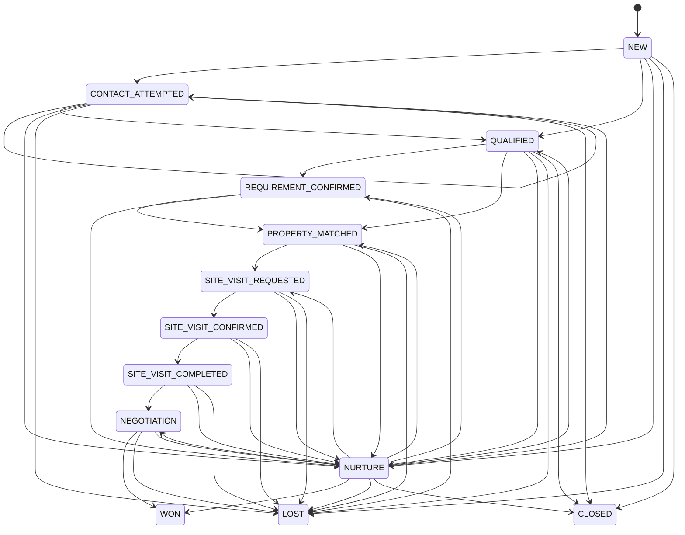

# URBANEDGE LAND SPACE — ADMIN / CRM ARCHITECTURE

**File:** `05-ADMIN-CRM-ARCHITECTURE.md`  
**System:** UrbanEdge Land Space V1  
**Parent architecture:** `01-MASTER-WEBSITE-ARCHITECTURE.md`  
**UX / route architecture:** `02-PAGE-ROUTE-UX-ARCHITECTURE.md`  
**Database architecture:** `03-DATABASE-SCHEMA-ARCHITECTURE.md`  
**Backend / business logic:** `04-BACKEND-API-BUSINESS-LOGIC.md`  
**Product requirements:** `LANDSPACE_PRODUCT_REQUIREMENTS.md`  
**Status:** Authoritative V1 admin, operations and CRM contract  
**Launch geography:** Ahmedabad + Gandhinagar, Gujarat  
**Architecture date:** 29 August 2026

---

# 0. PURPOSE

This document defines the complete **single-admin V1 operational system** for UrbanEdge Land Space.

It converts the existing product, UX, database and backend decisions into one operational contract covering:

- admin information architecture;
- dashboard;
- central lead inbox;
- CRM pipeline;
- exact lead stage-transition rules;
- terminal states;
- nurture handling;
- follow-up dates;
- notes;
- activity timeline;
- buyer requirements;
- property management;
- owner submissions;
- owner-submission conversion;
- publication review and publishing;
- verification queue;
- site visits;
- guides;
- locations;
- SEO;
- settings;
- analytics;
- audit;
- admin routes;
- list/table/filter requirements;
- entity detail layouts;
- cross-entity navigation;
- future `assigned_to` support;
- future role support without V1 multi-user complexity.

This is an **operational architecture document**, not a new database schema. The database document remains authoritative for table names, keys and base persistence structure. The backend document remains authoritative for mutation semantics, server-side validation, transactions, privacy and error handling.

Where this document adds detail, it does so at the admin/workflow level and must remain compatible with those contracts.

---

# 1. EXECUTIVE POSITION

UrbanEdge Land Space V1 is a **brokerage-operated business system**.

The administrator is not managing a marketplace. The administrator is managing a controlled brokerage pipeline:

```text
Demand
  ↓
Lead
  ↓
Qualification
  ↓
Requirement
  ↓
Property Matching
  ↓
Site Visit
  ↓
Negotiation
  ↓
Won / Lost / Nurture
```

At the same time, supply enters through:

```text
Owner Submission
  ↓
Contact
  ↓
Document Collection
  ↓
Review
  ↓
Verification
  ↓
Approved for Listing
  ↓
Property Draft
  ↓
Publication Validation
  ↓
Published Inventory
```

The admin system therefore has five primary operational centers:

```text
1. Dashboard
2. Leads / CRM
3. Properties / Inventory
4. Owner Submissions / Supply
5. Verification + Site Visits / Execution
```

Content, locations, SEO, settings and analytics support those core operations.

---

# 2. V1 ADMIN OPERATING MODEL

## 2.1 One-admin model

V1 has one authenticated UrbanEdge administrator with full operational access.

The admin can:

- create/edit properties;
- publish/unpublish/archive listings;
- manage availability;
- review owner submissions;
- manage private documents;
- manage verification;
- manage leads;
- update requirements;
- match properties to leads;
- manage site visits;
- manage notes and follow-ups;
- manage guides;
- manage locations;
- manage SEO fields;
- review analytics;
- manage application settings;
- inspect audit history.

This aligns with the product requirements and page architecture, which intentionally keep V1 operationally simple and explicitly exclude a public agent marketplace, seller dashboard and buyer account system.

## 2.2 Future-ready actor fields

The data model and UI contracts should support:

```text
created_by
updated_by
assigned_to
```

but V1 does not implement:

- assignment queues;
- teams;
- departments;
- role-specific dashboards;
- workload balancing;
- round-robin allocation;
- permission matrices with dozens of capabilities.

### V1 behavior

`assigned_to` may be `NULL`.

The central inbox is the de facto queue.

The single administrator sees all records.

### Future behavior

When multi-user support is introduced:

```text
assigned_to → admin_profile
```

can become operational without changing the core lead/property relationship model.

---

# 3. ADMIN ROUTE TREE

The route contract follows the existing UX architecture and expands it into operational screen responsibilities.

```text
/admin/login

/admin/dashboard

/admin/properties
/admin/properties/new
/admin/properties/[id]
/admin/properties/[id]/edit
/admin/properties/[id]/media
/admin/properties/[id]/verification
/admin/properties/[id]/leads
/admin/properties/[id]/visits

/admin/submissions
/admin/submissions/[id]
/admin/submissions/[id]/convert

/admin/leads
/admin/leads/pipeline
/admin/leads/[id]

/admin/follow-ups

/admin/requirements
/admin/requirements/unmatched
/admin/requirements/[id]

/admin/site-visits
/admin/site-visits/calendar
/admin/site-visits/[id]

/admin/verification
/admin/verification/queue
/admin/verification/[property-id]

/admin/media

/admin/guides
/admin/guides/new
/admin/guides/[id]
/admin/guides/[id]/edit

/admin/locations
/admin/locations/[id]
/admin/locations/[id]/edit

/admin/seo
/admin/seo/landing-pages
/admin/seo/[id]

/admin/analytics

/admin/settings
/admin/settings/business
/admin/settings/contact
/admin/settings/lead-sources
/admin/settings/property-options
/admin/settings/seo

/admin/audit
```

## 3.1 Route naming rule

The route `/admin/leads` is the **central operational inbox**.

The route `/admin/leads/pipeline` is an alternative pipeline visualization.

The list view is the primary day-to-day working surface.

The pipeline board is a visual management view, not the source of state truth.

---

# 4. ADMIN SHELL

## 4.1 Desktop shell

```text
┌────────────────────────────────────────────────────────────────────────────┐
│ UrbanEdge Land Space Admin              Search      Alerts      Admin      │
├───────────────┬────────────────────────────────────────────────────────────┤
│ Action centre │                                                            │
│ CRM           │                      PAGE CONTENT                          │
│ Properties    │                                                            │
│ Submissions   │                                                            │
│ Requirements  │                                                            │
│ Verification  │                                                            │
│ Media         │                                                            │
│ Guides        │                                                            │
│ Locations     │                                                            │
│ SEO           │                                                            │
│ Analytics     │                                                            │
│ Settings      │                                                            │
│ Audit         │                                                            │
└───────────────┴────────────────────────────────────────────────────────────┘
```

## 4.2 Sidebar priority

The first visual group should keep CRM as one operational module:

```text
Action centre
CRM
Properties
Submissions
Requirements
Verification
```

Leads, Pipeline, Follow-ups and Site visits are views within CRM, not separate sidebar modules.
Each main CRM page exposes the same top-level workspace navigation:

```text
Leads        → /admin/leads
Pipeline     → /admin/leads/pipeline
Follow-ups   → /admin/follow-ups
Site visits  → /admin/site-visits
```

The CRM sidebar item remains active for these routes and their child routes. Detail pages retain
their entity-specific navigation beneath this global CRM context.

Then:

```text
Media
Guides
Locations
SEO
Analytics
```

Then:

```text
Settings
Audit
```

## 4.3 Global header utilities

The header should provide:

- global admin search where practical;
- current admin identity;
- compact alert/count indicator;
- link to public website;
- logout.

Do not add an elaborate notification center in V1.

---

# 5. GLOBAL ADMIN DESIGN PRINCIPLES

## 5.1 Operational density

Admin screens may be information-dense.

Prefer:

- tables;
- badges;
- compact metadata;
- filter bars;
- side panels;
- structured detail sections.

Do not use large marketing cards to display routine business data.

## 5.2 Action visibility

The current next operational action should be obvious.

Examples:

```text
Lead → Follow up today
Submission → Request missing documents
Property → Publish blocked by missing cover image
Site Visit → Confirm appointment
Verification → Evidence review required
```

## 5.3 Destructive actions are separated

These include:

- delete;
- archive;
- reject;
- unpublish;
- mark sold;
- close lead;
- merge/identity changes where implemented.

Use explicit confirmation.

## 5.4 No silent state changes

Changing a stage, availability, verification result, or publication status must:

1. pass server rules;
2. record appropriate activity/audit;
3. visibly update the UI.

## 5.5 Cross-entity context is mandatory

The admin should be able to move easily:

```text
Lead → Requirement → Matched Property → Visit
Property → Leads → Visits
Submission → Converted Property → Verification
```

The system should behave like one operating environment rather than separate CRUD screens.

---

# 6. DASHBOARD

## Route

```text
/admin/dashboard
```

## Purpose

The dashboard is the administrator's **daily control center**, not a generic analytics homepage.

It must answer:

1. What needs attention now?
2. Which leads need action?
3. Which submissions need review?
4. Which visits are happening?
5. What is happening in the inventory?
6. Is the funnel moving?

The existing UX architecture explicitly prioritizes new inquiries, owner submissions, overdue follow-ups, today's visits, pending property review, pipeline counts and business-relevant performance metrics.

---

# 7. DASHBOARD SCREEN LAYOUT

## 7.1 Top bar

```text
Dashboard
Saturday, 29 Aug 2026

[Date Range]
[Refresh]
```

The default operational block is:

```text
Today
```

## 7.2 First row — action KPIs

Use compact cards:

```text
New Leads
Need Contact
Overdue Follow-ups
Visits Today
Pending Submissions
Properties Awaiting Review
```

Each card should be clickable into the corresponding filtered queue.

Example:

```text
Overdue Follow-ups
12
View 12 leads →
```

## 7.3 Second row — CRM pipeline

Show counts for:

```text
New
Contact Attempted
Qualified
Requirement Confirmed
Property Matched
Site Visit Requested
Site Visit Confirmed
Site Visit Completed
Negotiation
Nurture
Won
Lost
```

Do not show all twelve as equally large cards.

Preferred representation:

- compact horizontal stage summary;
- expandable or scrollable on narrow widths;
- optional mini-funnel visualization.

## 7.4 Third row — today's work queue

Two main panels:

### Follow-ups

Columns:

- Lead
- Stage
- Last contact
- Next follow-up
- Age
- Primary action

### Site visits

Columns:

- Time
- Property
- Lead
- Status
- Contact
- Action

## 7.5 Fourth row — supply/inventory health

Cards or compact tables:

```text
Published
Under Review
On Hold
Missing Documents
Verification Pending
Recently Sold / Leased / Rented
```

## 7.6 Fifth row — performance

Use business metrics:

- leads by source;
- inquiries by property;
- site visits requested/completed;
- win rate;
- loss reasons;
- top-viewed properties;
- WhatsApp clicks;
- call clicks;
- inquiry rate.

Avoid a dashboard dominated by:

- page views;
- sessions;
- bounce rate;
- lifetime traffic.

Those may exist in Analytics but are not the daily operating center.

---

# 8. DASHBOARD FILTERS

Minimum:

- date range;
- lead source;
- land category;
- transaction;
- district.

Optional:

- property;
- buyer type.

Date defaults:

```text
Today
```

with quick ranges:

```text
Today
7 Days
30 Days
Custom
```

---

# 9. DASHBOARD ALERT RULES

The dashboard should highlight operational risk.

## 9.1 Overdue follow-up

A lead is overdue when:

```text
status is open
AND
next_follow_up_at < now
```

## 9.2 Today's follow-up

```text
status is open
AND
next_follow_up date = business today
```

## 9.3 Pending submission

Submission requiring an admin action and not in terminal state.

## 9.4 Pending verification

Property with one or more required or explicitly requested verification checks unresolved.

## 9.5 Unconfirmed site visit

Visit is requested/proposed but not confirmed.

---

# 10. CENTRAL LEAD INBOX

## Route

```text
/admin/leads
```

## Purpose

This is the single most important admin list.

It is the operational memory of all buyer demand and conversion activity.

The list must support:

- rapid triage;
- filter;
- sort;
- stage changes;
- follow-up management;
- quick notes;
- property linking;
- opening full lead records.

---

# 11. LEAD INBOX TABLE

Default desktop columns:

| Column | Purpose |
|---|---|
| Lead | Name + lead reference |
| Stage | Current CRM stage |
| Source | Acquisition channel |
| Buyer / Intent | Buyer type + transaction |
| Requirement | Type/location/area/budget summary |
| Property | Primary linked property or count |
| Next Follow-up | Date + overdue state |
| Last Contact | Most recent contact date |
| Updated | Last CRM update |
| Action | Open / quick action |

Optional secondary column:

```text
Assigned
```

It is hidden or informational in V1 because the single admin is the default assignee.

---

# 12. LEAD INBOX FILTERS

The filter bar must support:

### Operational

- stage;
- overdue;
- follow-up today;
- next 7 days;
- no follow-up;
- newly created.

### Demand

- land category;
- transaction;
- buyer type;
- intended use;
- budget range;
- area range;
- district;
- taluka;
- locality.

### Source

- Website form;
- Property detail;
- WhatsApp click;
- Call click;
- Site-visit form;
- Sell Your Land;
- Buyer requirement;
- Referral;
- Manual;
- portal;
- social;
- Google Business/Profile;
- Direct/Organic;
- Offline.

### Relationship

- linked property;
- no linked property;
- site visit exists;
- negotiation;
- nurture.

---

# 13. LEAD SORTING

Allowed default sorts:

```text
NEWEST
OLDEST
FOLLOW_UP_ASC
FOLLOW_UP_DESC
LAST_CONTACTED
UPDATED
STAGE
```

Default:

```text
next_follow_up_at ASC with nulls last
```

or a composite operational view:

```text
overdue first
today second
upcoming third
unscheduled last
```

The backend query must remain bounded and deterministic.

---

# 14. LEAD QUICK ACTIONS

From the table, safe quick actions include:

```text
Open
Add Note
Log Contact
Set Follow-up
Change Stage
Link Property
Create Visit
```

Do not make destructive actions available as single-click table icons.

---

# 15. LEAD PIPELINE VIEW

## Route

```text
/admin/leads/pipeline
```

Columns:

```text
New
Contact Attempted
Qualified
Requirement Confirmed
Property Matched
Site Visit Requested
Site Visit Confirmed
Site Visit Completed
Negotiation
Nurture
Closed Won
Closed Lost
```

The backend and database use the authoritative statuses already established in the existing architecture.

## 15.1 Pipeline behavior

V1 may use:

- explicit stage dropdown;
- move action;
- stage-change dialog.

Drag-and-drop is optional.

The system should not allow a card to move to an invalid stage merely because the UI permits dragging.

---

# 16. LEAD DETAIL

## Route

```text
/admin/leads/[id]
```

## Information hierarchy

```text
Lead identity
    ↓
Current stage + next action
    ↓
Buyer requirement
    ↓
Linked properties
    ↓
Site visits
    ↓
Follow-up
    ↓
Activity timeline
    ↓
Outcome
```

## 16.1 Lead header

Display:

```text
Lead #...
Name
Phone
Email
Current Stage
Source
Created
Last Updated
```

Actions:

```text
[Call]
[WhatsApp]
[Add Note]
[Log Contact]
[Set Follow-up]
[Change Stage]
```

The exact phone/email shown here is internal CRM data and is not exposed to public views.

---

# 17. LEAD DETAIL — REQUIREMENT PANEL

Show:

- buyer type;
- transaction intent;
- land category;
- preferred district;
- taluka;
- locality;
- minimum area;
- maximum area;
- budget;
- intended use;
- timeline;
- free-text requirement notes.

Actions:

```text
Edit Requirement
Match Properties
```

The requirement is a first-class object represented by `lead_requirements`.

---

# 18. LEAD DETAIL — PROPERTY PANEL

Show all `lead_properties` relationships.

Columns:

- Property ID;
- title;
- category;
- location;
- area;
- price/POR;
- availability;
- match status;
- matched date;
- notes.

Actions:

```text
Open Property
Mark Presented
Remove Match
Add Property
```

Removing a candidate is not the same as deleting the property or the lead.

---

# 19. LEAD DETAIL — SITE VISIT PANEL

Show:

- upcoming visit;
- previous visits;
- date/time;
- property;
- status;
- notes;
- outcome.

Actions:

```text
Request Visit
Propose Time
Confirm
Reschedule
Complete
No Show
Cancel
```

---

# 20. LEAD DETAIL — FOLLOW-UP PANEL

The follow-up panel should always show:

```text
Next follow-up:
29 Aug 2026, 4:00 PM

Type:
Call

Reason:
Check budget and confirm site visit

[Complete]
[Reschedule]
```

If overdue:

```text
OVERDUE by 2 days
```

The follow-up date is an operational commitment, not a mere note.

---

# 21. NOTE MODEL

V1 notes belong inside lead/property/submission/visit operational context as appropriate.

## 21.1 Lead notes

Examples:

- buyer asked for industrial land near highway;
- budget revised;
- interested after family discussion;
- waiting for funding;
- asked for document review.

## 21.2 Note requirements

Each note should capture:

- author/admin;
- timestamp;
- text;
- optional related entity/action.

## 21.3 Note rules

- notes are append-oriented;
- editing is allowed only where useful and auditable;
- private operational notes never enter public content;
- notes should not be used as the only record for a structured state change.

A change from `Qualified` to `Property Matched` must still create the corresponding `STATUS_CHANGED` activity even if a note is also added.

---

# 22. ACTIVITY TIMELINE

The activity timeline is the chronological operating memory of the brokerage.

## 22.1 Core events

The existing product and backend architecture explicitly requires support for events such as:

```text
LEAD_CREATED
WHATSAPP_CLICK
CALL_CLICK
CONTACT_ATTEMPTED
CONTACTED
NOTE_ADDED
REQUIREMENT_UPDATED
PROPERTY_MATCHED
SITE_VISIT_REQUESTED
SITE_VISIT_CONFIRMED
SITE_VISIT_COMPLETED
OFFER_RECEIVED
FOLLOW_UP_SCHEDULED
STATUS_CHANGED
DOCUMENT_REQUESTED
OTHER
```

## 22.2 Additional V1 operational events

The implementation may use additional structured activity types where useful:

```text
FOLLOW_UP_COMPLETED
FOLLOW_UP_MISSED
PROPERTY_PRESENTED
PROPERTY_UNMATCHED
VISIT_CANCELLED
VISIT_RESCHEDULED
LOSS_RECORDED
NURTURE_STARTED
NURTURE_REACTIVATED
LEAD_REOPENED
```

These should not replace the authoritative database status fields.

---

# 23. ACTIVITY TIMELINE UX

Each item displays:

```text
29 Aug, 10:15 AM
Status changed

New → Contact Attempted

By:
Admin

Reason:
First call attempt
```

Another example:

```text
29 Aug, 12:40 PM
Property matched

UE-LS-000123
Industrial land, Sanand

Note:
Within requested area and budget.
```

Another:

```text
29 Aug, 3:00 PM
Follow-up scheduled

31 Aug, 11:00 AM
Type: Call
Reason: Confirm site visit
```

Timeline is newest-first in the main UI, with an optional oldest-first mode.

---

# 24. CRM PIPELINE — AUTHORITATIVE STATES

The V1 pipeline is:

```text
NEW
→ CONTACT_ATTEMPTED
→ QUALIFIED
→ REQUIREMENT_CONFIRMED
→ PROPERTY_MATCHED
→ SITE_VISIT_REQUESTED
→ SITE_VISIT_CONFIRMED
→ SITE_VISIT_COMPLETED
→ NEGOTIATION
→ WON

                             ↘ NURTURE
                             ↘ LOST
```

`CLOSED` is an operational terminal/administrative closure state in the database architecture and should not be confused with `WON` or `LOST`.

The product requirements' board labels use:

```text
Closed Won
Closed Lost
```

The backend/database uses:

```text
WON
LOST
NURTURE
CLOSED
```

The admin UI should display:

```text
Closed Won
Closed Lost
Closed
Nurture
```

only where the underlying status contract makes that distinction meaningful.

---

# 25. CRM STAGE DEFINITIONS

| Stage | Exact meaning | Required evidence to enter | Typical next |
|---|---|---|---|
| New | Lead exists but meaningful first outreach has not been recorded | Lead creation | Contact Attempted |
| Contact Attempted | At least one outreach attempt has been logged | Contact-attempt activity | Qualified / New |
| Qualified | Admin has confirmed the lead is potentially actionable | Qualification note/data | Requirement Confirmed / Nurture / Lost |
| Requirement Confirmed | Requirement is sufficiently complete to act on | Reviewed requirement data | Property Matched |
| Property Matched | At least one meaningful candidate property is linked | Active property relation | Site Visit Requested / Nurture |
| Site Visit Requested | Buyer has asked for a site visit | Site-visit request | Site Visit Confirmed / Nurture |
| Site Visit Confirmed | Date/time is manually confirmed | Confirmed site visit record | Site Visit Completed / Cancelled |
| Site Visit Completed | Visit actually occurred | Completion record | Negotiation / Nurture / Lost |
| Negotiation | Serious commercial discussion is underway | Admin-confirmed commercial progress | Won / Lost / Nurture |
| Nurture | Lead is not ready now but remains potentially valuable | Future follow-up or documented reactivation plan | Reactivate / Won / Lost / Closed |
| Won | Brokerage opportunity converted to a confirmed real outcome | Outcome captured | Terminal |
| Lost | Opportunity will not proceed | Structured loss reason | Terminal |
| Closed | Operational record is closed without an active sales workflow | Closure reason | Terminal |

---

# 26. STAGE-TRANSITION RULES

These are the exact V1 business rules.

## 26.1 NEW

### Entry

Every new lead enters:

```text
NEW
```

### Exit

Allowed:

```text
NEW → CONTACT_ATTEMPTED
NEW → QUALIFIED
NEW → NURTURE
NEW → LOST
NEW → CLOSED
```

However, the preferred operational path is:

```text
NEW → CONTACT_ATTEMPTED
```

before qualification.

Direct `NEW → QUALIFIED` is permitted only for an admin-entered/imported lead where qualification already happened offline and the admin records the qualification context.

### Required

No special evidence for the initial state.

---

# 27. CONTACT_ATTEMPTED

### Entry requirement

At least one:

```text
CONTACT_ATTEMPTED
```

activity must exist.

### Meaning

The administrator has made a meaningful outreach attempt.

Examples:

- phone call attempted;
- WhatsApp message sent;
- email sent;
- direct contact attempt recorded.

### Allowed transitions

```text
CONTACT_ATTEMPTED → QUALIFIED
CONTACT_ATTEMPTED → NURTURE
CONTACT_ATTEMPTED → LOST
CONTACT_ATTEMPTED → CLOSED
CONTACT_ATTEMPTED → CONTACT_ATTEMPTED
```

Repeated attempts do not require stage changes.

### Mandatory handling

If contact is attempted but the person is not yet ready:

- remain in `CONTACT_ATTEMPTED` while active pursuit continues; or
- move to `NURTURE` if a future decision date is known.

Do not mark `QUALIFIED` merely because the lead answered the phone.

---

# 28. QUALIFIED

### Entry requirement

Admin has established that the lead is genuinely relevant enough to pursue.

Minimum qualification should cover, where applicable:

- intended transaction;
- land category;
- location;
- approximate budget;
- approximate area;
- intended use;
- buyer type or actor context.

Not every field needs to be complete in every case.

### Allowed transitions

```text
QUALIFIED → REQUIREMENT_CONFIRMED
QUALIFIED → PROPERTY_MATCHED
QUALIFIED → NURTURE
QUALIFIED → LOST
QUALIFIED → CLOSED
```

`QUALIFIED → PROPERTY_MATCHED` is allowed when the requirement is already sufficiently actionable and a property has been linked.

---

# 29. REQUIREMENT_CONFIRMED

### Entry requirement

The administrator has reviewed and confirmed the buyer requirement.

At minimum, the system should have enough information to answer:

```text
What?
Where?
How much?
For what purpose?
What transaction?
```

where applicable.

### Allowed transitions

```text
REQUIREMENT_CONFIRMED → PROPERTY_MATCHED
REQUIREMENT_CONFIRMED → NURTURE
REQUIREMENT_CONFIRMED → LOST
```

### Rule

Do not leave a lead in `REQUIREMENT_CONFIRMED` indefinitely without a next action.

Set a follow-up or match a property.

---

# 30. PROPERTY_MATCHED

### Entry requirement

At least one meaningful `lead_properties` relation must exist.

A “meaningful” relation means:

- the property is relevant to the requirement;
- the property is not merely a placeholder;
- the relation has been intentionally added by the admin or matching workflow.

### Allowed transitions

```text
PROPERTY_MATCHED → SITE_VISIT_REQUESTED
PROPERTY_MATCHED → NURTURE
PROPERTY_MATCHED → LOST
```

A lead can remain `PROPERTY_MATCHED` while multiple properties are being presented.

### Return rule

If all matched properties become unavailable and no replacement is found:

```text
PROPERTY_MATCHED → NURTURE
```

or:

```text
PROPERTY_MATCHED → LOST
```

depending on whether future demand remains.

---

# 31. SITE_VISIT_REQUESTED

### Entry requirement

A site-visit record exists with:

```text
REQUESTED
```

status.

### Meaning

The buyer has requested a visit, but the administrator has not confirmed the appointment.

### Allowed transitions

```text
SITE_VISIT_REQUESTED → SITE_VISIT_CONFIRMED
SITE_VISIT_REQUESTED → NURTURE
SITE_VISIT_REQUESTED → LOST
```

### Not allowed

Never treat:

```text
SITE_VISIT_REQUESTED
```

as confirmation.

---

# 32. SITE_VISIT_CONFIRMED

### Entry requirement

The site visit must have:

- property;
- lead;
- confirmed date/time;
- confirmation state.

### Allowed transitions

```text
SITE_VISIT_CONFIRMED → SITE_VISIT_COMPLETED
SITE_VISIT_CONFIRMED → NURTURE
SITE_VISIT_CONFIRMED → LOST
```

Cancellation/rescheduling is managed primarily through the site-visit state.

A cancelled visit may return the lead to:

```text
PROPERTY_MATCHED
```

or:

```text
SITE_VISIT_REQUESTED
```

when a new visit is actively being arranged.

---

# 33. SITE_VISIT_COMPLETED

### Entry requirement

The administrator records the visit as completed.

Capture:

- attendance;
- visit notes;
- buyer reaction;
- issues/concerns;
- next action.

### Allowed transitions

```text
SITE_VISIT_COMPLETED → NEGOTIATION
SITE_VISIT_COMPLETED → NURTURE
SITE_VISIT_COMPLETED → LOST
```

### Required operational behavior

A completed visit without a next action should trigger:

```text
Follow-up Required
```

or an immediately scheduled follow-up.

---

# 34. NEGOTIATION

### Entry requirement

There is real commercial progression.

Examples:

- offer discussed;
- price negotiation underway;
- commercial terms being discussed;
- owner/buyer terms being reconciled.

Simply saying:

> “Interested”

does not justify the Negotiation stage.

### Allowed transitions

```text
NEGOTIATION → WON
NEGOTIATION → LOST
NEGOTIATION → NURTURE
```

### Offer tracking

When an offer is received:

1. record `OFFER_RECEIVED`;
2. record amount/terms where the data model permits;
3. add note;
4. maintain the negotiation stage.

---

# 35. NURTURE

## Definition

Nurture means:

> The lead is not actionable now, but future opportunity remains.

Examples:

- buyer needs financing time;
- purchase delayed;
- waiting for family approval;
- waiting for business decision;
- wants to purchase later;
- suitable property unavailable now;
- requirement may activate later.

### Entry requirement

At least one of:

- future follow-up date;
- explicit reactivation date/plan;
- documented reason for future re-engagement.

### Allowed transitions

```text
NURTURE → CONTACT_ATTEMPTED
NURTURE → QUALIFIED
NURTURE → REQUIREMENT_CONFIRMED
NURTURE → PROPERTY_MATCHED
NURTURE → SITE_VISIT_REQUESTED
NURTURE → NEGOTIATION
NURTURE → WON
NURTURE → LOST
NURTURE → CLOSED
```

### Reactivation

When the administrator re-engages the lead:

```text
NURTURE → CONTACT_ATTEMPTED
```

and create:

```text
NURTURE_REACTIVATED
CONTACT_ATTEMPTED
FOLLOW_UP_SCHEDULED
```

as appropriate.

### Do not misuse nurture

Do not use Nurture as a dumping ground for:

- unworked leads;
- overdue leads;
- unknown status;
- leads the admin does not know what to do with.

---

# 36. WON

## Definition

A real brokerage outcome has been confirmed.

The admin must capture enough outcome information to support reporting, such as:

- winning property;
- transaction type;
- outcome date;
- commercial outcome where retained;
- note.

### Terminal behavior

`WON` is terminal for ordinary CRM stage progression.

A new business opportunity from the same person may create a new lead if appropriate.

Do not move a completed won lead backward for routine follow-up.

---

# 37. LOST

## Definition

The current opportunity will not proceed.

### Entry requirement

A structured loss reason is required.

### Terminal behavior

`LOST` is terminal for the current opportunity.

A new requirement later may become a new lead or a re-opened workflow only through explicit administrative action, not accidental editing.

---

# 38. CLOSED

`CLOSED` is a terminal operational state for records that should no longer participate in active CRM work but are not represented as a Won/Lost outcome.

Examples:

- administrative closure;
- duplicate cleanup;
- historical record retained;
- invalid/obsolete record;
- non-business operational closure.

### Required

A closure reason should be stored.

`CLOSED` must not be used instead of:

- `WON`;
- `LOST`;
- `NURTURE`.

Those states carry business meaning.

---

# 39. TERMINAL STATES

The V1 terminal states are:

```text
WON
LOST
CLOSED
```

## Terminal rules

A terminal lead:

- does not appear in active follow-up queues;
- does not appear in overdue follow-up counts;
- does not accept ordinary stage transitions;
- remains searchable in CRM;
- retains activity history;
- retains property and visit relationships;
- remains available for reporting.

### Reopening a terminal lead

V1 should not provide a casual “drag back into the funnel” action.

Use an explicit:

```text
Reopen / Create New Opportunity
```

business action.

Preferred behavior:

```text
Closed historical lead
    ↓
New business intent
    ↓
Create new lead referencing same party
```

This preserves reporting integrity.

---

# 40. ALLOWED TRANSITION MATRIX

| From | Allowed next stages |
|---|---|
| New | Contact Attempted, Qualified, Nurture, Lost, Closed |
| Contact Attempted | Contact Attempted, Qualified, Nurture, Lost, Closed |
| Qualified | Requirement Confirmed, Property Matched, Nurture, Lost, Closed |
| Requirement Confirmed | Property Matched, Nurture, Lost |
| Property Matched | Site Visit Requested, Nurture, Lost |
| Site Visit Requested | Site Visit Confirmed, Nurture, Lost |
| Site Visit Confirmed | Site Visit Completed, Nurture, Lost |
| Site Visit Completed | Negotiation, Nurture, Lost |
| Negotiation | Won, Lost, Nurture |
| Nurture | Contact Attempted, Qualified, Requirement Confirmed, Property Matched, Site Visit Requested, Negotiation, Won, Lost, Closed |
| Won | none |
| Lost | none |
| Closed | none |

### Exception

Explicit administrative re-open creates an auditable business event and must not silently mutate a terminal record.

---

# 41. LEAD STAGE CHANGE DIALOG

Whenever a stage change needs additional information, the dialog must ask only for what the target stage requires.

Examples:

## To Contact Attempted

```text
Contact method
Attempt outcome
Note
Next follow-up
```

## To Qualified

```text
Qualification summary
Buyer type
Key budget/location confirmation
Next follow-up
```

## To Requirement Confirmed

```text
Confirm requirement data
Next action
```

## To Property Matched

```text
Select one or more properties
Presentation note
Next action
```

## To Site Visit Requested

```text
Property
Preferred date
Preferred time window
Buyer note
```

## To Site Visit Confirmed

```text
Confirmed date
Confirmed time
Confirmation note
```

## To Site Visit Completed

```text
Outcome
Buyer feedback
Next step
Follow-up
```

## To Negotiation

```text
Negotiation context
Offer/terms if available
Next follow-up
```

## To Nurture

```text
Nurture reason
Next follow-up OR explicit reactivation policy
```

## To Won

```text
Outcome property
Outcome date
Commercial/outcome note
```

## To Lost

```text
Loss reason
Loss note
```

---

# 42. FOLLOW-UP ARCHITECTURE

Follow-up is a first-class operational control.

Every active lead should support:

- `next_follow_up_at`;
- follow-up type;
- follow-up reason;
- completion state;
- note;
- `last_contacted_at`.

## 42.1 Follow-up types

V1 should support a small controlled vocabulary:

```text
CALL
WHATSAPP
EMAIL
SITE_VISIT_CONFIRMATION
PROPERTY_CHECK
OWNER_UPDATE
NEGOTIATION
DOCUMENT_CHECK
GENERAL
```

The exact database representation may use existing activity/field structures; the admin UI should remain human-readable.

---

# 43. FOLLOW-UP RULES BY STAGE

| Stage | Follow-up default |
|---|---|
| New | Same business day |
| Contact Attempted | Within 1–2 business days unless outcome says otherwise |
| Qualified | Until requirement is confirmed |
| Requirement Confirmed | Short-term match/presentation follow-up |
| Property Matched | Follow after presentation / buyer response |
| Site Visit Requested | Fast confirmation cycle |
| Site Visit Confirmed | Confirmation reminder before visit |
| Site Visit Completed | Follow-up within a short post-visit window |
| Negotiation | Admin-defined based on live negotiation |
| Nurture | Future date required unless explicit reactivation policy |
| Won | No normal sales follow-up |
| Lost | No normal sales follow-up |
| Closed | No normal sales follow-up |

These are **operational defaults**, not automated guarantees.

---

# 44. EXACT FOLLOW-UP QUEUES

The admin must have three primary operational buckets:

```text
OVERDUE
TODAY
NEXT 7 DAYS
```

Optional:

```text
NO FOLLOW-UP
```

## Overdue

```text
next_follow_up_at < now
AND lead.status not terminal
```

## Today

Business date matches current Asia/Kolkata date.

## Next 7 days

Future follow-up within seven calendar days.

---

# 45. FOLLOW-UP COMPLETION

Completing a follow-up should:

1. record the action/activity;
2. optionally update `last_contacted_at`;
3. clear or replace the old follow-up;
4. require a new follow-up date if the lead remains in an active stage where continued follow-up is expected.

Example:

```text
Complete call
→ record CONTACTED
→ note outcome
→ choose:
   [No further action]
   [Schedule next follow-up]
   [Move to Nurture]
   [Change stage]
```

Never allow an active high-intent lead to silently lose its next action.

---

# 46. FOLLOW-UP MISSED

If the date passes:

- lead remains in current stage;
- follow-up becomes overdue;
- dashboard count increases;
- no automatic stage downgrade occurs.

Do not auto-mark a lead as Lost because a follow-up date was missed.

---

# 47. BUYER REQUIREMENTS MODULE

## Routes

```text
/admin/requirements
/admin/requirements/unmatched
/admin/requirements/[id]
```

## Purpose

Capture and operationalize demand that is not tied to a single property.

This is especially important for:

```text
Search → No Results → Buyer Requirement → CRM → Matching
```

The requirement is linked to a lead and is not a fake property inquiry.

---

# 48. REQUIREMENTS LIST

Default columns:

- requirement/lead;
- buyer type;
- land type;
- transaction;
- location;
- area;
- budget;
- intended use;
- linked properties;
- status;
- next follow-up;
- updated.

## Filters

- unmatched;
- matched;
- stage;
- land type;
- transaction;
- district;
- taluka;
- budget;
- area;
- intended use;
- follow-up due.

---

# 49. REQUIREMENT DETAIL LAYOUT

```text
Requirement Header
    ↓
Requirement Brief
    ↓
Matching Summary
    ↓
Candidate Properties
    ↓
Lead Activity
    ↓
Site Visits
    ↓
Next Action
```

Primary action:

```text
Find Matching Properties
```

---

# 50. PROPERTY MATCHING WORKFLOW

The admin can:

1. open requirement;
2. inspect criteria;
3. run matching search;
4. select candidates;
5. link candidates;
6. add internal note;
7. schedule buyer follow-up;
8. optionally request site visit.

The backend may use deterministic matching dimensions already specified:

- category;
- transaction;
- district;
- subdistrict;
- area;
- budget;
- intended use;
- availability.

Matching score is an internal aid, not a public recommendation guarantee.

---

# 51. PROPERTY MANAGEMENT

## Routes

```text
/admin/properties
/admin/properties/new
/admin/properties/[id]
/admin/properties/[id]/edit
/admin/properties/[id]/media
/admin/properties/[id]/verification
/admin/properties/[id]/leads
/admin/properties/[id]/visits
```

The property manager is the inventory control center.

---

# 52. PROPERTIES LIST

## Default table

| Column | Purpose |
|---|---|
| Property ID | Stable business identifier |
| Title | Public listing title |
| Category | Agricultural / NA / Industrial |
| Transaction | Buy / Rent / Lease |
| Location | District + locality |
| Area | Standardized display |
| Price | Exact / range / POR / unit |
| Availability | Current commercial state |
| Publication | Draft / Review / Published / etc. |
| Verification | Summary status |
| Updated | Last change |
| Action | Open |

---

# 53. PROPERTY FILTERS

### Publication

- Draft;
- Under Review;
- Published;
- Unpublished;
- Archived.

### Availability

- Available;
- Under Negotiation;
- Sold;
- Rented;
- Leased;
- Off Market.

### Domain

- Agricultural;
- NA;
- Industrial.

### Transaction

- Buy;
- Rent;
- Lease.

### Geography

- District;
- Taluka;
- Locality.

### Verification

- pending;
- passed;
- requires review;
- failed;
- expired.

### Inventory quality

- missing media;
- missing documents;
- missing required fields;
- no public location;
- no verification evidence.

---

# 54. PROPERTY DETAIL / EDIT LAYOUT

The existing UX architecture specifies a combined property screen.

Recommended order:

```text
Header
    ↓
Status / Availability / Actions
    ↓
Public Preview
    ↓
Identity
    ↓
Classification
    ↓
Location
    ↓
Area
    ↓
Pricing / Offers
    ↓
Category-specific data
    ↓
Planning context
    ↓
Media
    ↓
Public presentation
    ↓
Verification
    ↓
Linked Leads
    ↓
Site Visits
    ↓
Source / Owner context
    ↓
Audit / History
```

---

# 55. PROPERTY HEADER

Show:

```text
UE-LS-000123
Industrial Land near Ahmedabad
Published
Available
Updated 29 Aug 2026

[Preview]
[Edit]
[Publish / Unpublish]
[Change Availability]
[Archive]
```

---

# 56. PROPERTY PUBLIC PREVIEW

Provide a read-only representation of what the public will see.

The preview must use the same public-safe projection logic as the actual public property page.

This is important because it tests:

- exact/approximate/hidden location behavior;
- public media;
- public verification;
- title/description;
- pricing;
- availability.

Never build the preview by exposing raw internal data to the client.

---

# 57. PROPERTY PUBLICATION WORKFLOW

The source architecture makes publication a controlled business decision.

## States

```text
DRAFT
UNDER_REVIEW
PUBLISHED
UNPUBLISHED
ARCHIVED
```

## Workflow

```text
Draft
  ↓
Review
  ↓
Publication Validation
  ↓
Publish
  ↓
Public Inventory
```

---

# 58. PUBLICATION VALIDATION CHECKLIST

Before enabling Publish:

### Identity

- Property ID valid;
- public slug valid;
- title present.

### Classification

- land category present;
- supported transaction present.

### Geography

- valid active geography;
- public-safe location mode.

### Area

- valid area;
- usable standardized representation.

### Commercials

- valid price representation;
- or valid Price on Request.

### Public presentation

- description;
- public contact path;
- approved cover/public media or explicit no-image exception.

### Category data

- category-specific minimum requirements satisfied.

### Verification / claims

- no unsupported public verification claim;
- required evidence for any public status claim;
- no unresolved publication-blocking issue.

### Safety

- no private coordinates in public projection;
- no private documents in public media;
- no owner private data in public content.

---

# 59. PUBLICATION BLOCKER DISPLAY

Example:

```text
Publish blocked

2 issues need attention:

✕ Public-safe map point missing
✕ Cover image not selected

[Fix These Issues]
```

Each blocker should link directly to the relevant property section.

---

# 60. PUBLICATION ACTIONS

## Publish

Moves:

```text
DRAFT / UNDER_REVIEW / UNPUBLISHED
→ PUBLISHED
```

only if all validation rules pass.

## Unpublish

Moves:

```text
PUBLISHED
→ UNPUBLISHED
```

Use when temporarily removing public visibility.

## Archive

Moves:

```text
any non-terminal public/admin state
→ ARCHIVED
```

Archive is the normal business retirement action.

## Restore

An archived property can be restored to a safe non-public state first:

```text
ARCHIVED → DRAFT
```

Then reviewed/published again.

Do not automatically restore a record directly to Published.

---

# 61. PROPERTY AVAILABILITY WORKFLOW

Availability is independent from publication.

Supported states:

```text
AVAILABLE
UNDER_NEGOTIATION
SOLD
RENTED
LEASED
OFF_MARKET
```

Examples:

```text
PUBLISHED + AVAILABLE
PUBLISHED + UNDER_NEGOTIATION
PUBLISHED + SOLD
UNPUBLISHED + SOLD
ARCHIVED + OFF_MARKET
```

Do not infer publication from availability or vice versa.

---

# 62. AVAILABILITY CHANGE RULES

## Available → Under Negotiation

Allowed by admin when a real negotiation is in progress.

## Under Negotiation → Available

Allowed if negotiation ends without closing and inventory remains marketable.

## Available → Sold / Rented / Leased

Requires outcome confirmation.

Should trigger:

- property update;
- audit;
- relevant lead review;
- public-state revalidation.

## Any state → Off Market

Used when owner withdraws or inventory is temporarily unavailable for operational reasons.

---

# 63. PROPERTY CHANGES AFTER PUBLISHING

High-impact changes may force re-review:

- category;
- transaction;
- land-use claim;
- planning claim;
- public coordinates;
- public identifier disclosure;
- verification signal;
- materially changed property facts.

Routine changes may remain published if validation still passes:

- wording;
- media order;
- minor description edits;
- internal notes;
- related lead records.

The backend architecture explicitly distinguishes routine changes from material changes and requires audit/validation for high-impact changes.

---

# 64. OWNER SUBMISSIONS

## Routes

```text
/admin/submissions
/admin/submissions/[id]
/admin/submissions/[id]/convert
```

## Purpose

Controlled supply acquisition and review.

Owner submissions are never public inventory by themselves.

---

# 65. SUBMISSION QUEUE

Default columns:

| Column | Purpose |
|---|---|
| Submission ID | Intake reference |
| Submitted | Recency |
| Owner | Contact |
| Land Type | Category |
| Transaction | Expected commercial intent |
| Location | District + locality |
| Area | Size |
| Asking Price | Commercial expectation |
| Status | Workflow state |
| Last Contact | Operational memory |
| Next Action | Immediate work |

---

# 66. SUBMISSION FILTERS

- status;
- land type;
- transaction;
- district;
- taluka;
- submitted date;
- incomplete;
- missing documents;
- verification pending;
- follow-up due;
- converted;
- rejected.

---

# 67. OWNER SUBMISSION WORKFLOW

Authoritative V1 states:

```text
NEW
→ CONTACTED
→ DOCS_REQUESTED
→ UNDER_REVIEW
→ VERIFICATION_PENDING
→ APPROVED
→ CONVERTED
→ CLOSED
```

Side states:

```text
ON_HOLD
REJECTED
```

---

# 68. OWNER SUBMISSION TRANSITION RULES

## NEW → CONTACTED

Requires a contact-attempt activity.

## CONTACTED → DOCS_REQUESTED

Requires a documented request for missing/supporting information.

## CONTACTED → UNDER_REVIEW

Allowed when enough information exists to begin review.

## DOCS_REQUESTED → UNDER_REVIEW

Allowed when the admin has received sufficient material to continue.

## UNDER_REVIEW → VERIFICATION_PENDING

Allowed when one or more specific checks need evidence review.

## UNDER_REVIEW → APPROVED

Allowed only when the admin is satisfied that the inventory can be represented publicly with its current scope and disclaimers.

## VERIFICATION_PENDING → APPROVED

Allowed after required checks are resolved.

## Any non-terminal active state → ON_HOLD

Use for:

- owner request;
- availability uncertainty;
- price revision;
- documentation delay;
- operational pause.

## ON_HOLD → UNDER_REVIEW

When work resumes.

## UNDER_REVIEW / VERIFICATION_PENDING → REJECTED

When UrbanEdge decides not to market the inventory.

## REJECTED → CLOSED

Administrative closure.

## APPROVED → CONVERTED

Requires explicit conversion to a property draft.

## CONVERTED → CLOSED

After conversion is complete.

---

# 69. SUBMISSION DETAIL LAYOUT

```text
Submission Summary
    ↓
Owner / Contact
    ↓
Land Classification
    ↓
Location
    ↓
Area
    ↓
Commercials
    ↓
Category-specific details
    ↓
Media
    ↓
Documents
    ↓
Review Findings
    ↓
Verification
    ↓
Timeline
    ↓
Next Action
```

The next operational action should be visually prominent.

---

# 70. CONVERT SUBMISSION TO PROPERTY

## Route

```text
/admin/submissions/[id]/convert
```

## Principle

Conversion is **not publication**.

The operation is:

```text
Owner Submission
    ↓
Create Property Draft
```

not:

```text
Owner Submission
    ↓
Publish
```

The backend document explicitly requires conversion to create a `DRAFT` property.

---

# 71. CONVERSION SCREEN

Show:

```text
Source Submission
Owner
Location
Area
Category
Transaction
Documents
Verification status
```

Then present copied values with explicit review:

```text
Public title
Public description
Location visibility
Public media
Price mode
Availability
Public verification signals
SEO slug
```

Every public field is editable.

The owner-provided description is treated as source material, not final public copy.

---

# 72. DOCUMENT PRIVACY DURING CONVERSION

Owner-submission documents remain private by default.

The admin may reference:

```text
Revenue record
Sale deed
Property card
NA order
Survey/map
Authority document
GIDC/allotment document
```

but these do not automatically become public listing media.

Public document publication requires an explicit, separate decision and safe asset handling.

---

# 73. VERIFICATION QUEUE

## Routes

```text
/admin/verification
/admin/verification/queue
/admin/verification/[property-id]
```

## Purpose

Centralize scoped verification work.

The verification architecture explicitly rejects a single Boolean “Verified” model.

---

# 74. VERIFICATION QUEUE TABLE

Default columns:

- Property ID;
- property title;
- category;
- location;
- check type;
- current status;
- risk;
- last reviewed;
- recheck date;
- assigned/reviewer;
- action.

## Filters

- pending;
- in review;
- passed;
- passed with note;
- failed;
- requires review;
- expired;
- high risk;
- category;
- district;
- reviewer.

---

# 75. VERIFICATION CHECK TYPES

Use the existing scoped model, such as:

```text
Information Reviewed
Documents Reviewed
Location Reviewed
Site Visited
Survey Reviewed
Legal Review Completed
```

Additional evidence-specific checks may include:

```text
Revenue Records Reviewed
Registration Records Reviewed
Planning / Zoning Check
GIDC Records Reviewed
Map / Survey Evidence Reviewed
```

The actual definitions remain configurable/reference data.

---

# 76. VERIFICATION DETAIL

For each check show:

```text
Check
Status
Reviewer
Reviewed at
Risk level
Evidence
Source
Scope
Internal notes
Public explanation
Recheck at
```

Example:

```text
Documents Reviewed

Status: PASSED_WITH_NOTE
Reviewer: Admin
Reviewed: 29 Aug 2026

Evidence:
Owner-provided sale deed

Scope:
Document copy reviewed for consistency with submitted property information.

Public wording:
Documents reviewed by UrbanEdge.

Note:
This does not constitute title certification.
```

---

# 77. VERIFICATION PUBLICATION RULE

A verification check can be displayed publicly only when:

```text
status supports public display
AND
public_visible = true
AND
public label exists
AND
public explanation is defined
```

Do not expose internal reasoning or evidence metadata by accident.

---

# 78. SITE VISITS MODULE

## Routes

```text
/admin/site-visits
/admin/site-visits/calendar
/admin/site-visits/[id]
```

## Purpose

Coordinate physical property visits manually.

Automatic calendar booking is explicitly outside V1 scope.

---

# 79. SITE VISIT LIST VIEWS

Primary tabs:

```text
Today
Upcoming
Follow-up Required
Completed
Cancelled
No Show
```

Optional date range.

---

# 80. SITE VISIT TABLE

Columns:

- Date/time;
- lead;
- property;
- status;
- contact;
- buyer type;
- created;
- next action.

Sort:

```text
earliest upcoming first
```

---

# 81. SITE VISIT STATUS MODEL

The source architecture defines:

```text
REQUESTED
CONTACTED
PROPOSED
CONFIRMED
RESCHEDULED
COMPLETED
CANCELLED
NO_SHOW
FOLLOW_UP_REQUIRED
```

The exact site-visit status is independent from the lead status.

Example:

```text
Lead = SITE_VISIT_CONFIRMED
Visit = RESCHEDULED
```

In that case, the lead should not falsely imply a still-confirmed appointment.

---

# 82. SITE VISIT DETAIL

Layout:

```text
Visit header
    ↓
Lead
    ↓
Property
    ↓
Preferred date/time
    ↓
Confirmed date/time
    ↓
Contact
    ↓
Visit status
    ↓
Visit notes
    ↓
Outcome
    ↓
Next follow-up
    ↓
Lead timeline
```

Actions:

```text
Contact
Propose
Confirm
Reschedule
Complete
No Show
Cancel
Set Follow-up
```

---

# 83. SITE VISIT COMPLETION RULE

To mark:

```text
COMPLETED
```

the admin must record:

- completion date/time;
- optional attendance;
- outcome/feedback or note.

After completion, the lead should be reviewed for:

```text
Negotiation
Nurture
Lost
```

with a follow-up where applicable.

---

# 84. SITE VISIT CANCELLATION RULE

Cancellation is not a lead loss by itself.

Examples:

```text
Visit cancelled due to owner schedule
→ lead remains active
→ new visit may be proposed
```

or:

```text
Buyer cancelled and is no longer interested
→ lead may move to LOST
```

Business meaning belongs to the lead, while scheduling meaning belongs to the visit.

---

# 85. GUIDES / CONTENT

## Routes

```text
/admin/guides
/admin/guides/new
/admin/guides/[id]
/admin/guides/[id]/edit
```

## Purpose

Support:

- SEO;
- buyer education;
- trust;
- local expertise;
- reduction of repeated sales explanations.

The product requirements explicitly keep Guides as V1/Should scope rather than expanding into a large publishing system.

---

# 86. GUIDE LIST

Columns:

- title;
- category;
- status;
- published date;
- updated date;
- SEO readiness;
- action.

Filters:

- draft;
- review;
- published;
- unpublished;
- archived;
- category;
- updated date.

---

# 87. GUIDE LIFECYCLE

```text
DRAFT
→ REVIEW
→ PUBLISHED
→ UNPUBLISHED
→ ARCHIVED
```

The guide must be sanitized and validated before publication.

No automatic public publication from draft.

---

# 88. GUIDE EDITOR

Sections:

```text
Title
Slug
Category
Excerpt
Body
Featured Media
SEO Title
SEO Description
Canonical
Indexing
Publication
```

The guide editor should clearly separate:

```text
Content
```

from:

```text
SEO
```

and:

```text
Publication
```

---

# 89. LOCATIONS

## Routes

```text
/admin/locations
/admin/locations/[id]
/admin/locations/[id]/edit
```

## Purpose

Maintain normalized public location data and editorial location-page state.

The database model intentionally separates administrative geography from planning authorities, TP schemes, GIDC estates and other planning dimensions.

---

# 90. LOCATION LIST

Columns:

- district;
- taluka/subdistrict;
- locality;
- active/inactive;
- service area;
- landing page status;
- property count;
- SEO readiness.

Filters:

- district;
- taluka;
- active/inactive;
- published landing page;
- property count;
- content status.

---

# 91. LOCATION RULES

Do not fabricate geography.

The architecture requires:

- Ahmedabad;
- Gandhinagar;
- verified geography hierarchy.

Imported/official geography should be treated separately from editorial location content.

A location may exist operationally without having an SEO landing page.

---

# 92. SEO MODULE

## Routes

```text
/admin/seo
/admin/seo/landing-pages
/admin/seo/[id]
```

## Purpose

Manage metadata and quality-gated SEO content.

The public architecture warns against thin programmatic pages.

---

# 93. SEO LANDING PAGE TABLE

Columns:

- page;
- location;
- category;
- status;
- indexability;
- SEO readiness;
- updated;
- action.

Filters:

- draft;
- review;
- published;
- noindex;
- archived;
- category;
- city/location.

---

# 94. SEO PUBLICATION RULE

A page should not become indexable merely because a URL exists.

Required:

- useful content;
- sufficient inventory/context;
- correct canonical;
- valid title/description;
- correct route;
- no private data;
- no unsupported claims.

---

# 95. MEDIA MODULE

## Route

```text
/admin/media
```

## Purpose

Cross-property media operations.

V1 only needs practical controls:

- recent uploads;
- failed uploads;
- unused media;
- public/private state;
- property association.

Do not turn this into a full enterprise digital asset manager.

---

# 96. MEDIA TABLE

Columns:

- asset;
- type;
- property;
- public/private;
- size;
- upload date;
- status;
- action.

Filters:

- image;
- video;
- brochure;
- 360;
- panorama;
- public;
- private;
- failed;
- unused.

---

# 97. SETTINGS

## Routes

```text
/admin/settings
/admin/settings/business
/admin/settings/contact
/admin/settings/lead-sources
/admin/settings/property-options
/admin/settings/seo
```

## Purpose

Allow non-code operational configuration without turning settings into a generic database editor.

---

# 98. BUSINESS SETTINGS

Examples:

- business display name;
- primary geography;
- support/contact text;
- public disclaimer text where configurable;
- inquiry CTA labels;
- business timezone.

---

# 99. CONTACT SETTINGS

Examples:

- public business phone;
- public business WhatsApp number;
- public business email;
- office/contact address;
- support hours text.

Never store service secrets here.

---

# 100. LEAD-SOURCE SETTINGS

The source architecture requires configurable lead sources including:

```text
Website form
Property detail
WhatsApp click
Call click
Site visit form
Sell Your Land
Buyer requirement
Referral
Manual
99acres
MagicBricks
Housing
Other portal
Instagram
Facebook
Google Business/Profile
Direct / Organic
Offline
```

The admin should be able to:

- enable/disable;
- rename display labels;
- define reporting grouping where appropriate.

Never hard-code portals into CRM business logic.

---

# 101. PROPERTY-OPTION SETTINGS

Potential configurable options:

- transaction labels;
- land category labels;
- area unit display;
- price display rules;
- verification labels;
- property card badges.

Core domain semantics remain typed and controlled by the architecture. Settings can change presentation, not business invariants.

---

# 102. ANALYTICS

## Route

```text
/admin/analytics
```

## Purpose

Turn usage data into business decisions.

V1 analytics should answer:

```text
Which properties create demand?
Which channels create leads?
Which leads become visits?
Which visits become negotiation?
Which opportunities become wins?
Why are leads being lost?
```

---

# 103. ANALYTICS VIEWS

## 103.1 Acquisition

- leads by source;
- leads by channel;
- inquiry type;
- property-detail conversion;
- buyer requirement submissions.

## 103.2 Inventory performance

- property views;
- WhatsApp clicks;
- call clicks;
- inquiry count;
- site-visit requests;
- matched-lead count.

## 103.3 Funnel

```text
Leads
→ Qualified
→ Requirement Confirmed
→ Property Matched
→ Site Visit Requested
→ Site Visit Completed
→ Negotiation
→ Won
```

Use conversion rates where the denominator is clearly defined.

## 103.4 Loss analysis

Loss reasons:

- Budget mismatch;
- Location mismatch;
- Size mismatch;
- Property sold;
- Property unavailable;
- Buyer eligibility / professional confirmation needed;
- Legal/document concern;
- Timing changed;
- Competitor property;
- Buyer stopped responding;
- Not interested;
- Duplicate lead;
- Other.

---

# 104. ANALYTICS FILTERS

- date range;
- source;
- category;
- transaction;
- district;
- property;
- buyer type.

Do not expose private lead notes or personal information inside analytics dashboards.

---

# 105. PROPERTY ANALYTICS DETAIL

On property detail admin screen, show compact performance:

```text
Views
WhatsApp clicks
Call clicks
Inquiries
Site-visit requests
Matched leads
Won opportunities
```

This gives the administrator immediate feedback about inventory quality.

---

# 106. AUDIT

## Route

```text
/admin/audit
```

## Purpose

Provide accountability for sensitive business mutations.

The database architecture defines audit logs as append-only.

---

# 107. AUDIT TABLE

Columns:

- timestamp;
- actor;
- action;
- entity;
- entity reference;
- summary;
- request/reference ID where appropriate.

Filters:

- action;
- entity type;
- date;
- actor;
- entity ID.

---

# 108. HIGH-VALUE AUDITED ACTIONS

At minimum:

```text
Property create
Property price change
Property availability change
Property publish
Property unpublish
Property archive
Public coordinate change
Verification status change
Owner submission status change
Owner submission rejection
Submission conversion
Lead stage change
Lead close
Lead loss reason
Site visit confirmation
Settings change
Private document access where policy requires
```

Do not place full private documents or secrets into audit records.

---

# 109. LEAD LOSS REASONS

The loss reason is structured, not only free text.

Canonical V1 reasons:

```text
BUDGET_MISMATCH
LOCATION_MISMATCH
SIZE_MISMATCH
PROPERTY_SOLD
PROPERTY_UNAVAILABLE
BUYER_ELIGIBILITY_REVIEW
LEGAL_DOCUMENT_CONCERN
TIMING_CHANGED
COMPETITOR_PROPERTY
BUYER_STOPPED_RESPONDING
NOT_INTERESTED
DUPLICATE
OTHER
```

Admin UI labels:

```text
Budget mismatch
Location mismatch
Size mismatch
Property sold
Property unavailable
Buyer eligibility / professional review
Legal or document concern
Timing changed
Competitor property
Buyer stopped responding
Not interested
Duplicate
Other
```

### Rule

`LOST` requires a loss reason.

For `OTHER`, a free-text note is mandatory.

---

# 110. LEAD CLOSURE REASONS

For `CLOSED`, use a separate operational closure reason rather than misusing loss reasons.

Examples:

```text
ADMINISTRATIVE_CLOSE
DUPLICATE_CLEANUP
INVALID_SUBMISSION
HISTORICAL_RECORD
NO_LONGER_RELEVANT
OTHER
```

---

# 111. NURTURE REASONS

V1 should capture why a lead enters nurture.

Examples:

```text
BUYING_LATER
FUNDING_PENDING
FAMILY_DECISION
PROPERTY_NOT_CURRENTLY_AVAILABLE
WAITING_FOR_DOCUMENTS
MARKET_TIMING
REQUIREMENT_NOT_READY
OWNER_RESPONSE_PENDING
OTHER
```

This makes nurture measurable instead of becoming a black hole.

---

# 112. LEAD DUPLICATION / IDENTITY HANDLING

The backend architecture defines normalized phone as the primary identity signal.

Admin UI should support a possible duplicate warning:

```text
Possible existing contact

Rahul Patel
+91...
2 active leads

[View Existing]
[Continue as New Opportunity]
```

Do not auto-merge based on name alone.

A person can have multiple legitimate requirements.

---

# 113. LEAD / PARTY DISTINCTION

The admin UX should show:

```text
Contact
```

and:

```text
Opportunity / Lead
```

as conceptually different.

One contact may have multiple leads over time.

Example:

```text
Party: Rahul Patel
  Lead A: Agricultural purchase, 2026
  Lead B: Industrial land, 2027
```

This future-proofs CRM behavior without requiring accounts.

---

# 114. PROPERTY ↔ LEAD RELATIONSHIP

This is many-to-many.

One property:

```text
Property
→ 20 inquiries
→ 5 site visits
→ 1 negotiation
```

One lead:

```text
Lead
→ 4 candidate properties
→ 2 visits
→ 1 negotiation
```

The UI should expose this relationship from both directions.

---

# 115. PROPERTY LEAD TAB

## Route

```text
/admin/properties/[id]/leads
```

Show:

- lead;
- stage;
- source;
- buyer type;
- match date;
- last contact;
- next follow-up;
- visit;
- outcome.

Filters:

- stage;
- source;
- visit status;
- date.

---

# 116. PROPERTY VISITS TAB

## Route

```text
/admin/properties/[id]/visits
```

Show:

- visit date/time;
- lead;
- status;
- outcome;
- next action.

Useful for an admin evaluating which property attracts serious interest rather than only page views.

---

# 117. PROPERTY VERIFICATION TAB

## Route

```text
/admin/properties/[id]/verification
```

Show:

- overall queue state;
- scoped checks;
- evidence;
- reviewer;
- date;
- risk;
- public wording.

No giant “Verified” switch.

---

# 118. SOURCE / OWNER CONTEXT

On property admin detail, show internal source context separately from public content:

```text
Owner / Source
Submission
Broker/intermediary
Private contact
Source notes
```

This block is never part of public preview.

---

# 119. CROSS-ENTITY NAVIGATION

Mandatory links:

```text
Lead → Matched Properties
Lead → Site Visits
Lead → Buyer Requirement
Property → Leads
Property → Site Visits
Property → Verification
Property → Source Submission
Submission → Converted Property
Submission → Documents
Site Visit → Lead
Site Visit → Property
Requirement → Lead
Requirement → Candidate Properties
```

---

# 120. QUICK-CREATE ACTIONS

From Dashboard:

```text
New Property
New Lead
Review Submission
Review Verification
Add Site Visit
```

From Lead:

```text
Add Property
Create Site Visit
Add Note
Set Follow-up
```

From Property:

```text
Create Lead
Create Site Visit
Start Verification
```

From Submission:

```text
Request Documents
Start Verification
Convert to Property
```

---

# 121. ADMIN NOTIFICATION MODEL

V1 does not require a full notification center.

Use operational indicators:

- unread/new queue count;
- overdue follow-up count;
- visits today;
- pending submission count;
- verification queue count.

Optional email alerts may notify the admin about:

- new lead;
- owner submission;
- site-visit request.

Email failure must not roll back business state.

---

# 122. SEARCH WITHIN ADMIN

A global admin search is valuable but should remain simple.

Search by:

- Property ID;
- property title;
- lead name;
- lead phone;
- submission ID;
- site visit;
- guide title.

Exact/safe matching should be used for IDs and phone numbers.

No broad “search everything with one unbounded query” implementation should be introduced.

---

# 123. ADMIN AUTHORIZATION

V1 has one administrator role, but authorization should still be explicit.

Every admin mutation follows:

```text
Authenticated?
    ↓
Active admin profile?
    ↓
Permission for operation?
    ↓
Business-rule validation
    ↓
Mutation
```

The UI is not the source of permission truth.

---

# 124. FUTURE ROLE SUPPORT

Future role model may become:

```text
SUPER_ADMIN
SALES
OPERATIONS
VERIFICATION
CONTENT
ANALYTICS
```

V1 does not implement these roles.

However:

- `admin_profiles` exists;
- actor IDs are stored;
- `assigned_to` can target admin profiles;
- audit records identify the actor;
- route/service boundaries are operation-specific.

This keeps future expansion possible without building a multi-user product prematurely.

---

# 125. ASSIGNMENT FUTURE-PROOFING

The data model supports:

```text
assigned_to
```

for leads and potentially other operational entities later.

### V1 display

```text
Assigned: You
```

or hidden if redundant.

### Future display

```text
Assigned: Neha Shah
```

### V1 rule

Assignment is not required to move a record through the funnel.

Do not block work because `assigned_to` is null.

---

# 126. ROLE / ASSIGNMENT DO NOT CHANGE STAGE RULES

Whether one admin or many users operate the system, stage semantics remain identical.

This is important because:

```text
authorization
≠
business workflow
```

---

# 127. ADMIN RECORD LOCKING / CONCURRENCY

V1 is single-admin, but records should still handle concurrent requests correctly.

Examples:

- browser tab A edits property;
- browser tab B publishes property.

The backend must validate current state before sensitive mutation.

For high-impact state changes:

```text
load current row
→ verify expected state
→ apply transition atomically
```

Do not trust stale client state.

---

# 128. UNSAVED CHANGES

For property and guide forms:

- warn before leaving with unsaved data;
- do not silently discard changes.

Autosave is optional.

If implemented, autosave only draft fields.

Never autosave:

- publish;
- archive;
- reject;
- terminal lead state;
- availability closure;
- verification result.

---

# 129. ADMIN ERROR STATES

Admin errors may be more detailed than public errors but must remain safe.

Good:

```text
Property could not be published.

Blocked:
• public-safe map point missing
• cover image not selected
```

Bad:

```text
PGRST204 relation cache lookup failed...
```

Technical detail belongs in server logs, not primary operator messaging.

---

# 130. ADMIN EMPTY STATES

Examples:

## Leads

> No active leads match these filters.

Actions:

```text
Clear Filters
```

## Follow-ups

> No overdue follow-ups.

## Submissions

> No owner submissions need review right now.

## Verification

> No verification work is currently pending.

## Visits

> No upcoming site visits.

## Properties

> No properties match this filter.

Never leave a blank table without explanation.

---

# 131. ADMIN LOADING STATES

Use skeletons for:

- dashboard KPIs;
- tables;
- detail panels;
- timeline;
- charts.

Do not show a completely blank page while the main query loads.

---

# 132. ADMIN RESPONSIVE BEHAVIOR

## Desktop

Use:

- sidebar;
- dense tables;
- split panels;
- sticky action panels where useful.

## Tablet

Use:

- collapsible sidebar;
- horizontally scrollable tables;
- compressed secondary metadata.

## Mobile

Prioritize:

- lead follow-up;
- quick notes;
- call/WhatsApp;
- stage change;
- submission review;
- site-visit actions;
- property status.

Tables may become cards.

Filter controls become bottom sheets/drawers.

The admin must remain operationally usable, but V1 does not need to reproduce desktop density on every mobile screen.

---

# 133. MOBILE LEAD CARD

Minimum display:

```text
Rahul Patel
Qualified

Industrial • Buy
Ahmedabad
₹1–2 Cr
Follow-up: Today, 4 PM

[Open]
[Call]
```

---

# 134. MOBILE SITE VISIT CARD

```text
11:30 AM
UE-LS-000123
Rahul Patel

Requested
[Propose]
[Confirm]
[Open]
```

---

# 135. MOBILE SUBMISSION CARD

```text
SUB-00042
Industrial Land
Sanand
25,000 sq ft
Docs Requested

[Open]
[Request Docs]
```

---

# 136. PUBLIC/PRIVATE BOUNDARY IN ADMIN UX

Admin may see:

- owner contact;
- private documents;
- exact coordinates;
- internal verification notes;
- source information;
- negotiation notes.

The public preview must never reuse these fields.

Every admin detail screen must visually distinguish:

```text
Public
```

from:

```text
Internal
```

This reduces accidental publication.

---

# 137. PUBLIC PROPERTY PREVIEW SAFETY

The preview must be generated through the same public projection layer used by public property detail.

This guarantees the admin is reviewing actual public exposure, not an optimistic mock.

---

# 138. ACTIVITY VS AUDIT

These are different.

## Activity

Business operating history:

```text
Contacted
Matched
Visited
Follow-up
Offer
Stage change
```

Useful for:

- sales work;
- context;
- lead timeline.

## Audit

Security/accountability history:

```text
Who changed verification?
Who published?
Who changed coordinates?
Who archived?
Who changed settings?
```

Useful for:

- governance;
- debugging;
- compliance;
- accountability.

Do not merge the concepts into one generic event table solely for convenience.

---

# 139. PROPERTY PUBLICATION + CRM INTERACTION

Publishing a property should automatically make it eligible for:

- public search;
- public detail;
- new inquiries;
- public analytics;
- sitemap when appropriate.

Unpublishing should remove public discoverability while preserving:

- old leads;
- property history;
- visit history;
- analytics;
- audit.

---

# 140. PROPERTY AVAILABILITY + EXISTING LEADS

When a property becomes:

```text
SOLD
RENTED
LEASED
OFF_MARKET
```

the admin should see:

```text
Active leads linked to this property: 7

Review these leads:
[Open Active Leads]
```

Suggested operational action:

- contact affected leads;
- find similar properties;
- update lead-property relation;
- move lead to Nurture or another valid state as appropriate.

Do not automatically close all linked leads.

---

# 141. OWNER SUBMISSION + EXISTING PROPERTY DUPLICATE CHECK

Before conversion, the admin should see a duplicate warning where reasonable:

```text
Possible existing property:

UE-LS-000123
Similar location
Similar area
Same owner/contact
```

The admin chooses:

```text
Use Existing
Continue New
Review
```

Do not automatically merge solely from similarity.

---

# 142. VERIFICATION + PUBLICATION INTERACTION

Verification is scoped.

A publication may not require every conceivable verification check.

Instead, publication rules define which claims require supporting evidence.

Example:

If the public listing claims:

```text
GIDC Records Reviewed
```

the corresponding verification evidence must exist.

If the listing does not claim it, the absence of that check does not necessarily block publication.

This prevents the admin system from pretending every listing must satisfy the same full legal due-diligence process.

---

# 143. PUBLIC CLAIM SAFETY

Do not let admin type arbitrary badges such as:

```text
100% Verified
Government Approved
Clear Title
Dispute Free
Guaranteed Development
```

The verification labels should be controlled/configurable values.

Free text belongs in:

```text
public explanation
```

with appropriate validation and review.

---

# 144. CONTENT / GUIDE RELATION TO CRM

Guides can support lead operations indirectly.

Admin may see:

```text
Guide → related land category
Guide → related properties
```

but Guides do not become CRM records.

Do not overbuild content/CRM coupling.

---

# 145. LOCATION / PROPERTY RELATION

Location pages should show:

```text
Property count
```

and may link into filtered property views.

Location admin should not directly edit individual property geography from the location page.

Property remains the owner of property-specific geography.

---

# 146. ANALYTICS DATA QUALITY

Analytics events should preserve business attribution such as:

```text
property_id
lead_source
page
event_type
timestamp
```

but not dump:

- owner documents;
- private notes;
- full phone numbers;
- private coordinates;
- unnecessary PII.

---

# 147. CORE ADMIN ANALYTICS EVENTS

At minimum:

```text
PROPERTY_VIEW
WHATSAPP_CLICK
CALL_CLICK
INQUIRY_SUBMITTED
BUYER_REQUIREMENT_SUBMITTED
SITE_VISIT_REQUESTED
OWNER_SUBMISSION_SUBMITTED
PROPERTY_PUBLISH
PROPERTY_UNPUBLISH
PROPERTY_ARCHIVE
LEAD_CREATED
LEAD_STAGE_CHANGED
PROPERTY_MATCHED
SITE_VISIT_CONFIRMED
SITE_VISIT_COMPLETED
LEAD_WON
LEAD_LOST
```

Client-only interaction analytics may exist for UX measurement, but business-state events must be recorded server-side when possible.

---

# 148. REPORTING DEFINITIONS

Define metrics consistently.

## Lead count

Number of leads created in the selected period.

## Qualified rate

```text
qualified leads
/
eligible created leads
```

The dashboard must document the denominator.

## Visit conversion

```text
completed site visits
/
site visit requests
```

## Win rate

Prefer:

```text
won leads
/
closed won + closed lost leads
```

for decision usefulness, rather than:

```text
won / all leads
```

unless explicitly labeled otherwise.

---

# 149. SOURCE ATTRIBUTION

Every public conversion should preserve available:

- source;
- page;
- property;
- search context where useful;
- campaign/source metadata.

Examples:

```text
Property detail → Inquiry
Property detail → WhatsApp
Property detail → Call
Property detail → Visit
No-results → Requirement
Sell Your Land → Submission
```

---

# 150. ADMIN OPERATIONAL DAILY WORKFLOW

Recommended first-pass routine:

```text
Open Dashboard
    ↓
Clear overdue follow-ups
    ↓
Review new leads
    ↓
Contact new leads
    ↓
Review today's site visits
    ↓
Review new owner submissions
    ↓
Process verification queue
    ↓
Update property availability
    ↓
Review active negotiations
    ↓
Review tomorrow's follow-ups
```

The UI should support this workflow directly through dashboard links.

---

# 151. NEW LEAD WORKFLOW

```text
Lead created
    ↓
Appears in New
    ↓
Admin opens lead
    ↓
Contact attempt
    ↓
Requirement review
    ↓
Qualification
    ↓
Requirement confirmed
    ↓
Property match
    ↓
Visit / nurture / lost
```

No lead should require navigation through unrelated modules to progress.

---

# 152. PROPERTY INQUIRY WORKFLOW

```text
Public property inquiry
    ↓
Lead created
    ↓
Property relation created
    ↓
Lead appears in inbox
    ↓
Admin contacts buyer
    ↓
Qualification
    ↓
Property-specific discussion
    ↓
Visit
    ↓
Negotiation
```

If the property becomes unavailable:

```text
review alternatives
→ relink suitable property
or
→ nurture
or
→ lost
```

---

# 153. GENERIC BUYER REQUIREMENT WORKFLOW

```text
Requirement form
    ↓
Lead + requirement
    ↓
Requirements / unmatched queue
    ↓
Admin reviews
    ↓
Search inventory
    ↓
Match one or more properties
    ↓
Lead moves to Property Matched
    ↓
Present / visit
```

---

# 154. OWNER ACQUISITION WORKFLOW

```text
Owner submission
    ↓
Submission queue
    ↓
Contacted
    ↓
Docs requested if needed
    ↓
Review
    ↓
Verification
    ↓
Approved
    ↓
Convert to property draft
    ↓
Publication validation
    ↓
Publish
```

The public site never bypasses the admin workflow.

---

# 155. VERIFICATION WORKFLOW

```text
Property / submission
    ↓
Verification queue
    ↓
Select check
    ↓
Collect evidence
    ↓
Review
    ↓
Status + risk + scope
    ↓
Public wording
    ↓
Publish / update property if eligible
```

---

# 156. SITE VISIT WORKFLOW

```text
Requested
    ↓
Contacted
    ↓
Proposed
    ↓
Confirmed
    ↓
Completed
    ↓
Lead follow-up
```

Alternative:

```text
Confirmed
→ Rescheduled
→ Proposed
→ Confirmed
```

Do not make calendar availability the source of truth in V1.

---

# 157. NEGOTIATION WORKFLOW

```text
Site Visit Completed
    ↓
Negotiation
    ↓
Offer received
    ↓
Commercial updates
    ↓
Won / Lost / Nurture
```

Negotiation can also begin without a completed visit if the business genuinely progressed commercially.

---

# 158. WIN WORKFLOW

```text
Negotiation
    ↓
Confirm outcome
    ↓
Select winning property
    ↓
Record outcome date
    ↓
WON
    ↓
Audit + reporting
```

Property availability must be updated separately as appropriate.

---

# 159. LOSS WORKFLOW

```text
Active stage
    ↓
Decision not proceeding
    ↓
Select loss reason
    ↓
Add loss note
    ↓
LOST
```

Never require a free-form note alone when a structured reason is available.

---

# 160. NURTURE WORKFLOW

```text
Active opportunity
    ↓
Not ready now
    ↓
Select nurture reason
    ↓
Set future follow-up
    ↓
NURTURE
    ↓
Reactivation
    ↓
Active stage
```

A nurture lead must remain discoverable and reportable.

---

# 161. TERMINAL CLEANUP VS DELETION

Do not delete closed CRM history merely because it is no longer active.

The database architecture explicitly prefers archive/history over destructive deletion.

The admin interface should therefore use:

```text
Close
Archive
```

rather than exposing “Delete Forever” broadly.

Permanent deletion, where ever required by policy, must be restricted and audited.

---

# 162. RECORD HISTORY EXPECTATIONS

## Leads

Activity timeline + audit.

## Properties

Audit + archived state.

## Submission

Status activity + audit.

## Site visits

Visit status + activity + audit.

## Verification

Evidence + reviewer/date/status + audit.

## Guides

Publication state + audit.

## Settings

Audit.

This follows the database architecture's history strategy.

---

# 163. DATA VISIBILITY MATRIX

| Data | Public | Admin |
|---|---:|---:|
| Property title | Yes | Yes |
| Property ID | Yes | Yes |
| Public area | Yes | Yes |
| Public price | Yes | Yes |
| Broad/public location | Yes | Yes |
| Exact private coordinate | No | Yes |
| Owner name | Usually no | Yes |
| Owner phone/email | No | Yes |
| Private documents | No | Yes |
| Internal notes | No | Yes |
| Lead data | No | Yes |
| Buyer requirement | No | Yes |
| Site visit details | No | Yes |
| Verification public summary | Yes, scoped | Yes |
| Verification internal evidence | No | Yes |
| Audit logs | No | Yes |

---

# 164. PUBLIC STATUS VS INTERNAL STATUS

Admin status can be more detailed than public status.

Example:

Internal:

```text
Property = PUBLISHED
Availability = UNDER_NEGOTIATION
Verification = PASSED_WITH_NOTE
```

Public:

```text
Published listing
Currently under negotiation
Documents reviewed
```

This keeps public UX readable while preserving operational detail.

---

# 165. ADMIN TABLE PERFORMANCE

Every large list should:

- paginate;
- filter server-side;
- sort server-side;
- use indexed fields;
- avoid loading full related collections.

Dashboard counts should use aggregate queries.

The backend architecture explicitly requires bounded server-side pagination and deterministic sorting.

---

# 166. ADMIN TABLE USER EXPERIENCE

The default table should support:

- sticky headers;
- row hover;
- compact badges;
- column truncation with detail on open;
- saved filters only if simple enough;
- pagination;
- clear active-filter state.

Do not introduce an elaborate spreadsheet editor.

---

# 167. BULK ACTIONS

V1 should keep bulk actions intentionally limited.

Recommended:

```text
Bulk archive selected properties
Bulk unpublish selected properties
Bulk assign later when multi-user exists
Bulk export only if explicitly implemented
```

Do not introduce bulk stage-changing of leads in V1 unless each target transition can be validated independently.

---

# 168. ADMIN EXPORT

If export is later enabled, audit it.

Potential export subjects:

- leads;
- properties;
- visits;
- submissions.

Exports must exclude fields the acting admin is not authorized to access.

---

# 169. PUBLIC PRIVACY REGRESSION TESTS FROM ADMIN UI

The admin architecture should be tested against accidental public leakage.

Test that public preview/page does not expose:

- private owner phone/email;
- exact private coordinate;
- private document URLs;
- internal notes;
- lead data;
- private verification evidence.

The database/backend architecture treats these as hard acceptance criteria.

---

# 170. ADMIN ACCEPTANCE CRITERIA — CRM

A build is not complete until:

- [ ] New leads appear immediately in central inbox.
- [ ] Lead source is preserved.
- [ ] Lead can link to multiple properties.
- [ ] Property can link to multiple leads.
- [ ] Requirement is separately represented.
- [ ] Stage changes enforce business rules.
- [ ] Invalid stage transitions are blocked server-side.
- [ ] Contact Attempted requires a contact-attempt activity.
- [ ] Qualified requires qualification.
- [ ] Requirement Confirmed requires usable requirement data.
- [ ] Property Matched requires a property relation.
- [ ] Site Visit Confirmed requires confirmed visit data.
- [ ] Nurture requires future reactivation/follow-up policy.
- [ ] Won and Lost are terminal.
- [ ] Lost requires loss reason.
- [ ] Notes appear in timeline.
- [ ] Follow-ups appear in overdue/today/next-7-day queues.
- [ ] Terminal leads disappear from active work queues.
- [ ] Re-opening is explicit and auditable.

---

# 171. ADMIN ACCEPTANCE CRITERIA — PROPERTY

- [ ] Property ID is immutable.
- [ ] Draft can be incomplete.
- [ ] Publish is blocked until validation passes.
- [ ] Publication and availability remain independent.
- [ ] Unpublished property is absent from public discovery.
- [ ] Archived property remains in admin/history.
- [ ] Public preview uses safe projection.
- [ ] Private owner/document/coordinate fields are not publicly exposed.
- [ ] Linked leads and visits are visible.
- [ ] Verification is scoped.
- [ ] High-impact changes are audited.

---

# 172. ADMIN ACCEPTANCE CRITERIA — OWNER SUBMISSIONS

- [ ] Submission has dedicated queue.
- [ ] Status is visible.
- [ ] Next action is visible.
- [ ] Documents stay private.
- [ ] Submission never auto-publishes.
- [ ] Conversion creates a draft property.
- [ ] Public presentation fields are editable during conversion.
- [ ] Conversion is audited.
- [ ] Rejection is structured.
- [ ] On Hold is usable without destroying workflow history.

---

# 173. ADMIN ACCEPTANCE CRITERIA — VERIFICATION

- [ ] No generic Verified switch.
- [ ] Check has status.
- [ ] Reviewer/date recorded.
- [ ] Evidence linked.
- [ ] Risk supported.
- [ ] Public explanation supported.
- [ ] Private evidence remains private.
- [ ] Public badge requires explicit eligibility.
- [ ] Recheck is operational, not represented as a statutory legal expiry.

---

# 174. ADMIN ACCEPTANCE CRITERIA — SITE VISITS

- [ ] Request does not equal confirmation.
- [ ] Manual confirmation required.
- [ ] Confirmed time is stored as an actual timestamp.
- [ ] Reschedule supported.
- [ ] No Show supported.
- [ ] Completion supports notes/outcome.
- [ ] Visit remains linked to lead/property.
- [ ] Completed visit triggers next-action handling.

---

# 175. ADMIN ACCEPTANCE CRITERIA — ANALYTICS

- [ ] Source attribution is retained.
- [ ] Property performance is measurable.
- [ ] Funnel stages are reportable.
- [ ] Loss reasons are reportable.
- [ ] Site visits are reportable.
- [ ] Analytics does not contain unnecessary sensitive data.
- [ ] Business metrics are clearly defined.

---

# 176. V1 NON-GOALS

Do not add these to the admin system merely because they are common CRM features:

- complex multi-user role management;
- agent marketplace;
- seller dashboard;
- buyer accounts;
- in-app chat;
- automatic calendar booking;
- marketing automation engine;
- SMS automation;
- WhatsApp Business API;
- AI lead scoring;
- AI-generated valuations;
- complex forecasting;
- commission accounting;
- deal payment ledger;
- full legal case-management system.

The product requirements explicitly exclude these from V1.

---

# 177. WHAT V1 SHOULD FEEL LIKE

The administrator should be able to start the morning at:

```text
Dashboard
```

and move naturally through:

```text
New Leads
→ Follow-ups
→ Site Visits
→ Submissions
→ Verification
→ Inventory
→ Negotiations
```

without needing to understand the database.

The system should feel like a **small, disciplined brokerage operating system**, not an enterprise CRM suite.

---

# 178. FINAL INFORMATION ARCHITECTURE

```text
ADMIN
│
├── Dashboard
│   ├── Today
│   ├── Follow-ups
│   ├── Visits
│   ├── Pipeline
│   ├── Inventory
│   └── Performance
│
├── Leads
│   ├── Inbox
│   ├── Pipeline
│   └── Lead Detail
│       ├── Requirement
│       ├── Properties
│       ├── Visits
│       ├── Follow-up
│       ├── Notes
│       └── Activity
│
├── Properties
│   ├── List
│   ├── New
│   └── Detail
│       ├── Edit
│       ├── Media
│       ├── Verification
│       ├── Leads
│       └── Visits
│
├── Submissions
│   ├── Queue
│   ├── Detail
│   └── Convert
│
├── Requirements
│   ├── All
│   ├── Unmatched
│   └── Detail
│
├── Site Visits
│   ├── Queue
│   ├── Calendar
│   └── Detail
│
├── Verification
│   ├── Queue
│   └── Property Checks
│
├── Media
│
├── Guides
│   ├── List
│   ├── New
│   └── Edit
│
├── Locations
│   ├── List
│   └── Edit
│
├── SEO
│   ├── Overview
│   └── Landing Pages
│
├── Analytics
│
├── Settings
│   ├── Business
│   ├── Contact
│   ├── Lead Sources
│   ├── Property Options
│   └── SEO
│
└── Audit
```

---

# 179. FINAL CRM STATE MODEL



---

# 180. FINAL OPERATIONAL PRINCIPLES

1. **The dashboard is a work queue, not a vanity analytics page.**
2. **The lead inbox is the center of the business system.**
3. **Requirement data is first-class and independent of any single property.**
4. **A lead can link to many properties; a property can link to many leads.**
5. **Every stage transition has a business meaning and server-side rule.**
6. **Contact Attempted requires a real contact-attempt activity.**
7. **Qualified requires human qualification.**
8. **Requirement Confirmed requires usable requirement data.**
9. **Property Matched requires at least one meaningful property link.**
10. **Site Visit Requested is not Site Visit Confirmed.**
11. **Site Visit Confirmed is not Site Visit Completed.**
12. **Nurture requires a future-action policy.**
13. **Won, Lost and Closed are terminal states.**
14. **Lost requires a structured loss reason.**
15. **Follow-up dates are operational controls, not decorative fields.**
16. **Notes add context; structured fields carry business state.**
17. **Activity history is separate from security audit history.**
18. **Owner submissions never auto-publish.**
19. **Submission conversion creates a draft property, not an automatic public listing.**
20. **Publication and availability are separate state dimensions.**
21. **Verification is scoped evidence, not a universal legal guarantee.**
22. **Public preview must use the same safe projection as the public website.**
23. **Private owner data, exact private coordinates and documents never enter public payloads.**
24. **One admin is sufficient for V1; `assigned_to` and actor IDs preserve future expansion.**
25. **The system should optimize for qualified brokerage opportunities and completed workflows, not administrative complexity.**

---

# 181. SOURCE ALIGNMENT

This document is grounded in the supplied architecture set.

### `LANDSPACE_PRODUCT_REQUIREMENTS.md`

Establishes:

- one-admin V1;
- central CRM;
- twelve-stage pipeline;
- follow-up dates;
- activity timeline;
- structured loss reasons;
- buyer requirements;
- owner submissions;
- site visits;
- property management;
- verification;
- guides;
- analytics;
- future `assigned_to`;
- explicit V1 exclusions.

### `01-MASTER-WEBSITE-ARCHITECTURE.md`

Establishes:

- single deployable Next.js modular monolith;
- admin boundary;
- public/private separation;
- scoped verification;
- audit;
- server-owned mutations;
- public projections;
- future-friendly admin identity;
- no unnecessary multi-service complexity.

### `02-PAGE-ROUTE-UX-ARCHITECTURE.md`

Establishes:

- exact admin route tree;
- dashboard layout;
- property management screens;
- submission queue;
- lead inbox/pipeline/detail;
- requirements;
- site visits;
- verification;
- guides;
- locations;
- analytics;
- responsive admin behavior.

### `03-DATABASE-SCHEMA-ARCHITECTURE.md`

Establishes:

- `leads`;
- `lead_requirements`;
- `lead_properties`;
- `lead_activities`;
- `site_visits`;
- `owner_submissions`;
- verification tables;
- property/publication/availability state;
- `assigned_to` compatibility;
- audit/history strategy.

### `04-BACKEND-API-BUSINESS-LOGIC.md`

Establishes:

- authoritative lead state machine;
- exact transition preconditions;
- lead deduplication;
- transactional lead creation;
- state transition service;
- submission conversion;
- publication validation;
- manual site visit confirmation;
- safe admin/public projections;
- audit;
- error semantics;
- cache behavior.

These source contracts are preserved rather than replaced.

---

# 182. IMPLEMENTATION HANDOFF

A coding agent implementing this file should treat the following as hard V1 requirements:

```text
AUTH
  → Supabase Auth
  → active admin profile
  → server-side authorization

DASHBOARD
  → operational queue first
  → overdue/today/next 7 days
  → new leads/submissions/visits/review

CRM
  → central inbox
  → exact pipeline
  → controlled transitions
  → notes
  → activity timeline
  → follow-up
  → structured loss reasons
  → nurture/reactivation
  → terminal states

REQUIREMENTS
  → first-class entity
  → unmatched queue
  → property matching

PROPERTIES
  → full CRUD
  → publication validation
  → independent availability
  → media
  → verification
  → linked leads/visits

SUBMISSIONS
  → controlled review queue
  → private documents
  → conversion to DRAFT
  → never auto-publish

VERIFICATION
  → scoped checks
  → evidence
  → reviewer/date/risk
  → public wording

SITE VISITS
  → requested
  → proposed
  → confirmed
  → completed
  → manual coordination

CONTENT
  → guides
  → locations
  → SEO landing pages

ANALYTICS
  → acquisition
  → inventory performance
  → funnel
  → loss reasons

SECURITY
  → no public private-data leakage
  → explicit public DTOs
  → audit sensitive changes

FUTURE
  → created_by
  → updated_by
  → assigned_to
  → admin identity abstraction
  → no V1 team/role complexity
```

---

# 183. FINAL ARCHITECTURAL POSITION

UrbanEdge Land Space V1 should operate as:

```text
ONE ADMIN
   ↓
ONE DASHBOARD
   ↓
ONE CENTRAL CRM
   ↓
ONE CURATED INVENTORY SYSTEM
   ↓
ONE OWNER ACQUISITION QUEUE
   ↓
ONE VERIFICATION WORKFLOW
   ↓
ONE SITE-VISIT OPERATING LOOP
   ↓
ONE BUSINESS HISTORY
```

The system is intentionally **small enough to operate manually, structured enough to prevent CRM drift, and extensible enough to support future staff assignment and role-based workflows without prematurely becoming an enterprise CRM.**

The success criterion is not “how many admin features exist.”

The success criterion is:

> **Can the UrbanEdge administrator reliably capture demand, qualify it, match it to land, schedule visits, follow up, acquire new supply, publish only review-ready inventory, and understand exactly why opportunities are won, lost or deferred?**

That is the V1 operational system.
