# URBANEDGE LAND SPACE — VERIFICATION WORKFLOW

**File:** `06-VERIFICATION-WORKFLOW.md`  
**System:** UrbanEdge Land Space V1  
**Parent documents:** `LEGAL_VERIFICATION_REPORT.md`, `03-DATABASE-SCHEMA-ARCHITECTURE.md`, `04-BACKEND-API-BUSINESS-LOGIC.md`, `05-ADMIN-CRM-ARCHITECTURE.md`, `LAND_DATA_MODEL_REPORT.md`  
**Architecture date:** 29 August 2026  
**Launch geography:** Ahmedabad + Gandhinagar, Gujarat  
**Expansion direction:** Gujarat → India  
**Status:** Implementable V1 workflow contract; public legal/verification wording remains configurable and **pending qualified Gujarat property-lawyer approval**.

> **Authority / safety note**
>
> This document converts the supplied research into a software and brokerage workflow. It is not legal advice, a title opinion, a planning opinion, a survey certificate, a government certification, or a guarantee that a property is transferable, developable, dispute-free, or otherwise legally clear. The supplied legal report expressly requires lawyer review before UrbanEdge publicly uses broad verification/legal claims and requires uncertainty to be routed to qualified counsel with the reason preserved.

---

# 1. PURPOSE

The verification system exists to make each important property statement **finite, evidence-backed, attributable, dated, reviewable, and publishable only within its defined scope**.

The system must answer, for every verification statement:

```text
What exactly was checked?
        ↓
What evidence supported that check?
        ↓
Where did the evidence come from?
        ↓
Who reviewed it?
        ↓
When was it reviewed?
        ↓
What is the result and risk?
        ↓
What exceptions remain?
        ↓
Does the result require a lawyer/surveyor/planner/engineer?
        ↓
What, exactly, may be shown publicly?
        ↓
When should it be rechecked?
```

The architecture deliberately rejects a single property-level `verified = true` state. The legal research says verification is multi-dimensional, and the database architecture already models verification as scoped rows with evidence, reviewer, dates, risk and public explanation.

---

# 2. NON-GOALS

This document does **not** turn UrbanEdge into:

- a title-insurance product;
- a court-record guarantee;
- a government certification system;
- a legal case-management platform;
- a survey authority;
- a planning authority;
- a statutory approval issuer.

It also does not attempt to hard-code every Gujarat legal rule into application code. Gujarat-specific checks remain configurable and source-backed so the common model can extend to other jurisdictions later.

---

# 3. SOURCE-OF-AUTHORITY MODEL

UrbanEdge must distinguish four classes of supporting material.

| Class | Meaning | How software treats it |
|---|---|---|
| `LEGAL_OFFICIAL_REQUIREMENT` | Act, Rule, Gazette notification, binding government instrument, or direct statutory requirement | Can drive hard workflow rules only after current-law validation |
| `OFFICIAL_ADMINISTRATIVE_PRACTICE` | Official portal, service, authority workflow, checklist, manual, certified record/search process | Can drive source/evidence checks; is not itself a legal conclusion |
| `PROFESSIONAL_DUE_DILIGENCE` | Lawyer, surveyor, planner, architect, engineer or established industry review practice | Drives referral/professional-review workflows; never becomes a government certification automatically |
| `URBANEDGE_OPERATIONAL_POLICY` | Product policy for auditability, publication safety, recheck, privacy and risk control | Must be labelled as UrbanEdge policy, not law |

### Source precedence

Use, in order:

1. Current official Gujarat legislation / government notification / authority source.
2. India Code / central legislation where applicable.
3. Current official authority portals, manuals and service documents.
4. Secondary commentary only for terminology/context where official material is incomplete.
5. Owner, broker, portal, AI summary, marketing page or other third-party statement is **evidence of a claim**, not authority for a legal conclusion.

Where official sources conflict, are incomplete, or are not sufficiently current for the relevant check, the result must move to `REQUIRES_REVIEW` rather than being resolved optimistically.

---

# 4. CORE SAFETY PRINCIPLES

## 4.1 No monolithic verification

Never create or infer:

```text
property.verified = true
```

Do not derive a universal legal state from the number of checks passed.

## 4.2 Verification is scoped

A passed check means:

> The defined check was completed to the recorded scope using the recorded evidence and reviewer on the recorded date.

It does **not** mean:

> The entire property is legally clear.

## 4.3 Publication and legal correctness are separate

A property may be publishable as a brokerage listing while one or more deeper legal checks remain unresolved, provided the public representation does not make a claim that those unresolved checks would support.

Conversely, a property may be blocked from publishing a specific claim while the underlying listing remains publishable.

## 4.4 Owner statements are claims

Statements such as:

- `NA`;
- `old tenure`;
- `industrial approved`;
- `GIDC approved`;
- `RERA`;
- `road touch`;
- `TP final plot`;
- `clear title`;
- `no dispute`;

must enter the system as **claims to verify**, never as source-verified facts merely because an owner or broker supplied them.

## 4.5 A document is not automatically authentic

An uploaded scan may be incomplete, altered, stale, an unofficial copy, or otherwise unsuitable to establish the asserted legal fact. “Received”, “reviewed”, and “source verified” are separate states.

## 4.6 Public output is projection, not raw evidence

Public pages receive only an approved public-safe projection. Private documents, owner PII, exact coordinates, internal notes, evidence metadata and sensitive reviewer commentary remain outside public DTOs.

## 4.7 Recheck is operational, not automatically statutory

`recheck_at` is an UrbanEdge risk-control date. It is not a statement that a law or permit legally expires on that date unless a separate authoritative rule actually establishes that period.

---

# 5. VERIFICATION OBJECT MODEL

The production model uses the existing relational architecture:

```text
PROPERTY
  ↓
VERIFICATION CHECK DEFINITION
  ↓
PROPERTY VERIFICATION
  ↓
VERIFICATION EVIDENCE
     ├── PRIVATE DOCUMENT
     └── SOURCE REFERENCE
```

Reviewer identity is attached to the verification result. Public wording is attached to the specific verification result and governed by a separately approved public-copy policy.

The existing database already defines:

- `verification_check_definitions`;
- `property_verifications`;
- `verification_evidence`;
- `private_documents`;
- `source_references`;
- `admin_profiles`.

The supplied database architecture also explicitly relates properties → verifications → evidence → private documents/source references and admin profiles → verification reviews.

---

# 6. DEFINITIONS

## 6.1 Claim

A statement about the property that may influence a buyer, seller, broker or administrator.

Examples:

```text
"This is NA land."
"The seller owns the land."
"This plot is in GIDC."
"The plot is road-touch."
"The land can be used for industrial purposes."
```

## 6.2 Evidence

An observed or supplied item used to support, reject or contextualize a verification check.

Evidence may be:

- a private document;
- an official source result;
- a source reference;
- a site observation;
- a survey/mapni record;
- a professional report;
- a recorded search result;
- another documented observation explicitly permitted by the check definition.

## 6.3 Source provenance

The history and origin of the evidence.

Provenance answers:

```text
Who supplied it?
What source produced it?
How was it obtained?
What source reference identifies it?
When was it observed/accessed?
Was it certified or merely viewed?
```

## 6.4 Review

Human assessment of the evidence against a specific verification scope.

## 6.5 Source verification

A stronger evidence state where a document/record is cross-checked against an appropriate official source, issuing system or certified original.

## 6.6 Professional review

A defined review performed by an appropriately qualified lawyer, surveyor, planner/architect, engineer or other specialist for a stated issue.

## 6.7 Exception

A known mismatch, limitation, conflict, missing item, risk, condition, or unresolved issue that affects a check or public claim.

## 6.8 Public-safe summary

A consumer-facing representation containing only the exact scope and wording approved for public disclosure.

---

# 7. EVIDENCE PROVENANCE MODEL

## 7.1 Evidence provenance states

Use the following conceptual ladder:

```text
RECEIVED
   ↓
REVIEWED
   ↓
SOURCE_VERIFIED
   ↓
PROFESSIONALLY_REVIEWED
```

These are **not mutually exclusive property states**. They describe increasing provenance/review characteristics of an evidence item.

Example:

```text
Owner uploads 7/12
        ↓
RECEIVED
        ↓
Admin reads the file
        ↓
REVIEWED
        ↓
Admin cross-checks against official record/source
        ↓
SOURCE_VERIFIED
        ↓
Lawyer evaluates title significance within defined scope
        ↓
PROFESSIONALLY_REVIEWED
```

## 7.2 Exact relationship among owner-provided, reviewed and source-verified

### Owner-provided

Means only:

> The evidence originated from an owner/submitter/broker channel.

It does **not** mean the content is accepted as true.

### Reviewed document

Means:

> A human inspected the specific file/document for legibility and the recorded review scope.

It does **not** mean:

- authentic;
- complete;
- legally effective;
- government-issued;
- source-verified;
- title-clearing.

### Source-verified record/document

Means:

> The evidence was cross-checked against the recorded authoritative source/process or suitable certified original for the stated purpose.

It does **not** mean:

- the entire property is legally clear;
- every field is correct;
- every possible claim is absent;
- the source itself is a legal opinion;
- the transaction is automatically permitted.

### Professional review

Means:

> A qualified professional reviewed the defined issue, material and scope recorded for that review.

It does **not** become a universal `clear title` state.

## 7.3 Valid combinations

These combinations are valid and expected:

| Origin | Human review | Source verification | Professional review | Meaning |
|---|---|---|---|---|
| Owner | No | No | No | Owner-supplied only |
| Owner | Yes | No | No | Owner-supplied document reviewed |
| Owner | Yes | Yes | No | Owner-supplied document cross-checked to source |
| Owner | Yes | Yes | Yes | Same evidence also considered by a qualified professional for a defined issue |
| Official | Yes | N/A or Yes | Optional | Official source/evidence reviewed for scope |
| Broker | Yes | No | No | Broker-supplied material reviewed; not source-verified |

The system must **never promote a document automatically from owner-provided to source-verified** merely because an admin marked it reviewed.

---

# 8. EVIDENCE TYPES

Seed the configurable check/evidence vocabulary with explicit types.

```text
OWNER_DOCUMENT
BROKER_DOCUMENT
OFFICIAL_RECORD
CERTIFIED_OFFICIAL_RECORD
OFFICIAL_PORTAL_RESULT
OFFICIAL_SEARCH_RESULT
REGISTERED_INSTRUMENT
AUTHORITY_ORDER
AUTHORITY_LETTER
COURT_OR_REVENUE_SEARCH
SITE_OBSERVATION
SURVEY_MAP
MAPNI_RECORD
PROFESSIONAL_REPORT
PROFESSIONAL_OPINION
PHOTOGRAPHIC_OBSERVATION
OTHER_RECORDED_OBSERVATION
```

`OTHER_RECORDED_OBSERVATION` requires internal notes explaining exactly what was observed and by whom.

---

# 9. SOURCE PROVENANCE CONTRACT

Every important verification source should be attributable to a source reference.

The architecture already has `source_references` and links verification evidence to `source_reference_id`.

For implementation, the source-reference record should support, as applicable:

```text
source_reference_id
source_class
source_system
authority_name
source_name
official_url
reference_number
record_identifier
record_date
accessed_at
source_version_or_update_date
certification_type
retrieval_method
snapshot_or_capture_reference
notes_internal
```

Where the existing `source_references` schema does not yet contain a field, add it through a migration rather than placing arbitrary source metadata into verification notes.

### Source rules

- Store the **exact source used**, not just “government website”.
- Store access/review date.
- Store source/reference number where available.
- Preserve source version/update information where the source publishes it.
- Do not silently replace an older source reference with a newer one; retain history.
- A newer official source may supersede an older source for current status, but the historical evidence remains part of the audit trail.

---

# 10. REVIEWER MODEL

Every completed verification result must have an attributable reviewer.

## 10.1 Admin review

Use the existing `reviewed_by` relationship to `admin_profiles` for ordinary UrbanEdge operational checks.

Required when status becomes:

```text
PASSED
PASSED_WITH_NOTE
FAILED
```

and required for any other status transition that represents a concluded human review according to implementation policy.

## 10.2 Professional review

Professional checks must additionally capture:

```text
professional_type
professional_name_or_reference
professional_scope
professional_review_date
professional_evidence_reference
professional_outcome
```

Professional type must map to a controlled value:

```text
LAWYER
SURVEYOR
PLANNER
ENGINEER
OTHER
```

The professional record may be represented through a dedicated table in a later schema migration, or through the existing verification/evidence model if the V1 implementation keeps the relationship lightweight. Do not store sensitive professional-report content in public fields.

## 10.3 Role separation

```text
LAWYER
  = title / legal rights / legal permissions / transaction restrictions

SURVEYOR
  = physical parcel / boundary / measurement / mapni

PLANNER / ARCHITECT
  = planning / zoning / TP / development / buildability

ENGINEER
  = infrastructure / technical / utilities / physical feasibility
```

One professional role must not silently substitute for another.

---

# 11. CHECK DEFINITION CONTRACT

Each `verification_check_definitions` record controls the operational meaning of a check.

Existing fields should remain authoritative:

```text
code
name
description_internal
category_scope
applies_to_transaction
default_required_for_publish
lawyer_review_required_by_default
surveyor_review_required_by_default
public_label_default
public_explanation_template
recheck_days_default
risk_if_failed
is_active
sort_order
```

### Additional policy metadata recommended

If needed, add a separate versioned policy table rather than bloating the existing property-verification row with legal-policy configuration:

```text
check_policy_version
required_evidence_rule
source_requirement_rule
public_copy_policy_id
blocked_if_stale
requires_exception_resolution
```

---

# 12. CHECK STATUS STATE MACHINE

The existing `verification_status` values are retained:

```text
NOT_STARTED
IN_REVIEW
PASSED
PASSED_WITH_NOTE
FAILED
REQUIRES_REVIEW
EXPIRED
```

## 12.1 State diagram

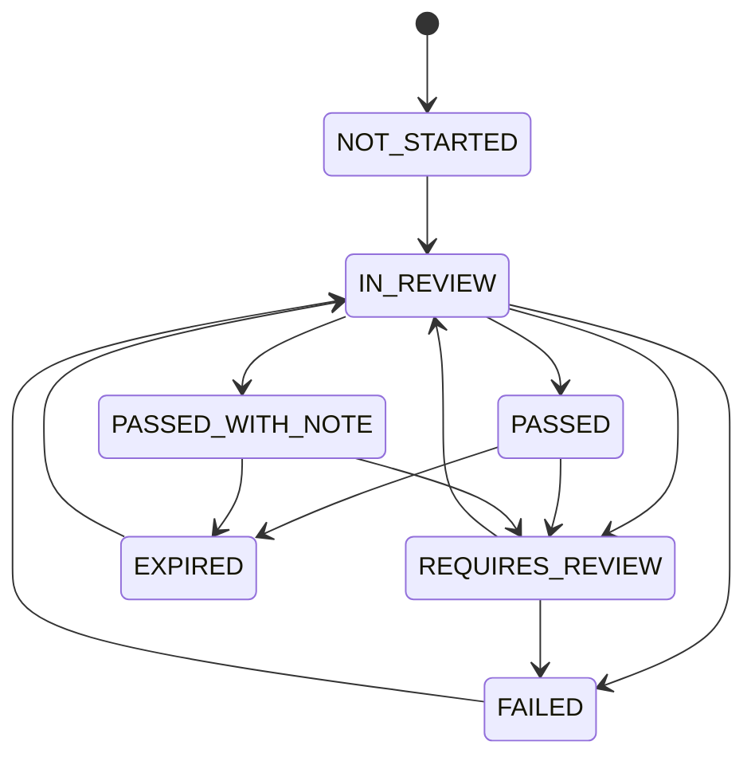

## 12.2 Transition rules

### `NOT_STARTED → IN_REVIEW`

Allowed when a check is opened and the reviewer begins work.

### `IN_REVIEW → PASSED`

Requires:

- defined scope;
- required evidence or documented observation;
- reviewer;
- review date;
- no unresolved publication-blocking exception for that check;
- source requirement satisfied where the check definition requires source verification.

### `IN_REVIEW → PASSED_WITH_NOTE`

Use when the core check is completed but a non-blocking caveat remains.

The note must be explicit and preserved internally.

### `IN_REVIEW → FAILED`

Use when the evidence does not support the defined check.

### `IN_REVIEW → REQUIRES_REVIEW`

Use when:

- evidence conflicts;
- source is incomplete;
- currentness is uncertain;
- a legal/professional question is triggered;
- the reviewer cannot safely interpret the evidence;
- the applicable planning or tenure position is uncertain.

### `PASSED / PASSED_WITH_NOTE → EXPIRED`

Only through the operational recheck mechanism when `recheck_at` is reached or a policy explicitly marks the check stale.

Do not describe this as a legal expiry unless an authoritative rule supports that conclusion.

### `EXPIRED → IN_REVIEW`

A fresh review is required. The previous result remains historical evidence.

### `PASSED / PASSED_WITH_NOTE → REQUIRES_REVIEW`

Allowed when new evidence, source changes, a material property change, or an exception invalidates confidence in the prior scope.

### Never allow automatic promotion

Do not run:

```text
EXPIRED → PASSED
REQUIRES_REVIEW → PASSED
FAILED → PASSED
```

without a fresh human review event and evidence.

---

# 13. EVIDENCE LIFECYCLE

A verification evidence item has its own lifecycle concept, separate from the verification result.

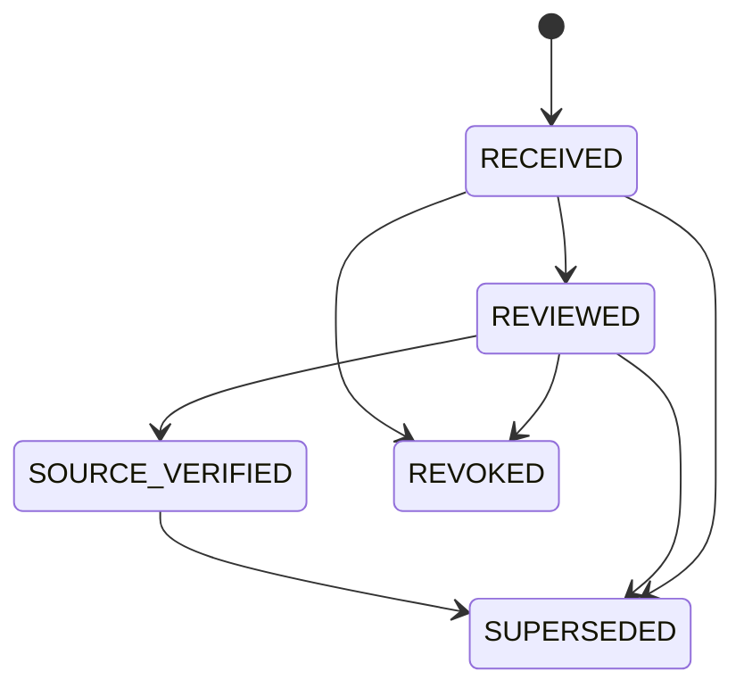

### Interpretation

```text
RECEIVED
  = file/source observation exists

REVIEWED
  = human inspected it within the recorded scope

SOURCE_VERIFIED
  = cross-check performed against defined authoritative source/process

SUPERSEDED
  = replaced by a newer evidence item

REVOKED
  = withdrawn/invalidated/not to be relied upon
```

A superseded or revoked evidence item must not continue satisfying a verification check automatically.

The existing schema uses `verification_evidence` plus `private_documents` and `source_references`; a future migration may add explicit provenance-state fields or an append-only evidence-review history if the V1 implementation requires stronger traceability.

---

# 14. VERIFICATION RESULT RECORD

Every `property_verifications` row represents one **specific scoped check**.

Minimum fields:

```text
property_id
check_definition_id
status
risk_level
scope_statement
reviewed_by
reviewed_at
recheck_at
referral_required
referral_type
source_reference_id
reviewer_notes_internal
public_label
public_explanation
public_visible
```

### Required semantics

`scope_statement` must answer:

```text
What exactly was checked?
What parcel/record/use/transaction did it cover?
What source or document set was used?
What limitation applies?
```

A generic scope such as:

```text
"property checked"
```

is insufficient for a legal-sensitive check.

---

# 15. EXCEPTIONS MODEL

Exceptions are first-class operational objects even where the current V1 schema represents them through notes/audit.

## 15.1 Exception fields

Recommended structured model:

```text
exception_id
property_id
verification_id
exception_code
severity
summary_internal
affected_claim
evidence_reference
opened_at
opened_by
status
resolution_summary
resolved_at
resolved_by
requires_professional_review
```

Statuses:

```text
OPEN
MITIGATED
ACCEPTED_FOR_INTERNAL_CONTEXT
RESOLVED
CLOSED
```

## 15.2 Severity

Use the existing risk vocabulary where possible:

```text
NONE
LOW
MEDIUM
HIGH
CRITICAL
```

## 15.3 Publication effect

```text
LOW
  → may be non-blocking if the public wording accurately discloses scope

MEDIUM
  → claim-specific review required

HIGH
  → generally blocks the affected legal/verification claim and normally triggers professional review

CRITICAL
  → property/check must enter verification-blocked or legal-review-required handling
```

Severity alone is not a legal conclusion. It is UrbanEdge's operational risk classification.

---

# 16. PROFESSIONAL-REVIEW FLAGS

## 16.1 Check-level flags

Use existing fields:

```text
referral_required = true/false
referral_type = LAWYER | SURVEYOR | PLANNER | ENGINEER | OTHER
```

## 16.2 Referral triggers

Default lawyer triggers include:

- ownership-chain uncertainty;
- conflicting revenue and registered records;
- incomplete inheritance/succession chain;
- partition/co-ownership dispute;
- POA-based offering/transaction;
- new/restricted tenure or premium issue;
- section 73AA or other restricted-land issue;
- purchaser eligibility question;
- fragmentation/subdivision legality question;
- title litigation;
- materially relevant revenue proceedings;
- mortgage/charge/release ambiguity;
- entity authority uncertainty;
- GIDC transfer/lease/subletting/compliance issue;
- unclear NA status or purpose mismatch;
- zoning/TP/reservation issue affecting intended use/value;
- government acquisition concern;
- high-value/high-risk transaction;
- explicit buyer request for title/legal certification;
- proposed use of broad legal-certainty wording.

## 16.3 Surveyor triggers

- boundary dispute;
- survey-number mismatch;
- hissa/part ambiguity;
- area mismatch;
- parcel cannot be clearly identified physically;
- legal/physical boundary requires measurement.

## 16.4 Planner/architect triggers

- zoning/land-use interpretation;
- TP/OP/FP interpretation;
- buildability/FSI;
- road-width/development-control question;
- development permission;
- plotted-development potential.

## 16.5 Engineer/specialist triggers

- industrial utilities;
- access/road design;
- drainage/flood/technical feasibility where material;
- structural/industrial technical issues.

## 16.6 Referral outcome rule

Whenever a mandatory professional trigger is active:

```text
referral_required = true
```

and the check becomes:

```text
REQUIRES_REVIEW
```

or another counsel-approved implementation state until the defined professional-review condition is satisfied or the claim is removed from public representation.

---

# 17. PUBLIC COPY POLICY

Public labels, explanations and disclaimer language must be **configuration**, not hard-coded business logic.

## 17.1 Why

The supplied legal report specifically requires final public terminology, evidence threshold and disclaimer to be approved by a qualified Gujarat property lawyer before production use.

## 17.2 Proposed policy object

Create a dedicated versioned policy resource such as:

```text
verification_public_copy_policies
```

Recommended fields:

```text
id
policy_code
version
status
label_template
explanation_template
disclaimer_text
what_this_means_template
what_this_does_not_mean_template
blocked_phrases
approved_by
approved_at
effective_from
superseded_at
created_at
updated_at
```

Status:

```text
DRAFT
LEGAL_REVIEW
APPROVED
PAUSED
SUPERSEDED
```

This is a recommended schema extension to the existing architecture.

## 17.3 Public publication rule

A verification signal may appear publicly only when:

```text
verification.status supports public display
AND verification.public_visible = true
AND public copy policy is APPROVED
AND public label exists
AND public explanation exists
AND required evidence exists
AND required source checks exist
AND no publication-blocking exception exists
AND check is not EXPIRED
AND no blocked phrase is present
```

If copy approval is not `APPROVED`, the check remains internal even if its underlying verification result is `PASSED`.

---

# 18. PUBLIC-SAFE LABEL CATALOG

The legal report provides the following safe candidate labels. They remain **candidate/configurable wording until counsel approval**.

```text
Documents Received
Documents Reviewed
Source Verified
Location Checked
Site Visit Completed
Revenue Records Reviewed
Registration Records Reviewed
Planning/Zoning Check Completed
GIDC Records Reviewed
Legal Review Completed — Scoped
NA Order Reviewed
NA Permission Document Reviewed
NA Purpose: [specified purpose]
TP / OP-FP Record Reviewed
Planning Scheme Information Reviewed
Buildability / FSI Reviewed — Scope and date shown
Development Potential — Seller Stated / Planning Check Required
```

The exact text shown in production must come from the approved public-copy configuration.

---

# 19. PUBLIC-CLAIM BLACKLIST

The following phrases are blocked by default in verification badges, verification headings, property descriptions, structured badge labels and other verification-related public copy:

```text
100% Clear Title
Clear Title
Clear Title Guaranteed
Legally Verified
Guaranteed Legal
Fully Verified
Verified
Government Approved
Government Certified
Dispute Free
No Legal Issues
Risk Free
Guaranteed NA
Guaranteed Construction
Guaranteed FSI
All Permissions Complete
No Encumbrances
Title Certified by UrbanEdge
```

Use case-insensitive matching and whitespace-normalized matching.

### Exception rule

Only a **lawyer-approved public-copy policy version** may authorize an exact phrase as a legitimate, scope-specific representation. An admin must never bypass the blacklist through arbitrary free-text entry.

Even where a lawyer-approved phrase exists, it must point to the exact approved scope and date.

---

# 20. PUBLIC VS INTERNAL DATA

## 20.1 Public

May include, where explicitly approved:

- scoped verification label;
- current status represented in approved public wording;
- review date;
- scope summary;
- a concise “what this does not mean” statement;
- category-specific public facts supported by published evidence;
- public-safe parcel identifiers when policy permits;
- public media.

## 20.2 Admin-only

Keep internal:

- full reviewer notes;
- source URLs/reference metadata where disclosure is not intended;
- risk level;
- exception detail;
- source-document chain;
- document provenance metadata;
- review reasoning;
- owner/broker sourcing details;
- exact internal location;
- internal negotiation context.

## 20.3 Restricted/confidential

Keep restricted:

- owner identity/contact data;
- identity documents;
- signatures;
- bank/financial information if ever collected;
- private deeds and scans;
- professional reports/opinions;
- sensitive government records;
- exact private coordinates.

## 20.4 Never public by default

```text
private_documents.*
verification_evidence.* internal notes
property_verifications.reviewer_notes_internal
owner PII
exact coordinates
admin audit payloads
private source paths/object paths
professional privileged commentary
internal risk classifications
```

This follows the existing public/private/RLS architecture: public data must come from explicit projections and private evidence must remain in private storage.

---

# 21. PUBLIC SUMMARY FORMAT

Each property should render a **Checks Completed** panel, not a single green legal badge.

Example structure:

```text
Verification checks

Documents Reviewed
  Status: Completed
  Reviewed: 29 Aug 2026
  Scope: Named submitted documents

Revenue Records Reviewed
  Status: Completed
  Reviewed: 29 Aug 2026
  Scope: Applicable revenue records listed in details

Registration Records Reviewed
  Status: Completed
  Reviewed: 29 Aug 2026
  Scope: Stated registration/search scope

Site Visit Completed
  Status: Completed
  Reviewed: 28 Aug 2026
  Scope: Physical location observation only

Planning / Zoning Check
  Status: Completed
  Reviewed: 29 Aug 2026
  Scope: Specific authority/source identified

Legal Review Completed — Scoped
  Status: Not obtained
```

The public interface must never imply that omitted checks were completed.

Recommended public states:

```text
COMPLETED
COMPLETED_WITH_NOTE
NOT_REVIEWED
NOT_APPLICABLE
REQUIRES_REVIEW
STALE
```

These are presentation states derived from underlying verification records and approved copy. They are **not** replacements for the internal `verification_status` enum.

---

# 22. CATEGORY WORKFLOW — AGRICULTURAL LAND

## 22.1 Objective

Confirm parcel identity, recorded revenue information, ownership/authority evidence, transaction-relevant title/registration evidence, tenure/restrictions, and category-specific risks without treating a revenue record as a universal title certificate.

## 22.2 Workflow

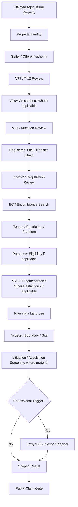

## 22.3 Baseline checks

| Check | Default | Minimum evidence | Public-safe outcome |
|---|---|---|---|
| Property identity | Mandatory | Current record + parcel/survey/map correlation | Identity/record check |
| Seller identity/authority | Mandatory | Owner/source record + authority evidence | Limited, scope-specific |
| VF7 / 7-12 | Mandatory | Current official record | Revenue Records Reviewed |
| VF8A | Conditional | Current official record where relevant | Revenue Records Reviewed |
| VF6 / mutation | Mandatory for material transfer | Certified entries + source instruments | Mutation Reviewed |
| Title chain | Conditional by transaction/claim | Registered deeds/orders | Title/document scope only |
| Index-2 | Mandatory for sale-type diligence where available | Certified Index-2 | Registration Records Reviewed |
| EC / encumbrance | Conditional by transaction, typically material sale/lease | Certified EC/search | Registration / Encumbrance Search Reviewed |
| Tenure | Mandatory | Revenue record + orders | Exact tenure class if safe |
| Premium | Conditional | Order/receipt | Limited status |
| Purchaser eligibility | High-risk conditional | Evidence + legal basis | Professional scope only |
| 73AA / restricted category | Conditional | Official record/order | Status only |
| Fragmentation | Conditional | Survey/area + applicable review | Status only |
| NA conversion | Conditional | NA order/application | NA-specific scope only |
| Planning | Conditional | DP/zoning/TP source | Planning Check Completed |
| Access | Listing-quality mandatory | Site + available legal-access evidence | Location/access scope only |
| Boundary | Conditional | Mapni/survey/site evidence | Survey/mapni scope only |
| Litigation | Conditional/high-value | Defined searches | Search scope/date only |
| Acquisition/reservation | Conditional | Official authority source | Status only |

## 22.4 Agricultural red flags

Immediately create an exception/referral when any of these appears:

- seller name mismatch;
- unresolved mutation;
- missing source deed;
- conflicting survey/block/area data;
- incomplete inheritance chain;
- new/restricted tenure;
- premium issue;
- restricted land concern;
- purchaser eligibility uncertainty;
- fragmentation concern;
- NA claim without supporting order;
- zoning/TP inconsistency;
- mortgage/charge or release ambiguity;
- litigation or acquisition concern.

---

# 23. CATEGORY WORKFLOW — NA LAND

## 23.1 Objective

Represent NA as a specific revenue/use status and preserve the critical separation between:

```text
NA status
≠
planning/zoning
≠
development/building permission
≠
blanket construction right
```

The legal report specifically requires these dimensions to remain separate.

## 23.2 Workflow

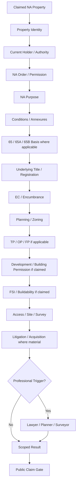

## 23.3 Baseline checks

| Check | Default | Evidence | Public-safe outcome |
|---|---|---|---|
| Property identity | Mandatory | Property card / 7/12 / survey data | Identity reviewed |
| Current holder | Mandatory | Record + title/authority evidence | Limited/scope-specific |
| NA order | Mandatory for NA claim | Original/certified order | NA Order Reviewed |
| NA purpose | Mandatory for NA claim | NA order | NA Purpose: [purpose] |
| Conditions | Mandatory | Order + annexures | Conditions reviewed / status |
| 65/65A/65B basis | Conditional | Authority order/current legal path | Internal / professional scope |
| Underlying title chain | Conditional by claim | Registered deeds/orders | Documents/title scope |
| Planning/zoning | Mandatory for use claims | Current planning source | Planning/Zoning Check Completed |
| Development/building permission | Conditional by claim | Competent authority approval | Specific approval reviewed |
| FSI/buildability | Conditional by claim | Current regulations + professional assessment | Buildability/FSI scope |
| Encumbrance | Mandatory for material sale | EC/search | Search scope/date |
| Litigation | Conditional/high-value | Defined search | Search scope/date |
| Access | Listing quality mandatory | Site + available easement/deed evidence | Access scope |

## 23.4 Hard rule for NA

Never implement:

```text
is_na = true
```

as sufficient support for:

```text
construction_allowed = true
```

or:

```text
all_non_agricultural_uses_allowed = true
```

NA claims require the appropriate order/purpose evidence, while intended use and development rights require separate planning evidence.

---

# 24. CATEGORY WORKFLOW — INDUSTRIAL LAND

## 24.1 Objective

Distinguish private industrial land, private industrial land with permissions, private industrial estates, GIDC land, leasehold/allotted land and project/plotting situations rather than treating all industrial inventory as one legal state.

## 24.2 Workflow

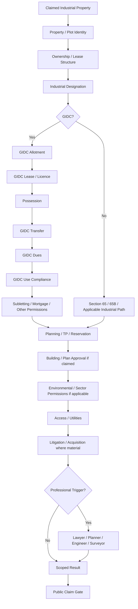

## 24.3 Industrial baseline checks

| Check | Default | Evidence | Public-safe outcome |
|---|---|---|---|
| Property/plot identity | Mandatory | Survey/plot/site plan | Identity reviewed |
| Ownership/lease structure | Mandatory | Title/lease/allotment | Scoped ownership/tenure statement |
| Industrial designation | Mandatory | DP/TP/zoning/order | Industrial designation reviewed |
| Section 65/65B | Conditional | Official order/current statutory path | Scoped status |
| GIDC status | Conditional | Current GIDC record | GIDC Records Reviewed |
| GIDC allotment | Conditional | OCA/allotment letter | Allotment reviewed |
| GIDC lease | Conditional | Lease deed/licence | Lease reviewed, scope shown |
| GIDC possession | Conditional | Possession record | Possession record reviewed |
| GIDC transfer | Mandatory for GIDC transfer | Transfer order/application/status | Transfer status only |
| GIDC dues | Mandatory for transfer workflow | Current official dues record | Dues status, not ownership conclusion |
| GIDC use compliance | Conditional | GIDC records/site | Use compliance status |
| Subletting | Conditional | Approval/status | Status only |
| Mortgage permission | Conditional | GIDC permission record | Status only |
| TP/FP/reservation | Conditional | Planning authority source | Planning record reviewed |
| Building/plan approval | Conditional by claim | Authority approval | Specific approval reviewed |
| Environmental/sector permission | Conditional by use | Relevant authority | Specific permit/status |
| Access/utilities | Conditional | Site + authority/utility evidence | Feasibility scope |
| Litigation | Conditional/high-value | Defined search | Search scope/date |

## 24.4 GIDC safety rule

The legal report says GIDC land is structured through GIDC allotment/lease arrangements and must not be represented as ordinary freehold property merely because a seller describes it as “owned”.

Therefore the public system must prefer scoped language such as:

```text
GIDC Records Reviewed
GIDC Lease Record Reviewed
GIDC Transfer Status Reviewed
```

and not default to:

```text
GIDC Ownership Verified
Freehold Industrial Land
```

unless a separate lawyer-approved policy and evidence scope explicitly supports such a statement.

---

# 25. COMMON TRANSACTION-LEVEL VARIATION

The exact verification package depends partly on the transaction.

## Sale

Highest emphasis on:

- owner/title chain;
- registration;
- EC/encumbrance;
- tenure/restrictions;
- access/boundaries;
- litigation/acquisition;
- category-specific permissions.

## Rent

Focus on:

- lessor identity/authority;
- premises/plot identity;
- permitted use;
- duration/lease conditions;
- relevant ownership/encumbrance issues;
- possession/site condition;
- local licensing/use requirements where relevant.

## Lease

Apply the transaction-specific lease framework and, for GIDC/industrial land, the applicable allotment/lease/transfer conditions.

Do not require the full sale-title package for every low-risk short-term rental without a documented reason.

---

# 26. PROPERTY-LEVEL VERIFICATION AGGREGATE

Do not store or expose a universal legal “verified” state.

For operational dashboards, derive a non-legal aggregate such as:

```text
NOT_STARTED
IN_REVIEW
CHECKS_COMPLETE
CONDITIONAL
REQUIRES_REVIEW
BLOCKED
STALE
```

### Aggregate calculation

```text
BLOCKED
    if any publication-blocking failure/exception exists

REQUIRES_REVIEW
    if any active check requires professional/review resolution

STALE
    if required public-supporting checks are expired

CONDITIONAL
    if relevant checks are passed but one or more are PASSED_WITH_NOTE

CHECKS_COMPLETE
    if the defined package is complete with no blocking issue

IN_REVIEW
    if active review work is underway

NOT_STARTED
    if no check has meaningfully begun
```

This aggregate is an operational summary only. It is not a title opinion.

---

# 27. CLAIM → CHECK → EVIDENCE → PUBLIC OUTPUT

Every public verification statement must be traceable through a deterministic chain.

```text
PUBLIC CLAIM
    ↓
APPROVED COPY POLICY
    ↓
REQUIRED CHECK
    ↓
REQUIRED EVIDENCE TYPE
    ↓
SOURCE / PROVENANCE REQUIREMENT
    ↓
REVIEWER + DATE
    ↓
STATUS
    ↓
EXCEPTIONS
    ↓
PUBLIC-SAFE SUMMARY
```

## Example A — Revenue Records Reviewed

```text
Claim:
  Revenue Records Reviewed

Required check:
  REVENUE_RECORDS_REVIEWED

Evidence:
  applicable official revenue record(s)

Reviewer:
  Admin

Result:
  PASSED / PASSED_WITH_NOTE

Public:
  approved label + scope + date
```

## Example B — NA Order Reviewed

```text
Claim:
  NA Order Reviewed

Required check:
  NA_ORDER_REVIEWED

Evidence:
  named NA order / certified or appropriately reviewed source

Additional:
  purpose + conditions captured

Public:
  only approved NA wording
```

## Example C — Legal Review Completed — Scoped

```text
Claim:
  Legal Review Completed — Scoped

Required check:
  LEGAL_REVIEW_COMPLETED

Required:
  qualified lawyer
  defined professional scope
  evidence/documents reviewed
  date
  outcome
  exceptions

Public:
  approved scoped wording only
```

---

# 28. OWNER SUBMISSION → VERIFICATION → PROPERTY

The owner-submission workflow remains:

```text
NEW
  → CONTACTED
  → DOCS_REQUESTED
  → UNDER_REVIEW
  → VERIFICATION_PENDING
  → APPROVED
  → CONVERTED
  → CLOSED
```

Side states remain:

```text
ON_HOLD
REJECTED
```

## 28.1 Conversion rule

Owner submission conversion creates a **property draft**, never an automatic public listing.

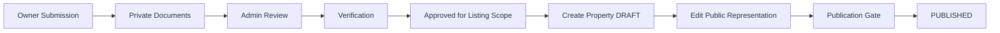

The owner description is source material, not final public copy.

Owner documents remain private by default and do not automatically become public media.

---

# 29. PUBLISH GATE

Publishing is a business-state decision and remains distinct from legal correctness.

The existing backend service is:

```text
requireAdmin
    ↓
load/lock property
    ↓
validate publication
    ↓
validate public location
    ↓
validate public media
    ↓
validate category data
    ↓
validate public verification output
    ↓
write publication state
    ↓
audit
    ↓
commit
    ↓
revalidate
```

## 29.1 Publish gate equation

```text
PUBLISH_ALLOWED =
    BASE_LISTING_VALID
    AND PUBLIC_LOCATION_SAFE
    AND PUBLIC_MEDIA_VALID
    AND CATEGORY_DATA_VALID
    AND PUBLIC_COPY_POLICY_VALID
    AND ALL_PUBLIC_CLAIMS_SUPPORTED
    AND NO_PUBLIC_CLAIM_BLOCKED
```

Where no verification claims are shown publicly, the property is not required to complete every conceivable verification check merely to become a listing.

## 29.2 Claim-specific verification requirement

```text
No public claim
  → no claim-specific verification requirement

Public claim selected
  → mapped check becomes required

Mapped check required
  → required evidence/source/reviewer/date must exist

Requirement fails
  → claim unavailable

Listing may still publish
  → provided no other publication blocker exists
```

This preserves the existing admin rule that publication is not an excuse to force every theoretical due-diligence check onto every listing.

---

# 30. PUBLISH-GATE STATE FLOW

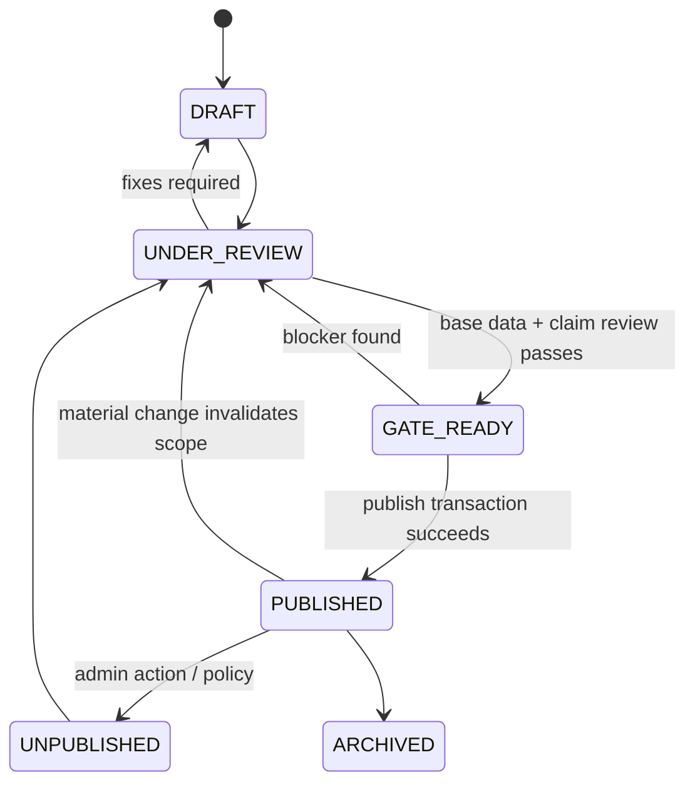

`GATE_READY` is a **derived gate result**, not an additional value that must be added to the existing `property_publication_status` enum.

The existing publication enum remains:

```text
DRAFT
UNDER_REVIEW
PUBLISHED
UNPUBLISHED
ARCHIVED
```

---

# 31. PUBLISH BLOCKERS

The backend already supports actionable blockers. Add verification-specific blockers such as:

```text
VERIFICATION_REQUIRED
VERIFICATION_EXPIRED
VERIFICATION_SOURCE_MISSING
VERIFICATION_EVIDENCE_MISSING
VERIFICATION_REVIEWER_MISSING
VERIFICATION_SCOPE_MISSING
VERIFICATION_EXCEPTION_OPEN
PROFESSIONAL_REVIEW_REQUIRED
PUBLIC_COPY_NOT_APPROVED
PUBLIC_CLAIM_BLOCKED
PUBLIC_CLAIM_BLACKLISTED
```

Example:

```text
Property: UE-LS-000123
Claim selected: GIDC Records Reviewed

BLOCKED
Reason:
  GIDC_RECORDS_REVIEWED has no qualifying evidence

Action:
  Add official GIDC source evidence or remove the public claim.
```

---

# 32. PUBLIC CLAIM REMOVAL VS LISTING UNPUBLISHING

A verification problem does not always require the whole listing to disappear.

Default safe behavior:

```text
Verification problem affects only a public claim
    ↓
Disable that public claim
    ↓
Rebuild public projection
    ↓
Keep listing published if all other publication requirements pass
```

However:

```text
Material contradiction / critical legal concern
    ↓
Property becomes REVIEW_REQUIRED / BLOCKED
    ↓
Publication may be suspended according to policy
```

This policy must be implemented as an explicit business rule, not an informal admin habit.

---

# 33. MATERIAL CHANGES AFTER PUBLICATION

The backend architecture identifies these as high-impact changes:

- category;
- transaction;
- public location visibility;
- public coordinates;
- material land-use claim;
- verification signal;
- parcel/public identifier;
- owner relationship.

When a material field changes:

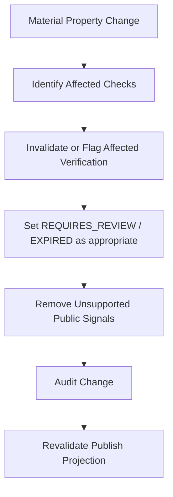

Do not silently keep a public verification badge whose supporting facts have materially changed.

---

# 34. RECHECK ENGINE

## 34.1 Inputs

The recheck engine considers:

```text
recheck_at
source update/change
material property change
new owner evidence
new professional opinion
new litigation/search result
new planning status
GIDC transfer/dues/status change
new buyer-specific legal question
```

## 34.2 High-priority recheck subjects

- current ownership/record status;
- EC/registered encumbrances;
- mutation status;
- RERA/project status where applicable;
- GIDC transfer/dues/status;
- permissions that can change or be revoked;
- planning notifications;
- acquisition/reservation status;
- litigation status;
- active listing availability.

## 34.3 Recheck logic

```text
CHECK PASSED
    ↓
recheck_at reached OR material change detected
    ↓
EXPIRED or REQUIRES_REVIEW
    ↓
public signal disabled if policy requires
    ↓
fresh review
    ↓
new result + new evidence/history
```

The prior verification record is retained for audit/history.

---

# 35. PROFESSIONAL REVIEW STATE MACHINE

Professional review is separate from ordinary admin review.

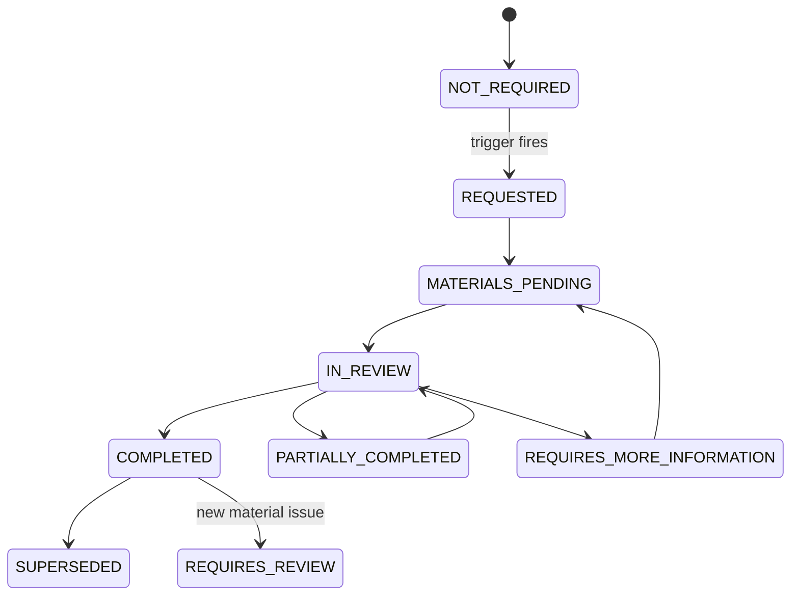

Professional completion requires:

```text
professional identity
+ role
+ defined scope
+ materials/evidence reviewed
+ date
+ outcome
+ exceptions/conditions where applicable
```

---

# 36. PROFESSIONAL REVIEW DOES NOT EQUAL “CLEAR TITLE”

This is a hard invariant.

```text
LEGAL_REVIEW_COMPLETED = true
```

means only:

> A qualified professional completed the recorded legal review scope.

It does not become:

```text
clear_title = true
```

and must never be transformed into:

```text
fully_verified = true
government_approved = true
dispute_free = true
```

without a separate, lawyer-approved, exact public-copy policy and sufficient evidence for that exact statement.

---

# 37. LITIGATION / SEARCH CHECKS

Search results must retain:

```text
search_scope
searched_entities
search_date
source
reviewer
result
limitations
```

Never convert:

```text
No result found
```

into:

```text
No dispute exists
```

Public-safe pattern:

```text
Litigation / authority searches completed for the stated scope as of [date].
```

Any stronger wording remains prohibited unless explicitly approved through the lawyer-governed public-copy policy.

---

# 38. ACCESS AND BOUNDARY CHECKS

`Location Reviewed`, `Site Visit Completed`, `Access Evidence Reviewed`, and `Survey / Mapni Evidence Reviewed` are separate checks.

Do not infer:

```text
site visit
→ legal access
→ boundary certainty
→ title certainty
```

A site visit can establish physical observations while legal access remains unproven.

A mapni/survey record can support a boundary check within its scope without becoming a universal statement about title or development rights.

---

# 39. PLANNING / DEVELOPMENT CHECKS

Planning is an independent layer from ownership/title.

Checks may include:

```text
PLANNING_CHECK_REVIEWED
TP_FP_OP_REVIEWED
BUILDABILITY_REVIEWED
DEVELOPMENT_PERMISSION_REVIEWED
```

Do not interpret:

```text
NA order exists
```

as:

```text
construction permission exists
```

Do not interpret:

```text
TP final plot exists
```

as:

```text
unrestricted development rights exist
```

Do not publish seller-supplied buildable-area claims as verified without an appropriate evidence standard and, where required, professional planning/buildability review.

---

# 40. ADMIN VERIFICATION QUEUE

The existing admin route contract is retained:

```text
/admin/verification
/admin/verification/queue
/admin/verification/[property-id]
/admin/properties/[id]/verification
```

Queue columns:

```text
Property ID
Property
Category
Location
Check Type
Status
Risk
Last Reviewed
Recheck Date
Reviewer
Referral
Action
```

Filters:

```text
Pending
In Review
Passed
Passed With Note
Failed
Requires Review
Expired
High Risk
Category
District
Reviewer
Referral Type
```

No “Verified” switch exists.

---

# 41. ADMIN VERIFICATION DETAIL

Display:

```text
Check
Status
Scope
Evidence
Source / Provenance
Reviewer
Reviewed At
Risk
Exceptions
Professional Referral
Public Visibility
Public Label
Public Explanation
Recheck At
Audit History
```

Separate visually:

```text
PUBLIC
```

from:

```text
INTERNAL
```

The admin preview must be generated by the same safe public projection used by the website.

---

# 42. PUBLIC PROJECTION CONTRACT

The public projection should be generated by a dedicated function/service such as:

```text
getPublicVerificationSummary(propertyId)
```

It may return:

```ts
type PublicVerificationItem = {
  code: string;
  label: string;
  explanation: string;
  status: "COMPLETED" | "COMPLETED_WITH_NOTE" | "NOT_REVIEWED" | "NOT_APPLICABLE" | "REQUIRES_REVIEW" | "STALE";
  reviewedAt?: string;
  scope?: string;
  limitation?: string;
};
```

It must never return:

```text
internal notes
raw evidence IDs
private document IDs
private storage paths
owner PII
exact coordinates
risk score
privileged professional commentary
private source metadata
```

---

# 43. API / SERVICE BOUNDARIES

## 43.1 Required server services

Recommended service functions:

```text
startVerificationCheck(propertyId, checkCode)
recordVerificationEvidence(verificationId, evidenceInput)
completeVerificationCheck(verificationId, resultInput)
requestProfessionalReview(verificationId, referralInput)
recordProfessionalReview(verificationId, professionalInput)
recheckVerification(propertyId, checkCode)
getAdminVerificationDetail(propertyId)
getPublicVerificationSummary(propertyId)
validatePublicVerificationOutput(propertyId)
validatePublicationClaims(propertyId)
```

All mutations are server-owned.

## 43.2 No browser-owned trust

The client may request:

```text
"complete this check"
```

but the server determines:

```text
whether the actor is authorized
whether evidence exists
whether the source requirement is met
whether the state transition is valid
whether professional review is required
whether public output is eligible
```

---

# 44. AUDIT REQUIREMENTS

Every meaningful verification event should preserve:

```text
WHO
DID WHAT
TO WHICH PROPERTY
TO WHICH CHECK
USING WHICH EVIDENCE
WHEN
WHAT RESULT
WHY
```

Audit events include at minimum:

```text
VERIFICATION_CREATED
VERIFICATION_STATUS_CHANGED
VERIFICATION_EVIDENCE_ADDED
VERIFICATION_EVIDENCE_SUPERSEDED
VERIFICATION_EVIDENCE_REVOKED
VERIFICATION_REVIEWER_CHANGED
PROFESSIONAL_REVIEW_REQUESTED
PROFESSIONAL_REVIEW_COMPLETED
VERIFICATION_EXCEPTION_OPENED
VERIFICATION_EXCEPTION_RESOLVED
PUBLIC_VERIFICATION_CHANGED
PUBLIC_COPY_POLICY_CHANGED
PROPERTY_PUBLISHED
PROPERTY_UNPUBLISHED
```

Never copy full private document contents into audit events.

---

# 45. PRIVACY / STORAGE RULES

Private verification documents should use private storage buckets such as:

```text
verification-documents-private
owner-submissions-private
```

Public media remains in approved public storage.

Rules:

- never expose private object paths publicly;
- never create public URLs for private evidence by default;
- authorize private document access server-side;
- log sensitive document access where required by policy;
- do not place document contents in analytics;
- retain replacement history where justified;
- revoked/deleted evidence no longer automatically satisfies a verification;
- request minimum identity material necessary for the verification objective.

---

# 46. PUBLIC DISCLAIMER CONFIGURATION

The supplied legal report contains draft disclaimer language that is explicitly marked **not final** and requires lawyer/client approval.

Therefore:

```text
Do not hard-code final legal disclaimer copy in components.
```

Instead store:

```text
verification_disclaimer_policy
```

with:

```text
status
version
text
approved_by
approved_at
effective_from
superseded_at
```

Recommended status:

```text
DRAFT
LEGAL_REVIEW
APPROVED
PAUSED
SUPERSEDED
```

The website may only use the production disclaimer from an `APPROVED` policy version.

The legal report's draft wording must not be copied into production unchanged.

---

# 47. SAFE DEFAULT WHILE LAWYER APPROVAL IS PENDING

Before the public copy policy is approved:

```text
Listing publication
    = allowed if normal publication requirements pass

Verification badges
    = disabled

Verification details
    = internal/admin only

Broad legal terms
    = blocked

Professional review records
    = internal unless separately approved
```

This lets the brokerage operate the inventory without accidentally deploying unapproved legal claims.

---

# 48. COPY / CLAIM VALIDATION PIPELINE

Every public title, description, badge, verification section and structured attribute that can create a legal impression should pass a claim-safety validator.

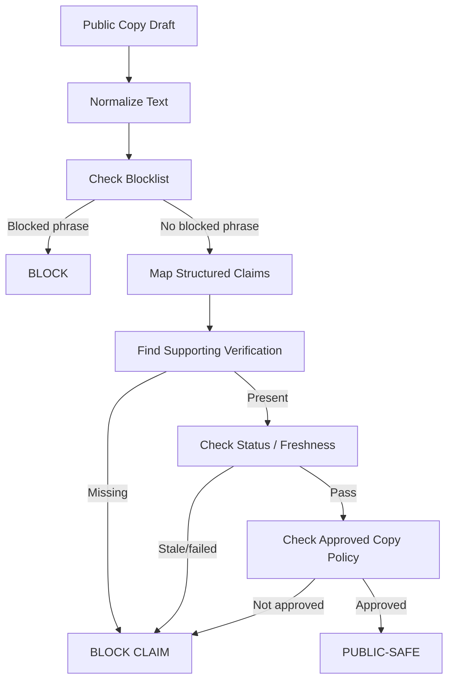

---

# 49. EXAMPLES OF SAFE CLAIM MAPPING

| Draft statement | Required system treatment |
|---|---|
| “Revenue Records Reviewed” | Must map to revenue-record review evidence + reviewer/date |
| “NA Order Reviewed” | Must map to a specific NA order evidence item + review scope/date |
| “GIDC Records Reviewed” | Must map to relevant GIDC evidence; not generic ownership |
| “Site Visit Completed” | Must map to a completed site-visit record and stated visit scope |
| “Survey/Mapni Evidence Reviewed” | Must map to survey/map evidence and defined scope |
| “Legal Review Completed — Scoped” | Must map to professional lawyer review with identity/scope/date |
| “Property is legally verified” | BLOCK by default |
| “Clear Title” | BLOCK by default |
| “Government Approved” | BLOCK by default unless exact approval is named and counsel-approved policy allows it |
| “Dispute Free” | BLOCK by default |
| “Guaranteed Construction” | BLOCK by default |

---

# 50. STATUS VS PUBLIC DISPLAY MATRIX

| Internal status | Public signal | Default |
|---|---|---|
| `NOT_STARTED` | No result / Not reviewed | Hide detailed claim |
| `IN_REVIEW` | Not reviewed / Under review only if approved wording exists | Usually hide |
| `PASSED` | Scoped completed statement | Eligible if all public-copy rules pass |
| `PASSED_WITH_NOTE` | Scoped completed statement with approved limitation | Eligible only if exception does not invalidate claim |
| `FAILED` | Do not show as positive verification | Hide positive claim; internal failure retained |
| `REQUIRES_REVIEW` | Requires review | Positive claim blocked |
| `EXPIRED` | Stale / not currently supported | Positive claim blocked until recheck |

---

# 51. WHAT HAPPENS WHEN EVIDENCE CHANGES

## New evidence added

```text
Existing check
   ↓
New evidence
   ↓
Re-evaluate whether old result remains valid
   ↓
Keep / modify / supersede result
   ↓
Audit
```

## Evidence replaced

Do not overwrite history.

```text
Old evidence
   ↓
SUPERSEDED
   ↓
New evidence
   ↓
Fresh review
```

## Evidence revoked

```text
Evidence revoked
   ↓
Affected check identified
   ↓
If no remaining qualifying evidence:
    check → REQUIRES_REVIEW or FAILED
   ↓
Affected public signal disabled
```

---

# 52. CATEGORY CLAIM SAFETY

## Agricultural

Do not derive:

```text
7/12 reviewed
→ clear title
```

or:

```text
road touch observed
→ legal access established
```

or:

```text
agricultural record exists
→ any buyer is eligible
```

## NA

Do not derive:

```text
NA order
→ unrestricted construction
```

or:

```text
NA
→ every non-agricultural use permitted
```

## Industrial / GIDC

Do not derive:

```text
GIDC record reviewed
→ freehold ownership
```

or:

```text
industrial designation
→ every industrial activity permitted
```

or:

```text
plot record
→ transfer approved
```

---

# 53. ERROR / FAILURE HANDLING

A verification service must fail closed for public claims.

Examples:

```text
Source lookup unavailable
    → do not mark PASSED
    → keep existing valid result only if policy permits
    → otherwise REQUIRES_REVIEW / STALE
```

```text
Evidence file unreadable
    → do not treat as reviewed
```

```text
Official source conflict
    → REQUIRES_REVIEW
```

```text
Required reviewer missing
    → cannot complete PASSED/FAILED transition
```

```text
Public copy not approved
    → claim cannot publish
```

A failed external notification must not roll back a committed verification/business state, consistent with the backend transaction architecture.

---

# 54. ADMIN ACCEPTANCE CRITERIA

## Verification

- [ ] No generic Verified switch exists.
- [ ] Every check has a defined code and scope.
- [ ] Every concluded check has reviewer and date.
- [ ] Required evidence or documented observation is attached.
- [ ] Source provenance can be identified.
- [ ] Owner-provided evidence is visibly distinct from source-verified evidence.
- [ ] Review does not automatically mean source verification.
- [ ] Source verification does not automatically mean legal validity.
- [ ] Professional review has role and scope.
- [ ] Exceptions are structured/traceable.
- [ ] Recheck date is stored.
- [ ] Recheck is not presented as statutory expiry.
- [ ] Replaced/revoked evidence does not silently preserve a result.
- [ ] Public labels come from approved configuration.
- [ ] Public positive signals require eligible status + evidence + copy policy.
- [ ] Private evidence never enters public DTOs.

## Publication

- [ ] Publish validates public verification output.
- [ ] Claim-specific checks are enforced only when the claim is selected.
- [ ] Blocklisted language blocks publication of the affected public representation.
- [ ] Public preview uses the same safe projection as the public website.
- [ ] Material property changes can invalidate affected verification claims.
- [ ] Publish/unpublish changes are audited.

---

# 55. AUTOMATED TEST REQUIREMENTS

## 55.1 Provenance tests

```text
owner_document + no human review
    ≠ reviewed

owner_document + reviewed
    ≠ source_verified

reviewed + source_reference cross-check
    = source_verified eligibility
```

## 55.2 Public projection tests

Assert anonymous users cannot access:

- private documents;
- owner PII;
- exact coordinates;
- internal verification notes;
- evidence internals;
- audit logs;
- professional-private material.

## 55.3 State machine tests

Test every allowed and forbidden verification transition.

Examples:

```text
FAILED → PASSED
  only after fresh IN_REVIEW and qualifying evidence

EXPIRED → PASSED
  forbidden directly

REQUIRES_REVIEW → public positive claim
  forbidden

PASSED_WITH_NOTE → public
  allowed only when policy supports the note/limitation
```

## 55.4 Claim safety tests

```text
"Clear Title"
  → blocked

"100% Clear Title"
  → blocked

"Government Approved"
  → blocked unless exact approved policy path applies

"Revenue Records Reviewed"
  → allowed only with mapped qualifying verification
```

## 55.5 Publication tests

```text
Missing required public verification evidence
    → claim blocked

Expired required verification
    → claim blocked

Public copy policy DRAFT
    → claim blocked

Private document attached as evidence
    → public DTO still excludes document path/content
```

---

# 56. RECOMMENDED V1 IMPLEMENTATION SEQUENCE

```text
1. Seed verification_check_definitions
        ↓
2. Implement property_verifications state machine
        ↓
3. Implement verification_evidence links
        ↓
4. Add source provenance capture
        ↓
5. Add exception/referral handling
        ↓
6. Implement category checklist resolver
        ↓
7. Implement public-copy policy store
        ↓
8. Implement public verification projection
        ↓
9. Implement publish claim validator
        ↓
10. Implement recheck scheduler/query
        ↓
11. Add audit events
        ↓
12. Add automated security/state/claim tests
        ↓
13. Conduct lawyer review of public labels/disclaimer and exact evidence thresholds
        ↓
14. Activate APPROVED public-copy policy
```

---

# 57. CHECK-DEFINITION SEED SET

The V1 seed set should include the existing researched checks:

```text
INFORMATION_REVIEWED
DOCUMENTS_REVIEWED
SOURCE_VERIFIED
PROPERTY_IDENTITY_REVIEWED
SELLER_AUTHORITY_REVIEWED
REVENUE_RECORDS_REVIEWED
VF7_REVIEWED
VF8A_REVIEWED
VF6_MUTATION_REVIEWED
REGISTRATION_RECORDS_REVIEWED
ENCUMBRANCE_SEARCH_REVIEWED
TITLE_CHAIN_REVIEWED
TENURE_RESTRICTION_REVIEWED
PREMIUM_REVIEWED
PURCHASER_ELIGIBILITY_REVIEWED
RESTRICTED_LAND_REVIEWED
FRAGMENTATION_REVIEWED
NA_ORDER_REVIEWED
NA_PURPOSE_REVIEWED
PLANNING_CHECK_REVIEWED
TP_FP_OP_REVIEWED
DEVELOPMENT_PERMISSION_REVIEWED
BUILDABILITY_REVIEWED
LOCATION_REVIEWED
SITE_VISIT_COMPLETED
ACCESS_EVIDENCE_REVIEWED
SURVEY_MAPNI_EVIDENCE_REVIEWED
LITIGATION_SCREENING_REVIEWED
ACQUISITION_RESERVATION_REVIEWED
INDUSTRIAL_DESIGNATION_REVIEWED
GIDC_RECORDS_REVIEWED
GIDC_ALLOTMENT_REVIEWED
GIDC_LEASE_REVIEWED
GIDC_TRANSFER_REVIEWED
GIDC_DUES_REVIEWED
GIDC_USE_COMPLIANCE_REVIEWED
GIDC_SUBLETTING_REVIEWED
GIDC_MORTGAGE_REVIEWED
BUILDING_PLAN_APPROVAL_REVIEWED
ENVIRONMENTAL_PERMISSION_REVIEWED
LEGAL_REVIEW_COMPLETED
SURVEYOR_REVIEW_COMPLETED
PLANNING_REVIEW_COMPLETED
ENGINEERING_REVIEW_COMPLETED
```

Not every check is required for every property. Applicability is controlled by category, transaction, claim and configured policy.

---

# 58. CATEGORY CHECK RESOLUTION RULE

The system should resolve a check set from:

```text
land_category
+
transaction_type
+
property facts
+
public claims selected
+
professional triggers
+
current verification policy version
```

Output:

```ts
type ResolvedVerificationPlan = {
  requiredChecks: CheckCode[];
  conditionalChecks: CheckCode[];
  publicClaimChecks: CheckCode[];
  professionalTriggers: ReferralRule[];
};
```

This makes category-specific verification deterministic without creating three completely separate verification engines.

---

# 59. WHAT IS INTERNAL VS PUBLIC — DECISION TABLE

| Item | Internal | Public |
|---|---:|---:|
| Property ID `UE-LS-*` | Yes | Yes |
| Survey/block identifier | Yes | Only when policy permits |
| Owner legal name | Yes | No by default |
| Owner phone/email | Yes | No |
| Owner-provided document | Yes | No by default |
| Document hash | Yes | No |
| Document source path | Yes | No |
| Evidence notes | Yes | No |
| Reviewer full notes | Yes | No |
| Reviewer role | Yes | Public only if approved |
| Review date | Yes | Yes for approved public check |
| Recheck date | Yes | Usually no; may be summarized if policy approves |
| Risk level | Yes | No by default |
| Referral reason | Yes | No by default |
| Professional identity | Yes | Only if approved and appropriate |
| Public label | Yes | Yes if approved |
| Public explanation | Yes | Yes if approved |
| Scope summary | Yes | Yes if approved |
| Limitation/disclaimer | Yes | Yes if approved |
| Private coordinates | Yes | No |
| Public-safe coordinates | Yes | Yes, subject to location policy |
| Audit history | Yes | No |
| Litigation search scope/date | Yes | Summary only if approved |
| Raw court/revenue result | Yes | No by default |
| Public media | Yes | Yes |

---

# 60. LEGAL-SAFETY INVARIANTS

The following must be encoded as hard product invariants:

1. `property.verified` does not exist as a universal truth field.
2. A passed verification is always scoped.
3. Owner-provided evidence is not source-verified by default.
4. Human document review is not authentication.
5. Source verification does not equal legal title certification.
6. Professional review is scoped and role-specific.
7. Professional review does not automatically become clear title.
8. No public badge without an approved label/explanation policy.
9. No public badge without qualifying evidence.
10. No public badge from an expired check.
11. No public legal-certainty wording from arbitrary admin text.
12. Current official sources outrank cached/third-party summaries.
13. Conflicting/incomplete official sources route to review required.
14. Private evidence never enters public DTOs.
15. Replaced/revoked evidence never silently satisfies old checks.
16. Recheck is operational unless an authority establishes a legal validity period.
17. Publication is not legal certification.
18. NA status does not imply unrestricted construction.
19. GIDC record review does not imply freehold ownership.
20. Litigation search does not prove that no dispute exists.
21. Site visit does not prove legal access/title/boundary.
22. Survey/mapni review does not become title certification.
23. Owner claims are claims until supported by the applicable workflow.
24. Any `clear title` / `legally verified` / `government approved` / equivalent broad claim is blocked unless counsel-approved exact policy explicitly authorizes it.

---

# 61. LAWYER-APPROVAL GATE

The workflow has a separate governance gate for public legal/verification language.

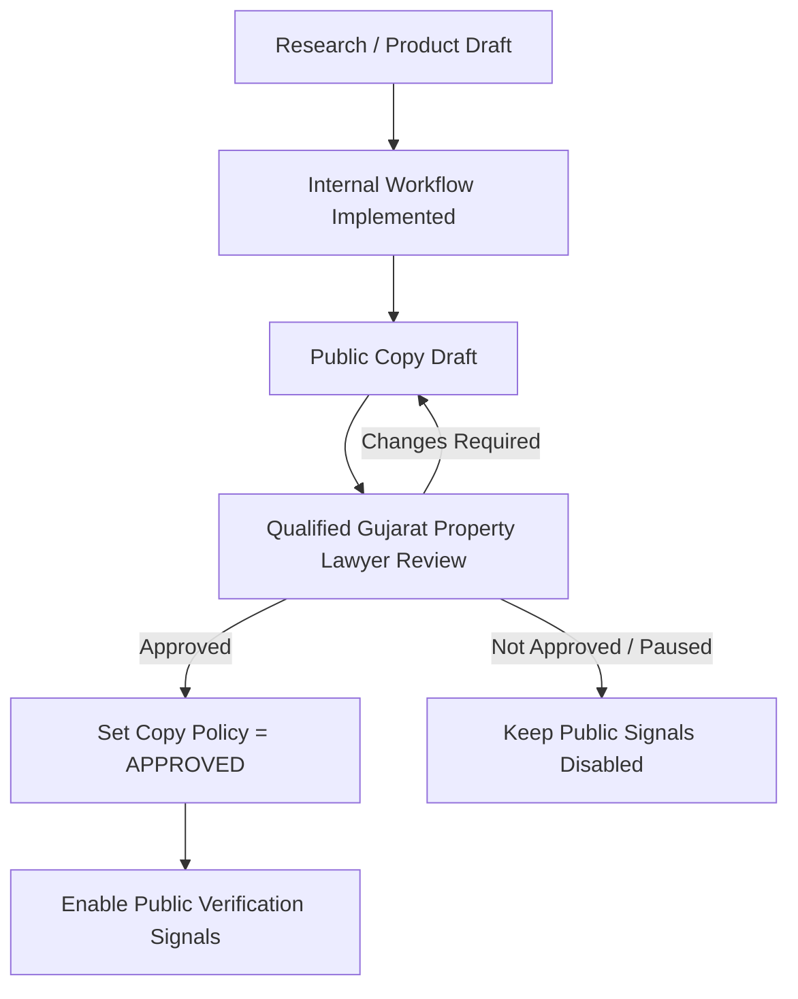

The lawyer approval gate covers, at minimum:

- public verification labels;
- definitions presented to consumers;
- evidence thresholds for any broad legal wording;
- disclaimer text;
- any exception to the blocked-phrase list;
- exact treatment of legal review badges;
- any representation implying title, legality, government approval, construction entitlement, RERA compliance or dispute absence.

---

# 62. SOURCE-DERIVED PRODUCT POSITION

This architecture preserves the supplied research position:

```text
Property identity
→ ownership / record evidence
→ transaction history
→ registration / encumbrance
→ tenure / restrictions
→ land-use / NA
→ planning / TP / zoning
→ site / survey / access
→ category-specific checks
→ litigation / government-claim screening
→ professional referral
→ scoped public disclosure
→ periodic recheck
```

The product does not collapse these layers into a legal-looking score.

---

# 63. RECOMMENDED PUBLIC USER EXPERIENCE

The public property page should use:

```text
Property facts
    ↓
Availability
    ↓
Approved verification signals
    ↓
Checks Completed
    ↓
Scope / date / limitation
    ↓
UrbanEdge contact CTA
```

A user should be able to understand:

```text
What UrbanEdge checked
What UrbanEdge did not check
When it was checked
What source class was used
Whether the result was owner-supplied or independently source-checked
Whether a professional review exists
```

without seeing sensitive private evidence.

---

# 64. FINAL IMPLEMENTATION CONTRACT

A coding agent implementing this document should treat the following as hard requirements:

```text
VERIFICATION
  → scoped checks
  → evidence-linked
  → provenance-aware
  → reviewer + date
  → risk + exceptions
  → recheck
  → professional referrals
  → public-copy policy

EVIDENCE
  → owner-provided is distinct from reviewed
  → reviewed is distinct from source-verified
  → source-verified is distinct from professional review
  → superseded/revoked evidence cannot silently support current claims

PUBLIC
  → explicit safe projection
  → approved labels only
  → approved disclaimer only
  → claim-specific evidence gates
  → no broad legal-certainty language by default

INTERNAL
  → raw documents
  → owner PII
  → private source metadata
  → detailed reviewer notes
  → exceptions
  → risk
  → professional/private material

CATEGORY
  → Agricultural workflow
  → NA workflow
  → Industrial/GIDC workflow
  → transaction-aware variation

STATE
  → NOT_STARTED
  → IN_REVIEW
  → PASSED
  → PASSED_WITH_NOTE
  → FAILED
  → REQUIRES_REVIEW
  → EXPIRED

PUBLISH GATE
  → base property validation
  → public-safe location
  → public media
  → category data
  → public verification output
  → claim/evidence consistency
  → approved public copy
  → no blocked claim

SAFETY
  → no monolithic verified boolean
  → no automatic clear-title inference
  → no automatic government-approval inference
  → no inference from NA to construction
  → no inference from GIDC to freehold ownership
  → no inference from search to dispute-free status
  → no public leakage of private evidence
```

---

# 65. IMPLEMENTATION NOTES FOR EXISTING ARCHITECTURE

This document is intentionally compatible with the supplied V1 system rather than replacing it.

### Existing database contracts retained

- `verification_check_definitions`
- `property_verifications`
- `verification_evidence`
- `private_documents`
- `source_references`
- `admin_profiles`
- property publication/availability state
- owner submissions and submission documents
- audit/history records

### Existing backend contracts retained

- server-owned mutations;
- atomic publish transaction;
- explicit public projections;
- no owner auto-publish;
- private documents outside public payloads;
- material change validation;
- audit on sensitive state changes.

### Existing admin contracts retained

- verification queue;
- property verification tab;
- reviewer/date/risk/evidence/scope/public wording;
- public/private visual separation;
- public preview through the same safe projection;
- publication only after validation.

### Recommended additive schema/policy extensions

Where the current schema does not yet model a concept directly, prefer a migration for:

```text
verification evidence provenance stage/history
verification exceptions
professional review identity/scope
versioned public-copy policy
versioned disclaimer policy
```

Do not put these concepts into an unbounded JSON blob merely to avoid schema work.

---

# 66. SOURCE ALIGNMENT

This workflow is based on the supplied project documents.

## `LEGAL_VERIFICATION_REPORT.md`

The source requires scoped verification, evidence taxonomy, document authenticity separation, public-claim controls, professional review triggers, category-specific checklists, public/private separation, recheck controls and lawyer approval of final public wording.

## `03-DATABASE-SCHEMA-ARCHITECTURE.md`

The source already defines typed verification definitions, property verification rows, verification evidence, source-reference relationships, reviewer/date/risk/public explanation fields, private documents, explicit public projections, RLS and audit/history.

## `04-BACKEND-API-BUSINESS-LOGIC.md`

The source establishes server-owned business rules, publication validation, safe DTOs, private document handling, atomic publication and material-change revalidation.

## `05-ADMIN-CRM-ARCHITECTURE.md`

The source establishes the verification queue, scoped verification detail, public/private separation, public-preview safety, owner submission conversion to DRAFT and claim-driven publication requirements.

## `LAND_DATA_MODEL_REPORT.md`

The source establishes the parcel-centric model, separation of property/parcel/source identifiers, planning as a separate dimension, field visibility classes, public/private separation and Gujarat-specific records behind jurisdiction-aware concepts.

---

# 67. FINAL POSITION

UrbanEdge should present verification as **evidence-backed scope**, not as a blanket legal status.

The safe implementation boundary is:

```text
OWNER / BROKER CLAIM
        ↓
EVIDENCE RECEIVED
        ↓
HUMAN REVIEW
        ↓
SOURCE CHECK, WHERE REQUIRED
        ↓
SCOPED VERIFICATION RESULT
        ↓
EXCEPTIONS / PROFESSIONAL REVIEW
        ↓
RECHECK CONTROL
        ↓
LAWYER-APPROVED PUBLIC COPY POLICY
        ↓
CLAIM-SPECIFIC PUBLISH GATE
        ↓
PUBLIC-SAFE SUMMARY
```

The product is therefore able to say exactly **what was checked**, while refusing to imply that UrbanEdge has certified everything that was not checked.

> **Required governance outcome before production release of legal/verification badges:** obtain qualified Gujarat property-lawyer approval for the final public labels, disclaimer, exact evidence thresholds, and any proposed exception to the blocked-phrase rules.
