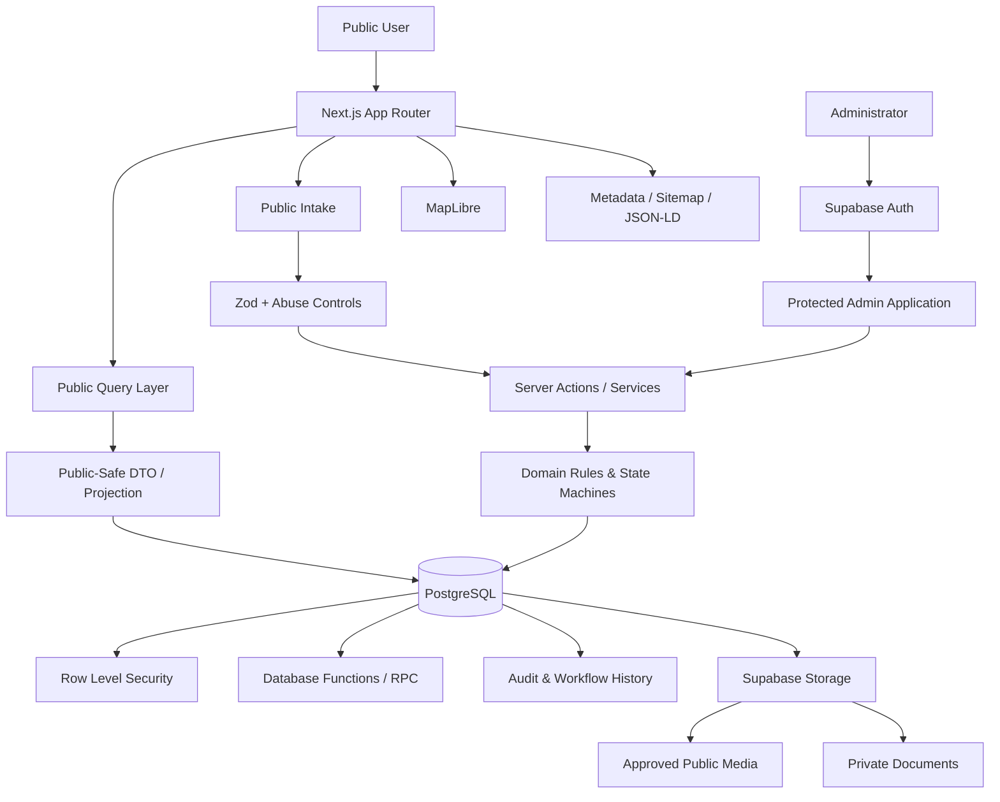

<div align="center">

# 🌍 UrbanEdge Land Space.

### A full-stack land discovery, brokerage operations, verification, and CRM platform for Ahmedabad & Gandhinagar.

**Property Discovery · Search · CRM · Verification · Site Visits · Owner Intake · SEO**

<br />

[](https://nextjs.org/)
[](https://react.dev/)
[](https://www.typescriptlang.org/)
[](https://supabase.com/)
[](https://tailwindcss.com/)
[](https://maplibre.org/)
[](https://vitest.dev/)
[](https://playwright.dev/)

<br />

**Built around curated inventory, privacy-aware property data, controlled publication, and human-assisted brokerage workflows.**

</div>

---

## 📖 About

**UrbanEdge Land Space** is a purpose-built land discovery and brokerage operations platform focused on **Ahmedabad and Gandhinagar, Gujarat**.

The system supports three primary land categories:

* 🌾 **Agricultural Land**
* 🏗️ **NA / Non-Agricultural Land**
* 🏭 **Industrial Land**

and three public discovery intents:

* **Buy**
* **Rent**
* **Lease**

Property owners can also submit land through a dedicated **Sell Your Land** workflow.

Unlike an open classifieds marketplace, owner-submitted properties are **not published automatically**. Submissions enter an internal review process where they can be evaluated, documented, verified, converted into managed property records, and published only through controlled brokerage workflows.

The application combines:

* a server-rendered public property-discovery website,
* structured land-specific search,
* an authenticated admin application,
* CRM and lead pipelines,
* buyer requirement management,
* site-visit operations,
* owner submissions,
* evidence-based property verification,
* publication controls,
* media/document handling,
* content and SEO management,
* and privacy/security safeguards

inside one unified Next.js application.

---

## ✨ Product Features

### 🔎 Land Discovery

The public website provides structured discovery rather than a simple property grid.

Users can explore listings through:

* keyword search,
* Property ID,
* land category,
* transaction type,
* district,
* taluka,
* place,
* locality,
* minimum / maximum budget,
* minimum / maximum land area,
* area units,
* availability,
* listed-price vs. price-on-request,
* and category-specific property attributes.

Search state is encoded in canonical URLs, making results shareable and preserving filters across navigation.

### 🌾 Category-Specific Search

Different land types expose different domain-specific filters.

**Agricultural Land**

* tenure
* irrigation
* area
* road/access information
* geographic hierarchy

**NA Land**

* NA status
* permitted/purposed use
* area
* pricing
* location

**Industrial Land**

* industrial subtype
* power status
* connectivity
* area
* geographic location

The system avoids treating all land parcels as structurally identical.

---

## 🏡 Property Experience

Each published property can expose a deliberately restricted public representation containing information such as:

* unique Property ID,
* land category,
* transaction type,
* availability,
* approved description,
* area,
* pricing,
* approved land-specific attributes,
* broad location,
* public-safe map position,
* media,
* relevant verification information,
* inquiry actions,
* site-visit actions,
* and structured metadata.

Sensitive internal information remains outside the public property projection.

---

## 🗺️ Privacy-Aware Location Model

Property location is not treated as simply public or private.

The system supports three visibility levels:

```text
EXACT
APPROXIMATE
HIDDEN
```

### EXACT

The explicitly authorized public coordinate can be displayed.

### APPROXIMATE

The public site receives a deliberately broadened location rather than the property's private coordinate.

### HIDDEN

No coordinate or public map point is exposed.

This boundary applies not only to the visible map, but also to:

* server-rendered HTML,
* client state,
* metadata,
* JSON-LD,
* analytics data,
* map configuration,
* and public DTOs.

Interactive maps are powered through **MapLibre** and load only from public-safe location information.

---

## 👤 Buyer Requirement Intake

Visitors who do not find the right property can submit structured requirements.

The workflow captures brokerage-relevant demand information instead of reducing every enquiry to a generic contact form.

Requirements enter the private administrative workflow where they can be:

* reviewed,
* qualified,
* connected to leads,
* compared with available properties,
* and followed through the CRM pipeline.

---

## 🏷️ Sell Your Land

Property owners can submit land through a dedicated intake workflow.

The form supports information such as:

* sale / rent / lease intent,
* land category,
* owner relationship,
* contact preference,
* district / taluka / village,
* location visibility preference,
* land area,
* pricing structure,
* property claims,
* supporting information,
* external media references,
* and required consent declarations.

### Submission lifecycle

```text
NEW
 ↓
CONTACTED
 ↓
DOCS_REQUESTED
 ↓
UNDER_REVIEW
 ↓
VERIFICATION_PENDING
 ↓
APPROVED
 ↓
CONVERTED
 ↓
CLOSED
```

Alternative branches support:

```text
ON_HOLD
REJECTED
CLOSED
```

An owner submission does **not** directly create a public listing.

Approved submissions can be converted into managed property records and continue through the normal internal publication workflow.

---

# 🧑‍💼 Admin & Brokerage Operations

The authenticated admin application acts as the operational center of the platform.

It includes dedicated workspaces for:

* 📊 Dashboard
* 🏡 Properties
* 👥 Leads
* 🔀 CRM Pipeline
* ⏰ Follow-ups
* 🎯 Buyer Requirements
* 📅 Site Visits
* 📆 Site Visit Calendar
* 📥 Owner Submissions
* ✅ Verification Queue
* 🖼️ Media
* 📝 Guides
* 📍 Locations
* 🔍 SEO
* 🔐 Security Health

---

## 🏡 Property Management

Administrators can create and manage property inventory through structured drafts.

Property workflows support:

* property creation,
* land-category-specific information,
* location data,
* pricing structures,
* availability,
* publication status,
* public/private information separation,
* media,
* verification,
* internal review,
* preview,
* and final publication.

### Publication lifecycle

```text
DRAFT
  ↓
UNDER_REVIEW
  ↓
PUBLISHED
  ↓
UNPUBLISHED
  ↓
ARCHIVED
```

The workflow also supports returning records for further review where appropriate.

Publication is treated as an explicit state transition rather than a generic boolean flag.

---

## 🚦 Publication Readiness

A listing must satisfy publication rules before public release.

Readiness is evaluated across areas such as:

```text
IDENTITY
CONTENT
CATEGORY_DATA
LOCATION_PRIVACY
OFFER_PRICE
MEDIA
CLAIMS_VERIFICATION
PUBLIC_PROJECTION
```

Each area can generate:

* **blockers**, or
* **warnings**

before publication.

This reduces the chance that incomplete, unsafe, or privacy-sensitive information reaches the public site.

---

# 👥 CRM & Lead Management

The platform includes a brokerage-specific CRM rather than sending enquiries to an external spreadsheet.

### Lead pipeline

```text
NEW
 ↓
CONTACT_ATTEMPTED
 ↓
QUALIFIED
 ↓
REQUIREMENT_CONFIRMED
 ↓
PROPERTY_MATCHED
 ↓
SITE_VISIT_REQUESTED
 ↓
SITE_VISIT_CONFIRMED
 ↓
SITE_VISIT_COMPLETED
 ↓
NEGOTIATION
 ↓
CLOSED_WON
```

Additional states support:

```text
NURTURE
CLOSED_LOST
```

Transitions are implemented as explicit domain state machines rather than arbitrary status changes.

CRM capabilities include:

* lead creation,
* opportunity tracking,
* buyer requirements,
* property matching,
* follow-up scheduling,
* activity history,
* pipeline progression,
* nurture handling,
* won/lost outcomes,
* and cross-navigation between related records.

---

# 📅 Site Visit Operations

Public users can request a site visit, but a request is **not automatically treated as a confirmed booking**.

### Visit lifecycle

```text
REQUESTED
 ↓
CONTACTED
 ↓
PROPOSED
 ↓
CONFIRMED
 ↓
COMPLETED
```

Operational branches also support:

```text
RESCHEDULED
CANCELLED
NO_SHOW
```

Admin workflows include:

* visit queue,
* visit detail workspace,
* calendar view,
* proposed scheduling,
* confirmation,
* rescheduling,
* completion,
* cancellation,
* outcomes,
* and CRM follow-up.

Scheduling is handled explicitly in the **Asia/Kolkata** timezone while persisted using timezone-aware database timestamps.

---

# ✅ Evidence-Based Verification

One of the most important design decisions in UrbanEdge Land Space is that the application does **not** reduce land verification to:

```text
verified = true
```

Land verification is modeled as a set of **scoped checks with evidence and provenance**.

A completed check means that a defined question was evaluated using recorded evidence.

It does **not** imply that an entire property is universally or legally “verified.”

---

## 🔬 Verification Workflow

Verification checks can progress through:

```text
NOT_STARTED
     ↓
IN_REVIEW
     ↓
 ┌──────────────────────────────┐
 │ PASSED                      │
 │ PASSED_WITH_NOTE            │
 │ FAILED                      │
 │ REQUIRES_REVIEW             │
 └──────────────────────────────┘
     ↓
  EXPIRED
```

Verification records can preserve:

* check definition,
* evidence,
* evidence source,
* source references,
* provenance,
* reviewer,
* professional-review requirement,
* exceptions,
* limitations,
* public-safe wording,
* and review history.

---

## 🧾 Evidence Provenance

Evidence can move through increasing levels of confidence:

```text
RECEIVED
   ↓
REVIEWED
   ↓
SOURCE_VERIFIED
   ↓
PROFESSIONALLY_REVIEWED
```

The system distinguishes receiving a document from establishing what that document actually proves.

For example, an owner claiming that a property is **NA land** does not automatically make that status an application fact.

The claim can instead trigger a relevant verification process.

---

## ⚖️ Safer Public Claims

The publication system actively avoids broad statements such as:

```text
"100% clear title"
"fully verified"
"legally verified"
"risk free"
"no legal issues"
```

Public verification information must include an appropriate:

* scope,
* explanation,
* limitation,
* and source class.

This keeps the website from turning limited evidence into misleading universal conclusions.

---

# 🖼️ Media & Document Architecture

The media system separates public assets from private operational documents.

Configured storage areas include:

```text
property-media-public
property-media-private
verification-documents-private
owner-submissions-private
guide-media-public
```

### Public media

Used for approved listing and guide assets.

### Private media

Used for information such as:

* verification evidence,
* owner-submitted documents,
* unpublished property material,
* and other internal documents.

Private document access is controlled through authorized server workflows and short-lived signed access rather than unrestricted public storage URLs.

The media architecture also supports:

* image processing,
* WebP output,
* PDFs,
* checksums,
* controlled promotion,
* external video links,
* drone-media references,
* 360° / virtual-tour references,
* and storage budget controls.

---

# 🔐 Security & Privacy

The application is designed around strict server/public boundaries.

### Authentication & Authorization

* Supabase authentication
* protected admin routes
* admin-profile authorization
* active/inactive administrator checks
* role-aware architecture
* server-side authorization

### Database Security

* PostgreSQL **Row Level Security**
* forced ownership boundaries
* restrictive grants
* actor-based database policies
* server-controlled privileged operations
* validated RPC workflows

### Public Data Isolation

The browser receives public-safe DTOs and projections rather than raw internal database records.

Sensitive data such as:

* owner contact details,
* private property coordinates,
* verification evidence,
* internal comments,
* private documents,
* CRM history,
* unpublished inventory,
* and internal brokerage information

is kept outside public payloads.

---

## 🛡️ Additional Security Controls

The repository also implements or prepares controls for:

* Content Security Policy
* HSTS in production
* clickjacking protection
* restrictive Permissions Policy
* referrer policy
* MIME-sniffing protection
* environment validation
* server/client boundary checks
* client-bundle secret scanning
* repository secret scanning
* anti-abuse validation
* idempotency protection
* rate-control infrastructure
* Cloudflare Turnstile integration
* controlled error responses
* privacy-aware audit logging

Preview deployments are designed to remain **noindex**.

---

# 🔍 Search Architecture

The canonical property search workspace is:

```text
/properties
```

Search state can include:

```text
q
propertyId
category
transaction
district
taluka
place
locality

minArea
maxArea
areaUnit

minPrice
maxPrice
pricing

availability

agriTenure
agriIrrigation

naStatus
naPurpose

industrialType
industrialPower

sort
page
```

Search inputs are normalized into canonical URL state.

Unknown, invalid, or non-canonical parameter combinations can be redirected to their normalized representation.

---

## 💰 Area & Pricing Semantics

The search layer understands multiple land-area units including:

```text
sq_ft
sq_m
sq_yd
var
acre
hectare
```

and distinguishes normal listed pricing from:

```text
PRICE_ON_REQUEST
```

This allows numeric filtering without pretending that non-numeric offers have comparable fixed prices.

---

# 🌐 SEO Architecture

The public experience is designed around server-rendered, intentionally curated pages rather than mass-generated search combinations.

### Core indexable routes include

```text
/
/properties
/properties/[property-slug]

/agricultural-land
/na-land
/industrial-land

/buy
/rent
/lease

/locations/[city]
/locations/[city]/[category]

/guides
/guides/[guide-slug]
/guides/category/[category-slug]

/about
/contact
```

Operational/intake pages are handled separately from curated discovery content.

### SEO capabilities

* server-rendered primary content
* canonical URLs
* metadata generation
* robots configuration
* XML sitemap generation
* JSON-LD
* breadcrumbs
* social/Open Graph metadata
* guide publishing
* location pages
* category pages
* slug redirects
* closed-property handling
* indexability rules
* noindex search utility route
* preview-environment noindex controls
* thin-page prevention

The architecture intentionally avoids creating thousands of low-value keyword combinations.

---

# 📝 Guides & Content

The admin application includes a guide/content workflow with states such as:

```text
DRAFT
 ↓
REVIEW
 ↓
PUBLISHED
 ↓
UNPUBLISHED
 ↓
ARCHIVED
```

Content tools include:

* guide creation,
* editing,
* preview,
* categories,
* public guide pages,
* SEO metadata,
* hero media,
* and publication control.

---

# 🧠 Engineering Highlights

This project includes considerably more than frontend page development.

| Engineering Area            | Implementation                                          |
| --------------------------- | ------------------------------------------------------- |
| **Framework**               | Next.js App Router                                      |
| **Frontend**                | React + TypeScript                                      |
| **Rendering**               | Server-first public experience with client enhancement  |
| **Domain Design**           | Feature modules + explicit state machines               |
| **Validation**              | Zod                                                     |
| **Database**                | PostgreSQL through Supabase                             |
| **Authentication**          | Supabase Auth                                           |
| **Authorization**           | Server authorization + RLS                              |
| **Search**                  | PostgreSQL-backed structured search                     |
| **Maps**                    | MapLibre                                                |
| **Media Processing**        | Sharp + Supabase Storage                                |
| **Anti-Abuse**              | Turnstile-ready intake protection                       |
| **Notifications**           | Resend integration                                      |
| **Testing**                 | Vitest + Testing Library + pgTAP + Playwright           |
| **Deployment Architecture** | Netlify + Supabase                                      |
| **Security**                | CSP, HSTS, secret scanning, environment guards          |
| **SEO**                     | SSR, canonicalization, sitemap, robots, structured data |

---

# 🧱 Architecture



---

## Application Boundaries

```text
Public Pages / Admin Pages
          │
          ▼
     Components
          │
          ▼
    Feature Domains
          │
          ▼
 Server Actions / Services
          │
          ▼
   Supabase Clients
          │
          ▼
 PostgreSQL + Storage
          │
          ├── RLS
          ├── RPC Functions
          ├── Integrity Constraints
          ├── Audit History
          └── Public-Safe Projections
```

The project deliberately separates:

* rendering,
* domain rules,
* validation,
* persistence,
* authorization,
* public projections,
* and privileged operations.

---

# 🗃️ Data Model

The database is designed around actual land-brokerage concepts rather than one oversized property table.

### Property Domain

```text
properties
property_agricultural
property_na
property_industrial
property_locations
property_offers
property_parcels
property_planning_context
parcel_identifiers
```

### Geography

```text
states
districts
subdistricts
places
localities
geography_aliases
planning_authorities
```

### Verification

```text
verification_check_definitions
property_verifications
verification_evidence
verification_exceptions
verification_history
professional_reviews
source_references
private_documents
```

### CRM

```text
parties
leads
lead_requirements
lead_properties
lead_activities
lead_follow_ups
party_consents
```

### Site Visits

```text
site_visits
site_visit_events
```

### Owner Submissions

```text
owner_submissions
owner_submission_documents
owner_submission_consents
owner_submission_events
```

### Content & SEO

```text
guides
guide_categories
seo_pages
seo_redirects
```

### Platform & Security

```text
admin_profiles
audit_logs
analytics_events
app_settings
notification_deliveries
```

This separation allows individual parts of the domain to evolve without turning property records into a large collection of loosely related nullable fields.

---

# 🔄 Explicit Workflow State Machines

Important business processes are represented as controlled state machines.

The repository defines state transitions for:

* property publication,
* property availability,
* owner submissions,
* CRM leads,
* site visits,
* verification,
* and guide publishing.

For example:

```text
Property:
DRAFT → UNDER_REVIEW → PUBLISHED → UNPUBLISHED → ARCHIVED

Lead:
NEW → QUALIFIED → MATCHED → SITE VISIT → NEGOTIATION → CLOSED

Verification:
NOT_STARTED → IN_REVIEW → RESULT → RECHECK

Owner Submission:
NEW → REVIEW → APPROVED → CONVERTED

Site Visit:
REQUESTED → CONTACTED → PROPOSED → CONFIRMED → COMPLETED
```

This prevents arbitrary status mutation and keeps application behavior aligned with defined business workflows.

---

# 🧪 Testing & Quality

The repository has automated validation across multiple layers.

### Unit Tests

Cover areas including:

* state machines,
* property draft validation,
* publication policy,
* public property projection,
* search parsing,
* verification policy,
* site-visit workflows,
* owner submissions,
* CRM behavior,
* media/storage rules,
* location privacy,
* SEO,
* environment safety,
* and security configuration.

### Component Tests

Cover areas including:

* property administration,
* publication,
* verification,
* public search,
* public property experience,
* CRM,
* owner submissions,
* site visits,
* content,
* and public intake.

### Integration Tests

Exercise service and database behavior for:

* property drafts,
* publication,
* search,
* CRM,
* public intake,
* owner submissions,
* media storage,
* verification,
* site visits,
* content/SEO,
* and security boundaries.

### Database Tests

The Supabase database includes pgTAP coverage for:

* schema,
* constraints,
* RLS,
* grants,
* projections,
* property drafts,
* storage,
* verification,
* publication,
* search,
* CRM,
* public intake,
* site visits,
* owner submissions,
* SEO,
* and security hardening.

### End-to-End Tests

Playwright covers integrated browser journeys across:

* public property discovery,
* search,
* property administration,
* CRM,
* verification,
* media,
* publication,
* buyer requirements,
* site visits,
* owner submissions,
* SEO/content,
* and security behavior.

---

# 📊 QA Snapshot

The repository's recorded local engineering qualification includes:

| Gate                          |                         Recorded Result |
| ----------------------------- | --------------------------------------: |
| PostgreSQL / pgTAP assertions |                                 **600** |
| Unit tests                    |                                 **147** |
| Component tests               |                                  **55** |
| Integration tests             |                                  **52** |
| Full Chromium E2E scenarios   |                                  **56** |
| Concurrent Property ID test   | **24 parallel inserts / 24 unique IDs** |
| Database migrations           |                                  **17** |
| Database lint                 |                                  ✅ Pass |
| ESLint                        |                                  ✅ Pass |
| Prettier                      |                                  ✅ Pass |
| Strict TypeScript             |                                  ✅ Pass |
| Production build              |                                  ✅ Pass |
| Client secret scan            |                                  ✅ Pass |
| Repository secret scan        |                                  ✅ Pass |
| Dependency security audit     |                                  ✅ Pass |

> The numbers above reflect the repository's recorded local qualification snapshot from **September 2026** and should be updated when the test suite changes.

---

# 🆔 Concurrency-Safe Property IDs

Public properties use immutable IDs such as:

```text
UE-LS-000001
```

The repository includes a dedicated concurrency test that creates records in parallel to verify that unique identifiers remain collision-free.

This prevents a common issue where identifiers generated only at the application layer can race under concurrent requests.

---

# 🛡️ Test Environment Safety

Stateful integration and E2E tests are guarded against accidental execution on a production-shaped environment.

The local test runners verify conditions such as:

* explicit test environment,
* test and production project references being different,
* local/test target configuration,
* and an explicit synthetic-test safety token.

A rejected unsafe target is treated as a successful safety control rather than something to bypass.

---

# 📂 Project Structure

```text
.
├── app/
│   ├── (public)/               # Public SSR website
│   │   ├── properties/
│   │   ├── guides/
│   │   ├── locations/
│   │   ├── requirements/
│   │   ├── sell-your-land/
│   │   └── site-visit/
│   │
│   ├── (admin)/                # Protected admin application
│   │   └── admin/
│   │       ├── properties/
│   │       ├── leads/
│   │       ├── requirements/
│   │       ├── site-visits/
│   │       ├── submissions/
│   │       ├── verification/
│   │       ├── guides/
│   │       ├── locations/
│   │       └── settings/
│   │
│   └── api/
│
├── components/
│   ├── admin/
│   ├── public/
│   ├── search/
│   ├── media/
│   └── foundation/
│
├── features/
│   ├── admin/
│   ├── content/
│   ├── crm/
│   ├── intake/
│   ├── media/
│   ├── owner-submissions/
│   ├── properties/
│   ├── search/
│   ├── site-visits/
│   ├── verification/
│   └── workflows/
│
├── server/
│   ├── auth/
│   ├── integrations/
│   ├── queries/
│   ├── search/
│   ├── services/
│   ├── storage/
│   └── supabase/
│
├── supabase/
│   ├── migrations/
│   ├── seed/
│   └── tests/
│
├── tests/
│   ├── unit/
│   ├── component/
│   ├── integration/
│   └── e2e/
│
├── config/
├── docs/
├── scripts/
└── types/
```

---

# 🛠️ Tech Stack

| Layer                       | Technology                            |
| --------------------------- | ------------------------------------- |
| **Framework**               | Next.js 16                            |
| **Frontend**                | React 19                              |
| **Language**                | TypeScript 6                          |
| **Styling**                 | Tailwind CSS 4                        |
| **Backend**                 | Next.js server actions/services       |
| **Database**                | PostgreSQL                            |
| **Backend Platform**        | Supabase                              |
| **Authentication**          | Supabase Auth                         |
| **Authorization**           | Server authorization + PostgreSQL RLS |
| **Validation**              | Zod                                   |
| **Maps**                    | MapLibre GL                           |
| **Image Processing**        | Sharp                                 |
| **Storage**                 | Supabase Storage                      |
| **Email Integration**       | Resend                                |
| **Anti-Abuse**              | Cloudflare Turnstile                  |
| **Testing**                 | Vitest + Testing Library              |
| **Database Testing**        | pgTAP / Supabase DB tests             |
| **Browser Testing**         | Playwright                            |
| **Code Quality**            | ESLint + Prettier + strict TypeScript |
| **Deployment Target**       | Netlify                               |
| **Database Hosting Target** | Supabase                              |

---

# 🚀 Getting Started

## Prerequisites

Install:

* **Node.js 22.12+**
* **npm 11**
* **Supabase CLI**
* Docker for the local Supabase development stack

The repository supports compatible Node.js releases below Node 25.

---

## 1. Clone the repository

```bash
git clone <your-repository-url>
cd urbanlandlivingspace-website
```

---

## 2. Install dependencies

```bash
npm ci
```

Using `npm ci` ensures that dependencies match the committed lockfile.

---

## 3. Configure the environment

Copy:

```bash
cp .env.example .env.local
```

Then configure the values needed for your environment.

Core application variables include:

```env
APP_ENV=
NEXT_PUBLIC_SITE_URL=

NEXT_PUBLIC_SUPABASE_URL=
NEXT_PUBLIC_SUPABASE_ANON_KEY=
SUPABASE_SERVICE_ROLE_KEY=
```

Optional/integration configuration includes:

```env
RESEND_API_KEY=
EMAIL_FROM=
EMAIL_REPLY_TO=
ADMIN_NOTIFICATION_EMAIL=

NEXT_PUBLIC_TURNSTILE_SITE_KEY=
TURNSTILE_SECRET_KEY=

NEXT_PUBLIC_MAP_STYLE_URL=
NEXT_PUBLIC_MAP_PROVIDER=

NEXT_PUBLIC_ANALYTICS_ENABLED=

HMAC_SECRET=
WEBHOOK_SIGNING_SECRET=
```

> [!IMPORTANT]
> Never expose `SUPABASE_SERVICE_ROLE_KEY`, HMAC secrets, webhook secrets, provider secrets, or other privileged values to client-side code or commit them to Git.

---

# 🗄️ Local Database

Start the local Supabase stack:

```bash
npm run db:start
```

Rebuild the database from migrations and seed data:

```bash
npm run db:reset
```

The repository contains versioned migrations for:

* schema,
* indexes,
* database constraints,
* public-safe projections,
* RLS,
* authorization,
* property drafts,
* storage,
* verification,
* publication,
* property detail,
* search,
* CRM,
* public intake,
* site visits,
* owner submissions,
* content/SEO,
* and security hardening.

---

# ▶️ Start Development

```bash
npm run dev
```

The project's pre-development script automatically prepares the required MapLibre worker asset.

---

# ✅ Development Quality Gate

For the main stateless project validation:

```bash
npm run qa
```

This runs:

```text
ESLint
    ↓
Prettier Check
    ↓
TypeScript
    ↓
Server / Client Boundary Check
    ↓
Secret Scan
    ↓
Unit Tests
    ↓
Component Tests
    ↓
Production Build
```

---

# 🧪 Available Test Commands

```bash
# All Vitest tests
npm run test

# Unit tests
npm run test:unit

# Component tests
npm run test:component

# Integration suite
npm run test:integration

# Guarded local integration tests
npm run test:integration:local

# Playwright
npm run test:e2e

# Guarded local browser tests
npm run test:e2e:local

# Database tests
npm run test:db

# Property-ID concurrency test
npm run test:db:concurrency

# Environment safety tests
npm run test:safety
```

---

# 🔍 Engineering Checks

Additional repository checks include:

```bash
# TypeScript
npm run typecheck

# ESLint
npm run lint

# Formatting
npm run format:check

# Server/client import boundaries
npm run check:server-boundaries

# Repository secret scanning
npm run check:secrets

# Built client bundle secret scanning
npm run check:client-bundle-secrets

# Production build
npm run build
```

---

# ☁️ Deployment Architecture

The application is designed around a provider-separated deployment model:

```text
Next.js Application
       │
       ▼
    Netlify
       │
       ├──── Supabase PostgreSQL
       ├──── Supabase Auth
       ├──── Supabase Storage
       ├──── Resend
       ├──── Cloudflare Turnstile
       └──── Map Provider / MapLibre
```

Environments are intentionally separated conceptually into:

```text
LOCAL / TEST
PREVIEW / STAGING
PRODUCTION
```

Production credentials should never be reused in local or test workflows.

Preview deployments are designed to remain excluded from search indexing.

---

# 📦 Storage Architecture

Storage buckets are configured through migrations rather than manually created application assumptions.

Current storage domains include:

| Bucket                           | Visibility |
| -------------------------------- | ---------- |
| `property-media-public`          | Public     |
| `property-media-private`         | Private    |
| `verification-documents-private` | Private    |
| `owner-submissions-private`      | Private    |
| `guide-media-public`             | Public     |

This keeps public presentation media separate from confidential brokerage and verification material.

---

# 🔐 Server / Client Secret Boundary

The repository includes automated checks intended to prevent sensitive server values from entering browser bundles.

Privileged secrets should only be consumed inside server-owned modules.

Examples include:

```text
Supabase service-role credentials
Turnstile secrets
Resend credentials
HMAC secrets
Webhook signing secrets
private storage operations
```

Public components operate through explicitly safe data projections and server-mediated workflows.

---

# 🧭 Design Philosophy

### 01 — Curated rather than open marketplace

The system is built around brokerage-reviewed inventory instead of allowing anyone to publish directly.

### 02 — Domain-specific instead of generic CRUD

Agricultural, NA, and Industrial properties have different information needs and are modeled accordingly.

### 03 — Public projection instead of raw records

Internal data is never assumed safe merely because a property itself is public.

### 04 — Evidence instead of broad verification claims

Verification records what was checked, using what evidence, at what scope.

### 05 — Explicit workflows instead of loose status fields

CRM, site visits, submissions, publication, availability, verification, and guides follow controlled state transitions.

### 06 — Privacy by architecture

Exact coordinates, owner information, internal documents, and CRM data are separated from public-facing information.

### 07 — Search intent instead of SEO page explosion

The application favors useful curated landing pages and canonical search state over mass-generated keyword URLs.

### 08 — Database constraints as part of application correctness

Important rules live beyond the interface layer through RLS, SQL constraints, RPC functions, triggers, and database tests.

### 09 — Safety around destructive testing

Local integration workflows are intentionally guarded against uncertain or production-shaped environments.

### 10 — Human-assisted brokerage

Software helps organize discovery, qualification, evidence, follow-up, and operations while keeping high-value brokerage decisions under human control.

---

# 🚧 Project Status

The repository contains the implemented V1 application and has completed its recorded **local whole-system engineering qualification**.

Core implemented areas include:

* ✅ public property discovery
* ✅ structured property search
* ✅ property details
* ✅ category and transaction pages
* ✅ location pages
* ✅ admin authentication
* ✅ property draft management
* ✅ property publication workflow
* ✅ CRM and lead management
* ✅ buyer requirements
* ✅ site-visit operations
* ✅ owner submissions
* ✅ verification workflows
* ✅ public/private media handling
* ✅ guides and content
* ✅ SEO infrastructure
* ✅ privacy boundaries
* ✅ security hardening
* ✅ database tests
* ✅ integration tests
* ✅ end-to-end tests
* ✅ production build qualification

Production release is intentionally separate from local engineering completion.

External launch steps such as final staging validation, provider configuration, production credentials, DNS/TLS confirmation, approved production content, and required professional/legal approvals remain deployment-time responsibilities.

---

<div align="center">

## 🌍 UrbanEdge Land Space

### Built for land discovery. Engineered for brokerage operations.

**Next.js · React · TypeScript · PostgreSQL · Supabase**

<br />

**Ahmedabad & Gandhinagar · Gujarat, India**

<br />

*Curated inventory · Structured data · Controlled publication · Privacy-aware workflows*

</div>
