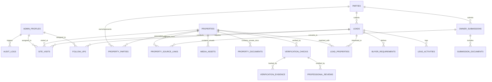
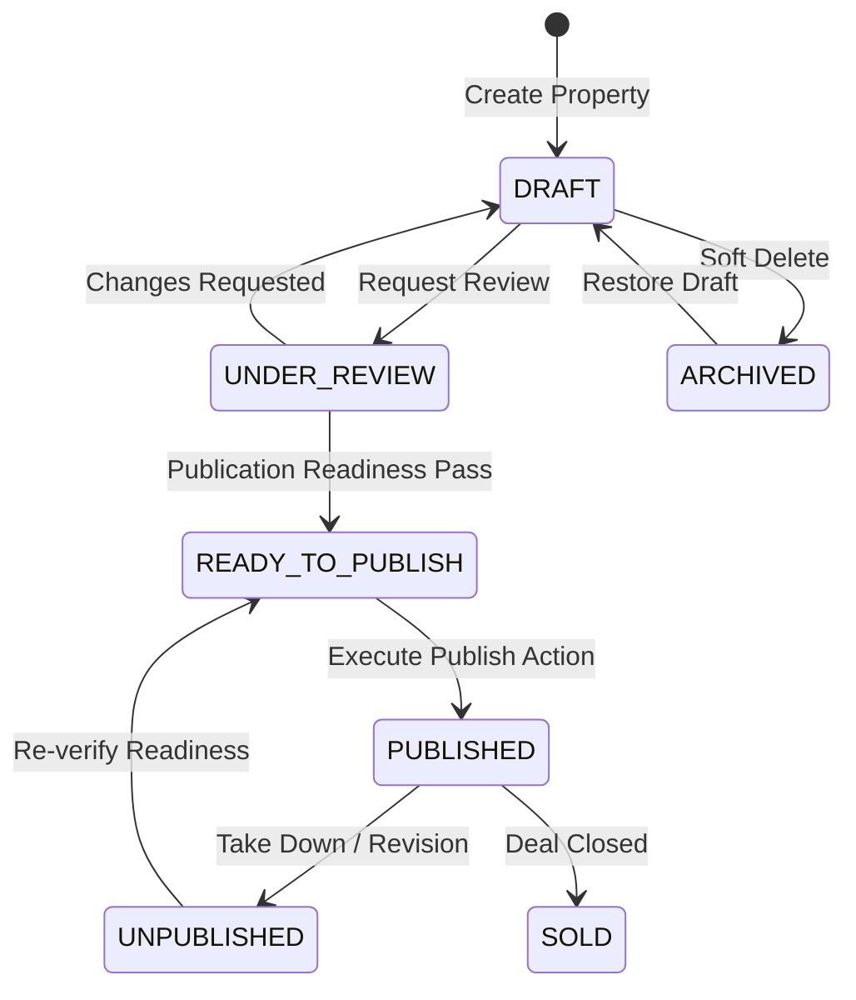
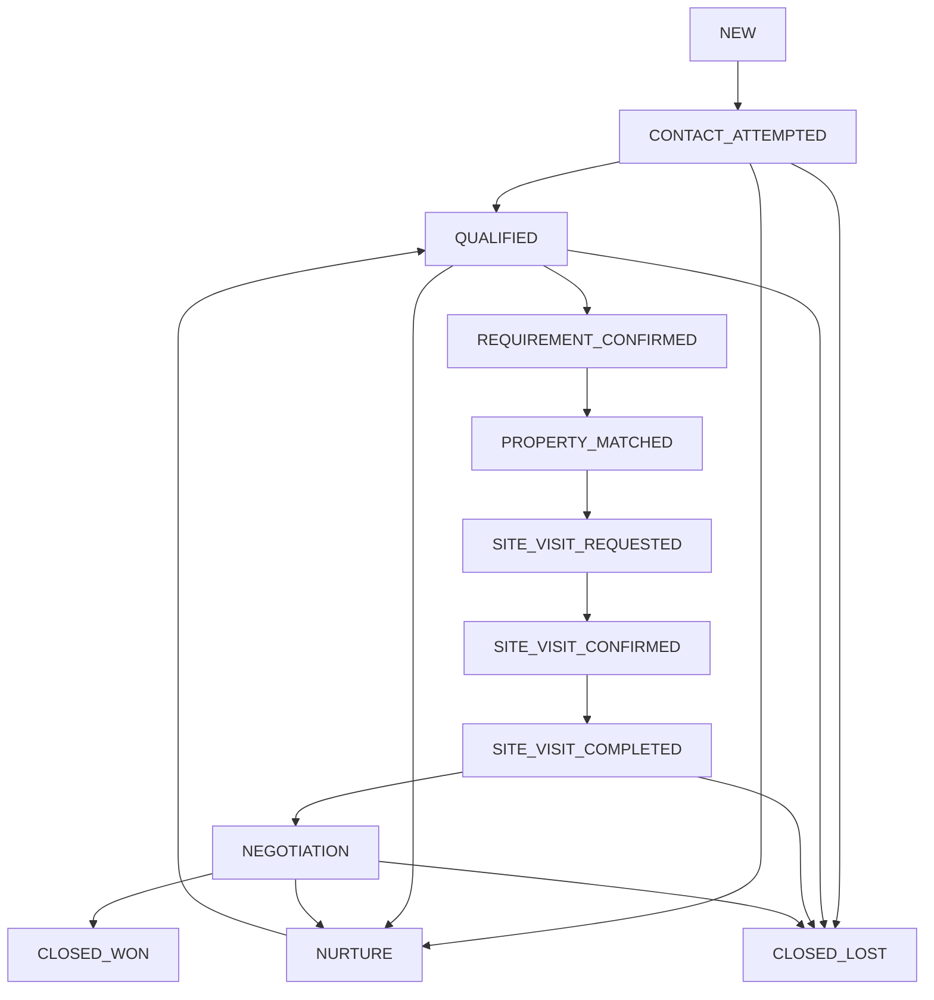
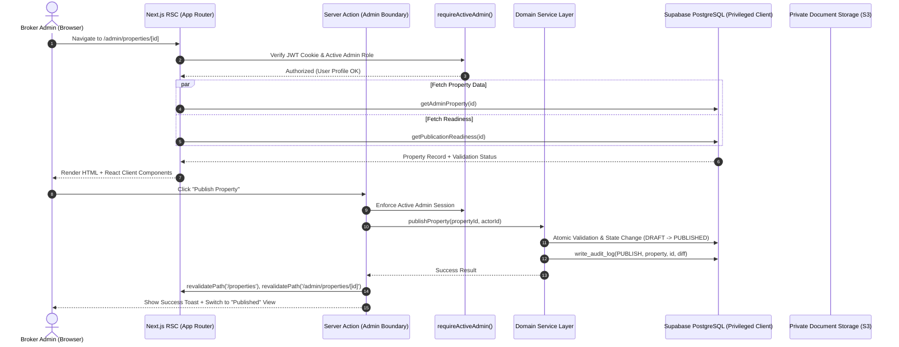

# URBANEDGE LAND SPACE — COMPLETE ADMIN PANEL ARCHITECTURE
**System:** UrbanEdge Land Space (Gujarat Real Estate Brokerage Operating System)  
**File:** `docs/architecture/COMPLETE-ADMIN-PANEL-ARCHITECTURE.md`  
**Authoritative Scope:** End-to-end Administrative Architecture, Design System, Domain Logic, Data Connections, and Security Workflows  
**Geography:** Ahmedabad & Gandhinagar, Gujarat, India  
**Stack:** Next.js 15 (App Router, RSC, Server Actions), TypeScript (Strict), Supabase (PostgreSQL 15, RLS, RPCs, Storage), Tailwind CSS / Vanilla Tokens, Vitest, Playwright  
**Status:** Living Master Specification & Production Blueprint  

---

## TABLE OF CONTENTS
1. [Executive System Vision & Operating Philosophy](#1-executive-system-vision--operating-philosophy)
2. [Design System & UI/UX Architecture](#2-design-system--uiux-architecture)
3. [Information Architecture & Route Hierarchy](#3-information-architecture--route-hierarchy)
4. [Core Domain Models & Relational Schema](#4-core-domain-models--relational-schema)
5. [Business Logic, Workflows & State Machines](#5-business-logic-workflows--state-machines)
   - 5.1 [Property Lifecycle & Marketing Publication Gate](#51-property-lifecycle--marketing-publication-gate)
   - 5.2 [12-Stage Buyer CRM Pipeline](#52-12-stage-buyer-crm-pipeline)
   - 5.3 [Seller Intake & Idempotent Property Conversion](#53-seller-intake--idempotent-property-conversion)
   - 5.4 [Site Visit Coordination Engine](#54-site-visit-coordination-engine)
   - 5.5 [7-Pillar Legal & Physical Verification Engine](#55-7-pillar-legal--physical-verification-engine)
   - 5.6 [Task Management & SLA Follow-Up Matrix](#56-task-management--sla-follow-up-matrix)
6. [Backend Connections, Data Flow & Server Architecture](#6-backend-connections-data-flow--server-architecture)
7. [Comprehensive Module-by-Module Specifications](#7-comprehensive-module-by-module-specifications)
8. [Security, RBAC, Data Privacy & Audit Trail](#8-security-rbac-data-privacy--audit-trail)
9. [Concurrency, Resiliency & Edge-Case Handling](#9-concurrency-resiliency--edge-case-handling)
10. [Performance, Indexing & Verification Matrix](#10-performance-indexing--verification-matrix)

---

# 1. EXECUTIVE SYSTEM VISION & OPERATING PHILOSOPHY

UrbanEdge Land Space is **not an open peer-to-peer marketplace**; it is an **exclusive, high-trust brokerage operating system** specializing in Agricultural, Non-Agricultural (NA), and Industrial land parcels across Ahmedabad and Gandhinagar.

```text
┌────────────────────────────────────────────────────────────────────────┐
│                        OPERATING PIPELINE                              │
│                                                                        │
│   DEMAND (Buyers)                      SUPPLY (Landowners)             │
│   ┌────────────────────┐               ┌────────────────────┐          │
│   │ Web Inquiry / Call │               │ Seller Submission  │          │
│   └─────────┬──────────┘               └─────────┬──────────┘          │
│             ▼                                    ▼                     │
│   ┌────────────────────┐               ┌────────────────────┐          │
│   │ Lead Qualification │               │ Verification Check │          │
│   └─────────┬──────────┘               └─────────┬──────────┘          │
│             ▼                                    ▼                     │
│   ┌────────────────────┐               ┌────────────────────┐          │
│   │ Requirement Match  │◄─────────────┤ Verified Inventory │          │
│   └─────────┬──────────┘  Matchmaking  └────────────────────┘          │
│             ▼                                                          │
│   ┌────────────────────┐                                               │
│   │ Coordinated Visit  │                                               │
│   └─────────┬──────────┘                                               │
│             ▼                                                          │
│   ┌────────────────────┐                                               │
│   │ Deal Negotiation   │                                               │
│   └─────────┬──────────┘                                               │
│             ▼                                                          │
│   ┌────────────────────┐                                               │
│   │ Closing (Token/Won)│                                               │
│   └────────────────────┘                                               │
└────────────────────────────────────────────────────────────────────────┘
```

### Core Operating Tenets:
1. **People → Properties → Visits → Deals:** The admin UI revolves around business verbs and actionable CRM states rather than raw database tables.
2. **Zero-Trust Private Information Boundary:** Land survey numbers (7/12, 8A, Village Form 6), revenue maps, owner identities, phone numbers, and title documents are classified as confidential. They are never transmitted over public APIs or exposed to the public frontend.
3. **Independent Publication vs. Availability:** A property can be `PUBLISHED` (visible on the marketing site) while its availability transitions from `AVAILABLE` to `UNDER_NEGOTIATION`, `SOLD`, or `OFF_MARKET`.
4. **Decoupled Verification from Marketing:** Public listing readiness requires basic listing sanity (cover image, location privacy, positive area, valid price), while deep 7-pillar legal verification runs in parallel as a trust-building diligence workflow.
5. **Single-Admin High-Leverage Architecture with RBAC Readiness:** The system is optimized for extreme velocity by a primary broker-operator while maintaining strict Role-Based Access Control (`SUPER_ADMIN`, `ADMIN`, `VERIFIER`, `SALES`, `CONTENT_EDITOR`) for future team scale.

---

# 2. DESIGN SYSTEM & UI/UX ARCHITECTURE

The Admin Panel adheres to a custom enterprise design system built for data density, readability during prolonged operational sessions, and rapid multi-tasking.

### 2.1 Color Palette & Semantic Tokens
* **Foundational Surfaces:**
  * App Background: `slate-50` (`#F8FAFC`)
  * Surface Background (Cards, Drawers): `white` (`#FFFFFF`)
  * Sidebar & App Bar Navigation: `slate-900` (`#0F172A`) to `slate-950` (`#020617`) with `slate-800` borders
* **Brand Accents:**
  * Primary Accent: Deep Navy `slate-900` / Rich Indigo `indigo-600` (`#4F46E5`)
  * Secondary Accent: Warm Amber `amber-600` (`#D97706`) for high-attention states and pending queues
* **Semantic Status Indicators:**
  * **Success / Published / Active / Won:** `emerald-600` text, `emerald-50` background, `emerald-200` border
  * **Warning / Attention / In Review / Under Offer:** `amber-600` text, `amber-50` background, `amber-200` border
  * **Danger / Expired / Lost / Failed / Overdue:** `rose-600` text, `rose-50` background, `rose-200` border
  * **Draft / Neutral / Archived:** `slate-500` text, `slate-100` background, `slate-300` border
  * **Info / Proposed / Scheduled:** `blue-600` text, `blue-50` background, `blue-200` border

### 2.2 Typography & Formatting Standards
* **Font Hierarchy:** Modern system sans-serif font stack (`Inter`, `-apple-system`, `BlinkMacSystemFont`, `Segoe UI`, `Roboto`).
  * Headings (`h1`): `text-2xl` to `text-3xl`, `font-bold`, `tracking-tight`, `text-slate-900`
  * Section Headers (`h2`): `text-lg` to `text-xl`, `font-semibold`, `text-slate-800`
  * Body Text: `text-sm` (`14px`), `font-normal`, `text-slate-600`
  * Microcopy & Metadata: `text-xs` (`12px`), `font-medium`, `text-slate-500`
  * Data & Numerical Values: `font-mono` or `tabular-nums` for alignment of currencies, land areas, and coordinates.
* **Localization & Indian Formats:**
  * **Currency:** Formatted using the Indian Numbering System (`en-IN`): e.g., `₹45.00 Lakh`, `₹3.25 Cr`.
  * **Land Units:** Converted and presented with dual metrics: Local Units (Vigha, Guntha, Acre, Sq. Yards) alongside metric base (Sq. Meters).
  * **Date & Time:** Always rendered in IST (`Asia/Kolkata`): `15 Sep 2026, 04:30 PM IST`.

### 2.3 Structural Components
```text
┌────────────────────────────────────────────────────────────────────────┐
│  HEADER: Breadcrumbs | Global Search (⌘K) | + Quick Action | Profile   │
├──────────────┬─────────────────────────────────────────────────────────┤
│ SIDEBAR      │ MAIN CONTENT WORKSPACE                                  │
│              │                                                         │
│ [Main]       │ ┌─────────────────────────────────────────────────────┐ │
│ • Dashboard  │ │ Page Title + Status Badges + Action Bar (CTA)       │ │
│ • Properties │ └─────────────────────────────────────────────────────┘ │
│ • Leads      │ ┌───────┬───────┬───────────┬─────────┬───────────────┐ │
│              │ │ Tab 1 │ Tab 2 │ Tab 3 ... │ Filters │ Search Bar    │ │
│ [Operations] │ ├───────┴───────┴───────────┴─────────┴───────────────┤ │
│ • Visits     │ │                                                     │ │
│ • Submissions│ │ Data Table / Workspace Form / Dynamic Pipeline      │ │
│ • Follow-ups │ │                                                     │ │
│              │ │                                                     │ │
│ [Content]    │ │                                                     │ │
│ • Guides     │ └─────────────────────────────────────────────────────┘ │
│ • SEO        │                                                         │
│ [Settings]   │ PAGINATION & AUDIT FOOTER                               │
└──────────────┴─────────────────────────────────────────────────────────┘
```

1. **Fixed Sidebar (`admin-navigation.tsx`):**
   - High-contrast responsive sidebar containing primary navigation links, operational badge counters (e.g. `New Leads [4]`, `Today's Visits [2]`), and a collapsible "More Operations" group.
2. **Top Utility Bar:**
   - Visual breadcrumbs indicating entity ancestry (e.g. `Leads > LD-2026-089 > Site Visits`).
   - Quick Creation dropdown (`+ New Property Draft`, `+ New Buyer Lead`, `+ Schedule Site Visit`).
   - Admin authentication profile with active role pill (`SUPER_ADMIN`).
3. **Tabbed Workspaces (`property-workspace.tsx`, `lead-workspace.tsx`):**
   - URL-search-param-driven tabs (`?tab=overview`, `?tab=media`, `?tab=documents`, etc.).
   - Enables direct deep-linking, browser history navigation, and lazy server-side fetching of heavy relations.
4. **Data Tables & Filter Bars:**
   - Sticky table headers, responsive overflow wrappers.
   - Real-time server-filtered inputs (search term, category dropdowns, status pills, date ranges).
   - Empty state illustrations with contextual action buttons.
5. **Form Architecture:**
   - Two-column responsive grid layout: Left column (Core fields, category-specific attributes), Right column (Sticky status card, publication readiness gate, availability toggles, audit history).
   - Micro-validation errors displayed directly below fields.
   - Optimistic status feedback on submit with disable-states preventing double-clicks.

---

# 3. INFORMATION ARCHITECTURE & ROUTE HIERARCHY

All administrative features are encapsulated within the protected route group: `app/(admin)/admin/(protected)`.

```text
/admin
├── login                                   # Authentication Gateway (Supabase Auth SSR)
└── (protected)                             # Layout boundary requiring active admin session
    ├── dashboard                           # Executive Dashboard & Daily Action Center
    │
    ├── properties                          # Property Inventory Hub
    │   ├── page.tsx                        # Filtered paginated list of properties
    │   ├── new/page.tsx                    # Multi-step property draft generator
    │   └── [id]                            # 6-Tab Property Workspace
    │       ├── page.tsx                    # (Overview, Media, Documents, Review, Buyers, Activity)
    │       └── preview/page.tsx            # Full-page staging preview before public publish
    │
    ├── leads                               # Buyer CRM Hub
    │   ├── page.tsx                        # Master Lead Inbox (preset filters, table view)
    │   ├── pipeline/page.tsx               # 12-Stage Visual Kanban Board
    │   ├── new/page.tsx                    # Direct lead entry modal/form
    │   └── [id]/page.tsx                   # Unified Buyer Workspace (Requirements, Matches, Visits)
    │
    ├── submissions                         # Landowner Inbound Supply Hub
    │   ├── page.tsx                        # Owner submissions list (Pending, Contacted, Reviewed)
    │   └── [id]/page.tsx                   # Submission Detail & 1-Click Property Draft Converter
    │
    ├── site-visits                         # Field Operations Center
    │   ├── page.tsx                        # Queue of scheduled, requested, and past site visits
    │   ├── calendar/page.tsx               # Weekly/Monthly Field Schedule (Asia/Kolkata)
    │   └── [id]/page.tsx                   # Visit Itinerary, Meeting Notes & Outcome Dispatcher
    │
    ├── verification                        # Legal & Title Due Diligence Center
    │   ├── queue/page.tsx                  # Backlog of parcels awaiting verification
    │   └── [propertyId]/page.tsx           # 7-Pillar Checksheet, Document Registry, Provenance Log
    │
    ├── follow-ups                          # Action Center & SLA Tasks
    │   └── page.tsx                        # Time-bucketed tasks (OVERDUE, TODAY, UPCOMING)
    │
    ├── requirements                        # Demand Aggregation Engine
    │   ├── page.tsx                        # Buyer requirements table
    │   ├── unmatched/page.tsx              # Unmet market demand awaiting supply match
    │   └── [id]/page.tsx                   # Requirement detail and matched inventory matrix
    │
    ├── guides                              # Educational CMS Hub
    │   ├── page.tsx                        # Guide articles list & category manager
    │   ├── new/page.tsx                    # Guide Markdown editor
    │   └── [id]/page.tsx                   # Article editor, SEO preview, hero media selector
    │
    ├── locations                           # Micro-market & Geo Engine
    │   ├── page.tsx                        # Ahmedabad/Gandhinagar Talukas, Localities & Zones
    │   └── [id]/page.tsx                   # Locality pricing indices & privacy fuzzing radii
    │
    ├── seo                                 # Search Engine Control Plane
    │   ├── page.tsx                        # Canonical URL rules, 301 redirects, indexability status
    │   └── actions.ts                      # Redirect CRUD and XML sitemap revalidation triggers
    │
    ├── media                               # Global Asset & Storage Repository
    │   └── page.tsx                        # Public asset CDN explorer & private vault audit
    │
    └── settings                            # Global Settings & Security
        ├── page.tsx                        # Company metadata, RERA licenses, operational hours
        ├── seo/page.tsx                    # Default meta titles, OpenGraph defaults, analytics tags
        └── security/page.tsx               # RBAC user manager, active sessions, audit trail explorer
```

---

# 4. CORE DOMAIN MODELS & RELATIONAL SCHEMA

The administrative system orchestrates 49 database tables and 24 PostgreSQL enums. Below is the relational architecture linking Core Demand, Supply, Operations, and Auditing.

### 4.1 Master Entity-Relationship Diagram (Mermaid)



### 4.2 Key Relational Table Definitions

#### `properties` (Core Inventory)
* `id` (UUID, Primary Key)
* `property_code` (TEXT, Unique, e.g. `PROP-2026-0042`)
* `publication_status` (ENUM: `DRAFT`, `UNDER_REVIEW`, `PUBLISHED`, `UNPUBLISHED`, `ARCHIVED`)
* `availability_status` (ENUM: `AVAILABLE`, `UNDER_NEGOTIATION`, `SOLD`, `RENTED`, `LEASED`, `OFF_MARKET`)
* `land_category` (ENUM: `AGRICULTURAL`, `NA`, `INDUSTRIAL`)
* `primary_transaction_type` (ENUM: `BUY`, `RENT`, `LEASE`)
* `location_visibility` (ENUM: `EXACT`, `APPROXIMATE`, `HIDDEN`)
* `district_id`, `subdistrict_id`, `locality_id` (Foreign Keys to Geography)
* `display_area_value`, `display_area_unit_id` (Calculated primary display metric)
* `area_sqm` (DECIMAL, Canonical normalized surface area)
* `price_mode` (ENUM: `PRICE_ON_REQUEST`, `EXACT_TOTAL`, `PRICE_RANGE`, `PER_UNIT`)
* `price_amount`, `price_min`, `price_max`, `price_per_unit`
* `is_featured` (BOOLEAN, default `false`)
* `published_at`, `created_at`, `updated_at` (TIMESTAMPTZ)

#### `leads` (Buyer & Seller Demand Entities)
* `id` (UUID, Primary Key)
* `lead_reference` (TEXT, Unique, e.g. `LD-2026-0189`)
* `party_id` (UUID, Foreign Key to `parties`)
* `lead_type` (ENUM: `BUYER_LEAD`, `SELLER_LEAD`, `GENERAL_INQUIRY`)
* `status` (ENUM: 12-Stage Pipeline)
* `intent_type` (ENUM: `BUY`, `RENT`, `LEASE`, `SELL`)
* `priority` (ENUM: `LOW`, `MEDIUM`, `HIGH`, `URGENT`)
* `assigned_to` (UUID, Foreign Key to `admin_profiles`, Nullable)
* `next_follow_up_at` (TIMESTAMPTZ)
* `notes_internal` (TEXT)
* `version` (INT, Optimistic Concurrency Counter)

#### `property_source_links` (Supply Provenance Junction)
* `id` (UUID, Primary Key)
* `property_id` (UUID, Foreign Key to `properties`, Cascade Delete)
* `source_type` (ENUM: `SELLER_LEAD`, `OWNER_SUBMISSION`, `MANUAL_BROKER_ENTRY`)
* `source_reference_id` (TEXT, Pointer to `leads.id` or `owner_submissions.id`)
* `linked_at` (TIMESTAMPTZ)
* *Constraint:* Unique `(property_id, source_type, source_reference_id)` ensuring strict 1-to-N non-destructive tracing without data overwriting.

#### `site_visits` (Field Coordination)
* `id` (UUID, Primary Key)
* `visit_reference` (TEXT, Unique, e.g. `SV-2026-0054`)
* `lead_id` (UUID, Foreign Key to `leads`)
* `property_id` (UUID, Foreign Key to `properties`)
* `assigned_to` (UUID, Foreign Key to `admin_profiles`, Nullable)
* `status` (ENUM: `REQUESTED`, `CONTACTED`, `PROPOSED`, `CONFIRMED`, `COMPLETED`, `CANCELLED`, `NO_SHOW`, `RESCHEDULED`)
* `requested_start_at`, `confirmed_start_at`, `confirmed_end_at` (TIMESTAMPTZ, Asia/Kolkata)
* `meeting_instructions` (TEXT)
* `client_feedback` (TEXT)
* `version` (INT)

#### `audit_logs` (Immutable Security Ledger)
* `id` (UUID, Primary Key)
* `action` (ENUM: `CREATE`, `UPDATE`, `PUBLISH`, `UNPUBLISH`, `ARCHIVE`, `RESTORE`, `DELETE`, `LOGIN`, `STATUS_CHANGE`, `DOCUMENT_ACCESS`)
* `entity_type` (TEXT, e.g. `property`, `lead`, `verification`, `document`)
* `entity_id` (TEXT)
* `actor_id` (UUID, Foreign Key to `admin_profiles`)
* `actor_ip` (INET)
* `user_agent` (TEXT)
* `before_state` (JSONB)
* `after_state` (JSONB)
* `created_at` (TIMESTAMPTZ, default `clock_timestamp()`)

---

# 5. BUSINESS LOGIC, WORKFLOWS & STATE MACHINES

The administrative panel is driven by deterministic, transaction-safe finite state machines (FSM).

### 5.1 Property Lifecycle & Marketing Publication Gate



#### Authoritative Marketing Readiness Gate (`getPublicationReadiness`):
Before any property can transition to `PUBLISHED`, the server-side validator executes an atomic pre-flight gate. Unlike generic real-estate platforms, the gate blocks publishing if:
1. **Core Listing Metadata Missing:** Title, slug, land category, or primary transaction type is empty.
2. **Invalid Surface Area:** `area_sqm` <= 0 or display area unit is undefined.
3. **Invalid Pricing Model:** If `price_mode` is `EXACT_TOTAL`, amount must be > 0. If `PRICE_RANGE`, min < max. (`PRICE_ON_REQUEST` requires no numeric value).
4. **No Approved Cover Image:** Must have at least one media asset tagged `is_cover = true` hosted in approved public storage.
5. **Unconfigured Location Privacy:** `location_visibility` must be explicitly declared as `EXACT`, `APPROXIMATE`, or `HIDDEN`.
6. **Prohibited Legal Guarantee Claims:** Automatic regex linter scans listing title, descriptions, and notes for forbidden deceptive terms:
   - Prohibited strings: *"100% Legal Guarantee"*, *"Zero Risk"*, *"Government Certified Title"*, *"Dispute Free Promised"*.
   - *Rationale:* Protects brokerage from consumer litigation and statutory Gujarat RERA penalties.

---

### 5.2 12-Stage Buyer CRM Pipeline

The CRM pipeline guides prospects from raw digital touchpoints to verified ownership transfer.



#### Exact Pipeline Stage Contracts:
| Stage Name | Business Meaning | Required Data / Next Step Action |
|---|---|---|
| `NEW` | Raw inquiry received from web form, WhatsApp, or phone. | Uncontacted. SLA: 15-minute response target. |
| `CONTACT_ATTEMPTED` | Admin called/messaged; no response received yet. | Scheduled follow-up task auto-generated for +24 hours. |
| `QUALIFIED` | Contact established; budget and genuine intent confirmed. | Basic buyer profile established. |
| `REQUIREMENT_CONFIRMED` | Structured requirement gathered (budget, category, location, area). | Creates/updates `buyer_requirements` record. |
| `PROPERTY_MATCHED` | At least 1 active inventory parcel linked in `lead_properties`. | Match score calculated; listing PDFs sent to buyer. |
| `SITE_VISIT_REQUESTED` | Buyer requested physical inspection of specific parcel. | Handed off to Site Visit Coordination engine. |
| `SITE_VISIT_CONFIRMED` | Field coordinator, car transport, and owner gate access set. | Calendar event locked in `Asia/Kolkata`. |
| `SITE_VISIT_COMPLETED` | Inspection finished; feedback logged. | Follow-up triggered within 4 hours for buyer sentiment. |
| `NEGOTIATION` | Price, payment terms, and title inspection under active discussion. | Title clearance certificates shared under NDA. |
| `CLOSED_WON` | Token/Bana advance received; Sale Agreement signed. | Commission recorded; property marked `UNDER_NEGOTIATION` or `SOLD`. |
| `CLOSED_LOST` | Deal failed, buyer backed out, or parcel bought elsewhere. | Requires structured reason (`PRICE_TOO_HIGH`, `LOCATION_REJECTED`, etc.). |
| `NURTURE` | Buyer has long-term capital (6–12 months); currently inactive. | Auto-enrolled in quarterly inventory newsletter queue. |

---

### 5.3 Seller Intake & Idempotent Property Conversion

Inbound seller leads from `/sell-your-land` arrive as `SELLER_LEAD` records.

```text
Seller Web Form (/sell-your-land)
      │
      ▼ (Turnstile Captcha + Validation + Honeypot)
Private Lead Intake Table (`leads`, `lead_type = 'SELLER_LEAD'`)
      │
      ├─► Private Intake Documents Vault (`leads/<id>/documents/`)
      │
      ▼
Admin Lead Workspace
      │
      ▼ Action: "Create Property from Lead"
      │
      ├─► 1. Pre-fills Known Parcel Attributes (Category, Village, Phone, Intent)
      ├─► 2. Initializes `properties` record with `publication_status = 'DRAFT'`
      ├─► 3. Creates `property_source_links` linking (property_id, 'SELLER_LEAD', lead_id)
      └─► 4. Attaches Owner Party to `property_parties` (Role: OWNER)
```

**Idempotency Guarantee:** Converting an owner submission or seller lead is non-destructive. One seller lead can own 0 to N distinct land parcels without overwriting earlier drafts, and deleting a draft never deletes the underlying seller CRM record.

---

### 5.4 Site Visit Coordination Engine

Field inspections are high-friction events requiring tight geographic and calendar coordination across Ahmedabad and Gandhinagar.
* **Separation from CRM Pipeline:** While CRM tracks the buyer's stage (`SITE_VISIT_COMPLETED`), the visit entity has an independent operational lifecycle (`REQUESTED`, `CONTACTED`, `PROPOSED`, `CONFIRMED`, `COMPLETED`, `CANCELLED`, `NO_SHOW`, `RESCHEDULED`).
* **Conflict Detection Engine:** When confirming a visit (`confirmed_start_at` to `confirmed_end_at`), the server detects overlapping schedules for the assigned field broker or the target parcel, surfacing warning alerts.
* **Timezone Safety:** All timestamps are stored in UTC in PostgreSQL and strictly interpreted using `Asia/Kolkata` across UI scheduling views.

---

### 5.5 7-Pillar Legal & Physical Verification Engine

To maintain market leadership in land transactions, UrbanEdge employs a 7-pillar diligence matrix.

```text
┌────────────────────────────────────────────────────────────────────────┐
│                   7-PILLAR LAND VERIFICATION MATRIX                    │
├────────────────────────────────┬───────────────────────────────────────┤
│ 1. 7/12 & 8A Land Records      │ Ownership names, Survey No, Paiki No, │
│    (AnyRoR / Revenue Dept)     │ Boja / Encumbrance / Bank charges     │
├────────────────────────────────┼───────────────────────────────────────┤
│ 2. Village Form 6 (Hakkarpatrak│ Mutation entries, inheritance history,│
│    Pedhinama Genealogical Tree)│ disputed heir claims                  │
├────────────────────────────────┼───────────────────────────────────────┤
│ 3. Title Search & Index II     │ 30-Year Sub-Registrar Index-II search,│
│    (Sub-Registrar Office)      │ prior sale deeds, mortgage covenants  │
├────────────────────────────────┼───────────────────────────────────────┤
│ 4. Zoning, TP & DP Clearance   │ AUDA / GUDA Development Plan, Zone   │
│    (AUDA / GUDA / AMC)         │ (R1, R2, Industrial, Green Belt), TP  │
├────────────────────────────────┼───────────────────────────────────────┤
│ 5. Physical Demarcation        │ Total Station DGPS survey, road touch,│
│    (DILR / Private DGPS)       │ boundary fencing, canal/power lines   │
├────────────────────────────────┼───────────────────────────────────────┤
│ 6. NA Order & Premium Receipt  │ Non-Agricultural conversion order,    │
│    (Collector Office)          │ construction permission, layout plan  │
├────────────────────────────────┼───────────────────────────────────────┤
│ 7. GIDC Allotment & Possession │ (For Industrial) Allotment letter,    │
│    (GIDC Authority)            │ Tripartite agreement, CETP compliance │
└────────────────────────────────┴───────────────────────────────────────┘
```

#### Evidence Provenance & Legal Protection:
* Every verification check is backed by `verification_evidence` rows.
* Evidence items possess strict provenance tracking: `OWNER_DOCUMENT`, `OFFICIAL_GOVERNMENT_PORTAL`, `CERTIFIED_REVENUE_COPY`, `PHYSICAL_SITE_OBSERVATION`, or `LAWYER_WRITTEN_OPINION`.
* Public transparency: Once verified, an aggregated verification pill is projected to public buyers (e.g. *"7/12 Verified & Title Clear"*), but confidential lawyer notes and raw revenue documents remain locked behind admin authorization.

---

### 5.6 Task Management & SLA Follow-Up Matrix

CRM tasks are categorized by time urgency using deterministic server logic:
* **`OVERDUE`:** Scheduled time < Current IST time (requires immediate red pill alert).
* **`TODAY`:** Scheduled time falls within current calendar day in `Asia/Kolkata`.
* **`UPCOMING`:** Scheduled for future dates.
* **`COMPLETED`:** Marked done with mandatory outcome notes.

---

# 6. BACKEND CONNECTIONS, DATA FLOW & SERVER ARCHITECTURE

The Admin Panel operates on Next.js 15 App Router utilizing Server Components for parallel read optimization and Server Actions for transactional mutations.



### 6.1 Three-Tier Client Isolation Architecture

To completely eliminate security vulnerabilities, client connections are partitioned into three isolated tiers:
1. **Public Anonymous Client (`createPublicServerClient`):** Reads exclusively from public-safe PostgreSQL views (`public_property_listings`, `public_guides`). Incapable of writing or reading private tables.
2. **Authenticated User Client (`createAuthenticatedServerClient`):** Standard Supabase client bound to session cookies; governed strictly by database Row Level Security (RLS) policies.
3. **Privileged Admin Service Client (`createPrivilegedServerClient`):** Server-only client initialized with `SUPABASE_SERVICE_ROLE_KEY`. **Never exposed to browser bundles.** Used exclusively behind `requireActiveAdmin()` guards for administrative mutations, audit logging, and signed URL generation.

### 6.2 Dual-Tier Storage Architecture

```text
┌────────────────────────────────────────────────────────────────────────┐
│                        STORAGE PARTITIONING                            │
├─────────────────────────────────┬──────────────────────────────────────┤
│ 1. PUBLIC VISUAL ASSETS         │ 2. PRIVATE SENSITIVE VAULT           │
│    (Images, Drone Videos)       │    (Title Deeds, 7/12, KYC, Tax)     │
├─────────────────────────────────┼──────────────────────────────────────┤
│ Bucket: `property-public-media` │ Bucket: `verification-documents-pvt` │
│ CDN: Public Edge Caching (WebP) │ Visibility: Strictly Private (No RLS)│
│ Thumbnails: Cloudinary / ImageKit│ Access: 15-minute Presigned URLs    │
│ Direct Browser Download: Yes    │ Access Logged to `audit_logs`: Yes   │
│ Filename Sanitized: Yes         │ Upload: Server-side RPC verification │
└─────────────────────────────────┴──────────────────────────────────────┘
```

**Presigned URL Access Flow:**
When an admin views a title deed, the browser calls `createDocumentSignedUrlAction(documentId)`. The server verifies active admin status, queries the object path from `property_documents`, calls Supabase Storage API to issue a cryptographically signed HMAC URL with 900-second expiration, records an `audit_logs` entry (`DOCUMENT_ACCESS`), and returns the short-lived link.

---

# 7. COMPREHENSIVE MODULE-BY-MODULE SPECIFICATIONS

### 7.1 Dashboard (`/admin/dashboard`)
* **Purpose:** Executive mission control for the brokerage.
* **Components:**
  - KPI Stat Grid: Total Active Listings, New Leads (24h), Scheduled Visits (Today), Verification Backlog.
  - Urgent Action Queue: List of overdue CRM follow-ups and unassigned seller submissions.
  - Daily Itinerary: Chronological view of site visits scheduled for today in Ahmedabad/Gandhinagar.
  - Performance Metrics: Request duration tracking via `measureAdminPerf`.
* **Failure Handling:** Wrapped in `Promise.allSettled` to prevent an error in one metric service from crashing the entire operational dashboard.

### 7.2 Property Workspace (`/admin/properties/[id]`)
* **Purpose:** Complete lifecycle management of a land parcel.
* **Workspace Tabs:**
  1. **Overview Tab:** Core identity, category (Agricultural, NA, Industrial), transaction mode, district/taluka/village selectors, area converter (Vigha/Guntha/Sq.Yd to Sq.M), price mode editor.
  2. **Media Tab:** Drag-and-drop cover photo selector, gallery reordering, YouTube/Vimeo drone video link embedder.
  3. **Documents Tab:** Private vault manager. Batch upload title deeds, 7/12 records, and tax receipts. Assign document tags (`TITLE_DEED`, `INDEX_II`, `ZONE_CERTIFICATE`).
  4. **Review & Readiness Tab:** Live interactive Publication Gate check-list. Displays pass/fail status for all 6 marketing criteria with one-click resolution shortcuts.
  5. **Interested Buyers Tab:** Reverse-matched buyer leads derived from `buyer_requirements` matrix. Displays matching leads with compatibility score.
  6. **Activity Tab:** Immutable chronological audit history detailing every edit, price change, and status mutation.

### 7.3 Buyer Lead Workspace (`/admin/leads/[id]`)
* **Purpose:** End-to-end buyer deal flow execution.
* **Workspace Layout:**
  - **Left Rail (Prospect Profile):** Name, phone (with 1-click WhatsApp/Call button), email, source, lead type pill, priority badge, and assigned broker.
  - **Center Panel (Requirements & Matches):**
    - Structured buyer criteria: Min/Max Budget, Target Land Categories, Preferred Localities, Timeline to purchase.
    - Active Property Matches: Inventory parcels meeting criteria with "Share via WhatsApp" and "Schedule Site Visit" buttons.
  - **Right Panel (Action Center):**
    - Pipeline Transition dropdown (with validation rules).
    - Schedule Follow-Up widget (date, time, task notes).
    - Internal Activity & Notes stream.

### 7.4 Seller Inbound Submissions (`/admin/submissions/[id]`)
* **Purpose:** Ingestion and conversion of landowner supply.
* **Components:**
  - Submission facts: Contact details, parcel survey number/village, claimed area, asking price.
  - Attached land record scans uploaded by owner.
  - Contact attempt history logger.
  - **Primary Action: "Create Property Draft"** — executes transactional draft generation, links the record via `property_source_links`, and immediately redirects to the new property workspace.

### 7.5 Site Visit Dispatcher (`/admin/site-visits/[id]`)
* **Purpose:** Field operation coordination and outcome logging.
* **Components:**
  - Route details: Pickup location, meeting point at the land parcel, gate access instructions.
  - Assigned field agent selector.
  - Status progression buttons (`CONFIRM`, `START TRIP`, `COMPLETE VISIT`, `LOG NO-SHOW`).
  - Post-visit feedback form: Buyer interest level (1–5 stars), price counter-offer, objections logged.

### 7.6 Legal Verification Workspace (`/admin/verification/[propertyId]`)
* **Purpose:** Rigorous title due diligence and audit compliance.
* **Components:**
  - 7-Pillar Check Accordion: Detailed check items corresponding to Gujarat Revenue Code.
  - Evidence uploader: Link certified revenue records to specific checks.
  - Legal Reviewer Sign-off: Record empanelled advocate name, bar council number, and written title clearance opinion date.

### 7.7 Editorial CMS & Guides (`/admin/guides`)
* **Purpose:** Inbound organic content marketing for Gujarat land buyers.
* **Components:**
  - Markdown/Rich-text editor with instant live preview.
  - Legal disclaimer enforcement: Compulsory injection of standard brokerage disclaimers before publishing.
  - SEO Meta controls: Title tag character counter (target: 50–60 chars), meta description counter (target: 150–160 chars), OpenGraph image attachment.

### 7.8 SEO & Redirects Control (`/admin/seo`)
* **Purpose:** Zero-downtime search engine equity preservation.
* **Components:**
  - 301 Redirect Table: Manage legacy URL redirects with wildcard matching.
  - Canonical Indexability Monitor: Real-time scan of noindex/dofollow rules across all land categories and locality pages.
  - Sitemap Rebuilder: 1-click button to trigger dynamic Next.js sitemap cache refresh.

### 7.9 Security Health & Audit Center (`/admin/settings/security`)
* **Purpose:** Platform hardening and compliance monitoring.
* **Components:**
  - Database Migration Level: Verifies applied schema migrations against production baseline.
  - Environment Boundary Check: Validates that private keys (`SUPABASE_SERVICE_ROLE_KEY`) are unexposed to client bundles.
  - Audit Trail Explorer: Real-time stream of all system mutations with filter by actor, action type, or entity ID.

---

# 8. SECURITY, RBAC, DATA PRIVACY & AUDIT TRAIL

### 8.1 Role-Based Access Control (RBAC) Matrix

| Administrative Role | View Inventory | Edit Drafts | Publish Properties | Manage CRM / Leads | Access Private Vault | Edit Security / RBAC |
|---|:---:|:---:|:---:|:---:|:---:|:---:|
| `SUPER_ADMIN` | ✅ | ✅ | ✅ | ✅ | ✅ | ✅ |
| `ADMIN` | ✅ | ✅ | ✅ | ✅ | ✅ | ❌ |
| `VERIFIER` | ✅ | ✅ | ❌ | ❌ | ✅ | ❌ |
| `SALES` | ✅ | ❌ | ❌ | ✅ | ❌ | ❌ |
| `CONTENT_EDITOR` | ❌ | ❌ | ❌ | ❌ | ❌ | ❌ |

*Note: `CONTENT_EDITOR` has write permissions exclusively on `/admin/guides` and `/admin/seo`.*

### 8.2 Row Level Security (RLS) Enforcement
* All 49 tables in the database have PostgreSQL RLS enabled (`ALTER TABLE ... ENABLE ROW LEVEL SECURITY;`).
* Public roles (`anon`, `authenticated`) have zero direct `INSERT`, `UPDATE`, or `DELETE` permissions on core tables.
* Administrative operations bypass RLS strictly through the server-side privileged client within Server Actions after session authorization.

### 8.3 Data Masking & Privacy Shielding
* Public queries project obfuscated coordinates: `public_latitude` and `public_longitude` are fuzzed by +/- 500m to prevent unauthorized direct visits bypassing the brokerage.
* Exact survey numbers (7/12 Survey No, TP Final Plot No) are strictly omitted from public views (`public_property_listings`, `public_property_details`).

---

# 9. CONCURRENCY, RESILIENCY & EDGE-CASE HANDLING

### 9.1 Optimistic Concurrency Control
To prevent two admins from inadvertently overwriting each other during simultaneous phone calls or negotiations:
* Entities (`properties`, `leads`, `site_visits`) maintain an integer `version` or ISO `updated_at` column.
* When submitting an update, the SQL mutation checks:
  ```sql
  UPDATE leads 
  SET status = $1, version = version + 1, updated_at = NOW() 
  WHERE id = $2 AND version = $expected_version;
  ```
* If zero rows are returned, the Server Action throws `PropertyDraftConflictError` / `LeadConflictError`, displaying a modal: *"This record was modified by another user. Reloading latest state."*

### 9.2 Resilient Network & Error Boundaries
* Every protected admin route features a dedicated `error.tsx` boundary providing clear error diagnostics without exposing database connection strings or stack traces to end users.
* Form actions employ `retainedValues(formData)` to ensure that if validation fails, the user does not lose typed notes, prices, or descriptions.

---

# 10. PERFORMANCE, INDEXING & VERIFICATION MATRIX

### 10.1 Database Indexing Strategy
To guarantee sub-50ms query times across thousands of land records:
* **Composite Filter Indexes:**
  - `idx_properties_admin_filter`: `(publication_status, availability_status, land_category, updated_at DESC)`
  - `idx_leads_pipeline`: `(status, lead_type, next_follow_up_at ASC)`
  - `idx_site_visits_schedule`: `(status, confirmed_start_at ASC)`
* **Foreign Key & Join Indexes:**
  - `idx_source_links_lookup`: `(source_type, source_reference_id)`
  - `idx_property_documents_pvt`: `(property_id, document_type)`
* **Audit Search Index:**
  - `idx_audit_logs_entity`: `(entity_type, entity_id, created_at DESC)`

### 10.2 Quality Assurance & Testing Pyramid
1. **Database Layer (pgTAP):** 38+ regression test suites verifying RLS isolation, trigger execution, audit logging, and check constraints.
2. **Domain Service Layer (Vitest):** Unit tests verifying publication readiness gates, pipeline transitions, and phone/email normalization.
3. **End-to-End Workflows (Playwright):**
   - E2E Test 1: Admin login → Create draft property → Upload media → Verify publication readiness → Publish → Check public listing.
   - E2E Test 2: Inbound seller lead → Convert to property draft → Confirm source link integrity.
   - E2E Test 3: Buyer lead → Requirement input → Match inventory → Schedule site visit → Move to Negotiation.

---
**UrbanEdge Land Space — Architectural Certification:**  
*This document constitutes the definitive engineering and design architecture for the UrbanEdge Land Space Administrative System. Any modifications to database schemas, publication gates, or RLS policies must be reflected herein.*
