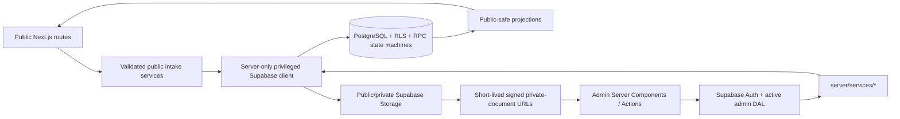
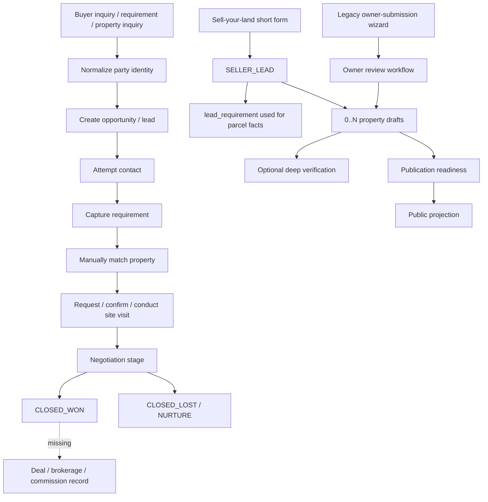
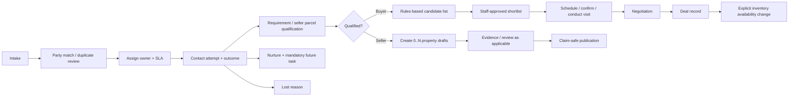

# UrbanEdge Real-Estate Admin / CRM — Deep Production Audit

**Audit date:** 26 September 2026  
**Repository:** `UrbanLand_website`  
**Target operating context:** Gujarat, India; approximately 5–20 internal users; up to approximately 20,000 properties and 100,000 leads  
**Decision standard:** safe, operationally complete, understandable, supportable and scalable—not merely buildable  
**Evidence labels:** **CONFIRMED**, **LIKELY**, **UNVERIFIED**, **RECOMMENDATION**

This is a technical and operational product audit, not legal advice. Gujarat and Indian legal conclusions must be approved by qualified counsel. URLs in the regulatory sections point to primary government sources wherever available.

## 1. Executive Summary

UrbanEdge is a substantial Next.js 16 / React 19 / Supabase real-estate platform with a public property website and a server-rendered admin application. It already contains unusually good foundations: server-only services, active-admin checks close to the data source, forced RLS, public-safe projections, private buckets, signed private-document access, structured property and verification models, consent-version records, optimistic concurrency for several high-risk workflows, and database-backed state machines for publication, site visits, owner submissions and lead stages.

It is not yet a production-ready real-estate CRM. The current implementation is best described as a secure and thoughtfully modelled application foundation whose daily sales operating model is incomplete. Critical operational lists use fixed caps without pagination; follow-ups can silently disappear behind completed history; roles exist but most business mutations only require “active admin”; seller intake has two competing pipelines; a local-time conversion is incorrect on UTC servers; staff assignment and next-action ownership are incomplete; and production monitoring, recovery and provider readiness have not been demonstrated.

The largest product-policy regression is deliberate: the latest migration removes the publication blocker for phrases such as “100% clear title,” while the service layer also strips that blocker and contains a direct-update fallback when the atomic publication RPC fails. That conflicts with the otherwise careful verification/disclaimer model and materially increases misleading-publication risk.

The codebase is healthy enough to improve in place. A rewrite would discard valuable domain and security work. The correct path is a short Phase 0 release hold, followed by focused CRM workflow and information-architecture work.

## 2. Production Readiness Verdict

**NOT READY FOR PRODUCTION**

Evidence for this verdict:

- **CONFIRMED:** publication can proceed with prohibited legal-guarantee language, and the application contains a fail-open direct-update path if the atomic publication RPC errors (PUB-001, PUB-002).
- **CONFIRMED:** actionable follow-ups and site visits can be omitted by hard result caps with no pagination (TASK-001, VISIT-001).
- **CONFIRMED:** six declared roles do not translate into mutation-level permissions across CRM, publication, verification, media or documents (RBAC-001).
- **CONFIRMED:** the public privacy notice version is explicitly named `PLACEHOLDER`, and the privacy page says final wording remains subject to legal approval (PRIV-001).
- **CONFIRMED:** seller next-action input is interpreted in the server timezone, unlike other India-time flows (TIME-001).
- **CONFIRMED:** the repository’s own deployment runbook remains a conditional hold and records unresolved production account, provider, DNS, legal, backup and device-validation work (OPS-001).
- **CONFIRMED:** current lint and format gates fail. Typecheck, boundary scan, secret scan, unit tests, component tests, build and dependency audit pass. The current database, integration and E2E suites could not be rerun because local Supabase did not start (TEST-001).
- **UNVERIFIED:** no staging or production environment, real backup restore, real malware scanning, alerting, field performance or mobile-device session was available for this audit.

There is no confirmed anonymous admin-data exposure in the inspected paths. The verdict is driven by workflow integrity, public-claim safety, privacy readiness and release evidence—not by an assumption that the whole system is insecure.

## 3. Top Production Blockers

| Priority | Blocker | Evidence | Release gate |
|---|---|---|---|
| 1 | Unsafe legal/title claims no longer block publication | `supabase/migrations/20260911020000_remove_prohibited_claims_blocker.sql:1-137`; `server/services/property-publication.ts:29-45,121-126` | Restore and test a fail-closed public-claim policy approved by counsel |
| 2 | Publication can bypass the atomic RPC after any RPC error | `server/services/property-publication.ts:53-118` | Delete fallback; publish only through one locked, audited transaction |
| 3 | Fixed limits can hide due work | `server/services/crm.ts:593-624`; `server/services/site-visits.ts:39-143` | Cursor pagination and server-side open/overdue queues; no silent truncation |
| 4 | Roles are labels more than permissions | `features/admin/domain/authorization.ts:1-6`; broad `requireActiveAdmin()` use | Enforce a permission matrix at service/RPC boundaries and test every role |
| 5 | Privacy notice is a placeholder; operational DPDP controls are absent | `features/intake/domain/contracts.ts:3`; public privacy/form copy | Counsel-approved notice plus retention, rights and breach procedures |
| 6 | Seller workflow stores India-local input incorrectly on UTC hosts | `app/(admin)/admin/(protected)/submissions/actions.ts:50-60` | Use the shared India-local conversion and add UTC-host tests |
| 7 | Production operating environment is not qualified | `docs/runbooks/m19-deployment-preparation.md:3-54` | Staging/prod provider, DNS, monitoring, scanner, backup and restore evidence |
| 8 | Current release branch does not pass its own QA command | `package.json` `qa`; current audit execution | Zero lint/format failures and current database/integration/E2E pass |

No P0 is assigned merely for incompleteness. All eight are P1 launch blockers; PUB-001 should be escalated to P0 if UrbanEdge intends to publish legal/title guarantees without mandatory professional approval.

## 4. Repository / Architecture Map

### Runtime and trust boundaries

**CONFIRMED architecture:** Next.js 16.3.4 App Router; React 19.2.8; TypeScript 6; Supabase Auth/PostgreSQL/Storage; Zod; Tailwind 4; Vitest; Playwright; pgTAP. Node is constrained to `>=22.12.0 <25`.

The inspected Next.js 16 guides explicitly require authorization close to data access and inside Server Actions/Route Handlers. UrbanEdge generally follows this through `server-only` services and `requireActiveAdmin()`; the protected layout is useful defense in depth but is not treated as the sole boundary.

### Route map

| Surface | Routes |
|---|---|
| Public catalogue | `/`, `/properties`, `/properties/[property-slug]`, `/search`, `/buy`, `/rent`, `/lease`, category and location landing pages |
| Public conversion | `/contact`, `/requirements`, `/site-visit`, `/sell-your-land`, thank-you routes |
| Public content/legal | `/guides...`, `/about`, `/privacy`, `/terms`, `/disclaimer` |
| Admin core | `/admin/dashboard`, `/admin/properties...`, `/admin/leads...` |
| Admin operations | `/admin/follow-ups`, `/admin/requirements...`, `/admin/site-visits...`, `/admin/submissions...` |
| Admin governance | `/admin/verification...`, `/admin/media`, `/admin/guides...`, `/admin/locations...`, `/admin/seo`, `/admin/settings/seo`, `/admin/settings/security` |
| Route handlers | private-document download, owner-submission document access, public intent, legacy seller submit |

### Data ownership map

| Owner | Canonical records | Notes |
|---|---|---|
| Identity/team | `auth.users`, `admin_profiles` | Six roles; no admin management workflow |
| People/demand | `parties`, `leads`, `lead_requirements`, `lead_activities`, `lead_follow_ups` | A party can hold several opportunities; duplicate resolution is incomplete |
| Supply | `owner_submissions`, `properties`, subtype/detail tables, `property_source_links` | Current seller leads and legacy submissions compete as entry points |
| Matching/visits | `lead_properties`, `site_visits`, `site_visit_events` | Match scoring is stored but not computed transparently |
| Files | `media_assets`, `private_documents`, `owner_submission_documents` | Public/private bucket separation is strong |
| Assurance | verification definition/result/evidence/exception/review/history tables | Detailed and extensible; not role-restricted enough |
| Publishing/content | public projections, `guides`, `seo_pages`, `seo_redirects`, locations | Publication and availability are correctly separate concepts |
| Governance | `audit_logs`, consent/idempotency/rate-limit/notification tables | No global audit viewer or operational privacy case model |

The schema is broad—more than 60 tables and 19 timestamped migration files. The checked-in operational documentation still refers to older migration counts in places; code and the actual migration directory are authoritative.

## 5. Current Business Workflow Map

Good state transitions exist, but the hand-offs are not one coherent operating loop. A sale can be marked won without a deal/commission record; a follow-up can be completed without a required next action; seller facts can live in either CRM demand records or owner-submission records; and staff cannot reliably see every due item once volumes exceed fixed caps.

## 6. CRM Pipeline Analysis

The lead stage enum and database gates are strong. Movement into contact, qualified, matched, nurture, won and lost states requires meaningful evidence such as an activity, requirement, active property match, future task or structured reason. This is superior to a free-form Kanban.

The pipeline is not yet a complete operating system. Assignment is implicit at creation, there is no reassignment workflow/history or unassigned queue for leads, priority/SLA is absent, and the close state has no commercial deal record. Stage views are duplicated in `/admin/leads?view=stages` and `/admin/leads/pipeline`.

### CRM-001 — Lead assignment and SLA are incomplete

- **Status:** **CONFIRMED**
- **Severity:** P1 High
- **Category:** CRM operations
- **Affected workflow:** intake → ownership → response → management
- **Evidence:** `supabase/migrations/20260905030000_m12_crm_core.sql:60-96` (`create_admin_lead`); `server/services/crm.ts:234-350` (`listLeads`); no lead reassignment mutation or team screen in `app/(admin)/admin/(protected)`.
- **Current behaviour:** admin-created leads are assigned to the creating admin; filters can query an assignee, but staff cannot reassign through a defined, audited workflow. There is no unassigned triage queue, assignment history, priority or response SLA.
- **Why it matters:** lead ownership is the central control for a multi-user sales team.
- **Real business impact:** enquiries can be orphaned, duplicated or handled by two people; managers cannot measure response accountability.
- **Recommended solution:** add atomic assign/unassign RPC with actor, old/new assignee and reason; unassigned queue; priority; first-response and next-action SLA timestamps; permission-gated bulk assignment.
- **Acceptance criteria:** every open lead has an explicit owner or appears in an unassigned queue; changes are audited; permissions are tested; dashboard reports SLA breaches; reassignment never loses history.
- **Estimated complexity:** M
- **Dependencies:** RBAC-001, target role matrix, notification provider.

### CRM-002 — Active leads can have no next action

- **Status:** **CONFIRMED**
- **Severity:** P1 High
- **Category:** Workflow integrity
- **Affected workflow:** follow-up completion and sales cadence
- **Evidence:** `supabase/migrations/20260905030000_m12_crm_core.sql:216-242` (`schedule_lead_follow_up`, `complete_lead_follow_up`); `app/(admin)/admin/(protected)/leads/[id]/page.tsx:537-571`.
- **Current behaviour:** completing a follow-up clears the lead’s next-follow-up timestamp; creating the next task is a separate optional action.
- **Why it matters:** a sales CRM should not let active opportunities fall out of the action queue silently.
- **Real business impact:** qualified leads can be forgotten immediately after a completed call.
- **Recommended solution:** on completion require one of: next task, terminal stage, nurture date, or explicit “no next action” reason with manager-visible exception.
- **Acceptance criteria:** no non-terminal lead can exit completion without a next-action disposition; invariant is enforced in one RPC and covered by pgTAP/E2E.
- **Estimated complexity:** M
- **Dependencies:** task ownership model; stage policy.

### CRM-003 — Duplicate handling is detection without resolution

- **Status:** **CONFIRMED**
- **Severity:** P2 Medium
- **Category:** Data quality
- **Affected workflow:** lead creation and customer history
- **Evidence:** `features/crm/domain/validation.ts:123-133`; `supabase/migrations/20260905030000_m12_crm_core.sql:60-96`.
- **Current behaviour:** phone/email are normalized and exact matches are detected; one party can correctly have multiple opportunities. If identity matching is ambiguous, a new party can be created. There is no merge/review workflow.
- **Why it matters:** exact normalization alone cannot resolve recycled phones, shared family numbers, changed emails or duplicate parties.
- **Real business impact:** fragmented history, double calling and misleading conversion reporting.
- **Recommended solution:** present candidate parties before creation, add a duplicate-review queue, controlled party merge with survivor selection and immutable merge audit.
- **Acceptance criteria:** staff can link a new opportunity to an existing party; ambiguous matches are reviewed; merge re-parents dependants transactionally; rollback/support procedure exists.
- **Estimated complexity:** L
- **Dependencies:** data stewardship permissions; merge policy.

## 7. Admin Information Architecture Review

Current primary navigation is Dashboard, Properties and Leads. “More” contains seller enquiries, guides/website and website settings. Follow-ups, requirements, site visits, verification and media have standalone routes but are omitted from the primary navigation; several also appear as embedded Leads views.

### IA-001 — Operational areas are hidden and duplicated

- **Status:** **CONFIRMED**
- **Severity:** P2 Medium
- **Category:** Information architecture
- **Affected workflow:** daily admin navigation
- **Evidence:** `components/admin/admin-navigation.tsx:6-16`; lead/follow-up/site-visit routes under `app/(admin)/admin/(protected)`.
- **Current behaviour:** tasks, visits, matching and verification exist in overlapping embedded and standalone screens with no single canonical hierarchy.
- **Why it matters:** staff form inconsistent mental models and managers cannot teach one operating sequence.
- **Real business impact:** slower onboarding, missed queues and duplicated maintenance.
- **Recommended solution:** canonical navigation: Dashboard; CRM (Leads, Pipeline, Tasks, Visits); Inventory (Properties, Seller Intake, Verification, Media); Content; Management. Keep deep links but redirect duplicate top-level views to one implementation.
- **Acceptance criteria:** each business queue has one canonical route, one label and one nav location; no data view differs because of route choice; role-based visibility matches server permissions.
- **Estimated complexity:** M
- **Dependencies:** RBAC-001; target screen architecture in section 31.

## 8. Dashboard Review

The current dashboard provides a compact overview and quick links. Its usefulness is constrained by the same bounded task list used elsewhere and by metrics that load all open records into application memory.

### DASH-001 — Dashboard is not a trustworthy action centre

- **Status:** **CONFIRMED**
- **Severity:** P1 High
- **Category:** Operations / performance
- **Affected workflow:** daily prioritization
- **Evidence:** `server/services/crm.ts:593-624,726-742`; `server/services/site-visits.ts:344-438`; admin dashboard component tests.
- **Current behaviour:** the dashboard derives task previews from a capped list and computes some open-task/visit metrics by loading records into Node and classifying them there.
- **Why it matters:** a dashboard must be both complete and cheap at real volume.
- **Real business impact:** missed overdue work and increasing latency/memory as the database grows.
- **Recommended solution:** database aggregate queries/views for counts; separately paginated “My overdue,” “Due today,” “Unassigned,” “Visits needing confirmation,” “Listings blocked” and “Privacy/security exceptions.”
- **Acceptance criteria:** counts match direct SQL on 100k synthetic leads; no metric query returns unbounded row bodies; every card links to the exact filtered queue.
- **Estimated complexity:** M
- **Dependencies:** TASK-001, VISIT-001, CRM-001.

## 9. Leads Module Deep Review

Strengths include normalized party identity, multiple opportunities per party, structured sources and requirements, stage gates, activities, follow-ups, matches and visit history. Weaknesses are fixed-page completeness, no assignment controls, no merge, no optimistic version on general lead edits, and an overlong single-page workspace.

### LEAD-001 — Lead and pipeline views silently stop at 100

- **Status:** **CONFIRMED**
- **Severity:** P1 High
- **Category:** Data completeness / scale
- **Affected workflow:** list, pipeline and management reporting
- **Evidence:** `server/services/crm.ts:234-350` (`listLeads`, `.limit(100)`); `/admin/leads` and `/admin/leads/pipeline` consume the same bounded result.
- **Current behaviour:** only 100 matching leads are returned, with no cursor/page metadata; stage columns are bucketed in memory from that partial set.
- **Why it matters:** a partial result is presented as the pipeline rather than as page 1.
- **Real business impact:** older or lower-sorted open opportunities disappear from staff and management views.
- **Recommended solution:** keyset pagination and server-side counts per stage; stable sort by business priority and ID; expose “showing X of Y.”
- **Acceptance criteria:** all filters paginate without duplicates/gaps; stage counts are independent of page; 100k-lead performance target is documented and tested.
- **Estimated complexity:** M
- **Dependencies:** indexes and representative performance dataset.

### LEAD-002 — Destructive copy contradicts recoverable storage

- **Status:** **CONFIRMED**
- **Severity:** P2 Medium
- **Category:** Destructive-action UX / auditability
- **Affected workflow:** lead and property removal
- **Evidence:** `components/admin/delete-lead-button.tsx:27-37`; `app/(admin)/admin/(protected)/leads/[id]/page.tsx:615-625`; `server/services/crm.ts:843-890`; `components/admin/delete-draft-button.tsx:34-37`; `server/services/property-drafts.ts:171-242`.
- **Current behaviour:** UI says “permanently delete” and “cannot be undone,” while services soft-delete/archive. Delete is prominent and audit insertion can fail after the record mutation.
- **Why it matters:** operators cannot predict retention/recovery behaviour, and the audit trail is not atomic.
- **Real business impact:** avoidable removals, support burden and incomplete forensic history.
- **Recommended solution:** call the operation Archive; move it to an overflow/settings area; require reason and appropriate permission; add a restore queue and transactional audit. Reserve hard deletion for a privacy/retention workflow.
- **Acceptance criteria:** copy matches semantics; reason is mandatory; restore is permissioned and tested; mutation and audit commit or roll back together.
- **Estimated complexity:** M
- **Dependencies:** RBAC-001, privacy erasure policy.

## 10. Requirements & Matching Review

Requirements are structured by transaction, category, location, budget and area. Multiple property matches per lead are supported. Matching itself is manual and its property choices are bounded reference data; the requirements queue is also partial.

### MATCH-001 — Matching is manual, partial and not explainable

- **Status:** **CONFIRMED**
- **Severity:** P1 High
- **Category:** CRM matching
- **Affected workflow:** qualified requirement → shortlist
- **Evidence:** `server/services/crm.ts:352-590`; `app/(admin)/admin/(protected)/leads/[id]/page.tsx:438-461`; `server/services/property-drafts.ts:729`; `server/services/crm.ts:626-700`.
- **Current behaviour:** staff select from bounded property reference data; `match_score` exists without a transparent scoring engine; requirements cap at 100 and unmatched counts scan relation data in application code.
- **Why it matters:** 20,000 properties cannot be searched reliably through a short select list.
- **Real business impact:** relevant stock is missed, irrelevant stock is sent, and matching quality cannot be explained to staff or customers.
- **Recommended solution:** server-side searchable inventory picker plus deterministic recommendation: hard filters for active/offering/category; normalized area/budget/location constraints; soft preference score; explicit mismatch reasons; manual override retained.
- **Acceptance criteria:** candidates are paginated; every recommendation shows reasons and variances; no unpublished/off-market record can be offered; tests cover unit conversions and boundary budgets.
- **Estimated complexity:** L
- **Dependencies:** area conversion governance, indexed search fields, canonical transaction vocabulary.

## 11. Follow-ups / Tasks Review

The split between immutable activity history and actionable follow-up records is correct. Rescheduling closes the old task and creates a new one, preserving history. The queue algorithm is unsafe at volume.

### TASK-001 — Completed history can hide current tasks

- **Status:** **CONFIRMED**
- **Severity:** P1 High
- **Category:** Queue completeness
- **Affected workflow:** follow-ups, dashboard, lead work
- **Evidence:** `server/services/crm.ts:593-624` (`listFollowUps` orders by `due_at` ascending and applies `.limit(200)` before UI filtering).
- **Current behaviour:** open and completed rows share the first 200 earliest due dates. Once enough old completed records exist, current and future open tasks can be absent.
- **Why it matters:** this is a silent omission, not a visible page boundary.
- **Real business impact:** missed calls and WhatsApp follow-ups directly reduce conversion and trust.
- **Recommended solution:** separate open queue and history queries; server-side status/due/assignee filters; keyset pagination; overdue-first index; archival/history pagination.
- **Acceptance criteria:** inserting more than 200 completed tasks never removes any open task from the open queue; total counts and truncation are explicit; dashboard uses the same complete open-query contract.
- **Estimated complexity:** M
- **Dependencies:** task assignment policy and indexes.

Call/WhatsApp buttons correctly do not claim communication success; staff record a structured activity manually. For Phase 1, preserve this honest manual model rather than pretending browser links confirm delivery. Provider integration can come later with delivery/webhook events.

## 12. Site Visits Review

The site-visit domain has an explicit state machine, optimistic `version`, event history, eligibility checks and India-time conversion. These are strong foundations.

### VISIT-001 — Visit queue silently truncates and filters after fetching

- **Status:** **CONFIRMED**
- **Severity:** P1 High
- **Category:** Queue completeness / scale
- **Affected workflow:** visit confirmation, attendance and follow-up
- **Evidence:** `server/services/site-visits.ts:39-143` (`.limit(200)`, application filtering, final `.slice(0,100)`); `app/(admin)/admin/(protected)/site-visits/page.tsx:47`.
- **Current behaviour:** only the 200 most recently updated visits are considered, then at most 100 matches are displayed. The page acknowledges “up to 100” but offers no next page.
- **Why it matters:** an operational visit can disappear solely due to unrelated recent records.
- **Real business impact:** unconfirmed appointments, no-shows without follow-up and poor customer experience.
- **Recommended solution:** SQL-side bucket/search/assignee/date filtering with keyset pagination and exact counts; add overlap warnings by assigned staff/property and a daily schedule view.
- **Acceptance criteria:** every actionable visit is reachable; no filtering occurs after a hidden hard cap; overlap tests cover India-time boundaries and concurrent edits.
- **Estimated complexity:** M
- **Dependencies:** indexes; staff assignment model.

### VISIT-002 — No scheduling conflict or multi-stop tour support

- **Status:** **CONFIRMED**
- **Severity:** P2 Medium
- **Category:** Field operations
- **Affected workflow:** scheduling
- **Evidence:** `features/site-visits/domain/workflow.ts:7-91`; site-visit schema and actions contain eligibility checks but no overlap constraint or itinerary entity.
- **Current behaviour:** staff can schedule overlapping visits for the same assignee/property; each visit is independent.
- **Why it matters:** a 5–20 person field team needs collision awareness before automation.
- **Real business impact:** double booking and inefficient travel.
- **Recommended solution:** warn on overlaps and travel buffers first; add optional tour/itinerary grouping only after usage validates the need.
- **Acceptance criteria:** confirmed/proposed overlaps are visible before save and require an explicit override reason; timezone behavior is tested.
- **Estimated complexity:** M
- **Dependencies:** reliable assignment and geocoding policy.

## 13. Seller / Owner Intake Review

The legacy owner-submission workflow is rich: idempotency, consent, documents, assignment, events, review stages and audited conversion. The current public seller page instead creates a compact `SELLER_LEAD`; the legacy submit endpoint and admin submissions workspace remain active.

### SELL-001 — Two seller pipelines and overloaded demand terminology

- **Status:** **CONFIRMED**
- **Severity:** P1 High
- **Category:** Domain ownership / intake
- **Affected workflow:** seller enquiry → property supply
- **Evidence:** `app/(public)/sell-your-land/page.tsx:21-73`; `components/public/seller-contact-form.tsx:153-164`; `app/(public)/sell-your-land/submit/route.ts`; `server/services/owner-submissions.ts`; `supabase/migrations/20260910010000_m20_simplify_publication_and_intake.sql:242-271`.
- **Current behaviour:** the visible form creates a `SELLER_LEAD`, maps “Sell my land” to transaction `BUY`, and writes parcel facts into `lead_requirements`; the richer owner-submission pipeline is still callable and separately administered.
- **Why it matters:** supply facts, seller intent and buyer demand are different concepts even if their market transaction pairs are related.
- **Real business impact:** inconsistent reporting, duplicate processing and confused staff labels.
- **Recommended solution:** choose one public seller intake. Model disposition intent (`SELL`, `RENT_OUT`, `LEASE_OUT`) separately from buyer demand and property offering. Preserve a short first step, then progressive enrichment; link one seller intake to 0..N property drafts.
- **Acceptance criteria:** one canonical endpoint and queue; no seller parcel facts are stored as buyer demand; migrated/legacy records remain traceable; UI labels are perspective-correct.
- **Estimated complexity:** L
- **Dependencies:** migration/data mapping, analytics taxonomy, copy approval.

### TIME-001 — Owner next-action time is server-time dependent

- **Status:** **CONFIRMED**
- **Severity:** P1 High
- **Category:** Date/time correctness
- **Affected workflow:** owner submission follow-up
- **Evidence:** `app/(admin)/admin/(protected)/submissions/actions.ts:50-60`; compare `features/site-visits/domain/workflow.ts:49-53` and `app/(admin)/admin/(protected)/leads/actions.ts:132-146`.
- **Current behaviour:** a `datetime-local` value is passed to `new Date(value).toISOString()`. On a UTC production host, `10:00` entered as India time is stored as `10:00Z`, 5.5 hours late.
- **Why it matters:** local business dates must not depend on host configuration.
- **Real business impact:** callbacks occur at the wrong time and SLA reporting is inaccurate.
- **Recommended solution:** one shared `indiaLocalDateTimeToUtc` parser; reject ambiguous/invalid input; render all operational timestamps explicitly in `Asia/Kolkata`.
- **Acceptance criteria:** tests run with `TZ=UTC` and show `10:00 IST → 04:30Z`; list filters use India-day boundaries; all UI formatters declare the timezone.
- **Estimated complexity:** S
- **Dependencies:** none.

## 14. Property Inventory Review

Publication status and market availability are correctly independent. Public projections are narrow, archive requires off-market semantics, restore returns to a private draft, and sold/rented/leased listings can remain public with accurate state. Property lists have real pagination.

Weaknesses are destructive copy, later relaxation of category completeness, and lack of a commercial close/deal link. Preserve the separate publication/availability model.

## 15. Property Verification Review

Verification is one of the strongest areas: configurable checks, applicability, evidence, provenance, professional review, exceptions, public-copy policy and history are separated. Deep verification being optional for marketing can be defensible only if public copy never implies legal verification and the record clearly communicates limitations.

### VERIFY-001 — Verification queue is unbounded and authorization is too broad

- **Status:** **CONFIRMED**
- **Severity:** P1 High
- **Category:** Verification operations / authorization
- **Affected workflow:** verification queue and decisions
- **Evidence:** `server/services/verifications.ts:30-65,104-145`; active-admin authorization pattern; no verifier-only mutation policy.
- **Current behaviour:** queue construction loads all live properties and verification rows into application memory. Any active admin can reach most verification mutations; repeated nested lookups add avoidable queries.
- **Why it matters:** evidence decisions are higher risk than general CRM edits and the queue must scale with inventory.
- **Real business impact:** slow pages, accidental approval and weak segregation of duties.
- **Recommended solution:** paginated SQL view/materialized aggregate; permission `verification.review`; optional four-eyes approval for public claims; batch verification IDs once.
- **Acceptance criteria:** 20k-property queue meets agreed latency; sales roles cannot approve evidence; approval/exception tests assert actor permissions and history.
- **Estimated complexity:** M
- **Dependencies:** RBAC-001; claim policy.

## 16. Media / Documents Review

**CONFIRMED strengths:** JPEG/PNG/PDF signature validation; image decode and pixel caps; WebP normalization and metadata stripping; no SVG; streamed size ceiling; deterministic server paths; private buckets; CLEAN-only signed URLs; production scanner fail-closed to inaccessible `PENDING`; and document-access audit.

### MEDIA-001 — Production scanner/reprocessing and media scale are not operationally proven

- **Status:** **CONFIRMED** for code path; **UNVERIFIED** for production provider
- **Severity:** P1 High
- **Category:** File security / operations
- **Affected workflow:** private uploads, media library
- **Evidence:** `server/storage/document-validation.ts:27-118`; `server/services/property-media.ts:585-598,720-769`; `docs/runbooks/m19-deployment-preparation.md`.
- **Current behaviour:** production without a scanner leaves private files pending and inaccessible, which is safe; however no background rescan/retry queue was found. The admin media list is unbounded and private previews can generate many signed-URL calls.
- **Why it matters:** a fail-closed upload still needs an operating path from pending to clean or rejected.
- **Real business impact:** documents can remain unusable indefinitely; media screens slow as assets grow.
- **Recommended solution:** provision scanner before launch; durable scan job/retry/dead-letter state and admin exception queue; paginate media; create signed URLs on demand.
- **Acceptance criteria:** real EICAR-like safe test fixture is rejected by the configured scanner; timeout/retry/recovery is demonstrated; pending age is monitored; 20k media rows paginate.
- **Estimated complexity:** M
- **Dependencies:** scanner provider, job runner, alerting.

## 17. Publishing / SEO Review

SEO foundations are good: canonical public projections, metadata routes, sitemap/robots controls, location/guide content and a redirect registry that avoids chains. Production indexing is tied to explicit environment configuration.

### PUB-001 — Unsafe title/legal guarantees are publishable

- **Status:** **CONFIRMED**
- **Severity:** P1 High
- **Category:** Publication integrity / regulatory risk
- **Affected workflow:** property readiness → public listing
- **Evidence:** `supabase/migrations/20260911020000_remove_prohibited_claims_blocker.sql:1-137`; `server/services/property-publication.ts:29-45,120-126`; `supabase/tests/016_m20_admin_simplification.test.sql:128-135` explicitly expects “100% clear title” not to block.
- **Current behaviour:** database readiness no longer creates `UNSAFE_PUBLIC_CLAIM`; the service also strips that blocker for compatibility. Phrases such as “100% clear title,” “government approved” or “fully verified” can pass if other marketing fields are complete.
- **Why it matters:** the verification model itself recognizes that legal/title/approval claims require careful evidence and limitations.
- **Real business impact:** misleading advertising, customer disputes, GujRERA/unfair-trade exposure where applicable, and reputational damage.
- **Recommended solution:** reinstate a centrally versioned claim policy. Block absolute guarantees; allow narrowly templated factual statements only when linked to approved evidence/professional review and limitation copy. Counsel approves vocabulary.
- **Acceptance criteria:** prohibited phrases fail at DB and service boundaries; approved templates require evidence; tests cover obfuscation/case/spacing; public pages never infer title certification from internal verification.
- **Estimated complexity:** M
- **Dependencies:** legal counsel, verification public-copy policy.

### PUB-002 — Publication fails open when its atomic RPC fails

- **Status:** **CONFIRMED**
- **Severity:** P1 High
- **Category:** Transaction integrity / exceptional conditions
- **Affected workflow:** publish
- **Evidence:** `server/services/property-publication.ts:53-118` (`publishPropertyWithClient`).
- **Current behaviour:** on any `publish_property` RPC error, the service recomputes readiness and may directly update `properties` to PUBLISHED, then separately attempts an audit insert. The update predicate does not include `expectedUpdatedAt`, so its pre-check has a race window.
- **Why it matters:** the fallback bypasses the one locked transaction intended to enforce readiness, concurrency and audit integrity. OWASP Top 10:2025 A10 specifically treats fail-open exceptional handling as a security/design risk.
- **Real business impact:** inconsistent public state, publication during a migration/RPC fault, and incomplete audit.
- **Recommended solution:** remove the fallback. The only publish path is a versioned RPC that locks, validates, transitions and audits atomically; known errors map to user-safe messages; unknown errors stop publication and alert operations.
- **Acceptance criteria:** RPC errors never alter publication state; concurrent publish/edit test has exactly one valid outcome; audit and state are one transaction; alert contains correlation ID without PII.
- **Estimated complexity:** S
- **Dependencies:** none; do before all other publication work.

## 18. Team / RBAC Review

### RBAC-001 — Declared roles are not enforced as business permissions

- **Status:** **CONFIRMED**
- **Severity:** P1 High
- **Category:** Authorization
- **Affected workflow:** all admin reads/mutations
- **Evidence:** `features/admin/domain/authorization.ts:1-6`; `server/auth/authorization.ts:13-48`; `server/services/security-health.ts:14-18`; other services predominantly call only `requireActiveAdmin()`; nav hiding in `components/admin/admin-shell.tsx:47-54`.
- **Current behaviour:** roles are `SUPER_ADMIN`, `ADMIN`, `EDITOR`, `SALES`, `VERIFIER`, `CONTENT_EDITOR`; only security health visibly requires admin-level roles. Hiding navigation does not prevent direct Server Action/service access.
- **Why it matters:** Next.js 16 treats every Server Action/Route Handler as a public entry point and requires authorization inside the action/data layer.
- **Real business impact:** a sales user can potentially publish, alter verification or access documents beyond job need; accountability is weak.
- **Recommended solution:** permission capabilities (`lead.read`, `lead.assign`, `property.publish`, `verification.approve`, `document.read`, `team.manage`, etc.) resolved server-side; enforce in services and RPCs; UI derives from the same matrix.
- **Acceptance criteria:** actor/permission/resource tests cover all roles and high-risk actions; direct action invocation is denied; role changes/revocation take effect promptly; default deny for new actions.
- **Estimated complexity:** L
- **Dependencies:** owner-approved responsibility matrix.

### RBAC-002 — No team lifecycle or session-control workspace

- **Status:** **CONFIRMED**
- **Severity:** P1 High
- **Category:** Identity operations
- **Affected workflow:** staff onboarding/offboarding
- **Evidence:** no team/users route; `admin_profiles` supports active state, but no product workflow for invite, role change, disable, MFA enforcement or session revocation.
- **Current behaviour:** staff lifecycle depends on out-of-band Supabase administration.
- **Why it matters:** production access must be operable by the business without ad hoc database/provider work.
- **Real business impact:** delayed offboarding and privilege drift.
- **Recommended solution:** restricted Management → Team screen or a documented provider-admin process for Phase 0; require MFA for privileged roles; record role/status changes; revoke sessions on disable.
- **Acceptance criteria:** joiner/mover/leaver drill completes from documented tools; disabled user loses access; two administrators exist; break-glass process is tested.
- **Estimated complexity:** M
- **Dependencies:** RBAC-001, Supabase Auth capabilities.

## 19. UX/UI Design-System Audit

The public navy/gold brand and the green/slate operational admin can legitimately differ. The problem is not color difference; it is inconsistent hierarchy across a 2,500+ line global stylesheet, public typography reused in dense admin work and page-specific composition.

### UX-001 — Admin lacks a compact, explicit operational design system

- **Status:** **CONFIRMED**
- **Severity:** P2 Medium
- **Category:** UX / design system
- **Affected workflow:** all admin screens
- **Evidence:** `app/globals.css`; mixed `font-display`, global component overrides and utility composition across admin pages.
- **Current behaviour:** components are individually usable but density, action placement, headings, status colors and empty/error states vary.
- **Why it matters:** professional CRM speed comes from predictable hierarchy more than decoration.
- **Real business impact:** scanning and training take longer; risky actions compete with routine work.
- **Recommended solution:** admin-only tokens and primitives: 8px spacing scale, system/sans typography, standard page header, filter bar, data table, status chip, timeline, sticky action rail, empty/error/loading states, confirmation dialog and overflow menu.
- **Acceptance criteria:** major screens use the same primitives; destructive red is reserved for destructive actions; 200% zoom and keyboard focus remain usable; no public-brand regressions.
- **Estimated complexity:** L
- **Dependencies:** IA-001 and screen architecture.

## 20. Mobile / Responsive Review

**CONFIRMED:** a mobile `
` navigation and horizontally scrollable tables exist. **UNVERIFIED:** no visual/device session was completed at 360, 390, 768, 1024, 1366 and 1440 pixels against a working database. The current Playwright configuration runs only desktop Chromium.

### RESP-001 — Responsive and cross-browser release evidence is incomplete

- **Status:** **UNVERIFIED**
- **Severity:** P1 High
- **Category:** Responsive QA / accessibility
- **Affected workflow:** all public and admin journeys
- **Evidence:** `playwright.config.ts` has only a Chromium project; deployment runbook leaves physical-device validation open.
- **Current behaviour:** component CSS suggests basic adaptability, but dense workspaces, dialogs, tables, sticky controls, keyboard order and WebKit behavior lack current release proof.
- **Why it matters:** admin users commonly operate from phones during visits and WhatsApp/call follow-up.
- **Real business impact:** conversion-critical actions may be unusable in the field.
- **Recommended solution:** add Chromium desktop, WebKit desktop, 390px mobile and 768px tablet projects; visual/manual matrix; test zoom, keyboard, screen reader landmarks and touch targets.
- **Acceptance criteria:** specified widths pass critical journeys with no clipped primary action, inaccessible overflow or horizontal page scroll; WebKit and real Android/iOS smoke tests are signed off.
- **Estimated complexity:** M
- **Dependencies:** stable staging data/environment.

## 21. Data Model & Integrity Review

The relational model is sophisticated and mostly normalized. Strong points include constrained enums, foreign keys, RLS, immutable references, separate source links, structured price modes, separate publication/availability and several locked/versioned RPCs.

### DATA-001 — Lead edits lack the concurrency standard used elsewhere

- **Status:** **CONFIRMED**
- **Severity:** P2 Medium
- **Category:** Concurrency / integrity
- **Affected workflow:** lead edit and related actions
- **Evidence:** property, site-visit and owner-submission services pass expected timestamps/versions; general CRM updates in `server/services/crm.ts` and M12 RPC signatures do not consistently require one.
- **Current behaviour:** concurrent staff edits can overwrite newer lead fields; stage transitions lock rows, but ordinary edits do not share that protection.
- **Why it matters:** multi-user CRM work makes stale forms normal.
- **Real business impact:** notes, requirement or ownership information can be lost without warning.
- **Recommended solution:** add monotonically increasing lead version and expected-version checks to mutations; merge independent timeline events rather than overwriting.
- **Acceptance criteria:** stale edit returns conflict with reload/compare UI; two-user integration test proves no silent lost update.
- **Estimated complexity:** M
- **Dependencies:** CRM service contract changes.

### DATA-002 — Local units require jurisdiction-governed conversion

- **Status:** **CONFIRMED** schema capability; **UNVERIFIED** business rules
- **Severity:** P2 Medium
- **Category:** Measurement correctness
- **Affected workflow:** requirements, property facts, matching
- **Evidence:** `area_units` and `area_conversion_rules` schema; property fallbacks include bigha/vigha while CRM fallback sets differ.
- **Current behaviour:** the model can store conversion rules by jurisdiction, but no approved operational rule set was demonstrated.
- **Why it matters:** bigha/vigha can vary by locality; treating either as a universal constant corrupts matches and pricing.
- **Real business impact:** incorrect area, per-unit price and buyer shortlists.
- **Recommended solution:** preserve declared value/unit; normalize only with an active, versioned jurisdiction rule and show conversion provenance; otherwise mark normalized area unavailable.
- **Acceptance criteria:** no universal local-unit conversion; rule version/jurisdiction is auditable; matching tests cover boundaries and unknown rules.
- **Estimated complexity:** M
- **Dependencies:** domain expert-approved conversion data.

## 22. Security Audit

### Confirmed controls

- Supabase `getUser()` plus active `admin_profiles` check at service boundaries.
- Private-document route performs authenticated object lookup, clean-status and bucket checks, then issues a short signed URL and records access.
- Forced RLS and restricted browser grants; privileged client is server-only.
- Origin/Fetch Metadata, Turnstile, HMAC rate/replay controls for public mutations outside local/test.
- Security headers/CSP, secret scans across current files/history/client output, bounded validation and file inspection.
- Current `npm audit --audit-level=high`: zero known vulnerabilities.

The inspected actions without visible page-level guards delegate to services that call `requireActiveAdmin()`; they are not reported as vulnerabilities. This aligns with Next.js 16 guidance to authorize close to data access.

### SEC-001 — Security status can report an outdated qualification point

- **Status:** **CONFIRMED**
- **Severity:** P2 Medium
- **Category:** Security operations / release integrity
- **Affected workflow:** Security & Audit health page
- **Evidence:** `server/services/security-health.ts:12-45` hard-codes `20260910010000_m20_simplify_publication_and_intake`; a later `20260911020000_remove_prohibited_claims_blocker.sql` exists.
- **Current behaviour:** the health snapshot reports a hard-coded audited migration rather than the deployed database migration set, and its name predates the latest policy-changing migration.
- **Why it matters:** operators can see a reassuring status that does not prove deployed schema identity or qualification.
- **Real business impact:** release drift goes unnoticed.
- **Recommended solution:** record application release SHA and expected migration head; query a controlled migration manifest/health RPC; fail readiness on mismatch.
- **Acceptance criteria:** health displays deployed app SHA, DB head and provider checks; mismatch is red and alerts; no hard-coded stale marker.
- **Estimated complexity:** S
- **Dependencies:** deployment metadata strategy.

### Security baseline conclusion

Against OWASP Top 10:2025, the strongest areas are access-control layering, injection resistance through typed clients/RPCs, private-data projection and upload validation. The largest gaps are A01 authorization granularity, A09 monitoring/alerting and A10 fail-open publication. A full ASVS 5.0 control-by-control assessment and external penetration test remain **UNVERIFIED** and are release acceptance work, not claims made by this audit.

## 23. Privacy / DPDP Review

The DPDP Act and final DPDP Rules were notified with phased commencement on 13 November 2025. As of this audit, the consent-manager provision enters force on 13 November 2026, while the principal notice/consent, fiduciary obligations, rights, safeguards and breach provisions identified in the commencement notification enter force eighteen months after notification (13 May 2027). This transition is preparation time, not a reason to ship placeholder notices. See the official [MeitY commencement notification G.S.R. 843(E)](https://www.meity.gov.in/static/uploads/2025/11/c56ceae6c383460ca69577428d36828b.pdf), [final Rules G.S.R. 846(E)](https://www.meity.gov.in/static/uploads/2025/11/53450e6e5dc0bfa85ebd78686cadad39.pdf), and [DPDP Act, 2023](https://www.meity.gov.in/static/uploads/2024/02/Digital-Personal-Data-Protection-Act-2023.pdf).

### PRIV-001 — Consent evidence points to placeholder legal copy

- **Status:** **CONFIRMED**
- **Severity:** P1 High
- **Category:** Privacy / consent
- **Affected workflow:** every public intake
- **Evidence:** `features/intake/domain/contracts.ts:3`; M13/M20 migrations enforce `M13-CONTACT-PLACEHOLDER-2026-09-05`; `app/(public)/privacy/page.tsx` and form copy state final wording is subject to legal approval.
- **Current behaviour:** consent, version and purpose context are recorded—good evidence mechanics—but the only accepted version identifies itself as a placeholder.
- **Why it matters:** versioning proves which notice was shown; it does not make draft wording adequate.
- **Real business impact:** invalid/unclear customer expectations and costly re-consent/remediation.
- **Recommended solution:** counsel-approved layered privacy notice and per-purpose consent/legitimate-use mapping; immutable version registry with effective dates; map each form to purpose, recipients, retention and rights channel.
- **Acceptance criteria:** no placeholder identifier/copy in production; rendered notice hash/version is stored; withdrawal/contact path works; translations are version-linked if offered.
- **Estimated complexity:** M
- **Dependencies:** counsel, data inventory, processor list.

### PRIV-002 — Privacy lifecycle is not operationalized

- **Status:** **CONFIRMED** absence in repository; production process **UNVERIFIED**
- **Severity:** P1 High
- **Category:** Privacy operations
- **Affected workflow:** retention, access/correction/erasure/grievance, breach response
- **Evidence:** no privacy-request case model, retention job, legal-hold marker, processor register or breach runbook found; privacy page flags unfinished retention/rights wording.
- **Current behaviour:** data is collected with consent evidence, but there is no demonstrated lifecycle from request intake to identity verification, export/correction/erasure, exception, closure and audit.
- **Why it matters:** DPDP readiness is an operating process across data stores and processors, not only a checkbox.
- **Real business impact:** inability to respond consistently, excessive retention and delayed breach communication.
- **Recommended solution:** data inventory; retention schedule by record class; rights/grievance case workflow; legal hold; deletion/anonymization jobs; processor/DPA register; breach triage and notification playbook.
- **Acceptance criteria:** tabletop tests for access, correction, withdrawal/erasure and breach; each completes within counsel-set SLA across DB/storage/notifications/backups; exceptions are reasoned and audited.
- **Estimated complexity:** L
- **Dependencies:** counsel, operations owner, backup design, processor contracts.

## 24. Gujarat Real-Estate / Regulatory Operational Review

### Legal boundary

RERA registration is not a universal label for every land listing. Section 3 of the central Act applies project registration to advertising/marketing/sale invitation for plots, apartments or buildings in a real-estate project in a planning area, subject to stated exemptions. Sections 9–10 govern agents facilitating sales in registered projects and prohibit false/misleading representations and unregistered-project facilitation. See the official [Real Estate (Regulation and Development) Act, 2016](https://www.indiacode.nic.in/bitstream/123456789/15131/1/the_real_estate_%28regulation_and_development%29_act%2C_2016.pdf) and [GujRERA portal](https://gujrera.gujarat.gov.in/).

The product must therefore classify applicability instead of marking every standalone land parcel “RERA approved” or assuming RERA is irrelevant. The Gujarat Revenue Department exposes official services for rural records of right/7/12, property cards, document registration/Jantri and revenue applications, including non-agricultural permission services. These are evidence sources—not automatic proof of clean title. See the official [Revenue Department online services](https://revenuedepartment.gujarat.gov.in/iora-service).

### REG-001 — RERA/applicability and claim provenance are not first-class publication controls

- **Status:** **LIKELY** product gap; exact legal applicability is case-specific
- **Severity:** P1 High
- **Category:** Regulatory operations
- **Affected workflow:** property intake, verification and publication
- **Evidence:** extensive planning/verification schema exists, but no mandatory `RERA applicability → basis → registration number/status/last checked` publication decision was found; PUB-001 allows absolute claims.
- **Current behaviour:** staff can record evidence and planning context, but the listing gate does not force a legally reviewed applicability classification or source/date for regulated claims.
- **Why it matters:** “registered,” “approved,” “NA,” “clear title,” “encumbrance-free” and similar statements have different sources and legal meanings.
- **Real business impact:** misleading listings and inability to demonstrate the basis for claims.
- **Recommended solution:** counsel-approved claim catalogue and applicability workflow: `APPLICABLE`, `NOT_APPLICABLE`, `EXEMPT`, `UNKNOWN`; source authority, identifier, fetched/verified date, reviewer, expiry and public limitation template. Never infer title from 7/12/property-card entries alone.
- **Acceptance criteria:** applicable project/agent claims require current GujRERA evidence; unknown blocks the relevant claim; every published regulated statement has provenance and limitation copy.
- **Estimated complexity:** M
- **Dependencies:** Gujarat counsel, GujRERA operating policy, PUB-001.

### Product best-practice checklist, not a legal conclusion

- Keep declared ownership/source facts separate from verified facts.
- Track rural 7/12/record-of-right, mutation entries, property card, registered instrument, encumbrance search, NA permission, planning authority/DP/TP/GIDC context, access and measurement as distinct checks.
- Store issuing authority, document date, retrieval date, parcel identifiers and reviewer; do not reduce them to one “verified” badge.
- Require professional/legal review for title opinions and clearly state scope and limitations.
- Recheck time-sensitive sources before transaction/booking and after material changes.

## 25. Performance / Scalability Review

Property catalogue pagination and most batched relation queries are good. The principal risk is repeated fixed-limit or unbounded server fetch followed by JavaScript filtering/aggregation.

### PERF-001 — Multiple operational modules cannot scale to target volume

- **Status:** **CONFIRMED**
- **Severity:** P1 High
- **Category:** Performance / completeness
- **Affected workflow:** leads, requirements, visits, owner submissions, verification, media and dashboard
- **Evidence:** `server/services/crm.ts:234-350,593-742`; `server/services/site-visits.ts:39-143,344-438`; `server/services/owner-submissions.ts:292-385`; `server/services/verifications.ts:30-65`; `server/services/property-media.ts:585-598`.
- **Current behaviour:** limits of 100/200 hide later rows in some modules; others load entire tables; several filters/counts run in Node.
- **Why it matters:** target volume is two orders of magnitude beyond these implicit page sizes.
- **Real business impact:** slow requests, high memory, incomplete queues and inconsistent reports.
- **Recommended solution:** common keyset pagination contract; SQL-side filters/counts; stable composite indexes; query budgets; representative 20k/100k dataset and explain plans.
- **Acceptance criteria:** no list returns unbounded rows; every cap has page/cursor/total semantics; p95 targets are agreed and met in staging; queue completeness invariants are tested.
- **Estimated complexity:** L
- **Dependencies:** per-module query redesign and staging load data.

## 26. Error Handling / Observability Review

The app has local error boundaries and user-facing action errors. It lacks evidence of centralized structured logs, exception tracking, uptime checks, trace/correlation IDs, queue alerts or on-call procedures.

### OBS-001 — Production faults will not be detected or investigated reliably

- **Status:** **CONFIRMED** repository gap; external monitoring **UNVERIFIED**
- **Severity:** P1 High
- **Category:** Observability / incident response
- **Affected workflow:** whole service
- **Evidence:** console logging/warnings in services; no monitoring provider/instrumentation or alert runbook found; audit writes can warn and continue.
- **Current behaviour:** failures depend on user reports or provider consoles; no demonstrated alert for auth spikes, publication failure, old pending scans, notification failure, backup failure or elevated 5xx.
- **Why it matters:** OWASP A09 emphasizes that logs without monitoring and alerting do not enable response.
- **Real business impact:** long outages, silent missed leads and weak forensics.
- **Recommended solution:** structured redacted logs, release/request correlation, error tracking, uptime/synthetic checks, business-queue alerts, dashboards and severity/on-call runbook.
- **Acceptance criteria:** staged failures trigger actionable alerts; PII is excluded; operator can trace a public intake through notification/audit; retention/access for logs is documented.
- **Estimated complexity:** M
- **Dependencies:** hosting/monitoring provider and privacy log policy.

### AUDIT-001 — High-value mutations and audit records are not always atomic

- **Status:** **CONFIRMED**
- **Severity:** P1 High
- **Category:** Auditability
- **Affected workflow:** publish, lead/property archive and other service-level mutations
- **Evidence:** `server/services/property-publication.ts:80-109`; `server/services/crm.ts:859-889`; `server/services/property-drafts.ts:207-242`.
- **Current behaviour:** state changes and `audit_logs` inserts can be separate requests; some audit failures only log a warning. No global audit-log explorer exists.
- **Why it matters:** the most consequential actions need immutable, complete provenance.
- **Real business impact:** investigators cannot prove who changed what, and managers cannot review sensitive actions.
- **Recommended solution:** move high-value mutations and audit insertion into one RPC transaction; add permissioned audit explorer with actor/entity/action/date filters and export controls.
- **Acceptance criteria:** forced audit failure rolls back the state change; audit table is append-only; access/export is logged; before/after and reason are present for high-risk events.
- **Estimated complexity:** M
- **Dependencies:** RBAC-001; RPC migration.

## 27. Testing Review

### Current execution on 26 September 2026

| Check | Result | Notes |
|---|---|---|
| ESLint | **FAIL** | One warning treated as failure: unused `deletePropertyDraft` import in `properties/actions.ts:21` |
| Prettier check | **FAIL** | Six files reported unformatted |
| TypeScript | PASS | `tsc --noEmit` |
| Server-boundary scan | PASS | 23 client entries checked |
| Secret scan | PASS | 434 current files plus reachable Git history |
| Unit tests | PASS | 29 files, 197 tests |
| Component tests | PASS | 19 files, 83 tests |
| Production build | PASS | Required network access for Google Fonts; route build and postbuild secret scan passed |
| Dependency audit | PASS | Zero vulnerabilities at high threshold |
| pgTAP / integration / E2E | **UNVERIFIED CURRENTLY** | `supabase status` exited 137; no current local DB run |

Historical repository evidence says 16 pgTAP files / 619 assertions and broad integration/E2E suites passed before the latest state. This is useful history, not current proof. The latest migration deliberately changes claim behavior and must be covered in the current release run.

### TEST-001 — Release qualification is incomplete and not cross-browser

- **Status:** **CONFIRMED**
- **Severity:** P1 High
- **Category:** Quality assurance
- **Affected workflow:** release
- **Evidence:** current commands above; `.github/workflows/ci.yml`; `playwright.config.ts`; 16 SQL test files and desktop-Chromium-only project.
- **Current behaviour:** strong test breadth exists, but current lint/format fail; database-dependent tests were not rerun; E2E uses dev server and one browser/desktop profile.
- **Why it matters:** build success cannot validate RLS, RPC atomicity, migration behavior, browser layout or production runtime.
- **Real business impact:** release regressions in the highest-risk database workflows can escape.
- **Recommended solution:** repair QA gates; run clean DB reset + pgTAP + integration + E2E from migration zero; production-build E2E where practical; add WebKit/mobile; require Phase 0 workflows in CI.
- **Acceptance criteria:** clean CI commit passes all gates; test artifact identifies migration head and release SHA; critical path matrix covers login, role denial, lead/task/match/visit, seller conversion, upload/scan, verify, publish/unpublish/archive and privacy request.
- **Estimated complexity:** M
- **Dependencies:** stable Supabase CI/runtime and staging fixtures.

## 28. DevOps / Production Operations Review

CI is stronger than average and environment validation fails closed for unsafe production origins and incomplete provider pairs. The deployment runbook honestly records unresolved external work. No repository deployment descriptor, monitoring setup, scheduled jobs or proven off-platform backup destination was found.

### OPS-001 — Production environment and recovery are not qualified

- **Status:** **CONFIRMED** runbook hold; actual provider state **UNVERIFIED**
- **Severity:** P1 High
- **Category:** DevOps / continuity
- **Affected workflow:** deployment, rollback, recovery
- **Evidence:** `docs/runbooks/m19-deployment-preparation.md:3-54`; no completed production evidence bundle.
- **Current behaviour:** local/CI quality controls exist, but staging/prod accounts, canonical DNS, provider credentials, email/scanner/maps, legal content, physical-device validation, backup schedule and restore proof remain open or unavailable.
- **Why it matters:** production readiness includes the operating environment and recovery, not only source code.
- **Real business impact:** failed intake notifications, inaccessible documents, accidental indexing, data loss or slow rollback.
- **Recommended solution:** immutable release checklist and evidence pack: infrastructure owner, environment inventory, least-privilege secrets, migration rehearsal, backup/restore drill, rollback, monitoring, synthetic intake and provider failover expectations.
- **Acceptance criteria:** staging mirrors production controls; RPO/RTO are approved and restore is timed; deploy/rollback is rehearsed; provider/DNS/security checks are green; named operator signs the release.
- **Estimated complexity:** L
- **Dependencies:** hosting/Supabase/provider accounts and owners.

## 29. Missing Feature Analysis

### Must exist before launch

- Permission enforcement and staff lifecycle (RBAC-001/002).
- Complete task/visit/lead queues and next-action invariant.
- One seller intake and correct India-time handling.
- Privacy notice, retention/rights/breach operations.
- Monitoring, scanner operations, backups and current release qualification.
- Claim-safe, atomic publishing.

### Phase 1 operational foundation

- Audited lead assignment/unassigned queue, priority and SLA.
- Searchable/explainable property matching.
- Controlled duplicate-party review/merge.
- Deal/close record with accepted property, commercial value, brokerage basis/status, owner, milestones and documents.
- Global audit explorer and restore/archive queues.

### Phase 2 professional UX

- Canonical navigation, compact admin design system, tabbed lead/property workspaces, saved filters, cross-browser/mobile refinement.
- Calendar/day schedule and overlap warning.
- Manager views for funnel, ageing, response SLA and source quality.

### Phase 3—only after real usage

- WhatsApp provider integration with templates/consent/delivery webhooks.
- Automated lead routing and reminders.
- Route optimization/multi-stop tours.
- Advanced recommendation ranking.

### DEAL-001 — Closed-won has no commercial close record

- **Status:** **CONFIRMED**
- **Severity:** P2 Medium
- **Category:** Commercial operations
- **Affected workflow:** negotiation → close → brokerage
- **Evidence:** lead stages and matches exist; no deal/offer/brokerage/commission entity or route was found.
- **Current behaviour:** `CLOSED_WON` requires an active property relation and reason, but does not capture the transaction, counterparties, agreed value, brokerage, payment status or milestones.
- **Why it matters:** a CRM should distinguish sales progress from the commercial record that follows acceptance.
- **Real business impact:** revenue and completion tracking moves to spreadsheets/messages.
- **Recommended solution:** a deliberately small Deal entity created from won lead + property; do not build accounting. Track status, amount, brokerage basis/amount/status, expected/actual close, owner and documents.
- **Acceptance criteria:** closing won creates/links exactly one deal or records an approved exception; property availability change remains explicit; management can report pipeline value and outstanding brokerage.
- **Estimated complexity:** L
- **Dependencies:** finance/business policy, RBAC and audit.

## 30. Recommended Target CRM Flow

Operating rules:

1. Every non-terminal opportunity has an owner and next-action disposition.
2. Party identity, opportunity, buyer requirement, seller intake, property and deal remain separate entities.
3. Automation recommends; staff approves. Every match explains hard filters and soft variances.
4. Visit, publication, verification and availability transitions remain explicit and audited.
5. `CLOSED_WON` does not silently mark property sold; a deal and explicit availability action handle commercial truth.
6. Public legal/approval/title statements are evidence-backed templates, never free-form guarantees.

## 31. Recommended Screen Architecture

### Dashboard

Top row: My overdue, due today, unassigned leads, visits needing action, publication blockers. Middle: today agenda and prioritized work queue. Bottom: funnel/SLA/source snapshot and exceptions. Every number links to a complete filtered queue.

### Leads

One canonical paginated list with search, stage, owner, priority, next-action, source and date filters; saved views; visible result total; bulk assign only for permitted roles. Archive in overflow.

### Lead Workspace

Header: reference, party, owner, priority, stage, next action, consent/contact preference. Primary actions: call, WhatsApp, add outcome, schedule task. Tabs: Overview; Requirement; Matches; Visits; Activity; Documents. Sticky right rail: stage transition, next task, assignment and SLA. Danger/settings are isolated.

### Pipeline

Server-counted stage board with lazy paginated columns and ageing/owner indicators. It is another presentation of the same lead query, not a second implementation.

### Tasks

Default “My open tasks,” overdue first. Tabs/filters for team, completed history and exceptions. Complete requires outcome plus next-action disposition. Mobile layout is a chronological list.

### Site Visits

Day/week agenda plus paginated operational list; confirmation and follow-up queues; overlap warnings; direct links to lead/property; travel/multi-stop added only if validated.

### Properties

Paginated inventory with publication and availability as separate filters/columns, claim/readiness blockers, owner/source, assigned curator and updated date. Archive/restore in controlled actions.

### Property Workspace

Header: immutable ID, category, offering, availability, publication, owner/source. Tabs: Facts; Location; Pricing; Media; Verification; Matches/Visits; Publishing; History. Publishing tab previews exact public output and evidence-backed claims.

### Seller Intake

One queue: new/unassigned, contact due, qualifying, converted, rejected/duplicate. Short public intake expands internally into ownership/parcel/location/price/document details. Conversion shows all created drafts and preserves the source link.

### Verification

Paginated risk queue with applicability, missing evidence, stale evidence, exception, reviewer and claim impact. Sales can view status; only authorized reviewers decide. Public copy is previewed beside evidence and limitations.

### Management

Team/roles; SLA and source/funnel analytics; audit log; privacy requests/retention exceptions; provider/security health; release/migration status. This area is admin-only and action-audited.

## 32. Prioritized Remediation Plan

### Phase 0 — Production Blockers

1. Remove publication fallback (PUB-002), reinstate counsel-approved claim blocker (PUB-001), and add atomic tests.
2. Fix TIME-001 and add UTC-host/date-boundary tests.
3. Replace TASK-001 and VISIT-001 hidden caps; ensure dashboard consumes complete server-side queues.
4. Implement minimum permission matrix for publish, verify, document access, lead assignment/archive, team/security; provide joiner/leaver process.
5. Replace privacy placeholder and approve purpose/retention/rights/breach operating procedures.
6. Provision scanner, monitoring/alerts, production/staging providers, backup and successful restore evidence.
7. Fix lint/format; reset a clean database; run pgTAP, integration, production-build E2E, WebKit/mobile smoke and penetration/ASVS scope.

**Exit condition:** every P1 blocker in sections 3 and 32 is closed with current release evidence. Estimated program: L/XL, dominated by organizational/provider/privacy dependencies rather than code alone.

### Phase 1 — Workflow / CRM Foundation

1. Lead assignment, unassigned queue, priority/SLA and next-action invariant.
2. Keyset pagination across leads, requirements, submissions, verification and media.
3. Canonical seller model and legacy migration.
4. Searchable/explainable matching and governed area conversion.
5. Duplicate review/merge and optimistic lead version.
6. Minimal Deal/brokerage workflow and transactional audit explorer.

### Phase 2 — Professional UX

1. Canonical IA/navigation and route consolidation.
2. Admin design primitives and tabbed lead/property workspaces.
3. Dashboard/action centre, saved views and compact tables/cards.
4. Cross-browser/mobile/accessibility polish and field-user testing.

### Phase 3 — Management / Automation

1. Manager analytics and forecasting based on trustworthy data.
2. WhatsApp/email provider events and template governance.
3. Automated reminders/routing, scan/privacy retention jobs and escalation.
4. Travel/tour and advanced ranking only when measured need justifies them.

Dependency order is intentional: trustworthy policy/data and complete queues precede visual redesign; permissions precede team automation; canonical entities precede analytics; monitoring precedes background automation.

## 33. Production Acceptance Checklist

### Release and environment

- [ ] `npm run qa` passes with zero warnings and formatting differences.
- [ ] Clean migration-from-zero, all pgTAP, integration and E2E suites pass for the release SHA.
- [ ] Build is tested with production environment validation and a documented font/network strategy.
- [ ] Staging mirrors production RLS, buckets, providers and domain behavior.
- [ ] App release SHA and database migration head are visible and match.
- [ ] Deploy, rollback and database migration rehearsal are signed off.

### Security and access

- [ ] Permission matrix is approved and enforced server-side for every role.
- [ ] Direct Server Action/Route Handler denial tests pass for disallowed roles.
- [ ] Joiner/mover/leaver, MFA and session-revocation drills pass.
- [ ] Public/anonymous/authenticated/service-role RLS matrix passes.
- [ ] Private document IDOR, signed URL expiry and access-audit tests pass.
- [ ] External penetration test or approved ASVS 5.0 scope has no unresolved high finding.

### CRM operations

- [ ] Every non-terminal lead is owned or appears in unassigned triage.
- [ ] Follow-up completion enforces next-action disposition.
- [ ] More than 100k leads / 20k properties do not hide queue records.
- [ ] Lead, requirement, matching, task and visit pagination totals reconcile with SQL.
- [ ] Duplicate review, assignment and stale-edit conflict journeys pass.
- [ ] Closed-won produces a controlled commercial/deal disposition.

### Seller, property and publication

- [ ] One canonical seller intake and perspective-correct vocabulary are live.
- [ ] India-local timestamps pass with a UTC server.
- [ ] Property publication can occur only through one atomic RPC.
- [ ] Absolute legal/title/approval guarantees are blocked.
- [ ] Evidence-backed claims show source, review date and limitation copy.
- [ ] Publication and availability transitions remain separate and audited.
- [ ] Archive/restore copy and behavior match; audit is transactional.

### Files and verification

- [ ] Real malware scanner, retry/dead-letter flow and pending-age alert pass.
- [ ] Media/verification queues paginate at target volume.
- [ ] Only authorized reviewers can approve evidence/exceptions/public copy.
- [ ] Exact private coordinates and private storage paths never enter public output.

### Privacy and regulatory operations

- [ ] No placeholder notice/version appears in production.
- [ ] Data inventory, purpose, recipient/processor and retention schedule are approved.
- [ ] Access/correction/withdrawal/erasure/grievance tabletop passes.
- [ ] Breach detection, triage and notification tabletop passes.
- [ ] GujRERA applicability and regulated claim policy are counsel-approved.
- [ ] Local land-record evidence is presented as evidence, not automatic title proof.

### Reliability and UX

- [ ] Backup is automated, monitored and restored within approved RPO/RTO.
- [ ] Error, uptime, provider, queue and business-conversion alerts reach an owner.
- [ ] Critical journeys pass at 360, 390, 768, 1024, 1366 and 1440 px.
- [ ] Chromium, WebKit and real Android/iOS smoke tests pass.
- [ ] Keyboard, focus, zoom, landmarks, labels, errors and contrast pass WCAG 2.2 AA review.
- [ ] Staff pilot demonstrates that a new enquiry can be owned, acted on, matched, visited and closed without a spreadsheet or hidden route.

## 34. Final Conclusion

**Is the application currently safe and operationally mature enough for production use by UrbanEdge?**

No. **NOT READY FOR PRODUCTION.** Its security and data-model foundations are credible, and no confirmed anonymous admin-data bypass was found in the reviewed paths. But public-claim safeguards have been intentionally weakened, publication contains a fail-open path, core work queues are incomplete at volume, role boundaries are largely unenforced, privacy content/processes are unfinished, production operations are unproven, and the current branch does not pass the complete release gate.

**What must change for staff to open the admin panel and genuinely feel that this is a professional real-estate CRM rather than a collection of CRUD pages?**

Make the system revolve around one complete work loop: explicit owner, priority, SLA and next action; a canonical buyer/seller model; explainable matching; visit execution; controlled deal close; and a trustworthy inventory/publication process. Put complete queues—not entity counts—on the dashboard. Consolidate navigation and duplicate views. Turn roles into server-enforced permissions. Use consistent workspace tabs and a sticky action rail. Finally, make every high-risk action atomic, auditable and observable. The existing state machines, RLS, private-file controls and verification architecture should be retained as the foundation for that work.

